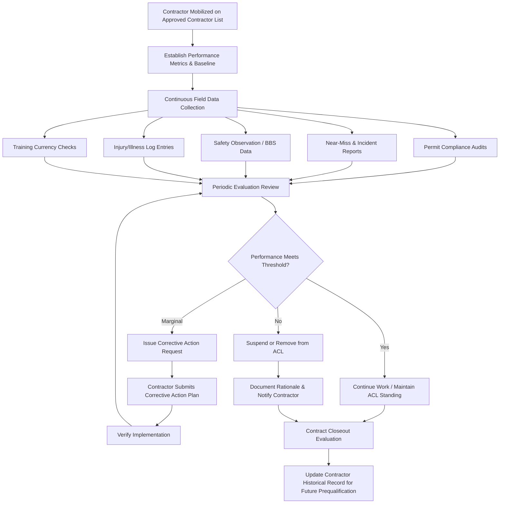

## Evaluating Contractor Safety Performance

### Overview

Evaluating contractor safety performance is the ongoing, structured process by which a host employer measures, documents, and acts upon a contractor's safety behavior and outcomes throughout the duration of a contract, and uses that record to inform re-qualification, contract renewal, or removal decisions. This differs from prequalification (a pre-award screening activity) in that performance evaluation is continuous and outcome-based, drawing on real-time and periodic data generated *during* the actual work rather than historical data submitted in advance.

OSHA 29 CFR 1910.119(h)(2)(iv) explicitly requires host employers to periodically evaluate the performance of contract employers in fulfilling their obligations under the standard. This creates a regulatory obligation to close the loop: prequalification and orientation establish the starting conditions, but performance evaluation verifies that those conditions are actually being met in the field and provides the data trail needed to demonstrate ongoing due diligence.

### Regulatory Basis

**Key Points**

- **1910.119(h)(2)(iv)**: The host employer shall periodically evaluate the performance of contract employers in fulfilling their obligations as specified in paragraph (h) of this section.
- **1910.119(h)(2)(v)**: The host employer shall maintain a contract employee injury and illness log related to the contractor's work in process areas.
- **40 CFR 68.87(b)(5)** (EPA RMP): parallel requirement for periodic evaluation of contractor performance at RMP-covered facilities.
- These evaluation requirements are the enforcement mechanism that gives the host employer's other 1910.119(h) obligations (hazard disclosure, safe work practices) ongoing accountability, rather than being satisfied once at contract signing.

### Purpose of Ongoing Evaluation

- Verify that safety commitments made during prequalification are actually being executed in the field.
- Detect performance degradation early (e.g., rising near-miss rates, permit violations) before it results in a serious incident.
- Provide objective, documented evidence supporting contract renewal, re-qualification, or termination decisions.
- Support OSHA/EPA compliance demonstration during audits or incident investigations.
- Drive continuous improvement through structured feedback to the contractor.
- Populate the Approved Contractor List (ACL) with current, evidence-based standing rather than a static historical score.

### Evaluation Framework



### Categories of Performance Data

1. **Leading Indicators** (predictive, behavior-based)
   - Permit-to-work compliance rate (percentage of permits executed without violation)
   - Behavior-Based Safety (BBS) observation results and corrective action closure rate
   - Toolbox talk / pre-job briefing attendance and quality
   - Training currency (percentage of workforce with valid, up-to-date certifications)
   - Housekeeping and PPE compliance audit scores
   - Timeliness and quality of hazard reporting under 1910.119(h)(3)(v)
2. **Lagging Indicators** (outcome-based)
   - Recordable incident count and rate (TRIR) for work performed at the host site
   - Days Away, Restricted, or Transferred (DART) cases
   - First aid case frequency
   - Near-miss reporting rate (note: a *higher* near-miss reporting rate can indicate a healthier reporting culture rather than worse performance, and should be interpreted alongside severity data)
   - Environmental releases or spills attributable to contractor work
   - Property damage incidents
3. **Compliance and Audit Findings**
   - Number and severity of safety audit findings during the contract period
   - Repeat findings across multiple audits (indicates systemic rather than isolated issues)
   - Regulatory citations issued directly related to contractor work during the contract
4. **Responsiveness Metrics**
   - Time to close corrective actions from audits or incidents
   - Quality and completeness of incident investigation reports submitted by the contractor
   - Willingness to stop work voluntarily when a hazard is identified (supports stop-work-authority culture)

### Sample Performance Scorecard Structure

| Metric Category | Metric | Data Source | Target/Threshold |
| --- | --- | --- | --- |
| Leading | Permit compliance rate | PTW audit log | $\geq 95\%$ |
| Leading | Training currency | Badge/access system | $100\%$ current |
| Leading | BBS corrective action closure | BBS program data | $\geq 90\%$ within 30 days |
| Lagging | TRIR (site-specific) | Injury/illness log | At or below host site average |
| Lagging | DART rate | Injury/illness log | Trending flat or down |
| Compliance | Audit findings (serious) | EHS audit reports | Zero repeat serious findings |
| Responsiveness | Corrective action closure time | CAPA tracking system | $\leq 14$ days average |

A composite performance score can be calculated similarly to the prequalification scoring model:

$$P = \sum_{i=1}^{n} w_i \times p_i$$

where $w_i$ is the weight assigned to metric $i$ and $p_i$ is the normalized performance value (0–100). Unlike the one-time prequalification score, $P$ is typically recalculated on a rolling basis (e.g., quarterly) throughout the contract duration.

### Evaluation Cadence

| Contract Type | Recommended Evaluation Frequency |
| --- | --- |
| Short-duration specialty work (days to weeks) | Post-job closeout review only |
| Standing/recurring service contracts | Quarterly formal review; continuous informal monitoring |
| Turnaround/major renovation | Daily field monitoring; weekly formal review during execution; comprehensive closeout review |
| Long-term embedded contractors (e.g., on-site maintenance) | Monthly informal check-in; semi-annual or annual formal review |

### Example: Quarterly Contractor Performance Review Summary

**Example**



```
Quarterly Contractor Performance Review
-----------------------------------------
Contractor:            ____________________
Contract Scope:        ____________________
Review Period:         Q__ 20__

Leading Indicators:
  Permit compliance rate:        ____ %  (Target: 95%)
  Training currency:             ____ %  (Target: 100%)
  BBS corrective actions closed:  ____ %  (Target: 90% w/in 30 days)

Lagging Indicators:
  TRIR (site-specific):          ____   (Host site avg: ____)
  DART cases this quarter:       ____
  First aid cases this quarter:  ____
  Near-misses reported:          ____

Audit Findings:
  Total findings this quarter:   ____
  Serious/repeat findings:       ____

Overall Composite Score:         ____ / 100
Rating: [ ] Satisfactory  [ ] Needs Improvement  [ ] Unsatisfactory

Corrective Actions Required:    ____________________
Next Review Date:               ____________________
Reviewer Signature:             ____________________
```

### Actions Based on Evaluation Outcomes

- **Satisfactory performance**: contractor remains active on the ACL; positive performance history strengthens standing for future contract awards and reduces re-qualification friction.
- **Marginal/declining performance**: formal corrective action request issued, often with a defined improvement timeline; increased audit frequency during the correction period.
- **Unsatisfactory performance**: temporary suspension from active work pending root cause analysis and corrective action plan; in cases of serious or willful violations, immediate removal from the ACL and contract termination review.
- **Serious incident attributable to contractor negligence**: typically triggers automatic suspension pending investigation, regardless of prior scorecard standing, and a mandatory requalification review before any future work is authorized.

### Common Pitfalls

- Relying exclusively on lagging indicators (TRIR, incident counts), which react only after harm has occurred and can mask improving or declining trends when incident counts are low ("small numbers" statistical volatility).
- Conducting evaluations only at contract closeout, missing the opportunity to intervene during the contract when performance issues first emerge.
- Failing to weight repeat/systemic audit findings more heavily than isolated findings, understating the significance of recurring issues.
- Disconnecting the evaluation process from the prequalification/ACL system, so poor ongoing performance does not actually affect future contract eligibility.
- Inconsistent evaluation criteria across different contractors or business units, undermining comparability and defensibility of the scoring system. [Inference: this variability is commonly noted in PSM audit findings, though its prevalence differs by organization.]
- Treating a low near-miss reporting count as a positive outcome rather than investigating whether it reflects underreporting.

### Related Topics

- Contractor Prequalification and Selection
- Contractor Orientation and Training Requirements
- Coordinating Host Employer and Contractor Responsibilities
- Permit-to-Work Systems for Contractors
- Behavior-Based Safety (BBS) Programs
- Incident Investigation and Root Cause Analysis
- Approved Contractor List (ACL) Management
- Turnaround/Shutdown Planning and Contractor Mobilization