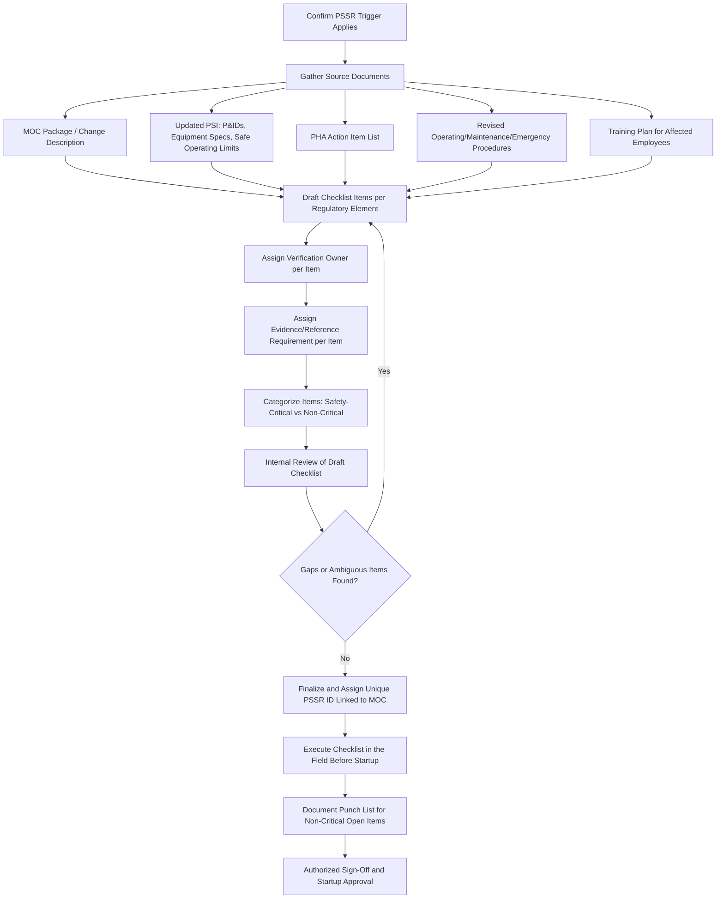

## PSSR Checklist Development

### Overview

PSSR checklist development is the process of designing the structured verification instrument used to confirm, item by item, that all four regulatory confirmation elements of 29 CFR 1910.119(i)(2) have been satisfied before a hazardous chemical is introduced into a new or modified process. A well-designed checklist translates the general regulatory requirements — construction/equipment conformance, procedure adequacy, PHA/MOC resolution, and training completion — into specific, verifiable, project-scoped questions that a reviewer can objectively answer as complete or incomplete. Poorly developed checklists (generic, boilerplate, or disconnected from the actual scope of the change) are a frequently cited root cause in incidents that occur shortly after startup, because they create a false sense of verification without actually testing whether critical safety elements are in place.

### Regulatory Basis for Checklist Content

**Key Points**

- **1910.119(i)(2)(i)**: Checklist must verify construction and equipment is in accordance with design specifications.
- **1910.119(i)(2)(ii)**: Checklist must verify safety, operating, maintenance, and emergency procedures are in place and adequate.
- **1910.119(i)(2)(iii)**: Checklist must verify, for new facilities, that a PHA has been performed and recommendations resolved or implemented; for modified facilities, that MOC requirements under 1910.119(l) have been met.
- **1910.119(i)(2)(iv)**: Checklist must verify training of each employee involved in operating the process has been completed.
- The standard does not prescribe a specific checklist format — organizations have latitude in design, but every item must trace back to one of these four confirmation elements or the checklist is incomplete by regulatory definition.

### Design Principles for Effective PSSR Checklists

1. **Traceability to Regulatory Elements** — every checklist item should be mappable to one of the four 1910.119(i)(2) sub-elements; items that cannot be mapped are either administrative (fine to include, but should be clearly separated) or indicate scope creep beyond the regulatory intent.
2. **Project-Specific Customization** — a generic, one-size-fits-all checklist fails to catch project-specific hazards; the checklist should be tailored using the MOC documentation, PHA action items, and design package for the specific change.
3. **Binary, Verifiable Language** — items should be phrased so they can be answered "Yes/Complete" or "No/Incomplete" with objective evidence, not subjective judgment (e.g., "Relief valve set pressure verified against updated PSI calculation, ref. doc #____" rather than "Relief system looks okay").
4. **Closed-Loop Punch List Integration** — the checklist must distinguish between safety-critical items (must be closed before startup) and non-safety-critical items (may be tracked to closure post-startup on a documented punch list with a deadline).
5. **Role-Based Sign-Off** — different sections should require sign-off from the function actually qualified to verify them (e.g., instrumentation items signed by I&E, procedures by operations, training by training coordinator/supervisor).
6. **Version Control Tied to the Specific Change** — each PSSR checklist should be uniquely identified and linked to its originating MOC or project number, preventing reuse of a stale or mismatched checklist.

### Checklist Development Workflow



### Checklist Structure by Regulatory Element

**1. Construction and Equipment Verification**

- Field walk-down confirms installed equipment matches approved P&ID and equipment data sheet (make, model, material of construction, rating).
- Pressure testing, leak testing, or hydrostatic testing completed and documented per code requirement.
- Instrumentation calibration completed and documented (transmitters, control valves, safety instrumented functions).
- Electrical area classification verified for any new/modified equipment in classified areas.
- Relief device sizing and set pressure verified against current process conditions.
- Positive material identification (PMI) completed where required by specification.

**2. Procedures Adequacy Verification**

- Operating procedures revised to reflect the change and formally approved/issued.
- Emergency shutdown procedures updated to include new or modified equipment.
- Maintenance procedures (including LOTO points) updated to reflect new isolation points or equipment.
- Safe operating limits (pressure, temperature, level, flow) documented in the procedure and consistent with updated PSI.
- Alarm and interlock setpoints match the values specified in updated PSI and procedures.

**3. PHA/MOC Resolution Verification**

- For new facilities: PHA completed, and each recommendation documented as resolved (implemented, or a documented technical/management justification for not implementing).
- For modifications: MOC review completed per 1910.119(l), including hazard evaluation of the change itself.
- Any PHA-of-record revisions required by the change have been incorporated.
- Outstanding recommendations from prior PHAs affecting this equipment/area reviewed for relevance to the current change.

**4. Training Completion Verification**

- List of affected employees (operations, maintenance, contractors if applicable) cross-referenced against training completion records.
- Training content confirmed to cover the specific change (not just generic refresher content).
- Verification-of-understanding method documented for each trained employee (consistent with the same rigor applied to contractor training under 1910.119(h)).
- Shift-to-shift communication plan established so all crews (not just the day shift present during commissioning) receive equivalent training before they operate the changed process.

### Sample Checklist Item Format

| Item # | Regulatory Element | Verification Item | Evidence Required | Verified By | Status |
| --- | --- | --- | --- | --- | --- |
| C-01 | Construction/Equipment | New relief valve RV-204 installed matches spec sheet Rev 3 | Field walk-down + spec sheet | I&E Lead | [ ] Complete |
| C-02 | Construction/Equipment | Hydrotest of new piping spool completed at 1.5x MAWP | Hydrotest certificate | QA/QC | [ ] Complete |
| P-01 | Procedures | Operating procedure OP-118 revised for new bypass line | Approved procedure copy | Ops Supervisor | [ ] Complete |
| P-02 | Procedures | LOTO procedure updated to include new isolation valve | Approved LOTO procedure | Maintenance Lead | [ ] Complete |
| H-01 | PHA/MOC | MOC #2026-0142 hazard evaluation completed and approved | MOC form + PHA worksheet | PSM Coordinator | [ ] Complete |
| H-02 | PHA/MOC | All PHA recommendations for this change resolved or justified | Recommendation tracking log | PHA Team Lead | [ ] Complete |
| T-01 | Training | All operators on all shifts trained on new bypass operation | Training sign-in + quiz scores | Training Coordinator | [ ] Complete |

### Punch List Categorization Logic

$$\text{Startup Decision} = \begin{cases} \text{Approved} & \text{if all safety-critical items = Complete} \\ \text{Conditional Approval} & \text{if only non-critical items remain, with documented closure date} \\ \text{Denied} & \text{if any safety-critical item = Incomplete} \end{cases}$$

Safety-critical items typically include anything affecting containment integrity, relief system adequacy, interlock/safety instrumented function functionality, or life-safety systems. Non-critical items are typically cosmetic, minor documentation cleanup, or non-safety-related punch items (e.g., signage, painting, minor insulation touch-up).

### Example: Checklist Header/Metadata Block

**Example**



```
Pre-Startup Safety Review Checklist
-------------------------------------
PSSR ID:                    PSSR-2026-0087
Linked MOC/Project #:       MOC-2026-0142
Unit/Process:               ____________________
Description of Change:      ____________________
PSSR Type:      [ ] New Facility   [ ] Modified Facility

Checklist Prepared By:      ____________________
Date Prepared:              __________
Checklist Approved By:      ____________________
Date Approved for Use:      __________

Startup Authorization:
[ ] All safety-critical items verified complete
[ ] Non-critical punch list attached with closure dates
[ ] Startup Approved By: ____________________  Date: __________
```

### Common Pitfalls

- Reusing a generic corporate template without tailoring it to the specific MOC scope, resulting in items that don't apply and missing items that do.
- Writing checklist items as vague judgment calls ("system appears ready") rather than binary, evidence-based verifications.
- Allowing the same person who performed the modification to also perform the independent PSSR verification without any independent check, reducing the effectiveness of the review as a control.
- Failing to separate safety-critical punch items from cosmetic ones, either delaying startup unnecessarily or allowing startup with a genuinely critical item unresolved.
- Not linking the checklist to the specific MOC/PHA documentation, making it difficult to demonstrate regulatory traceability during an audit or incident investigation. [Inference: commonly identified as a documentation weakness in PSM compliance audits, though prevalence varies by organization.]
- Overlooking off-shift or contract personnel when verifying training completion, leaving a subset of the workforce operating the changed process without adequate training.

### Related Topics

- PSSR Triggers for New and Modified Facilities
- Management of Change (MOC) Program Requirements
- Process Safety Information (PSI) Elements and Maintenance
- Process Hazard Analysis (PHA) Recommendation Tracking
- Operating Procedures Development and Revision Control
- Punch List Management and Startup Readiness
- Contractor Orientation and Training Requirements