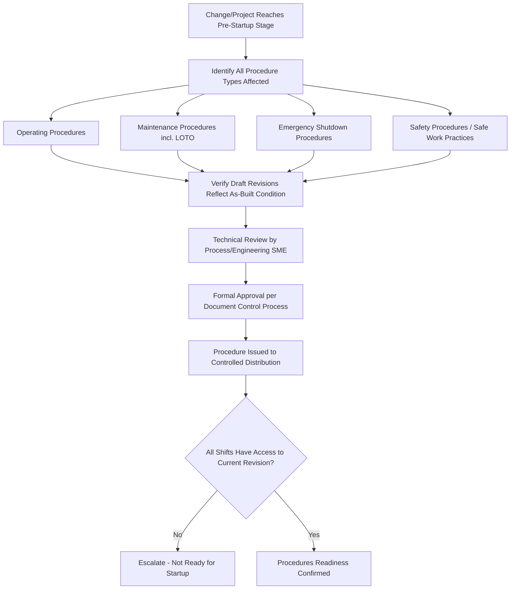
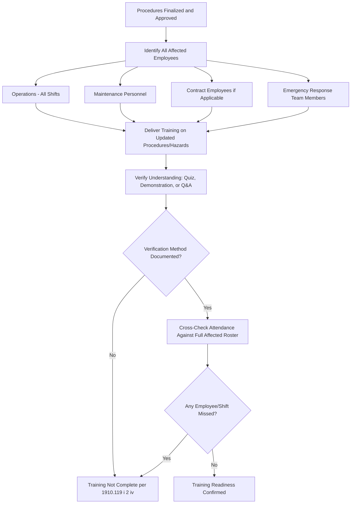

## Confirming Readiness of Procedures and Training

### Overview

Confirming readiness of procedures and training is the PSSR sub-element that verifies two of the four regulatory confirmation requirements under 29 CFR 1910.119(i)(2): that safety, operating, maintenance, and emergency procedures are in place and adequate (1910.119(i)(2)(ii)), and that training of each employee involved in operating the process has been completed (1910.119(i)(2)(iv)). While construction/equipment verification confirms the physical system is ready, and PHA/MOC resolution confirms the hazard evaluation is complete, procedures and training readiness confirms the *human system* — the people who will operate, maintain, and respond to emergencies in the changed process — are equipped with accurate documentation and sufficient competence before the hazardous chemical is introduced.

This element is frequently the weakest link in PSSR execution because procedure revisions and training delivery often lag behind the physical completion of a project; construction can finish on schedule while procedure updates and training rollouts fall behind, creating pressure to start up before the human-system readiness is genuinely complete.

### Regulatory Basis

**Key Points**

- **1910.119(i)(2)(ii)**: Confirms safety, operating, maintenance, and emergency procedures are in place and adequate before startup.
- **1910.119(i)(2)(iv)**: Confirms training of each employee involved in operating the process has been completed.
- **1910.119(f)** (Operating Procedures): establishes the baseline requirement that written operating procedures exist, are technically accurate, and reflect current operating practice — the PSSR verification checks that this baseline has been updated for the specific change.
- **1910.119(g)** (Training): establishes the baseline requirement for initial and refresher training on operating procedures — the PSSR verification checks that training specific to the change has actually been delivered and understood before startup, not merely scheduled.

### Two Distinct Verification Tasks

1. **Procedure Readiness** — confirming the *documents* are updated, accurate, approved, and accessible.
2. **Training Readiness** — confirming the *people* who will use those documents have received, understood, and can apply the updated content.

Both must be independently verified; a common but flawed assumption is that updating a procedure automatically implies the workforce has absorbed the change. PSSR treats these as separate checkpoints precisely because procedure revision and training delivery can become decoupled in practice.

### Procedures Readiness Verification Workflow



### Training Readiness Verification Workflow



### Procedures Readiness Checklist Items

| Verification Item | Evidence Required |
| --- | --- |
| Operating procedure revised to reflect new/modified equipment and safe operating limits | Approved procedure document, revision number matching current change |
| Emergency shutdown procedure includes new isolation points and updated shutdown sequence | Approved ESD procedure |
| Maintenance procedure updated with new LOTO isolation points and equipment-specific instructions | Approved maintenance/LOTO procedure |
| Safe work practice documents (hot work, confined space, etc.) reflect any new area classification or hazard | Updated safe work practice document |
| Alarm/interlock setpoint values in the procedure match values in updated Process Safety Information | Cross-check between procedure and PSI documentation |
| Procedure formally approved through document control (not a marked-up draft) | Document control system approval record |
| Obsolete/superseded procedure versions removed from circulation at all operating locations | Document control distribution log |
| Procedures accessible to all shifts, including night shift and any remote operating stations | Physical/electronic access verification |

### Training Readiness Checklist Items

| Verification Item | Evidence Required |
| --- | --- |
| Complete roster of affected employees identified, covering all shifts and relevant crafts | Affected employee roster cross-referenced with organizational chart |
| Training content specifically addresses the change (not generic annual refresher content) | Training material/lesson plan reviewed against the change description |
| Each employee's attendance documented with name, date, and topics covered | Training sign-in sheets or LMS records |
| Understanding verified via quiz, practical demonstration, or documented Q&A (not signature alone) | Quiz scores, demonstration checklist, or documented verbal assessment |
| Contract employees performing operations/maintenance roles included in training scope where applicable | Contractor training records (cross-reference with 1910.119(h) requirements) |
| Emergency responders briefed on any new hazards or changed emergency procedures | ERT briefing attendance record |
| Training completion cross-checked against 100% of the affected roster before startup authorization | Gap analysis: roster vs. completion log |

### Handling Partial Readiness (Common Real-World Scenario)

It is common for procedures to be complete but training to lag for off-shift crews, or vice versa. PSSR governance should define how this is handled rather than leaving it to informal judgment at the time of startup pressure:

- **Acceptable approach**: startup is delayed, or the process is held in a safe state, until 100% of affected employees across all shifts have completed training — this is the position most consistent with the plain language of 1910.119(i)(2)(iv), which does not include a partial-completion allowance.
- **Common but higher-risk practice**: starting up with day-shift training complete and a documented plan to train remaining shifts before they take over operation, with interim compensating measures (e.g., day-shift supervisor coverage during initial off-shift operation). [Inference: this is a documented industry practice in some organizations' procedures, but it introduces risk exposure during the gap period and should be treated as an exception requiring explicit management authorization, not a default approach.]
- **Not acceptable**: starting up and allowing untrained shifts to operate the changed process without any compensating measure, which constitutes a direct failure of 1910.119(i)(2)(iv).

### Example: Procedures and Training Readiness Sign-Off Block

**Example**



```
PSSR Sub-Element: Procedures and Training Readiness
------------------------------------------------------
Linked MOC/Project #:        ____________________

PROCEDURES
[ ] Operating procedure(s) revised, reviewed, and approved: Doc #(s) __________
[ ] Emergency shutdown procedure updated: Doc # __________
[ ] Maintenance/LOTO procedure updated: Doc # __________
[ ] Safe work practice documents updated (if applicable): Doc # __________
[ ] Superseded versions withdrawn from circulation
[ ] Confirmed accessible at all operating/control locations

TRAINING
Affected Employee Roster Count: ______   Completed Training Count: ______
[ ] 100% of affected roster trained (all shifts, incl. contractors if applicable)
[ ] Training content specific to this change (not generic refresher)
[ ] Understanding verified via: [ ] Quiz  [ ] Demonstration  [ ] Documented Q&A
[ ] Emergency Response Team briefed on relevant changes

Gaps Identified: ____________________________________________
Compensating Measures (if any gap accepted): __________________
Approved By:  ____________________     Date: __________
```

### Common Pitfalls

- Verifying that a procedure revision was *drafted* but not that it was formally *approved and issued* through document control before checking the box as complete.
- Training only the shift present during commissioning/startup and assuming other shifts will "pick it up" informally, without documented, verified training.
- Treating a training sign-in sheet alone as sufficient evidence, without a documented verification-of-understanding method, which does not satisfy the intent of demonstrating employees have "completed" training in a meaningful sense.
- Failing to include maintenance personnel and emergency responders in the training scope, focusing only on process operators.
- Allowing schedule pressure to compress training delivery into a rushed session immediately before startup, reducing comprehension and retention. [Inference: widely cited as a contributing factor in post-startup incidents, though root causes vary by specific event.]
- Not reconciling the procedure's technical content (setpoints, sequences) against the current Process Safety Information, resulting in a procedure that is "updated" in revision number only, not in substance.

### Related Topics

- PSSR Checklist Development
- PSSR Triggers for New and Modified Facilities
- Operating Procedures Development and Revision Control
- Management of Change (MOC) Program Requirements
- Contractor Orientation and Training Requirements
- Process Safety Information (PSI) Elements and Maintenance
- Punch List Management and Startup Readiness