## Common PSSR Gaps and Audit Findings

### Overview

This topic catalogs the recurring deficiencies identified in Pre-Startup Safety Review programs during internal audits, third-party PSM compliance audits, OSHA inspections, and post-incident investigations. Understanding these patterns serves two purposes: it allows an organization to proactively audit its own PSSR program against known failure modes, and it explains why PSSR — despite being a relatively procedural, checklist-driven element of PSM — remains one of the more frequently cited elements in enforcement actions and one of the more commonly implicated elements in incidents that occur shortly after startup or restart.

Most PSSR gaps trace back to one of three underlying causes: schedule/production pressure that compresses or bypasses the review, a checklist that is procedurally complete but substantively weak, or a failure to correctly identify that the PSSR trigger applied in the first place.

### Regulatory Context for Audit Findings

**Key Points**

- OSHA inspections and PSM audits assess compliance against the four explicit sub-elements of 1910.119(i)(2): construction/equipment conformance, procedures adequacy, PHA/MOC resolution, and training completion.
- Because 1910.119(i)(1) uses the phrase "significant enough to require a change in the process safety information" as the trigger for modified facilities, a large share of audit findings relate to under-scoping which modifications actually qualify.
- EPA RMP audits (40 CFR 68.79, program audit requirements) apply a parallel lens for RMP-covered processes, and findings are broadly consistent with OSHA PSM audit patterns.
- Post-incident investigations (e.g., CSB investigation reports into various process safety incidents) have repeatedly identified PSSR breakdowns — particularly around unresolved PHA recommendations and incomplete training — as contributing factors, reinforcing that these are not merely paperwork deficiencies but genuine risk drivers.

### Taxonomy of Common PSSR Gaps

```mermaid
flowchart TD
    A[Common PSSR Gaps] --> B[Trigger Identification Failures]
    A --> C[Checklist Quality Failures]
    A --> D[Procedures & Training Failures]
    A --> E[PHA/MOC Linkage Failures]
    A --> F[Governance & Schedule Pressure Failures]
    A --> G[Documentation & Traceability Failures]

    B --> B1[Modification not recognized as PSSR trigger]
    B --> B2[Replacement-in-kind misclassification]
    B --> B3[Temporary changes left in place without review]

    C --> C1[Generic boilerplate checklist not scoped to change]
    C --> C2[Vague, non-verifiable checklist language]
    C --> C3[Same person verifies own work - no independence]

    D --> D1[Off-shift crews not trained before startup]
    D --> D2[Procedure drafted but not formally approved]
    D --> D3[Verification of understanding not documented]

    E --> E1[PHA recommendations open at startup]
    E --> E2[MOC hazard evaluation incomplete or skipped]
    E --> E3[PHA-of-record not updated for the change]

    F --> F1[Schedule pressure overrides safety-critical punch items]
    F --> F2[Startup authorized verbally without complete checklist]
    F --> F3[PSSR treated as a formality after decision already made]

    G --> G1[PSSR not linked to originating MOC/project number]
    G --> G2[Punch list items not tracked to closure post-startup]
    G --> G3[No retained evidence for individual checklist items]
```



### Category 1: Trigger Identification Failures

- **Under-scoping modifications**: treating only large capital projects as PSSR triggers while missing smaller field changes that still alter Process Safety Information (piping reroutes, control logic changes, instrumentation upgrades).
- **Replacement-in-kind misclassification**: labeling a component substitution as "replacement in kind" when it actually differs in material, rating, or manufacturer specification, thereby skipping both MOC and PSSR.
- **Temporary-becomes-permanent changes**: temporary bypasses, jumpers, or temporary piping installed under an expedited process that are never formally reviewed once they become de facto permanent.

### Category 2: Checklist Quality Failures

- **Generic/boilerplate checklists**: using a corporate template without tailoring it to the specific project scope, resulting in irrelevant items being checked off and genuinely relevant items never being asked.
- **Non-verifiable language**: checklist items phrased as subjective judgments ("system looks ready") rather than binary, evidence-based confirmations, making the checklist auditable in form but not in substance.
- **Lack of independent verification**: allowing the individual who executed the modification to also perform the PSSR sign-off without any independent reviewer, undermining the checklist's function as a control.

### Category 3: Procedures and Training Failures

- **Off-shift training gaps**: training delivered only to the shift present during commissioning, with other shifts assumed to "pick it up" through informal handover rather than documented training.
- **Draft-versus-approved confusion**: checklist items marked complete based on a drafted procedure revision that was never formally approved and issued through document control.
- **Missing verification of understanding**: training attendance documented via signature only, without a quiz, demonstration, or documented Q&A confirming comprehension, which fails the intent (and in the contractor context, the explicit text) of the applicable training documentation requirements.

### Category 4: PHA/MOC Linkage Failures

- **Open PHA recommendations at startup**: recommendations from the process hazard analysis remain unresolved or their resolution status is undocumented, yet the PSSR checklist item is marked complete.
- **Superficial MOC hazard evaluation**: the MOC form is completed administratively (signatures obtained) without a substantive hazard evaluation of the specific change being documented.
- **PHA-of-record not updated**: the change is implemented and the PSSR passes, but the facility's PHA-of-record (the living hazard analysis document) is never revised to reflect the new configuration, creating a latent gap for the next PHA revalidation cycle or future MOC reviewers.

### Category 5: Governance and Schedule Pressure Failures

- **Safety-critical punch items overridden**: non-critical and safety-critical punch list items are not clearly distinguished, allowing production schedule pressure to justify starting up with a safety-critical item still open.
- **Informal/verbal startup authorization**: startup proceeds based on a verbal "good to go" from a senior manager without the checklist itself being formally completed and signed, effectively bypassing the control.
- **PSSR as post-decision formality**: the checklist is completed *after* the decision to start up has already been made operationally, reducing the review to a documentation exercise rather than a genuine gate. [Inference: this pattern is frequently identified in post-incident investigations and audit reports, though its prevalence varies by organizational safety culture.]

### Category 6: Documentation and Traceability Failures

- **No linkage to originating MOC/project**: the PSSR record does not reference a specific MOC or project number, making it difficult during a later audit or investigation to reconstruct which change the PSSR actually covered.
- **Punch list items untracked**: non-critical items deferred to "post-startup completion" are never entered into a tracked system with an owner and due date, and are subsequently forgotten.
- **Insufficient retained evidence**: the checklist itself is retained, but the underlying evidence for individual items (calibration certificates, training quiz scores, hydrotest records) is not retained or cross-referenced, so the checklist's claims cannot be substantiated during an audit.

### Representative Audit Finding Language

**Example**



```
Finding: PSSR-2025-014
Severity: Major

Observation:
Review of PSSR record #PSSR-2025-014 (linked to MOC-2025-081, addition of
a new bypass line around FCV-220) found that Checklist Item H-02
("All PHA recommendations for this change resolved or justified") was
marked complete; however, the referenced PHA worksheet shows Recommendation
#7 ("Evaluate need for high-high level interlock on bypass condition")
as open with no documented resolution or management justification.

Root Cause Contribution:
The PSSR reviewer relied on the MOC originator's verbal assurance that
"the recommendation would be handled later" rather than requiring
documented resolution per 1910.119(i)(2)(iii) before startup.

Corrective Action Required:
1. Halt further startups referencing this MOC pending PHA recommendation
   resolution.
2. Retrain PSSR reviewers on requirement to verify documented resolution,
   not verbal assurance, for all PHA/MOC-linked checklist items.
3. Audit last 12 months of PSSR records for similar unresolved-recommendation
   patterns.
```

### Frequency Pattern of Finding Categories (Illustrative)

| Gap Category | Relative Audit Finding Frequency | Typical Severity |
| --- | --- | --- |
| Trigger identification failures | High | Major (can mean no PSSR performed at all) |
| Checklist quality failures | High | Moderate to Major |
| Procedures/training failures | Moderate to High | Major |
| PHA/MOC linkage failures | Moderate | Major to Critical |
| Governance/schedule pressure failures | Moderate | Critical (direct causal link to incidents) |
| Documentation/traceability failures | High | Minor to Moderate |

[Inference: relative frequency ranking reflects commonly reported patterns across PSM audit literature and enforcement summaries; actual frequency and severity distribution varies significantly by facility, industry sector, and audit program maturity.]

### Corrective Strategies Mapped to Gap Categories

| Gap Category | Corrective Strategy |
| --- | --- |
| Trigger identification | Formalize a documented trigger-screening step within the MOC workflow itself, not left to reviewer judgment alone |
| Checklist quality | Require project-specific checklist customization as a mandatory step; prohibit direct reuse of prior checklists without review |
| Procedures/training | Require documented verification-of-understanding for all affected personnel across all shifts before checklist closure |
| PHA/MOC linkage | Require the PHA/MOC recommendation tracking log reference number as a mandatory field on the PSSR checklist |
| Governance/schedule pressure | Require a role independent of the project schedule owner (e.g., PSM Coordinator) to hold final PSSR sign-off authority |
| Documentation/traceability | Implement a document control requirement linking PSSR ID, MOC ID, and all supporting evidence in a single retrievable record |

### Common Pitfalls (Meta-Level, Regarding the Audit Process Itself)

- Conducting PSSR audits as a paperwork completeness check (are all boxes checked?) rather than a substantive verification (is the evidence behind each box adequate?).
- Failing to sample a statistically meaningful number of PSSR records across different project sizes and types, leading to an incomplete picture of program health.
- Not tracking whether corrective actions from prior PSSR audit findings were actually implemented, allowing the same gap categories to recur across audit cycles.
- Treating PSSR audit findings in isolation from related MOC and PHA program audits, missing systemic root causes that span multiple PSM elements.

### Related Topics

- PSSR Triggers for New and Modified Facilities
- PSSR Checklist Development
- Confirming Readiness of Procedures and Training
- Management of Change (MOC) Program Requirements
- Process Hazard Analysis (PHA) Recommendation Tracking
- Punch List Management and Startup Readiness
- Incident Investigation and Root Cause Analysis
- PSM Compliance Audit Program Design