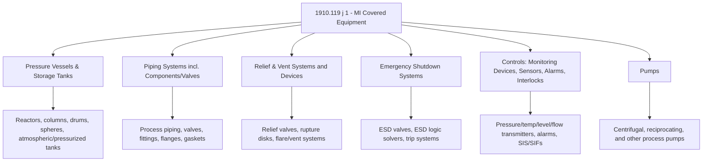
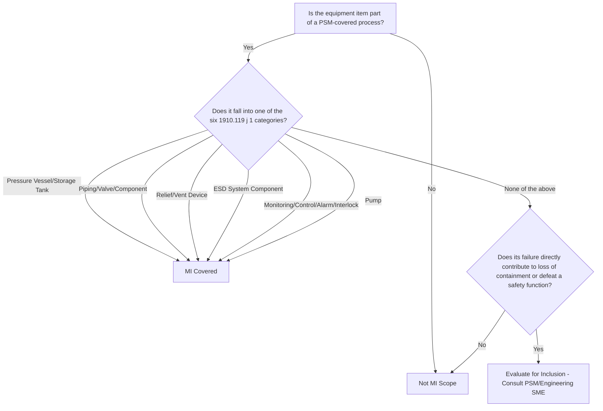

## Equipment Covered Under Mechanical Integrity Programs


### Overview

Mechanical Integrity (MI) is the PSM element that ensures equipment used to process, contain, or control highly hazardous chemicals is designed, fabricated, installed, and maintained to operate reliably throughout its service life, and that any degradation is detected and corrected before it results in a loss of containment. The scope question — *which specific equipment falls under the MI program* — is foundational, because OSHA 29 CFR 1910.119(j) defines MI coverage using an explicit, enumerated equipment list rather than a general statement that "all equipment" is covered. Correctly identifying covered equipment is the necessary first step before inspection, testing, and preventive maintenance programs can be properly scoped; equipment incorrectly excluded from MI scope receives none of the regulatory rigor (documented inspection intervals, deficiency correction, quality assurance) that the standard requires.

### Regulatory Basis

**Key Points**

- **OSHA 29 CFR 1910.119(j)(1)**: Application. Paragraph (j) applies to the following equipment: pressure vessels and storage tanks; piping systems (including piping components such as valves); relief and vent systems and devices; emergency shutdown systems; controls (including monitoring devices and sensors, alarms, and interlocks); and pumps.
- **1910.119(j)(2)** through **(j)(6)**: establish the programmatic requirements applied to the equipment identified in (j)(1) — written procedures, training for maintenance personnel, inspection/testing, correction of deficiencies, and quality assurance for new equipment/spare parts/materials of construction.
- **40 CFR 68.73** (EPA RMP): a substantively parallel equipment list for RMP-covered processes, generally interpreted consistently with the OSHA enumeration.
- This is a closed, named list — not an open-ended "any equipment that touches the process" standard — but as discussed below, correctly interpreting the boundaries of each named category is itself a significant scoping exercise.

### The Six Named Equipment Categories



### Category-by-Category Scope Detail

**1. Pressure Vessels and Storage Tanks**

- Reactors, distillation columns, separator drums, heat exchangers (shell side), spheres, and both pressurized and atmospheric storage tanks holding covered chemicals.
- Includes vessel internals that are integral to containment and pressure boundary integrity (e.g., vessel nozzles, manways).
- Atmospheric tanks are explicitly included, not just pressure-rated vessels — a common scoping error is assuming only pressurized equipment counts.

**2. Piping Systems, Including Components Such as Valves**

- Process piping carrying covered chemicals between vessels, including all in-line components: valves (block, control, check), flanges, gaskets, fittings, expansion joints, and strainers.
- Explicitly extends to valves as piping components, meaning manual block valves are within MI scope even though they might otherwise be thought of as "simple" mechanical devices.
- Underground or buried piping carrying covered process chemicals is generally within scope, though inspection methodology differs from above-ground piping (see cathodic protection, soil corrosion monitoring).

**3. Relief and Vent Systems and Devices**

- Pressure relief valves (PRVs), rupture disks, conservation vents, and vacuum relief devices.
- The downstream vent/flare header piping and knockout drums that route relief discharge are typically included, since they are integral to the relief system's function of safely managing an overpressure event.
- Relief device sizing basis and set pressure are tied closely to Process Safety Information; MI covers the physical device's mechanical condition and functional testing, distinct from (but coordinated with) the engineering basis maintained under PSI.

**4. Emergency Shutdown (ESD) Systems**

- ESD valves (often fail-safe, fire-safe rated), their actuators, and the logic solvers or trip systems that command emergency shutdown action.
- Includes the physical final elements (valves, actuators) and the systems that trigger them, distinguishing ESD systems from the broader "controls" category by their specific safety-shutdown function.

**5. Controls: Monitoring Devices, Sensors, Alarms, and Interlocks**

- Pressure, temperature, level, and flow transmitters used for process monitoring and safety-related functions.
- Alarm systems tied to safe operating limits.
- Interlocks and Safety Instrumented Systems (SIS)/Safety Instrumented Functions (SIFs) that automatically take protective action based on sensor input.
- Basic Process Control System (BPCS) components are generally included when their failure could contribute to a process safety event, though many organizations apply differentiated (often less intensive) MI rigor to pure BPCS versus safety-instrumented-system components, reflecting risk-based prioritization. [Inference: this differentiated treatment is common industry practice, though the regulatory text itself does not explicitly separate BPCS from safety systems within the "controls" category.]

**6. Pumps**

- Centrifugal, reciprocating, and other pump types in covered chemical service.
- Includes seals, bearings, and associated mechanical components as part of the pump's integrity envelope.
- Pump drivers (motors, turbines) are generally included to the extent their failure could result in a loss of containment event (e.g., seal failure due to misalignment from a failing driver coupling).

### Equipment Typically Outside MI Scope (Boundary Cases)

| Equipment/System | MI Status | Rationale |
| --- | --- | --- |
| Structural steel supporting a covered vessel | Generally outside the six named categories | Not enumerated; often covered under separate structural integrity programs |
| Electrical distribution equipment (non-monitoring/control) | Generally outside MI, unless tied to ESD/interlock function | Falls under electrical safety programs unless it performs a monitoring/control/shutdown function |
| Fire protection systems (deluge, foam) | Often managed under separate fire protection program, though overlapping with ESD in some designs | Depends on whether the system performs an emergency shutdown function integral to process safety |
| Non-process utility piping (e.g., plant air not used for process control) | Outside MI scope | Does not carry or control a covered chemical, and is not a monitoring/control system |
| Portable/temporary equipment not permanently connected to the covered process | Case-by-case; often outside MI until it is treated as a permanent modification | Temporary equipment used briefly (e.g., temporary pump for a maintenance activity) is typically managed under other controls, but should not be used as a means of indefinitely avoiding MI coverage |

### Scoping Decision Logic



### Example: MI Equipment Inventory Register Excerpt

**Example**



```
MI Equipment Register - Unit 100 Reactor Section
---------------------------------------------------
Equipment ID   | Description                    | MI Category
R-101          | Primary Reactor Vessel          | Pressure Vessel
E-102          | Reactor Feed/Effluent Exchanger | Pressure Vessel (shell side)
PSV-101        | Reactor Overpressure Relief     | Relief Device
XV-105         | Emergency Isolation Valve       | ESD System
LT-101         | Reactor Level Transmitter       | Control/Monitoring
LSH-101        | High Level Interlock            | Control/Interlock (SIF)
P-101 A/B      | Reactor Feed Pumps              | Pump
100-PL-010     | Reactor Feed Piping, 6-in CS    | Piping System
V-101          | Feed Block Valve                | Piping Component
```

### Why Correct Scoping Matters Downstream

- **Inspection Interval Assignment**: only equipment properly identified as MI-covered is assigned into API/ASME-based inspection intervals (e.g., API 510 for pressure vessels, API 570 for piping, API 653 for storage tanks); missed equipment receives no formal inspection interval at all.
- **Deficiency Correction Tracking**: 1910.119(j)(5) requires deficiencies outside acceptable limits to be corrected in a timely manner consistent with process safety; equipment outside the identified MI scope falls outside this tracking discipline.
- **Quality Assurance**: 1910.119(j)(6) requires QA for fabrication/installation of new equipment and spare parts consistent with design specifications; scoping errors mean this QA discipline is never applied to affected components.
- **Audit and Regulatory Defensibility**: OSHA inspections frequently begin by testing whether the facility's MI equipment inventory is complete against the six named categories; an incomplete inventory is a common and easily identifiable citation basis.

### Common Pitfalls

- Excluding atmospheric storage tanks from MI scope based on an assumption that only pressurized equipment is covered.
- Treating manual block valves as outside MI scope because they lack "active" components, when the standard explicitly includes valves as piping components.
- Omitting underground/buried piping from the inventory due to inspection access difficulty rather than genuine scope exclusion, resulting in undetected external corrosion.
- Applying BPCS-level (lower rigor) maintenance practices to components that actually perform a safety-instrumented function, without a documented risk-based justification for the differentiated treatment.
- Allowing "temporary" equipment to remain in service indefinitely without ever being formally brought into MI scope, procedures, and inspection intervals.
- Failing to update the MI equipment inventory when Management of Change introduces new equipment, resulting in a growing gap between the facility's actual equipment and its MI program of record. [Inference: commonly identified as a recurring audit finding, though prevalence varies by facility MOC discipline.]

### Related Topics

- Inspection, Testing, and Preventive Maintenance (ITPM) Program Design
- API 510/570/653 Inspection Code Requirements
- Deficiency Correction and Run-Repair-Replace Decision Making
- Quality Assurance for New Equipment and Spare Parts
- Safety Instrumented Systems (SIS) and Safety Instrumented Functions (SIF)
- Management of Change (MOC) Program Requirements
- Process Safety Information (PSI) Elements and Maintenance