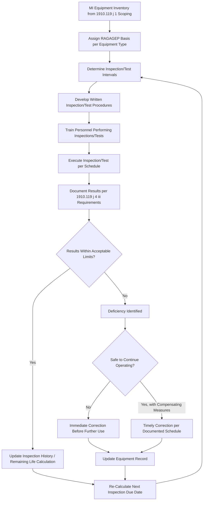

## Inspection, Testing, and Preventive Maintenance


### Overview

Inspection, Testing, and Preventive Maintenance (ITPM) is the operational core of the Mechanical Integrity element, translating the equipment scope defined under 1910.119(j)(1) into a systematic program of recurring activities that detect degradation, verify functional performance, and prevent failure of equipment before it results in a loss of containment. Where equipment scoping answers "what is covered," ITPM answers "how do we know it's still fit for service, and how often do we check." OSHA 29 CFR 1910.119(j)(4) establishes the specific regulatory requirements for inspection and testing frequency, procedure basis, documentation, and acceptance criteria, making ITPM one of the most heavily audited and most procedurally detailed elements of PSM.

### Regulatory Basis

**Key Points**

- **1910.119(j)(2)**: Written procedures must be established and implemented for maintenance activities on process equipment.
- **1910.119(j)(3)**: Training must be provided to employees involved in maintaining the ongoing integrity of process equipment, covering an overview of the process and its hazards, and the procedures applicable to the employee's job tasks.
- **1910.119(j)(4)(i)**: Inspections and tests shall be performed on process equipment using procedures that follow recognized and generally accepted good engineering practices (RAGAGEP).
- **1910.119(j)(4)(ii)**: The frequency of inspections and tests shall be consistent with applicable manufacturers' recommendations and good engineering practices, and more frequently if determined necessary by prior operating experience.
- **1910.119(j)(4)(iii)**: The employer shall document each inspection and test that has been performed on process equipment, including the date of the inspection/test, the name of the person who performed it, the serial number or other identifier of the equipment, a description of the inspection/test performed, and the results.
- **1910.119(j)(5)**: When inspection/test results indicate equipment deficiencies outside acceptable limits (defined by the manufacturer or good engineering practice), the employer shall correct the deficiency before further use, or in a safe and timely manner consistent with process safety requirements.
- **1910.119(j)(6)**: Quality assurance procedures for new equipment and spare parts must ensure they are suitable for the process application.

### ITPM Program Architecture



### RAGAGEP Basis by Equipment Category

| Equipment Category | Common RAGAGEP Reference |
| --- | --- |
| Pressure vessels | API 510 (Pressure Vessel Inspection Code) |
| Atmospheric storage tanks | API 653 (Tank Inspection, Repair, Alteration, and Reconstruction) |
| Piping systems | API 570 (Piping Inspection Code) |
| Pressure relief devices | API 576 (Inspection of Pressure-Relieving Devices), API 520/521 (sizing/design basis) |
| Pumps | API 610 (Centrifugal Pumps), manufacturer O&M manuals |
| Safety Instrumented Systems | IEC 61511 / ISA 84 (functional safety lifecycle, proof testing) |
| Electrical/instrumentation | NFPA 70E, manufacturer calibration specifications |
| Fired heaters and boilers | API 573 (Fired Heaters), ASME Boiler and Pressure Vessel Code Section I/VIII |

### Inspection and Testing Methods by Equipment Type

**1. Pressure Vessels and Storage Tanks**

- External visual inspection (coating condition, structural distortion, nozzle leaks).
- Internal visual inspection during vessel entry (requires confined space entry procedures).
- Ultrasonic thickness (UT) testing to measure wall thickness and calculate corrosion rate.
- Radiographic testing (RT) of weld seams where required by code.
- Remaining life calculation based on measured corrosion rate against minimum required thickness.

**2. Piping Systems**

- Circuit-based inspection under API 570, with representative thickness measurement locations (TMLs) selected based on corrosion risk.
- Visual inspection for external corrosion, insulation damage (which can mask corrosion under insulation, or CUI), and support/alignment issues.
- Specialized techniques for high-risk circuits: guided wave UT for inaccessible piping, CUI-specific inspection protocols.

**3. Relief Devices**

- Bench testing of pressure relief valves to verify set pressure and reseat performance, typically performed on a removed valve in a test facility.
- In-situ testing where design permits (some modern relief valve designs support online testing without removal).
- Inspection for valve body corrosion, spring condition, and seat damage during bench testing.

**4. Emergency Shutdown Systems and Safety Instrumented Functions**

- Functional/proof testing of the complete safety instrumented function loop: sensor, logic solver, final element.
- Partial stroke testing of ESD valves where full-stroke testing is impractical without a process shutdown.
- Verification of trip setpoints against the documented safety requirement specification.

**5. Controls and Monitoring Devices**

- Calibration of pressure, temperature, level, and flow transmitters against a certified reference standard.
- Alarm testing to confirm the alarm activates at the documented setpoint and is properly annunciated.
- Interlock functional testing to verify the interlock takes the correct protective action when the trip condition is simulated.

**6. Pumps**

- Vibration analysis and bearing condition monitoring.
- Seal condition inspection (leak monitoring, seal flush system verification).
- Performance testing (flow/head curve verification) to detect internal wear.

### Interval-Setting Logic

Inspection intervals are not arbitrary; they are derived from a combination of code-minimum requirements, calculated remaining life, and operating experience:

$$t_{\text{next}} = \min\left(t_{\text{code-max}}, \; \frac{RL}{2}\right)$$

where $t_{\text{code-max}}$ is the maximum interval permitted by the applicable RAGAGEP (e.g., API 510 sets a maximum internal inspection interval, commonly up to 10 years absent a risk-based inspection program extending it further), and $RL$ is the calculated remaining life based on measured corrosion rate, with the interval typically capped at half the remaining life as a conservative practice. Facilities using a formal Risk-Based Inspection (RBI) program (API 580/581) may adjust intervals based on a documented probability-and-consequence risk ranking rather than a flat calendar interval, provided the RBI program itself meets RAGAGEP.

### Documentation Requirements (1910.119(j)(4)(iii))

**Key Points**

Every inspection/test record must capture:

1. Date the inspection or test was performed
2. Name of the person who performed the inspection or test
3. Serial number or other unique equipment identifier
4. Description of the inspection or test performed
5. Results of the inspection or test

### Example: ITPM Record Entry

**Example**



```
Inspection/Test Record
------------------------
Equipment ID:         V-101 (Reactor Vessel)
Inspection Type:      Internal Visual + UT Thickness Survey
Date Performed:       2026-03-14
Inspector:            J. Santos, API 510 Certified Inspector #12345
RAGAGEP Basis:        API 510

Findings:
  - 24 UT thickness measurement locations recorded
  - Minimum measured thickness: 0.485 in (nozzle N4 area)
  - Minimum required thickness (t-min): 0.375 in
  - Corrosion rate calculated: 0.012 in/yr
  - Remaining life: 9.2 years
  - No visual indications of cracking, distortion, or coating failure

Result:            WITHIN ACCEPTABLE LIMITS
Next Inspection Due: 2030-03 (Interval = min(10 yr code max, RL/2 = 4.6 yr)
                     -> Interval set at 4.6 years per conservative practice)

Deficiencies Identified: None
Reviewed By:  ____________________  Date: __________
```

### Deficiency Correction Requirements (1910.119(j)(5))

- Deficiencies **outside acceptable limits** (e.g., measured thickness below minimum required thickness, a failed proof test on a safety instrumented function) must be corrected before further use of the equipment, or through a documented, timely correction plan consistent with process safety if continued operation is justified under compensating measures.
- Acceptable limits are defined by the manufacturer's specification or applicable RAGAGEP — not by informal engineering judgment applied ad hoc at the time of the finding.
- A common decision framework: **Run** (continue operating with monitoring, if within acceptable limits and remaining life supports it), **Repair** (correct the deficiency, e.g., weld overlay, re-rate), or **Replace** (remove from service and install new/rebuilt equipment) — sometimes referred to as the "Run-Repair-Replace" (or Fitness-for-Service) decision process, often formalized using API 579 Fitness-for-Service assessment methodology for pressure equipment.

### Preventive Maintenance vs. Inspection/Testing Distinction

| Activity Type | Purpose | Example |
| --- | --- | --- |
| Inspection | Detect condition/degradation without necessarily restoring function | UT thickness survey, visual corrosion inspection |
| Testing | Verify functional performance of a safety-critical function | Relief valve set-pressure test, SIF proof test |
| Preventive Maintenance | Proactively restore or maintain condition before failure, independent of a detected deficiency | Scheduled lubrication, filter replacement, seal replacement at a defined run-time interval |

All three activity types feed into the same documented history and deficiency-correction discipline required by 1910.119(j), even though their triggering logic differs (calendar/run-time interval for PM, condition-based for inspection findings, and functional-verification for testing).

### Common Pitfalls

- Setting inspection intervals purely by calendar convention (e.g., "every 5 years, always") without basing them on actual corrosion rate data or RAGAGEP-permitted maximums, potentially under- or over-inspecting equipment relative to actual degradation risk.
- Incomplete documentation that omits one of the five required record elements (commonly, omitting the specific description of what was inspected/tested, or the named individual who performed it), which is directly citable under 1910.119(j)(4)(iii).
- Treating a deficiency finding as "informational" rather than triggering the formal correction-timeliness requirement under 1910.119(j)(5).
- Applying preventive maintenance schedules that are disconnected from actual failure data or manufacturer recommendations, resulting in either wasted resources or insufficient protection.
- Allowing quality assurance requirements for spare parts (1910.119(j)(6)) to lapse, such that a replacement part installed during a repair does not actually meet the original design specification. [Inference: commonly identified as a root cause contributor in equipment failure investigations, though prevalence varies by facility procurement controls.]
- Inconsistent inspector qualifications (e.g., using non-certified personnel for code-mandated inspections that require an API-certified inspector), undermining the RAGAGEP basis for the inspection itself.

### Related Topics

- Equipment Covered Under Mechanical Integrity Programs
- API 510/570/653 Inspection Code Requirements
- Risk-Based Inspection (RBI) Program Development
- Deficiency Correction and Run-Repair-Replace Decision Making
- Fitness-for-Service Assessment (API 579)
- Quality Assurance for New Equipment and Spare Parts
- Safety Instrumented Systems (SIS) Proof Testing