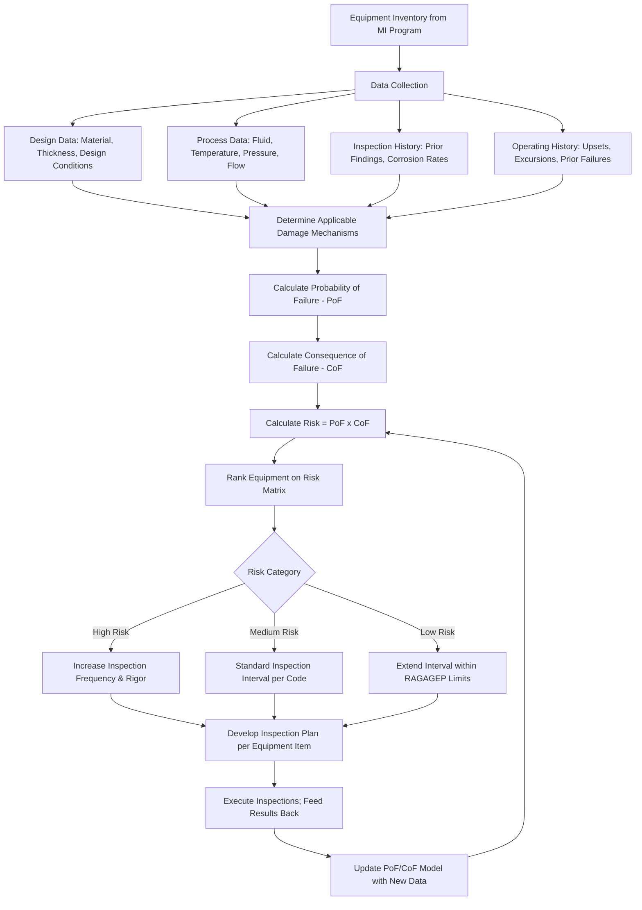

## Risk-Based Inspection Methodology

### Overview

Risk-Based Inspection (RBI) is a systematic methodology for prioritizing and optimizing inspection planning by directing inspection resources toward equipment with the highest calculated risk, rather than applying uniform, calendar-based intervals across all equipment regardless of actual damage potential or consequence severity. RBI is formalized under API 580 (Risk-Based Inspection) and API 581 (Risk-Based Inspection Technology, which provides the quantitative methodology), and it functions as a Recognized and Generally Accepted Good Engineering Practice (RAGAGEP) that can be used to satisfy the inspection interval-setting requirements of 1910.119(j)(4) as an alternative to fixed code-maximum intervals.

The core value proposition of RBI is resource optimization without compromising safety: rather than inspecting all equipment on the same fixed schedule, RBI concentrates inspection effort and technical rigor on equipment where a failure would have the greatest consequence and/or where degradation is most likely, while appropriately reducing inspection frequency (within RAGAGEP limits) on lower-risk equipment where the calculated risk does not justify the same intensity of effort.

### Regulatory and Standards Basis

**Key Points**

- **API 580**: establishes the RBI program framework, management system elements, and qualitative/semi-quantitative principles — the "how to build and run an RBI program" document.
- **API 581**: provides the detailed, quantitative risk calculation methodology (probability of failure models, consequence of failure models, damage factor calculations) — the "how to calculate the numbers" document.
- **1910.119(j)(4)(i)**: permits inspection procedures that follow recognized and generally accepted good engineering practices; a properly implemented RBI program consistent with API 580/581 satisfies this requirement as an alternative to relying solely on fixed intervals from equipment-specific codes (API 510, 570, 653).
- RBI does not replace the underlying inspection codes (API 510/570/653) — it determines *when* and with *what technique/scope* those codes' inspection methods are applied, based on calculated risk rather than a flat calendar default.

### Risk Fundamentals: The Core Equation

RBI is built on the fundamental risk relationship:

$$\text{Risk} = \text{Probability of Failure (PoF)} \times \text{Consequence of Failure (CoF)}$$

Both PoF and CoF are evaluated per equipment item (or per "circuit" for piping), and the resulting risk value is used to rank equipment and set inspection priority, interval, and technique.

### RBI Program Workflow



### Damage Mechanism Identification

A critical RBI input is identifying which damage mechanisms are credible for each piece of equipment, based on its material of construction, process fluid, and operating conditions. Common damage mechanisms include:

| Damage Mechanism | Typical Contributing Factors |
| --- | --- |
| General/localized corrosion | Corrosive process fluid, inadequate corrosion allowance |
| Corrosion under insulation (CUI) | Moisture ingress under insulation, cyclic temperature operation |
| Sulfide stress cracking / hydrogen-induced cracking | Wet H2S service, high-strength steel susceptibility |
| Chloride stress corrosion cracking | Austenitic stainless steel in chloride-bearing environments |
| High-temperature hydrogen attack | High-temperature, high-pressure hydrogen service |
| Fatigue cracking | Cyclic loading, vibration, thermal cycling |
| Erosion/erosion-corrosion | High-velocity flow, particulate-laden streams |

API 581 provides damage-mechanism-specific probability-of-failure models; correctly identifying applicable mechanisms is a prerequisite to a valid PoF calculation, since an omitted damage mechanism means its associated risk is entirely unaccounted for.

### Probability of Failure (PoF) Components

- **Generic failure frequency**: a baseline failure frequency for the equipment type/damage mechanism combination, derived from industry failure data.
- **Damage factor**: an adjustment multiplier reflecting how much the specific equipment's actual condition (measured corrosion rate, inspection effectiveness, time in service) increases risk above the generic baseline.
- **Inspection effectiveness**: a credit factor reflecting how reliable the applied inspection technique is at detecting the specific damage mechanism (highly effective techniques reduce calculated future risk more than a technique poorly suited to the mechanism present).

### Consequence of Failure (CoF) Components

- **Flammable/explosive consequence**: modeled release scenarios (leak size categories) and resulting fire/explosion consequence area, factoring in fluid properties, inventory, and detection/isolation system effectiveness.
- **Toxic consequence**: modeled toxic release dispersion and affected area based on fluid toxicity and quantity.
- **Financial consequence**: business interruption, equipment damage, and environmental cost components, often modeled separately from the safety-consequence dimension (some organizations weight safety consequence significantly higher than financial consequence in the final risk ranking).

### Risk Matrix Representation

A common way to visualize RBI output is a risk matrix plotting PoF against CoF:

|  | CoF: Low | CoF: Medium | CoF: High | CoF: Very High |
| --- | --- | --- | --- | --- |
| **PoF: Very High** | Medium | High | Very High | Very High |
| **PoF: High** | Medium | Medium | High | Very High |
| **PoF: Medium** | Low | Medium | Medium | High |
| **PoF: Low** | Low | Low | Medium | Medium |
| **PoF: Very Low** | Low | Low | Low | Medium |

Equipment falling in "Very High" and "High" risk cells typically receives increased inspection frequency, more rigorous inspection techniques (e.g., full-coverage UT scanning rather than spot checks), and closer engineering review; "Low" risk equipment may have inspection intervals extended toward or up to the applicable RAGAGEP maximum interval, provided the extension remains defensible under the code basis.

### Inspection Planning Output

For each equipment item, the RBI program should produce a documented inspection plan specifying:

1. **Interval**: next inspection due date, based on calculated risk and remaining life.
2. **Technique**: the specific NDE (non-destructive examination) method appropriate to the identified damage mechanism (e.g., UT thickness grid for general corrosion, wet fluorescent magnetic particle testing for cracking).
3. **Coverage**: the extent of the equipment surveyed (e.g., percentage of circuit length, specific high-risk locations such as dead legs, low points, or injection points).
4. **Scope justification**: linkage back to the specific damage mechanism(s) the inspection is intended to detect.

### Example: RBI-Derived Inspection Plan Entry

**Example**



```
RBI Inspection Plan
----------------------------------------
Equipment ID:            100-PL-045 (Piping Circuit)
Service:                 Wet H2S / Sour Water
Identified Damage Mechanisms:
  - Sulfide stress cracking (high susceptibility - carbon steel, wet H2S)
  - General corrosion (moderate susceptibility)

PoF Category:            High (damage factor elevated due to wet H2S exposure)
CoF Category:            High (toxic H2S release, populated area within
                         consequence radius)
Calculated Risk Category: Very High

Recommended Inspection Plan:
  - Technique: Wet fluorescent magnetic particle (WFMPI) for cracking +
    UT thickness grid for general corrosion
  - Coverage: 100% of circuit welds for WFMPI; TMLs at all elbows,
    tees, and dead legs
  - Interval: 3 years (reduced from API 570 default interval due to
    elevated risk ranking)

Basis Reference: API 581 damage factor calculation, Rev __, dated ____
Approved By: ____________________  Date: __________
```

### RBI Program Management Requirements (per API 580)

- **Team-based approach**: RBI assessments should involve inspection, process/materials engineering, and operations personnel collectively, not a single discipline in isolation.
- **Living program**: RBI is not a one-time assessment; risk rankings must be revalidated periodically and updated whenever new inspection data, process changes (via MOC), or operating excursions occur.
- **Documented basis**: every risk ranking and resulting inspection plan must have a traceable technical basis (damage mechanism identification, PoF/CoF calculation inputs) that can be audited.
- **Management of Change integration**: process changes that could introduce new damage mechanisms or alter consequence potential must trigger RBI reassessment for affected equipment.

### Common Pitfalls

- Applying RBI as a purely interval-extension exercise (looking only for equipment where inspection frequency can be reduced) without equal rigor in identifying equipment that requires *increased* frequency or technique upgrade.
- Failing to correctly identify all credible damage mechanisms for a given piece of equipment, resulting in an artificially low PoF that does not reflect the equipment's actual degradation risk.
- Treating the RBI risk ranking as static after initial calculation, without a defined revalidation cycle or trigger tied to new inspection findings or process changes.
- Using generic industry failure frequency data without adjusting for facility-specific operating history (e.g., prior near-misses or failures that should elevate the damage factor for similar equipment).
- Disconnecting RBI from the Management of Change program, so a process modification that introduces a new corrosive species or changes operating temperature does not trigger reassessment of previously "low risk" equipment. [Inference: commonly identified as an audit finding in mature RBI programs, though the specific gap rate varies by facility.]
- Under-resourcing the multidisciplinary team input that API 580 calls for, resulting in an RBI assessment driven primarily by inspection history without adequate process/materials engineering input on damage mechanism applicability.

### Related Topics

- Inspection, Testing, and Preventive Maintenance
- Equipment Covered Under Mechanical Integrity Programs
- API 510/570/653 Inspection Code Requirements
- Fitness-for-Service Assessment (API 579)
- Deficiency Correction and Run-Repair-Replace Decision Making
- Management of Change (MOC) Program Requirements
- Damage Mechanism Review and Corrosion Loop Identification