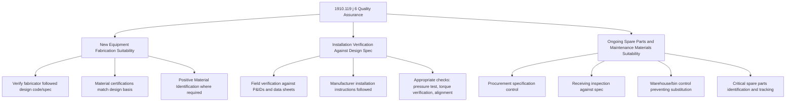

## Quality Assurance for Equipment and Spare Parts

### Overview

Quality Assurance (QA) for equipment and spare parts is the Mechanical Integrity sub-element that ensures new equipment and spare/replacement parts installed into a PSM-covered process are actually suitable for that specific process application before they enter service. This is the final control point in the MI system: even a perfectly scoped equipment inventory, well-designed inspection intervals, and rigorous testing program can be undermined if a replacement gasket, valve, or vessel component installed during routine maintenance does not actually meet the material, pressure, or temperature rating required by the original design specification. QA closes this gap by requiring documented verification of fitness-for-service *before* installation, rather than relying on inspection to catch a substandard part only after it has already failed in service.

### Regulatory Basis

**Key Points**

- **OSHA 29 CFR 1910.119(j)(6)**: In the construction of new plants and equipment, the employer shall assure that equipment as it is fabricated is suitable for the process application for which it will be used. Appropriate checks and inspections shall be performed to assure that equipment is installed properly and consistent with design specifications and the manufacturer's instructions. The employer shall assure that maintenance materials, spare parts, and equipment are suitable for the process application for which they will be used.
- This provision has three distinct requirements embedded within it: (1) new equipment fabrication suitability, (2) installation verification against design specifications, and (3) ongoing suitability of maintenance materials and spare parts used in repairs and replacements.
- **40 CFR 68.73(d)** (EPA RMP): a substantively parallel requirement for RMP-covered processes.
- QA under 1910.119(j)(6) is closely linked to, but distinct from, the design specification verification performed during PSSR (1910.119(i)(2)(i)) — PSSR verifies the *installed* condition matches design at a point in time (startup), while QA is the continuous discipline that ensures every part entering the maintenance supply chain, at any time, meets that same design basis.

### The Three QA Requirement Areas



### QA Requirement 1: New Equipment Fabrication Suitability

- Verification that equipment is fabricated in accordance with the applicable design code (e.g., ASME Boiler and Pressure Vessel Code Section VIII for pressure vessels, ASME B31.3 for process piping).
- Material test reports (MTRs) or mill certificates confirming actual material chemistry and mechanical properties match the design specification.
- Positive Material Identification (PMI) testing at the fabrication shop or upon receipt, particularly for alloy materials where a mix-up (e.g., installing carbon steel where stainless steel was specified) could create an undetected failure risk.
- Non-destructive examination (NDE) of fabrication welds per the applicable code (radiography, ultrasonic testing, or other methods specified by the design code and the criticality of the joint).
- Documented fabricator quality control program review, particularly for third-party fabricated equipment (vessels, exchangers, skid-mounted packages).

### QA Requirement 2: Installation Verification Against Design Specifications

- Field verification that installed equipment location, orientation, and connections match the approved P&IDs and equipment layout drawings.
- Confirmation that manufacturer's installation instructions were followed (e.g., correct bolt torque sequence and value for flanged connections, proper alignment tolerances for rotating equipment, correct gasket selection for the service).
- Appropriate checks performed and documented: hydrostatic or pneumatic pressure testing of new piping/vessels, torque verification records, laser alignment reports for pumps and rotating equipment, calibration certificates for newly installed instrumentation.
- This verification substantively overlaps with, and typically feeds directly into, the "construction and equipment in accordance with design specifications" confirmation required by PSSR under 1910.119(i)(2)(i).

### QA Requirement 3: Ongoing Suitability of Spare Parts and Maintenance Materials

This is often the most operationally challenging QA requirement because it must function continuously across the full maintenance supply chain, not just at a discrete project milestone.

**Procurement Specification Control**

- Purchase specifications for spare parts must reference the correct design basis (material, pressure/temperature rating, dimensional standard) rather than a generic part description.
- Approved vendor/manufacturer lists help ensure parts are sourced from suppliers with demonstrated quality control, particularly for safety-critical components (relief valves, gaskets in critical service, bolting materials).

**Receiving Inspection**

- Incoming parts checked against the purchase specification before being placed into usable inventory, not merely checked against the purchase order line item description.
- Material certifications reviewed and retained for traceability, especially for pressure-boundary components and bolting.
- PMI spot-checks on receipt for alloy components in critical service, particularly where a wrong-material substitution has historically been a documented industry hazard (e.g., carbon steel bolts installed in place of specified alloy bolts in high-temperature or corrosive service).

**Warehouse and Bin Control**

- Physical segregation or clear labeling preventing look-alike parts of different specifications from being inadvertently substituted (a classic failure mode: two gaskets that appear visually identical but have different temperature/pressure ratings, stored in adjacent bins).
- Bin locations cross-referenced to a controlled parts database that ties the physical part to its specification and approved application.

**Critical Spare Parts Program**

- Identification of spare parts whose failure or unavailability would have significant safety or business consequence, ensuring adequate inventory is maintained for these items specifically (distinct from general inventory optimization, which might otherwise deprioritize low-turnover but safety-critical parts).
- Documented basis linking each critical spare to the specific equipment/application it supports, preventing "similar enough" substitutions during an outage.

### Example: Wrong-Material Substitution Risk Pattern

**Example**

A commonly cited industry failure pattern illustrates why QA Requirement 3 exists: a maintenance technician replaces a leaking flange gasket during an emergency repair, selecting a gasket from a nearby bin that appears to be the correct type. The installed gasket is rated for a lower temperature/pressure service than the process actually requires. The substitution passes visual inspection (gaskets of different ratings can look nearly identical) and the flange does not leak immediately. Over subsequent thermal cycling, the gasket degrades faster than the correctly specified material would have, eventually resulting in a loss of containment. Root cause analysis typically traces this to inadequate bin labeling/segregation (a QA Requirement 3 control gap) rather than a failure of the technician's individual competence. [Inference: this pattern is a widely referenced illustrative scenario in MI/QA training material and audit guidance rather than a specific single documented incident.]

### QA Documentation Checklist

| QA Area | Documentation Required |
| --- | --- |
| New equipment fabrication | Material test reports/mill certs, fabrication code compliance record, NDE reports, fabricator QC documentation |
| Installation verification | Field walk-down record, pressure test certificate, torque/alignment records, calibration certificates |
| Spare parts procurement | Purchase specification referencing design basis, approved vendor list reference |
| Receiving inspection | Receiving inspection checklist, material certification review record, PMI results where applicable |
| Warehouse control | Bin labeling/segregation audit record, critical spare parts list with equipment cross-reference |

### Example: Spare Parts QA Verification Form

**Example**



```
Spare Parts Quality Assurance Verification
---------------------------------------------
Part Description:        Gasket, Spiral Wound, 6-in, Class 300
Part Number:              SW-6300-316-FG
Application Equipment:    100-PL-045 (Sour Water Piping)
Required Specification:   316 SS windings / Flexible Graphite filler,
                          rated to 750F / Class 300

Receiving Verification:
[ ] Material certification received and matches specification
[ ] Part number/marking on physical item matches specification
[ ] PMI performed (if required for this application): Result ____
[ ] Stored in correctly labeled/segregated bin location: Bin # ____

Pre-Installation Verification:
[ ] Confirmed correct part pulled for this specific application
[ ] Cross-checked against equipment spec sheet / MOC if applicable

Verified By:  ____________________  Date: __________
```

### Integration with Other PSM Elements

- **Management of Change**: any change in approved spare parts specification (e.g., a material upgrade following a damage mechanism finding) must be processed through MOC before the new specification becomes the standard procurement basis.
- **Pre-Startup Safety Review**: PSSR's construction/equipment verification (1910.119(i)(2)(i)) relies on QA records generated under 1910.119(j)(6) as supporting evidence that installed equipment matches design specifications.
- **Mechanical Integrity Inspection Program**: inspection findings that reveal unexpected degradation may sometimes trace back to a QA failure (wrong material installed), making QA records a necessary input to root cause analysis during MI deficiency investigations.

### Common Pitfalls

- Treating QA as satisfied by the presence of a purchase order, without verifying that the purchased part's actual specification matches the design requirement.
- Inadequate bin labeling or physical segregation, allowing visually similar but functionally different parts (gaskets, bolting, valve trim) to be inadvertently substituted during maintenance.
- Relying on the original equipment manufacturer's part number alone without independently verifying material certification, particularly when parts are sourced through secondary distributors rather than directly from the OEM.
- Failing to maintain a critical spare parts list, resulting in emergency procurement decisions made under time pressure without the same specification rigor applied to routine planned procurement.
- Not retaining material certifications and QA records long-term, undermining traceability during a later failure investigation or MI audit.
- Allowing field "workarounds" during emergency repairs (installing the closest available part rather than the correctly specified one) without a documented temporary-use justification and a plan to replace with the correct part in a defined timeframe. [Inference: commonly identified as a contributing factor in equipment failure investigations, though prevalence varies by facility spare parts program maturity.]

### Related Topics

- Equipment Covered Under Mechanical Integrity Programs
- Inspection, Testing, and Preventive Maintenance
- PSSR Checklist Development
- Management of Change (MOC) Program Requirements
- Deficiency Correction and Run-Repair-Replace Decision Making
- Critical Spare Parts Management
- Positive Material Identification (PMI) Programs