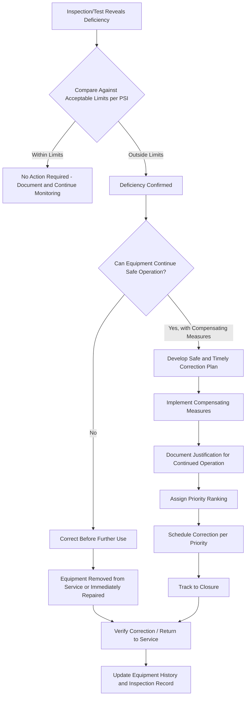

## Deficiency Correction and Prioritization

### Overview

Deficiency correction and prioritization is the Mechanical Integrity sub-element that governs what happens after an inspection or test identifies equipment condition outside acceptable limits. Detecting a deficiency accomplishes nothing for process safety unless it is followed by a disciplined, documented decision process that determines whether the equipment can continue operating, under what compensating measures, and by when the deficiency must be corrected. OSHA 29 CFR 1910.119(j)(5) establishes this as an explicit regulatory requirement, and it functions as the critical link between the inspection/testing program (which generates findings) and actual risk reduction (which only occurs once a finding is acted upon).

Because facilities typically generate deficiency findings faster than they can immediately correct all of them — particularly across a large equipment inventory — prioritization is not merely an administrative convenience but a necessary risk management function: it ensures that limited correction resources (labor, materials, planned downtime) are directed first toward the deficiencies that pose the greatest process safety risk.

### Regulatory Basis

**Key Points**

- **OSHA 29 CFR 1910.119(j)(5)**: When inspection and testing reveals a deficiency in equipment that is outside acceptable limits (defined by the process safety information in paragraph (d) of this section), the employer shall correct the deficiency before further use, or in a safe and timely manner when necessary means are taken to assure safe operation.
- This creates two possible pathways for any identified deficiency: (1) correct before further use (the default, most conservative pathway), or (2) continue operation under a documented "safe and timely" correction plan with necessary compensating measures — this second pathway is not an automatic entitlement, but requires an affirmative, documented determination that continued operation is safe.
- **40 CFR 68.73(e)** (EPA RMP): a substantively parallel deficiency correction requirement for RMP-covered processes.
- "Acceptable limits" are explicitly tied back to Process Safety Information (1910.119(d)) — meaning the acceptance criteria for any given deficiency must trace to documented design basis, safe operating limits, or code-minimum requirements, not to an ad hoc judgment made at the time the finding is made.

### The Two Correction Pathways



### Determining "Acceptable Limits"

Acceptable limits are not a single universal standard; they depend on the equipment type, damage mechanism, and applicable RAGAGEP:

| Equipment/Finding Type | Typical Acceptable Limit Basis |
| --- | --- |
| Pressure vessel wall thickness | Minimum required thickness (t-min) per design code (ASME Section VIII) and corrosion allowance basis |
| Piping wall thickness | t-min per ASME B31.3 design calculation for the specific pipe class and service |
| Relief valve set pressure | Tolerance band around design set pressure per API 527/576 |
| Safety Instrumented Function proof test | Pass/fail against documented Safety Requirement Specification response |
| Storage tank bottom thickness | Minimum thickness per API 653 based on original design and corrosion allowance |
| Rotating equipment vibration | Alarm/trip thresholds per API 610 or ISO vibration severity standards |

A deficiency exists when a measured or tested condition falls outside these documented limits — not simply when a value has changed from a prior reading, since gradual degradation within acceptable limits is expected and monitored rather than treated as an immediate deficiency.

### Determining "Safe and Timely" Correction (When Immediate Correction Is Not Required)

When a deficiency is found but immediate shutdown/correction is not warranted, the decision to continue operation under a correction plan should be supported by documented technical justification, typically addressing:

1. **Fitness-for-Service Assessment**: a formal engineering evaluation (often per API 579) demonstrating the equipment remains fit for continued service despite the deficiency, for a defined period and under defined conditions.
2. **Remaining Life Calculation**: quantified basis for how long the equipment can safely operate before the deficiency would progress to a condition requiring immediate correction.
3. **Compensating Measures**: additional controls implemented to manage risk during the interim period (e.g., increased inspection frequency, reduced operating pressure/temperature, enhanced monitoring, temporary repair such as a clamp or patch meeting code requirements).
4. **Defined Correction Timeline**: a specific, tracked completion date — not an open-ended "as resources allow" designation.

### Prioritization Framework

Because multiple deficiencies often compete for the same correction resources (turnaround windows, specialized contractors, capital budget), a prioritization framework ensures the highest-risk items are addressed first:

$$\text{Priority Score} = f(\text{Consequence Severity}, \text{Likelihood of Further Degradation}, \text{Time to Next Inspection Opportunity})$$

**Priority Category 1 — Immediate/Emergency**

- Deficiency represents an imminent loss of containment risk or a safety-critical function that is currently non-functional (e.g., a failed proof test on a safety instrumented function protecting against a credible high-consequence scenario).
- Requires immediate correction before further use; equipment is typically removed from service or the process is operated only under direct compensating measures until corrected.

**Priority Category 2 — Urgent/Near-Term**

- Deficiency is outside acceptable limits but a documented fitness-for-service basis supports continued operation for a defined, relatively short period (weeks to a few months) with compensating measures.
- Scheduled for correction at the next available opportunity (planned outage, next scheduled maintenance window) rather than deferred indefinitely.

**Priority Category 3 — Planned/Routine**

- Deficiency has a documented remaining life supporting continued safe operation for an extended period, but correction should still be scheduled (e.g., at the next major turnaround) rather than left unaddressed indefinitely.
- Typically tracked in a long-range maintenance/turnaround planning list rather than requiring near-term action.

### Priority Assignment Matrix

| Consequence if Deficiency Progresses | Likelihood of Rapid Progression | Assigned Priority |
| --- | --- | --- |
| High (toxic/flammable release, high-population consequence area) | High | Category 1 - Immediate |
| High | Low/Moderate | Category 2 - Urgent |
| Medium | High | Category 2 - Urgent |
| Medium | Low/Moderate | Category 3 - Planned |
| Low | Any | Category 3 - Planned |

### Example: Deficiency Correction Decision Record

**Example**



```
Deficiency Correction Record
-------------------------------------
Equipment ID:          100-PL-045 (Piping Circuit)
Finding Source:        UT Thickness Survey, dated 2026-02-10
Deficiency Description: Measured thickness at TML-07 = 0.192 in;
                        t-min per design code = 0.225 in
                        (deficiency: 0.033 in below acceptable limit)

Acceptable Limit Basis: ASME B31.3 design calculation, Doc #PSI-2018-0044

Immediate Safety Determination:
[ ] Correct before further use (required)
[X] Continue operation under documented Fitness-for-Service basis

Fitness-for-Service Basis:
  API 579 Level 1 assessment performed by [Engineer], dated 2026-02-14.
  Result: Fit for continued service at reduced MAWP of 285 psig
  (from original 320 psig) for a period not to exceed 6 months.

Compensating Measures:
  - Operating pressure administratively restricted to 285 psig
  - UT re-measurement at TML-07 scheduled at 3-month interval
  - Area flagged in control room for operator awareness

Priority Category:      2 - Urgent
Correction Plan:        Replace 12-ft piping spool at next planned
                        outage, scheduled 2026-07 (within 6-month
                        FFS validity window)

Approved By:  ____________________  Date: __________
Tracking ID:  DEF-2026-0091
```

### Tracking to Closure

- All open deficiencies, regardless of priority category, should reside in a single tracked system (not scattered across individual inspector notes or informal spreadsheets) with an assigned owner, priority, and due date.
- Category 1 items typically require executive/management visibility given their immediate risk implications; Category 2 and 3 items are commonly reviewed on a recurring cadence (e.g., monthly MI program review) to confirm they remain on track and that no items have silently exceeded their fitness-for-service validity window.
- A deficiency's priority category should be re-evaluated if new information arises (e.g., a subsequent inspection shows faster-than-expected degradation), rather than being fixed permanently at initial assignment.

### Common Pitfalls

- Treating any deficiency finding as automatically requiring immediate shutdown, without evaluating whether a genuine "safe and timely" pathway with proper technical justification is available — this can create unnecessary production impact without a corresponding safety benefit, and can also erode organizational discipline around the distinction if applied inconsistently.
- Conversely, allowing continued operation under a "safe and timely" justification that is not actually supported by a documented fitness-for-service assessment, effectively treating the deficiency as low priority without genuine technical basis.
- Allowing correction timelines to slip past their documented fitness-for-service validity window without formal re-assessment, silently converting a time-bound compensating measure into an indefinite one.
- Fragmented deficiency tracking across multiple systems or informal records, making it difficult to demonstrate to an auditor (or to internal management) the full population of open items and their status.
- Prioritizing deficiencies primarily by ease/cost of correction rather than by actual risk, potentially leaving higher-risk items under-resourced relative to easier, lower-risk fixes. [Inference: commonly identified as a systemic tendency in resource-constrained maintenance organizations, though the degree varies by facility governance.]
- Failing to communicate compensating measures (e.g., a reduced operating pressure restriction) effectively to operations personnel, risking inadvertent operation outside the temporarily reduced safe limit.

### Related Topics

- Inspection, Testing, and Preventive Maintenance
- Risk-Based Inspection Methodology
- Fitness-for-Service Assessment (API 579)
- Equipment Covered Under Mechanical Integrity Programs
- Process Safety Information (PSI) Elements and Maintenance
- Management of Change (MOC) Program Requirements
- Turnaround/Shutdown Planning and Contractor Mobilization