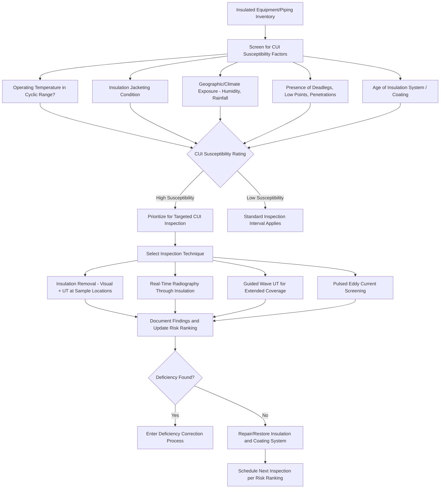

## Corrosion Under Insulation and Hidden Degradation Mechanisms

### Overview

Corrosion Under Insulation (CUI) and other hidden degradation mechanisms represent one of the most challenging categories of damage for Mechanical Integrity programs because, by definition, they occur in locations that are not visible to routine external visual inspection. Insulated piping and equipment, buried or underground components, and areas obscured by fireproofing, cladding, or supports can experience significant wall loss or cracking that progresses undetected until a leak occurs, an inspection specifically targets the hidden location, or the equipment fails. Because CUI and related hidden mechanisms defeat the most common and lowest-cost inspection method (external visual inspection), they require deliberate program design — specific identification of susceptible locations, specialized inspection techniques, and risk-based prioritization — rather than being caught incidentally through standard inspection rounds.

Industry incident history, including investigations by the U.S. Chemical Safety Board (CSB) into fatal piping failures, has repeatedly identified CUI-type damage mechanisms as root or contributing causes, making this a specifically emphasized area within Mechanical Integrity program audits and RAGAGEP guidance (notably API 583, Corrosion Under Insulation and Fireproofing).

### Regulatory and Standards Context

**Key Points**

- CUI is not named as a distinct regulatory category within 1910.119(j), but it falls squarely within the general inspection and testing requirements of 1910.119(j)(4), which require inspections to follow RAGAGEP and to be performed at a frequency consistent with good engineering practice and prior operating experience — a program that fails to specifically address CUI-susceptible locations does not meet this standard for the affected equipment.
- **API 583**: Corrosion Under Insulation and Fireproofing — provides RAGAGEP guidance specifically for identifying CUI-susceptible equipment, inspection methodology, and mitigation strategies.
- **API 570 / API 510 / API 653**: the underlying piping, pressure vessel, and storage tank inspection codes all incorporate CUI as a damage mechanism to be specifically considered within circuit/component inspection planning, rather than treating external insulated surfaces as adequately covered by generic visual inspection alone.
- **API 580/581 (RBI)**: CUI is one of the most commonly modeled damage mechanisms in risk-based inspection programs specifically because its "hidden" nature elevates both its probability of undetected progression and the importance of correctly identifying susceptible locations.

### Why CUI Occurs

CUI develops when moisture becomes trapped between insulation and the underlying metal surface, and the coating/insulation system fails to keep that moisture away from the metal. Contributing factors include:

- **Insulation jacketing breaches**: damaged, poorly sealed, or missing insulation cladding/jacketing that allows rainwater or wash-down water ingress.
- **Cyclic temperature operation**: equipment operating intermittently between ambient and elevated temperatures (roughly 10°C to 175°C / 50°F to 350°F is commonly cited as the highest-risk range) allows repeated condensation cycles, whereas equipment continuously operating above this range tends to keep the surface dry and equipment continuously below it experiences less aggressive corrosion kinetics.
- **Deadlegs and low points**: insulated nozzles, supports, and low points in piping systems where water can collect and remain trapped rather than draining away.
- **Coating system degradation**: failed or absent protective coating beneath the insulation, removing the last line of defense once moisture does penetrate.
- **Penetrations**: insulation penetrations for supports, instrumentation, or bolted connections, which are common entry points for moisture and are frequently under-inspected relative to the surrounding insulated surface.

### CUI Risk Screening Workflow



### CUI-Susceptible Location Identification

| Location Type | Why It's High Risk |
| --- | --- |
| Insulated piping in cyclic-temperature service | Repeated condensation/drying cycles accelerate corrosion |
| Vessel/piping supports and clips | Water tends to collect at support contact points; often poorly sealed |
| Nozzle-to-shell junctions | Complex insulation geometry increases jacketing failure likelihood |
| Deadlegs and low points | Water pools and cannot drain, providing sustained moisture exposure |
| Areas near steam tracing | Steam leaks can introduce additional moisture into the insulation system |
| Insulation jacketing seams and terminations | Primary pathways for water ingress if sealant/caulking fails |
| Below-grade transitions (piping entering soil) | Interface zone often has degraded coating and is difficult to inspect |

### Inspection Techniques for Hidden Degradation

**1. Insulation Removal (Direct Visual + Thickness Measurement)**

- The most reliable method: physically remove insulation at targeted locations, visually inspect the surface, and perform UT thickness measurement.
- Highest confidence but also highest cost and labor; typically applied at a statistically representative sample of high-risk locations rather than the entire insulated surface.

**2. Real-Time Radiography (Profile Radiography)**

- X-ray or gamma radiography performed through the insulation to visualize the pipe/vessel wall profile without removing insulation.
- Effective for detecting significant wall loss on piping, though less effective for detecting localized pitting compared to direct UT.

**3. Guided Wave Ultrasonic Testing (GWUT)**

- Transmits ultrasonic waves along the length of a pipe from a single access point, screening a long section of insulated piping for significant anomalies without removing insulation along the entire length.
- Useful as a screening tool to identify locations warranting more detailed follow-up inspection, rather than as a precise thickness-measurement technique.

**4. Pulsed Eddy Current (PEC)**

- Measures average wall thickness through insulation and (in many cases) through non-magnetic cladding, without insulation removal.
- Effective for general wall-loss screening over broad areas; less effective at pinpointing highly localized pitting.

### Non-CUI Hidden Degradation Mechanisms

CUI is the most commonly discussed hidden mechanism, but MI programs should address other locations where degradation is similarly difficult to detect through routine external inspection:

- **Corrosion Under Fireproofing (CUF)**: analogous to CUI, but occurring beneath sprayed or cementitious fireproofing material rather than thermal insulation, common on structural steel and vessel skirts in fire-protected areas.
- **Buried/Underground Piping Corrosion**: external corrosion on buried piping, assessed via cathodic protection monitoring, soil resistivity surveys, and periodic direct examination (excavation at representative locations) rather than routine visual inspection.
- **Internal Corrosion Under Deposits**: internal fouling, scale, or sediment can shield localized areas of the internal wall from uniform corrosion inhibitor exposure, creating internal pitting that is not detectable from external inspection and may require internal visual inspection or specialized internal NDE.
- **Refractory-Lined Equipment Degradation**: internal shell corrosion beneath refractory lining in fired equipment (furnaces, reactors) that is only detectable through internal inspection during a shutdown, since the refractory itself obscures the underlying shell.

### Example: CUI Inspection Finding Record

**Example**



```
CUI Inspection Record
------------------------------------
Equipment ID:          100-PL-060 (Insulated Piping, Cyclic Service)
Inspection Technique:  Insulation Removal + UT Thickness Survey
Location Selected:     Support clip at grid line 14, identified as
                       high-susceptibility per CUI screening criteria
                       (cyclic temp service, aged jacketing, deadleg
                       nearby)

Findings:
  - Insulation jacketing found breached with visible water staining
  - Coating system fully degraded at inspection location
  - Measured wall thickness: 0.145 in (t-min = 0.219 in)
  - Localized pitting corrosion identified, max pit depth 0.09 in

Result:                DEFICIENCY - OUTSIDE ACCEPTABLE LIMITS
Action:                Entered into Deficiency Correction process,
                       Priority Category 1 (active pitting below t-min)
Additional Scope:      Expand inspection to adjacent support locations
                       on same circuit given confirmed active mechanism

Inspector:  ____________________  Date: __________
```

### Program-Level Mitigation Strategies

- **Insulation and coating system upgrades**: improved jacketing materials, better sealing at penetrations and terminations, and corrosion-resistant coating systems beneath insulation to reduce future CUI susceptibility.
- **Insulation removal at design stage for high-risk locations**: some organizations eliminate insulation entirely on identified high-CUI-risk, non-personnel-protection-critical locations where the operational benefit of insulation is marginal relative to the inspection burden it creates.
- **CUI-specific risk-based inspection integration**: incorporating CUI susceptibility explicitly as a modeled damage mechanism within the facility's RBI program, ensuring inspection intervals and techniques for insulated equipment reflect this elevated and hidden risk rather than defaulting to generic external visual inspection intervals.
- **Systematic screening surveys**: periodic, structured CUI susceptibility screening across the full insulated equipment inventory (rather than only inspecting where a leak has already occurred), often using the susceptibility factors outlined above to rank and prioritize follow-up detailed inspection.

### Common Pitfalls

- Relying on external visual inspection alone for insulated equipment, effectively providing no meaningful CUI detection since the insulation obscures the very surface that would show corrosion.
- Failing to specifically identify and prioritize known high-risk locations (deadlegs, low points, penetrations, support contact points) for targeted inspection, instead treating all insulated surface area as uniformly low priority.
- Underestimating the cyclic-temperature risk band, assuming that "hot" equipment is inherently safe from CUI because higher temperatures might seem likely to dry out moisture, when in fact the cyclic (not simply "hot") nature of operation is the key risk driver.
- Repairing insulation and coating after a CUI finding without addressing the systemic cause (e.g., simply patching a jacketing breach without correcting the drainage or sealing design deficiency that allowed water ingress in the first place), inviting recurrence at the same location.
- Not integrating CUI-specific damage mechanism modeling into the facility's risk-based inspection program, resulting in insulated equipment being inspected on the same generic interval as non-insulated equipment despite its fundamentally different and hidden risk profile. [Inference: commonly identified as a program maturity gap in facilities transitioning from calendar-based to risk-based inspection approaches, though prevalence varies.]
- Overlooking non-CUI hidden mechanisms (buried piping, corrosion under fireproofing, internal deposits) when a program's attention becomes narrowly focused on CUI specifically, leaving other "hidden" degradation categories under-addressed.

### Related Topics

- Inspection, Testing, and Preventive Maintenance
- Risk-Based Inspection Methodology
- Equipment Covered Under Mechanical Integrity Programs
- Deficiency Correction and Prioritization
- Fitness-for-Service Assessment (API 579)
- Damage Mechanism Review and Corrosion Loop Identification
- Cathodic Protection and Buried Piping Integrity Monitoring