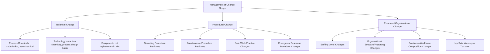
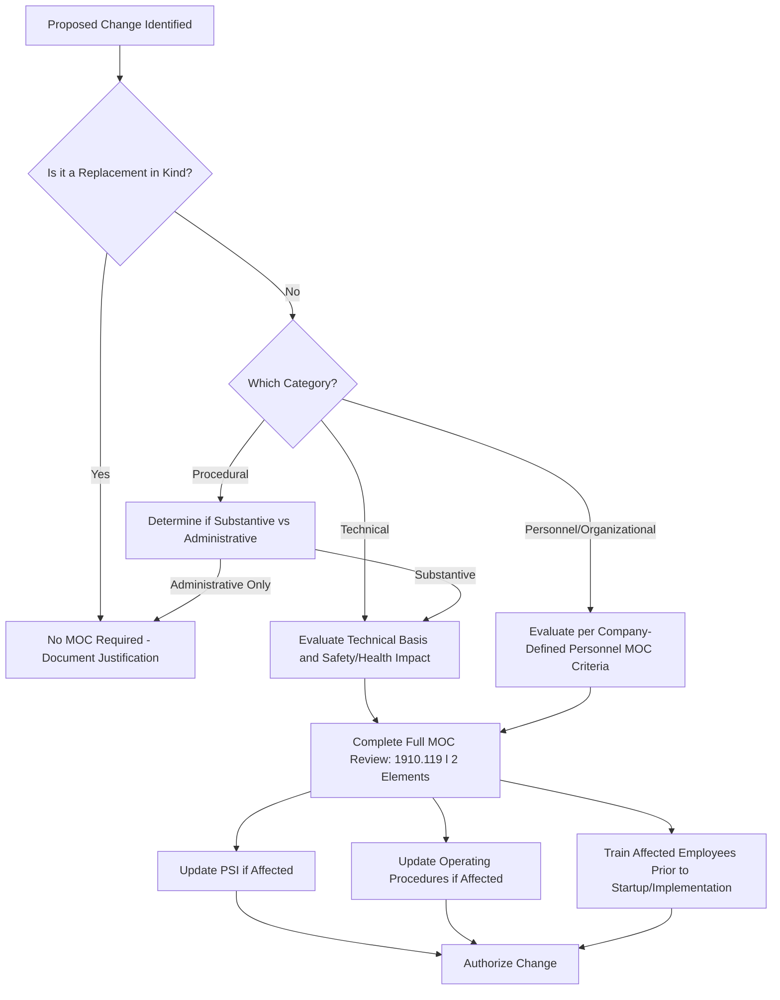

## Technical, Personnel, and Procedural Change


### Overview

Management of Change (MOC) applies to more than physical equipment modifications alone. OSHA 29 CFR 1910.119(l) requires a documented MOC procedure to evaluate changes to process chemicals, technology, equipment, and procedures — and industry practice, informed by incident investigation history, has extended this scope conceptually to include organizational and personnel changes that can materially affect process safety even without any physical modification to the plant. Understanding the full breadth of what constitutes a "change" requiring MOC review — technical, personnel, and procedural — is essential because narrowly interpreting MOC as applying only to equipment changes is one of the most consequential scoping errors an organization can make in its PSM program.

### Regulatory Basis

**Key Points**

- **OSHA 29 CFR 1910.119(l)(1)**: The employer shall establish and implement written procedures to manage changes (except for "replacements in kind") to process chemicals, technology, equipment, and procedures; and, changes to facilities that affect a covered process.
- **1910.119(l)(2)**: The procedures shall assure that the following considerations are addressed prior to any change: (i) the technical basis for the proposed change; (ii) impact of change on safety and health; (iii) modifications to operating procedures; (iv) necessary time period for the change; and (v) authorization requirements for the proposed change.
- **1910.119(l)(3)**: Employees involved in operating a process and maintenance/contract employees whose job tasks will be affected by a change shall be informed of, and trained in, the change prior to startup of the process or affected part.
- **1910.119(l)(4)**: If a change covered by this paragraph results in a change in the process safety information, such information shall be updated accordingly.
- **1910.119(l)(5)**: If a change covered by this paragraph results in a change in the operating procedures, such procedures shall be updated accordingly.
- The standard's explicit text names "process chemicals, technology, equipment, and procedures" — this is the literal statutory basis for the "technical" and "procedural" categories; "personnel" change as an MOC-relevant category is a widely adopted industry practice extension, reflecting recognition that staffing/organizational changes can alter risk even absent any technical modification. [Inference: the explicit inclusion of personnel-related change triggers in company MOC procedures is common industry practice, though it is not verbatim regulatory text in 1910.119(l).]

### Three Change Categories



### Category 1: Technical Change

**Process Chemicals**

- Substitution of a raw material, catalyst, or additive with a different chemical, even if intended to serve the same functional purpose.
- Changes in chemical concentration, purity, or impurity profile that could affect reactivity, corrosivity, or hazard classification.
- Introduction of a new chemical into an existing process not previously part of the Process Safety Information.

**Technology**

- Changes to the fundamental process chemistry, reaction pathway, or process design basis (e.g., a different catalyst system requiring different operating temperature/pressure).
- Changes to control philosophy or process control strategy that alter how the process is fundamentally operated, distinct from simple instrumentation replacement.

**Equipment**

- Any equipment modification that is not a strict "replacement in kind" — different material of construction, different capacity/rating, different manufacturer specification, or new equipment added to the process.
- This category overlaps directly with the PSSR trigger discussion, since MOC-qualifying equipment changes are the primary driver of the PSSR requirement for modified facilities under 1910.119(i)(1).

### Category 2: Procedural Change

- **Operating procedure revisions**: any substantive change to startup, normal operation, temporary operation, emergency shutdown, or normal shutdown procedures — not merely typographical corrections, but changes affecting sequence, safe operating limits, or operator actions.
- **Maintenance procedure revisions**: changes to lockout/tagout points, maintenance sequencing, or isolation procedures that reflect a genuine change in how maintenance is performed, distinct from administrative reformatting.
- **Safe work practice changes**: modifications to hot work, confined space entry, or other safe work practice procedures that alter the controls applied to hazardous work activities.
- **Emergency response procedure changes**: revisions to the Emergency Action Plan or emergency response procedures that change evacuation routes, roles, or response protocols.

A key distinction within procedural change is between a substantive change (altering what is done or how a hazard is controlled) and a purely administrative change (formatting, renumbering, correcting a typo with no substantive effect) — MOC review is warranted for the former but is typically not necessary for the latter, though many organizations apply a lightweight documented screening step to confirm a proposed procedure edit is genuinely administrative before exempting it from full MOC review.

### Category 3: Personnel and Organizational Change

While not explicitly named in the regulatory text of 1910.119(l), industry practice recognizes that certain personnel and organizational changes can materially affect process safety risk and warrants MOC-equivalent evaluation:

- **Staffing level changes**: reducing the number of operators per shift, changing shift structure (e.g., 8-hour to 12-hour rotations), or changing the ratio of experienced-to-new personnel on a given crew.
- **Organizational structure changes**: reorganizing reporting lines for safety-critical roles, changing which department owns a particular safety function, or consolidating roles that previously provided independent checks.
- **Contractor/workforce composition changes**: a significant shift in the proportion of contract versus employee labor performing safety-critical tasks, which can affect the training, experience, and site-specific knowledge base of the workforce actually operating or maintaining the process.
- **Key role vacancy or turnover**: extended vacancy in a safety-critical position (e.g., a PSM Coordinator, MI Engineer, or shift supervisor role) without an interim coverage plan, or unusually high turnover in operations positions reducing institutional process knowledge.

[Inference: this category's treatment as a formal MOC trigger — as opposed to being managed solely through HR or staffing processes — reflects an industry practice adopted by many mature PSM programs following incident investigations (e.g., aspects of the CSB's investigation findings related to staffing and organizational factors in various incidents) that identified organizational/staffing factors as contributing causes, though the specific triggering criteria and formality vary significantly across organizations.]

### MOC Screening Decision Logic



### MOC Review Elements Applied Across All Three Categories (1910.119(l)(2))

| Required Consideration | Technical Change Example | Procedural Change Example | Personnel Change Example |
| --- | --- | --- | --- |
| Technical basis for change | Engineering justification for new catalyst | Rationale for revised startup sequence | Staffing study supporting reduced crew size |
| Impact on safety and health | Reactivity/hazard assessment of new chemical | Hazard analysis of procedure change effect on operator actions | Workload/fatigue analysis for revised shift pattern |
| Modifications to operating procedures | Update procedures for new equipment operation | The change IS the procedure modification | Update procedures if task allocation changes |
| Time period for the change | Temporary vs. permanent equipment change | Effective date and transition plan | Duration of interim coverage for vacant role |
| Authorization requirements | Engineering/PSM management sign-off | Document control approval | HR/operations management sign-off, PSM review |

### Example: Personnel Change MOC Screening Form Excerpt

**Example**



```
Personnel/Organizational Change MOC Screening
------------------------------------------------
Proposed Change:  Reduce control room operator staffing from 2 to 1
                  per shift on Unit 200, night shift only

Screening Questions:
1. Does this change affect the number of personnel available to
   respond to an abnormal situation or emergency? [X] Yes  [ ] No
2. Does this change affect span of control for safety-critical
   monitoring tasks?                              [X] Yes  [ ] No
3. Has a workload/task analysis been performed for the
   proposed staffing level?                       [ ] Yes  [X] No - REQUIRED

Screening Result: FULL MOC REVIEW REQUIRED
Rationale: Change affects emergency response capability and normal
           task workload; questions 1-2 triggered per company MOC
           procedure Section 4.3 (Personnel Change Criteria)

Next Steps: Complete workload analysis, hazard evaluation of reduced
            staffing scenario, and full MOC package before
            implementation.
```

### Common Pitfalls

- Interpreting MOC scope narrowly as "equipment changes only," missing procedural revisions that substantively alter operator actions or hazard controls.
- Treating procedure revisions as automatically administrative without a documented screening step, allowing substantive changes to bypass MOC review.
- Having no formal criteria at all for when a personnel/organizational change should trigger MOC-equivalent review, leaving staffing and structural decisions entirely outside PSM oversight despite their demonstrated risk relevance.
- Failing to update Process Safety Information and operating procedures consistently when a technical change is approved, creating a gap between 1910.119(l)(4)/(l)(5) requirements and actual document control practice.
- Approving a change through MOC but failing to complete training of all affected personnel (across all shifts) before the change takes effect, echoing the same off-shift training gap seen in PSSR execution.
- Applying inconsistent rigor across the three categories — often technical/equipment MOC is well-established while procedural and especially personnel-related MOC screening remains informal or absent. [Inference: this uneven maturity across categories is commonly observed in PSM program audits, though the degree varies significantly by organization.]

### Related Topics

- Replacement-in-Kind Determination Criteria
- PSSR Triggers for New and Modified Facilities
- Process Safety Information (PSI) Elements and Maintenance
- Operating Procedures Development and Revision Control
- Process Hazard Analysis (PHA) Recommendation Tracking
- Staffing and Fatigue Risk Management in Process Safety
- Contractor Prequalification and Selection