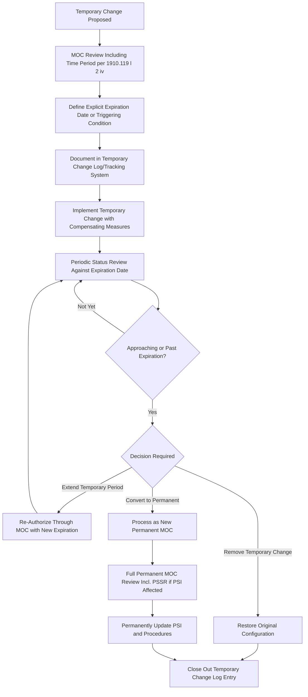

## Temporary Versus Permanent Changes

### Overview

Distinguishing temporary from permanent changes is a critical dimension of Management of Change (MOC) program design because the two change types carry fundamentally different risk profiles and require different, deliberately tailored control mechanisms. A permanent change, once implemented, is expected to remain part of the facility's standard configuration indefinitely and is documented as such in the Process Safety Information and operating procedures. A temporary change, by contrast, is explicitly intended to exist only for a limited, defined period — and the greatest risk associated with temporary changes is not the change itself, but the failure to remove or convert it at the end of that period, allowing a temporary modification to persist indefinitely without ever receiving the full technical and documentation rigor that a genuinely permanent change would require.

OSHA 29 CFR 1910.119(l)(2)(iv) explicitly requires that the MOC procedure address the "necessary time period for the change" as one of its core considerations — this is the specific regulatory hook establishing that temporary duration is not incidental detail but a required element of the MOC evaluation itself.

### Regulatory Basis

**Key Points**

- **1910.119(l)(2)(iv)**: The MOC procedure shall assure that the necessary time period for the change is considered prior to any change to a covered process.
- This requirement implies that every MOC — temporary or permanent — must have an explicit determination of duration as part of the authorization; a temporary change authorized without a defined expiration and closure/conversion plan does not satisfy the intent of this provision.
- **1910.119(l)(4) and (l)(5)**: require Process Safety Information and operating procedures to be updated when a change affects them — for a temporary change, this typically means documenting the temporary condition in a tracked temporary change log rather than permanently revising the PSI/procedures (which would misrepresent the facility's normal configuration), while for a permanent change it means the PSI/procedures must be formally, permanently updated.
- **1910.119(i)** (Pre-Startup Safety Review): a permanent change that alters Process Safety Information triggers the PSSR requirement for modified facilities; a properly time-limited temporary change with a documented, bounded scope may or may not trigger a full PSSR depending on company procedure and the nature/duration of the change, but reintroducing the process after the temporary change is removed and the original configuration restored generally does not require a fresh PSSR if it merely returns the process to its previously reviewed state.

### Defining Characteristics of Each Change Type

| Characteristic | Temporary Change | Permanent Change |
| --- | --- | --- |
| Intended duration | Defined, bounded period (specific end date or triggering condition) | Indefinite; becomes the new standard configuration |
| PSI treatment | Documented in temporary change log/tracking system; PSI not permanently revised | PSI formally and permanently updated |
| Procedure treatment | Temporary procedure addendum or documented operating restriction | Operating procedures formally revised |
| Expiration mechanism | Must have explicit expiration date/trigger and extension or closure process | Not applicable — no expiration |
| Typical examples | Temporary bypass line, jumper hose, portable pump, temporary relief device, extended equipment operation outside normal limits during a documented test | New permanent piping, replaced equipment of different specification, revised standard operating procedure |
| Risk if mismanaged | Becomes de facto permanent without ever receiving full MOC/PSSR rigor | Rare mismanagement mode is different: risk is more about incomplete initial review than about "expiration" |

### Temporary Change Lifecycle



### Common Temporary Change Scenarios

1. **Temporary Bypass or Jumper**
   - A temporary hose, jumper, or bypass line installed to maintain process continuity during a repair (e.g., bypassing a failed control valve while a replacement is sourced).
   - Requires clear labeling in the field, documented compensating measures (e.g., manual monitoring in place of the bypassed automatic control), and a specific removal date tied to the underlying repair completion.
2. **Temporary Equipment**
   - Portable pumps, temporary tanks, or rental equipment brought in to support a specific activity (e.g., a maintenance outage requiring temporary process fluid transfer).
   - MOC review should address the temporary equipment's suitability for the specific service (a QA-type consideration) even though it is not intended to remain permanently.
3. **Temporary Operating Limit Changes**
   - Operating temporarily outside a normal operating range for a specific, time-bound purpose (e.g., a catalyst regeneration procedure requiring elevated temperature for a defined duration).
   - Requires explicit safe operating limits for the temporary condition, distinct from (and typically narrower in duration than) the permanent safe operating limits.
4. **Temporary Instrumentation Bypass**
   - Bypassing an alarm or interlock temporarily for testing, calibration, or troubleshooting.
   - Among the highest-risk temporary change categories, since it directly affects a safety-critical protective function; requires the most stringent compensating measures (e.g., continuous operator monitoring, restricted duration measured in hours rather than days/weeks) and often a separate, more tightly controlled "safety system bypass" procedure layered on top of standard MOC.

### The "Temporary-Becomes-Permanent" Failure Mode

This is one of the most frequently cited MOC program weaknesses in PSM audits and incident investigations. It occurs when:

- A temporary change is implemented with an expiration date, but no systematic tracking mechanism exists to flag approaching or lapsed expirations.
- The underlying reason for the temporary change (e.g., awaiting a replacement part) takes longer than expected, and the temporary condition is allowed to continue past its original expiration without formal re-authorization.
- Over time, operational familiarity with the temporary condition causes it to be perceived as "normal," and it is never converted to a properly reviewed and documented permanent change.
- The result is equipment or a process configuration operating outside its documented, reviewed basis indefinitely — effectively defeating the entire purpose of the MOC program's technical review for that specific configuration.

[Inference: this failure mode has been identified as a contributing factor in multiple major process safety incidents investigated by bodies such as the CSB, where temporary modifications (e.g., temporary piping, bypassed safety systems) remained in place far longer than originally intended without renewed technical review — though the specific causal chain and prevalence vary by individual incident and organization.]

### Temporary Change Tracking System Requirements

An effective temporary change tracking system should capture, at minimum:

- Unique identifier linked to the originating MOC record.
- Description of the temporary change and its location (field-verifiable).
- Documented expiration date or triggering condition for removal/conversion.
- Compensating measures in place during the temporary period.
- Responsible owner accountable for tracking to closure.
- A defined escalation process when an item approaches or passes its expiration without resolution (e.g., automatic notification to PSM Coordinator or plant management).

### Example: Temporary Change Authorization and Tracking Record

**Example**



```
Temporary Change Authorization
---------------------------------------
Temporary Change ID:      TC-2026-0037
Linked MOC #:             MOC-2026-0155
Description:              Temporary bypass jumper installed around
                          FCV-118 (failed positioner) on Cooling Water
                          Return line, Unit 300

Technical Basis:          Control valve positioner failed; replacement
                          part on order, 3-week lead time
Impact on Safety/Health:  Loss of automatic flow control; manual
                          throttling required via adjacent block valve

Compensating Measures:
  - Operator to manually verify flow rate every 2 hours during
    temporary period (logged on operator rounds sheet)
  - Temporary jumper clearly tagged in field: "TEMPORARY - TC-2026-0037"
  - High/low flow alarm added on adjacent flow transmitter as
    interim monitoring measure

Authorized Duration:      21 days from installation
Installation Date:        2026-04-02
Expiration Date:          2026-04-23

Status Tracking:
[ ] Removed and original configuration restored by expiration date
[ ] Extended - New MOC/expiration required if still needed
[ ] Converted to permanent change - Full permanent MOC initiated

Approved By:  ____________________  Date: __________
Closed By:    ____________________  Date: __________
```

### Permanent Change Considerations Distinct from Temporary

- Permanent changes require full, formal update of Process Safety Information (P&IDs, equipment specifications, safe operating limits) as the new standard of record — there is no analogous "temporary log" entry; the change becomes the facility's documented configuration.
- Permanent changes to equipment typically trigger the PSSR requirement under 1910.119(i)(1) when they are significant enough to change Process Safety Information, whereas well-scoped temporary changes with a defined, limited duration are more commonly managed through the temporary change tracking mechanism without a separate full PSSR (though this determination should be explicitly addressed in company MOC procedure, not assumed by default).
- Training for permanent changes must reach all affected personnel across all shifts before the permanent configuration takes effect (paralleling the same training completeness requirement discussed in PSSR); temporary changes similarly require affected personnel to be informed, though the training may appropriately be lighter-weight and specific to the temporary condition and its compensating measures.

### Common Pitfalls

- Authorizing a temporary change without a specific expiration date or triggering condition, effectively creating an open-ended temporary status that provides no forcing function for closure.
- Lacking a centralized, actively monitored temporary change tracking system, relying instead on individual memory or informal notes to remember when a temporary change should be removed.
- Extending a temporary change repeatedly without re-evaluating whether it should instead be processed as a permanent change with full technical review and PSI update.
- Applying insufficiently rigorous compensating measures to temporary changes on the assumption that "it's only temporary," when in some cases (e.g., safety system bypasses) the temporary period represents elevated risk requiring more stringent controls than the eventual permanent state might need.
- Field conditions diverging from the documented temporary change record — e.g., a temporary jumper physically remains in place after the tracking system shows it as closed, due to incomplete field verification at closure.
- Failing to communicate temporary changes and their compensating measures to all shifts, resulting in an off-shift crew unaware of a temporary bypass or operating restriction currently in effect.

### Related Topics

- Technical, Personnel, and Procedural Change
- Replacement-in-Kind Determination Criteria
- PSSR Triggers for New and Modified Facilities
- Process Safety Information (PSI) Elements and Maintenance
- Deficiency Correction and Prioritization
- Safety Instrumented Systems (SIS) Bypass Management
- Operating Procedures Development and Revision Control