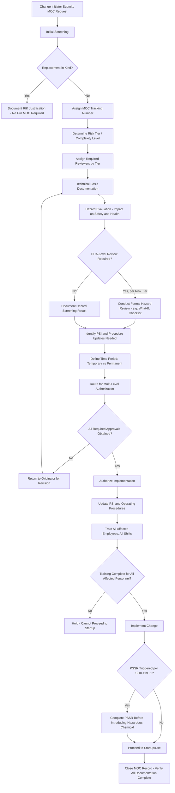

## Management of Change Approval Workflow


### Overview

The Management of Change (MOC) approval workflow is the structured, sequential process by which a proposed change to a PSM-covered process moves from initial identification through technical review, hazard evaluation, multi-level authorization, implementation, and closure. While earlier topics addressed *what* qualifies as a change requiring MOC (technical, personnel, procedural) and the distinct handling of temporary versus permanent changes, this topic addresses the *procedural mechanics* of how a change actually moves through the organization to become authorized — the specific sequence of steps, required approvals, and documentation checkpoints that operationalize the five review considerations mandated by 1910.119(l)(2).

A well-designed approval workflow ensures that no change bypasses the required technical and hazard evaluation regardless of schedule pressure, that the right level of authority reviews changes proportional to their risk, and that the resulting documentation trail can withstand regulatory audit scrutiny.

### Regulatory Basis

**Key Points**

- **1910.119(l)(1)**: requires written procedures to manage changes — the approval workflow is the operational expression of these written procedures.
- **1910.119(l)(2)(i)-(v)**: the five required considerations (technical basis, safety/health impact, procedure modifications, time period, authorization requirements) must each have a documented checkpoint within the workflow — a workflow missing any of these five is incomplete by regulatory definition.
- **1910.119(l)(2)(v)** specifically requires that authorization requirements for the proposed change be established — meaning the workflow must define *who* has authority to approve *what type* of change, rather than leaving approval authority ambiguous or informal.
- **1910.119(l)(3)**: training of affected employees prior to startup is a workflow gate, not merely a follow-up activity — the workflow should not permit implementation/startup until training completion is documented.
- **1910.119(l)(4) and (l)(5)**: PSI and procedure updates are workflow outputs that must be completed as part of, not after, the change closure process.

### End-to-End MOC Workflow



### Workflow Stage Detail

**1. Initiation and Screening**

- Any employee (or contractor, per company procedure) identifies a proposed change and submits an MOC request, typically via a standardized form or electronic MOC management system.
- Initial screening determines whether the proposed change is genuinely subject to MOC or qualifies as a replacement-in-kind exemption; this screening decision itself should be documented, not simply assumed, since misclassification here is a commonly cited audit finding.

**2. Risk Tiering / Complexity Classification**

- Many mature MOC programs classify changes into risk tiers (e.g., Low/Medium/High, or Level 1/2/3) to proportion the rigor of subsequent review to the actual risk of the change — a minor procedural clarification does not warrant the same multi-discipline review as a new chemical introduction.
- Tiering criteria typically consider: consequence severity if the change introduces an unrecognized hazard, complexity/novelty of the change, and whether the change affects a safety-critical system (relief, ESD, SIS).

**3. Technical Basis Documentation**

- The originator (often with engineering support) documents the technical justification for the change: what is being changed, why, and the engineering basis supporting that the change is sound.
- This directly satisfies 1910.119(l)(2)(i).

**4. Hazard Evaluation**

- A hazard evaluation appropriate to the change's risk tier is performed — ranging from a documented checklist-based screening for low-risk changes to a formal What-If, Checklist, or HAZOP-style review for higher-risk or higher-complexity changes.
- This satisfies 1910.119(l)(2)(ii) and should explicitly consider whether the change introduces new damage mechanisms, alters relief system adequacy, affects area classification, or interacts with other active MOCs (interaction effects between concurrent changes are a commonly overlooked risk).

**5. PSI and Procedure Impact Identification**

- The workflow requires an explicit determination of which Process Safety Information documents (P&IDs, equipment specifications, safe operating limits, material safety data) and which operating/maintenance procedures are affected by the change.
- This step operationalizes 1910.119(l)(4) and (l)(5) by identifying the specific update scope before implementation, rather than leaving document updates to be discovered informally after the fact.

**6. Time Period Determination**

- Explicit classification as temporary or permanent, with temporary changes requiring a defined expiration/triggering condition per the considerations discussed under Temporary Versus Permanent Changes.
- This satisfies 1910.119(l)(2)(iv).

**7. Multi-Level Authorization**

- Authorization requirements are tiered by risk/complexity, with higher-risk changes requiring approval from more senior technical and management authority.
- A typical authorization chain might include: originating department supervisor, process/engineering discipline reviewer, PSM Coordinator, and (for higher-tier changes) plant/site management or a formal MOC review committee.
- This satisfies 1910.119(l)(2)(v) and is often the stage most vulnerable to schedule-pressure bypass if not rigorously enforced through the workflow system itself (e.g., an electronic system that physically prevents implementation authorization without all required sign-offs recorded).

**8. Document Updates**

- Once authorized, PSI and procedures identified in Stage 5 are formally updated through document control, with the updated versions issued before or concurrent with implementation.

**9. Training**

- All affected employees — across all shifts, including maintenance and contractors where applicable — are trained on the change before it takes effect, per 1910.119(l)(3).
- The workflow should include an explicit gate preventing implementation/startup from proceeding until training completion is verified for the full affected population, mirroring the same all-shifts discipline required in PSSR.

**10. Implementation and PSSR Interface**

- For changes that meet the PSSR trigger criteria (significant enough to require a PSI change, per 1910.119(i)(1)), the MOC workflow should hand off to the PSSR process before the hazardous chemical is introduced or the changed process is placed into operation.

**11. Closure**

- The MOC record is formally closed only once all documentation (technical basis, hazard evaluation, PSI updates, procedure updates, training records, PSSR if applicable) is verified complete and retained.
- An MOC left "open" indefinitely after implementation (a common finding) undermines the audit trail and can obscure whether required follow-up actions were actually completed.

### Risk-Tiered Authorization Matrix (Illustrative)

| Risk Tier | Example Change Type | Hazard Evaluation Rigor | Minimum Authorization Level |
| --- | --- | --- | --- |
| Low | Minor procedural clarification, non-safety-critical instrumentation calibration change | Documented checklist screening | Department supervisor + PSM Coordinator |
| Medium | Piping reroute, non-critical equipment upgrade, staffing level adjustment on non-critical role | Structured What-If or checklist review | Engineering discipline lead + PSM Coordinator + Operations manager |
| High | New chemical introduction, safety instrumented function modification, significant capacity increase | Formal HAZOP or equivalent PHA-level review | Multi-discipline MOC review committee + Plant/Site management |

### Example: MOC Approval Routing Record

**Example**



```
MOC Approval Workflow Record
-------------------------------------
MOC Tracking #:        MOC-2026-0203
Change Description:    Install new high-high level interlock on
                       Reactor R-101 (addresses open PHA
                       recommendation #12)
Risk Tier:             High (new safety instrumented function)

Workflow Checkpoints:
[X] Technical basis documented (Doc #ENG-2026-0091)
[X] Hazard evaluation completed - Method: Structured What-If
[X] PSI impact identified: P&ID Rev 14, SRS Doc updated
[X] Procedure impact identified: Operating Procedure OP-101 Rev 8
[X] Time period: Permanent
[X] Authorization obtained:
    - Engineering Lead: ________________  Date: ________
    - PSM Coordinator:   ________________  Date: ________
    - Plant Manager:     ________________  Date: ________
[X] PSI updated and issued
[X] Operating procedure updated and issued
[X] Training completed - all shifts (12/12 affected personnel)
[X] PSSR completed - PSSR-2026-0114 (triggered per PSI change)
[X] MOC Closed

Closed By:  ____________________  Date: __________
```

### Common Pitfalls

- Allowing informal or verbal authorization to substitute for documented sign-off at any required approval level, undermining the traceability that 1910.119(l)(2)(v) is intended to establish.
- Applying a uniform review rigor to all changes regardless of risk, either over-burdening low-risk changes with unnecessary process or under-scrutinizing high-risk changes by treating them the same as routine ones.
- Permitting implementation to proceed before training is verified complete for all affected shifts, echoing the same training-gap failure mode seen in PSSR execution.
- Leaving MOC records open indefinitely after physical implementation, with PSI/procedure updates or training documentation trailing behind or never actually completed.
- Failing to evaluate interaction effects between multiple concurrent MOCs affecting the same unit or system, where each change may be individually low-risk but their combination introduces an unrecognized hazard. [Inference: commonly identified as a gap in mature MOC programs during multi-project turnaround periods, though prevalence varies by organization's MOC system capability.]
- Not linking the MOC record to the resulting PSSR record (where triggered), making it difficult to demonstrate the complete chain of custody from change identification through safe startup during an audit.

### Related Topics

- Technical, Personnel, and Procedural Change
- Temporary Versus Permanent Changes
- Replacement-in-Kind Determination Criteria
- PSSR Triggers for New and Modified Facilities
- PSSR Checklist Development
- Process Hazard Analysis (PHA) Recommendation Tracking
- Process Safety Information (PSI) Elements and Maintenance