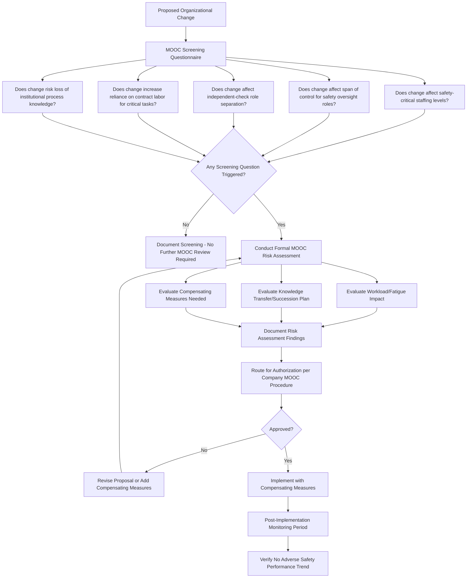

## Management of Organizational Change


### Overview

Management of Organizational Change (MOOC) is the extension of Management of Change principles to organizational, staffing, and structural modifications that can materially affect process safety risk without involving any physical or technical change to the process itself. While standard MOC under 1910.119(l) is anchored in explicit statutory language covering "process chemicals, technology, equipment, and procedures," organizational change — restructuring, staffing reductions, outsourcing decisions, changes in supervisory span of control, and similar workforce or structural shifts — is not named as a distinct regulatory category within the OSHA PSM standard's literal text. It has instead emerged as an industry-adopted practice area, developed substantially in response to incident investigations (most notably associated with the BP Texas City refinery explosion investigation and subsequent CSB and API guidance work) that identified organizational and staffing factors as significant contributing causes to major process safety events even where no equipment or procedural change was directly implicated.

MOOC exists to close a specific gap: an organization's technical MOC program can be fully mature and well-executed while still being blind to a staffing reduction, reorganization, or outsourcing decision that quietly erodes the same safety margins that technical MOC is designed to protect.

### Origin and Regulatory Context

**Key Points**

- OSHA 29 CFR 1910.119(l) does not explicitly name "organizational change" or "staffing change" as a distinct trigger category; MOOC is therefore best understood as a RAGAGEP-influenced industry practice rather than a direct citation basis under the literal PSM text. [This distinction matters for accurate compliance framing: an auditor should not claim 1910.119(l) explicitly mandates MOOC, though many company PSM procedures voluntarily incorporate it as a documented element of their broader change management system.]
- The Center for Chemical Process Safety (CCPS), part of AIChE, has published guidance specifically addressing Managing Organizational Change for Process Safety, providing the primary technical reference framework most organizations draw upon when building an MOOC program.
- Post-incident investigations, including the U.S. Chemical Safety Board's investigation into the 2005 BP Texas City refinery explosion, identified organizational factors — including staffing cuts, loss of technical expertise, and cost-cutting pressures — as significant contributing factors, which substantially drove industry adoption of formal MOOC practices following that investigation.
- EPA's Risk Management Program (40 CFR Part 68) similarly does not explicitly enumerate organizational change as a distinct regulated category, so MOOC's regulatory basis in both frameworks rests primarily on its function as good engineering/management practice rather than an explicit statutory requirement.

### Why Organizational Change Carries Process Safety Risk

Organizational changes can degrade process safety performance through several distinct mechanisms, even without any physical change to equipment or documented procedures:

- **Loss of institutional knowledge**: experienced personnel who possess undocumented operational knowledge (informal workarounds, subtle equipment quirks, historical near-miss lessons) depart or are reassigned, and that knowledge is not captured before their departure.
- **Reduced staffing margins**: fewer personnel available to perform the same volume of safety-critical tasks (operator rounds, permit issuance, maintenance execution) can increase workload, fatigue, and the likelihood of missed or rushed safety checks.
- **Span of control degradation**: a single supervisor or engineer overseeing a larger number of direct reports or a wider process scope than before may have reduced capacity to provide adequate oversight of safety-critical decisions.
- **Loss of independent checks**: reorganizing so that a role providing independent verification (e.g., separating maintenance execution from maintenance planning/QA) is consolidated into a single position can remove a check-and-balance that previously existed.
- **Contractor/outsourcing shifts**: increasing reliance on contract labor for safety-critical roles previously performed by experienced employees can introduce workforce turnover and site-specific-knowledge gaps, connecting back to the contractor management concerns addressed elsewhere in PSM.

### MOOC Screening and Review Workflow



### Common MOOC-Triggering Scenarios

| Scenario | Why It Warrants MOOC Review |
| --- | --- |
| Reducing operator staffing per shift | Directly affects capacity to perform safety-critical monitoring and emergency response tasks |
| Consolidating separate maintenance planning and execution roles | Removes an independent check previously separating these functions |
| Extended vacancy in a PSM Coordinator or MI Engineer role | Creates a gap in technical oversight of safety-critical programs during the vacancy period |
| Increasing contractor-to-employee ratio for routine operations tasks | Introduces workforce turnover and reduces site-specific institutional knowledge base |
| Reorganizing reporting lines so operations and safety functions report to the same commercially-incentivized manager | May reduce the independence of safety decision-making from production pressure |
| Rapid workforce turnover following a retirement wave or reduction-in-force | Risk of undocumented operational knowledge loss across multiple roles simultaneously |
| Changing shift schedule structure (e.g., 8-hour to 12-hour rotations) | Affects fatigue risk and continuity of situational awareness across shift handovers |

### Elements of a Formal MOOC Risk Assessment

1. **Workload and Fatigue Impact Analysis**: quantified or structured qualitative assessment of whether remaining/restructured staff can adequately perform all safety-critical tasks within their available time and attention, considering realistic (not idealized) workload distribution.
2. **Knowledge Transfer and Succession Planning**: identification of undocumented or tacit knowledge held by departing/reassigned personnel, and a documented plan to capture or transfer that knowledge (e.g., structured handover periods, documentation of informal practices, mentoring overlap).
3. **Span of Control Evaluation**: assessment of whether a supervisor or engineer's proposed oversight scope remains adequate for the safety-critical decisions and approvals within their responsibility.
4. **Independent Check Preservation**: verification that any consolidation of roles does not eliminate a safety-relevant separation of duties (e.g., the same person should generally not both perform and approve their own safety-critical work).
5. **Compensating Measures**: where some risk increase is accepted as part of the change, documented interim or permanent measures to offset it (e.g., temporary additional oversight, enhanced handover documentation, phased implementation with monitoring checkpoints).

### Example: MOOC Screening and Assessment Record

**Example**



```
Management of Organizational Change Record
---------------------------------------------
MOOC Tracking #:        MOOC-2026-0019
Proposed Change:        Consolidate Maintenance Planning and
                        Maintenance Execution supervisor roles
                        into a single position, Unit 400

Screening Results:
[X] Affects independent-check role separation - TRIGGERED
[ ] Affects safety-critical staffing levels
[ ] Affects span of control for safety oversight
[ ] Increases contractor reliance for critical tasks
[ ] Risk of institutional knowledge loss

Formal MOOC Risk Assessment Required: YES

Risk Assessment Findings:
  - Current structure provides independent review of maintenance
    work scope by planning supervisor before execution supervisor
    approves resource allocation
  - Consolidation would remove this independent check for
    safety-critical maintenance activities (LOTO scope review,
    critical equipment work prioritization)
  - Compensating measure proposed: PSM Coordinator to perform
    monthly sample audit of maintenance work scope decisions
    for consolidated role, for minimum 6-month monitoring period

Authorization:
  Plant Manager:        ________________  Date: ________
  PSM Coordinator:      ________________  Date: ________

Post-Implementation Monitoring Plan: 6-month sample audit per
above; review at Month 3 and Month 6 PSM management review meeting
```

### Integration with Broader PSM Elements

- **Contractor Management**: increasing reliance on contract labor for safety-critical roles connects MOOC directly to contractor prequalification, orientation, and coordination requirements discussed elsewhere in PSM — an organizational shift toward contracting should trigger review of whether existing contractor management controls adequately cover the expanded scope.
- **Training**: organizational changes that alter roles or responsibilities may require updated training content and a re-verification of competency for personnel assuming modified or expanded duties.
- **Incident Investigation**: organizational factors should be an explicit consideration within incident investigation root cause analysis (addressed further in that PSM element), creating a feedback loop where investigation findings can identify the need for MOOC review of a previously unscreened organizational condition.
- **Management Review**: periodic PSM management review should include organizational/staffing trend data (turnover rates, vacancy durations in safety-critical roles, span-of-control metrics) as a leading indicator input, rather than relying solely on MOOC screening at the point of an explicit proposed change.

### Common Pitfalls

- Treating organizational and staffing decisions as purely an HR/business function entirely outside PSM oversight, missing the demonstrated risk relevance identified in major incident investigations.
- Having no formal, documented screening criteria for what organizational changes should trigger MOOC review, leaving the determination to inconsistent individual judgment.
- Conducting MOOC review only for large, formal reorganizations while missing gradual, incremental staffing erosion (e.g., not backfilling positions after attrition) that accumulates into a significant change over time without ever being reviewed as a discrete "change" event.
- Failing to capture tacit/institutional knowledge before experienced personnel depart, particularly during rapid workforce transitions (retirement waves, restructuring, acquisitions).
- Implementing compensating measures on paper without genuine follow-through on post-implementation monitoring, allowing an accepted interim risk increase to become a permanent, unmonitored condition. [Inference: this pattern of monitoring commitments lapsing is commonly observed across many types of compensating-measure programs, though specific prevalence in MOOC contexts is not independently quantified in public literature.]
- Overstating MOOC's regulatory status by characterizing it as an explicit OSHA PSM requirement, when its basis is more accurately described as an industry-adopted good practice informed by incident learning and CCPS guidance rather than direct statutory text.

### Related Topics

- Technical, Personnel, and Procedural Change
- Management of Change Approval Workflow
- Contractor Prequalification and Selection
- Coordinating Host Employer and Contractor Responsibilities
- Staffing and Fatigue Risk Management in Process Safety
- Incident Investigation and Root Cause Analysis
- PSM Management Review and Continuous Improvement