## Common Management of Change Failures

### Overview

This topic catalogs the recurring failure patterns identified across Management of Change programs through PSM audits, OSHA enforcement actions, and post-incident investigations. MOC is frequently described in the process safety literature as one of the PSM elements most strongly associated with catastrophic incidents when it fails, precisely because MOC sits at the intersection of nearly every other PSM element — a single MOC breakdown can simultaneously produce a PSSR gap, an out-of-date Process Safety Information record, an untrained workforce, and an unrecognized hazard. Understanding these common failure patterns is essential both for designing more resilient MOC programs and for recognizing early warning signs during internal audits, before a failure pattern contributes to an actual loss-of-containment event.

Multiple major process safety incidents investigated by the U.S. Chemical Safety Board (CSB) — including the 2005 BP Texas City refinery explosion and various other incidents across the chemical and refining sectors — have identified MOC breakdowns as significant contributing or root causes, which is part of why MOC receives particular emphasis in both regulatory enforcement and industry good-practice guidance.

### Regulatory Context

**Key Points**

- Because 1910.119(l) requires MOC to address five explicit considerations — technical basis, safety/health impact, procedure modifications, time period, and authorization requirements — each of the failure categories below can typically be traced back to a breakdown in one or more of these five specific sub-requirements, giving OSHA a clear citation basis when a failure pattern is identified during an inspection.
- OSHA's National Emphasis Program and PSM-focused inspections have historically identified MOC as one of the most frequently cited PSM elements, reflecting both its central role in the standard and the practical difficulty of implementing it with full rigor across every category of change discussed elsewhere in this chapter.

### Taxonomy of Common MOC Failures

```mermaid
flowchart TD
    A[Common MOC Failure Patterns] --> B[Scope and Trigger Failures]
    A --> C[Hazard Evaluation Failures]
    A --> D[Documentation Update Failures]
    A --> E[Training and Communication Failures]
    A --> F[Authorization and Governance Failures]
    A --> G[Temporal and Tracking Failures]

    B --> B1[Change misclassified as replacement in kind]
    B --> B2[Informal/undocumented changes bypass MOC entirely]
    B --> B3[Personnel/procedural changes not recognized as MOC-triggering]

    C --> C1[Hazard evaluation rigor mismatched to actual risk]
    C --> C2[Interaction effects between concurrent changes missed]
    C --> C3[Hazard evaluation completed as formality, not substantively]

    D --> D1[PSI not updated to reflect approved change]
    D --> D2[Operating procedures left inconsistent with new configuration]
    D --> D3[PHA-of-record not revised]

    E --> E1[Off-shift personnel not trained before startup]
    E --> E2[Contractors affected by change not included in training scope]
    E --> E3[Verification of training understanding not documented]

    F --> F1[Authorization obtained informally/verbally]
    F --> F2[Schedule pressure overrides required review steps]
    F --> F3[Single point of authorization without independent check]

    G --> G1[Temporary changes never converted or removed]
    G --> G2[MOC records left open indefinitely after implementation]
    G --> G3[No systematic tracking of approaching expirations]
```



### Category 1: Scope and Trigger Failures

- **Replacement-in-kind misclassification**: labeling a component substitution as "replacement in kind" when it differs in material, rating, or specification, allowing it to bypass MOC entirely.
- **Undocumented informal changes**: field personnel making a change (a valve reposition, a control setpoint adjustment, a procedure workaround) without recognizing it as MOC-triggering, often because the change feels minor or was made under operational urgency.
- **Under-recognition of non-equipment change categories**: as discussed in Technical, Personnel, and Procedural Change, organizations frequently apply rigorous MOC discipline to equipment changes while failing to recognize that procedural and organizational changes carry equivalent regulatory or good-practice significance.

### Category 2: Hazard Evaluation Failures

- **Rigor mismatch**: applying a lightweight checklist review to a change that actually warrants a formal HAZOP-style evaluation, typically because the risk tiering/classification step was itself flawed or absent.
- **Missed interaction effects**: evaluating a proposed change in isolation without considering how it interacts with other currently active or recently implemented changes affecting the same unit or system — a change that is individually benign can combine with another concurrent change to create an unrecognized hazard.
- **Formality without substance**: completing the hazard evaluation documentation as a procedural step to satisfy the workflow, without genuine technical engagement — for example, a What-If review where the same generic set of questions is answered identically regardless of the specific change under review.

### Category 3: Documentation Update Failures

- **PSI not updated**: the change is approved and physically implemented, but the corresponding Process Safety Information (P&IDs, equipment specifications, safe operating limits) is never formally revised, creating an immediate and often long-lasting gap between documented and actual plant configuration.
- **Procedures left inconsistent**: operating or maintenance procedures continue to reflect the pre-change configuration, creating a direct conflict between what the procedure instructs and what the equipment/process actually requires.
- **PHA-of-record not revised**: the facility's process hazard analysis document of record is not updated to reflect the new configuration, meaning the next PHA revalidation cycle (or a future MOC reviewer evaluating a related change) works from an inaccurate hazard baseline.

### Category 4: Training and Communication Failures

- **Off-shift training gaps**: training delivered to the shift present at implementation, with other shifts left to learn informally — a failure pattern that echoes directly across MOC, PSSR, and contractor training discussed elsewhere in this material.
- **Contractor exclusion**: MOC training scope defined only for host employees, missing contract personnel whose job tasks are directly affected by the change, in tension with the coordination principles discussed under contractor management.
- **Understanding not verified**: training documented via signature or attendance only, without a quiz, demonstration, or documented Q&A confirming actual comprehension of the change.

### Category 5: Authorization and Governance Failures

- **Informal/verbal authorization**: a change proceeds based on verbal approval from a manager without the required sign-offs being documented in the MOC record, undermining the audit trail 1910.119(l)(2)(v) is intended to establish.
- **Schedule pressure overriding review**: production or turnaround schedule pressure causes required review steps to be skipped or compressed, with the MOC documentation sometimes completed retroactively after the change has already been implemented.
- **Insufficient independence in authorization**: the same individual who proposes and technically justifies a change also holds sole authorization authority, removing the independent check that a properly tiered authorization structure is intended to provide.

### Category 6: Temporal and Tracking Failures

- **Temporary changes becoming permanent**: as detailed under Temporary Versus Permanent Changes, a temporary modification persists indefinitely past its documented expiration without formal conversion to a reviewed permanent change.
- **Open MOC records**: the MOC record remains administratively "open" long after physical implementation, obscuring whether follow-up actions (PSI updates, training, PSSR) were actually completed.
- **No expiration monitoring system**: temporary changes lack a systematic tracking mechanism to flag approaching or lapsed expirations, relying instead on individual memory.

### Illustrative Cross-Category Failure Chain

**Example**

A single MOC breakdown often cascades across multiple categories rather than remaining isolated to one:



```
Illustrative Failure Chain:
1. A control valve is replaced with a unit of different Cv
   rating during an emergency repair. [Scope failure: treated
   as replacement in kind without verifying equivalence]
2. No hazard evaluation is performed since the change was
   not recognized as MOC-triggering. [Hazard evaluation failure]
3. The updated valve specification is never entered into
   the equipment database or reflected on the P&ID.
   [Documentation failure]
4. Operators are not informed the valve's flow characteristic
   has changed. [Training/communication failure]
5. Months later, during an upset condition, the process
   responds differently than operators expect based on the
   outdated procedure's assumed valve characteristic,
   contributing to a control excursion.

Root Cause Investigation Finding:
  Contributing cause traced to an unrecognized equipment
  change that bypassed MOC at the point of initial repair,
  cascading into hazard evaluation, documentation, and
  training gaps that remained latent until the upset
  condition exposed them.
```

### Audit Indicators Suggesting MOC Program Weakness

| Audit Indicator | Underlying Failure Category Suggested |
| --- | --- |
| High proportion of changes classified as "replacement in kind" relative to industry norms | Scope/trigger failure — likely misclassification |
| Discrepancies between field walk-downs and current P&IDs | Documentation update failure |
| MOC records showing implementation dates preceding final authorization dates | Authorization/governance failure |
| Large number of MOC records open beyond a defined closure target (e.g., 90 days post-implementation) | Temporal/tracking failure |
| Training completion records showing gaps for specific shifts or contractor populations | Training/communication failure |
| Repeated hazard evaluation findings using identical boilerplate language across dissimilar changes | Hazard evaluation failure — formality without substance |
| No documented criteria distinguishing risk tiers for authorization level | Governance failure — proportionality gap |

### Corrective Strategies Mapped to Failure Categories

| Failure Category | Corrective Strategy |
| --- | --- |
| Scope/trigger | Formalize documented replacement-in-kind criteria; require explicit justification, not assumption, for RIK classification |
| Hazard evaluation | Implement risk-tiering system proportioning evaluation rigor to change complexity/consequence; require interaction-effect screening for concurrent changes |
| Documentation | Require PSI/procedure update as a mandatory workflow gate before MOC closure, not a follow-up task |
| Training/communication | Require documented all-shift, all-affected-personnel training completion, including contractors, as a startup/implementation gate |
| Authorization/governance | Implement electronic MOC system enforcing required sign-off sequence; prohibit implementation without complete documented authorization |
| Temporal/tracking | Implement centralized temporary change tracking system with automated expiration alerts; set and enforce MOC closure targets |

### Common Pitfalls (Meta-Level, Regarding MOC Audit Practice Itself)

- Auditing MOC program compliance by sampling only completed, closed records, missing the population of changes that never entered the MOC system at all (the "unrecognized change" failure mode is, by definition, invisible to a records-only audit).
- Treating MOC audit findings as isolated administrative issues rather than tracing them back to the specific failure category and underlying systemic cause.
- Failing to cross-reference MOC audit findings against related PSSR, training, and PHA program audits, missing the compounding pattern that a single MOC breakdown often produces across multiple PSM elements simultaneously.
- Not verifying field conditions directly against MOC/PSI records during the audit, relying solely on paper/electronic record review, which can miss the "documentation says one thing, field shows another" pattern that is a hallmark of MOC documentation failure. [Inference: commonly recommended practice in PSM audit guidance, though the specific frequency of field-verification audit steps varies across organizations' audit protocols.]

### Related Topics

- Technical, Personnel, and Procedural Change
- Temporary Versus Permanent Changes
- Management of Change Approval Workflow
- Management of Organizational Change
- PSSR Triggers for New and Modified Facilities
- Process Safety Information (PSI) Elements and Maintenance
- Incident Investigation and Root Cause Analysis
- PSM Compliance Audit Program Design