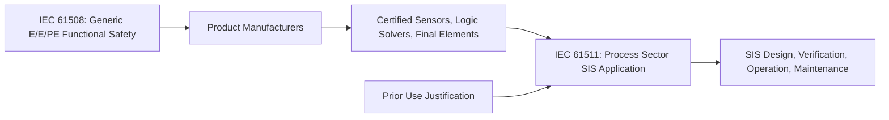
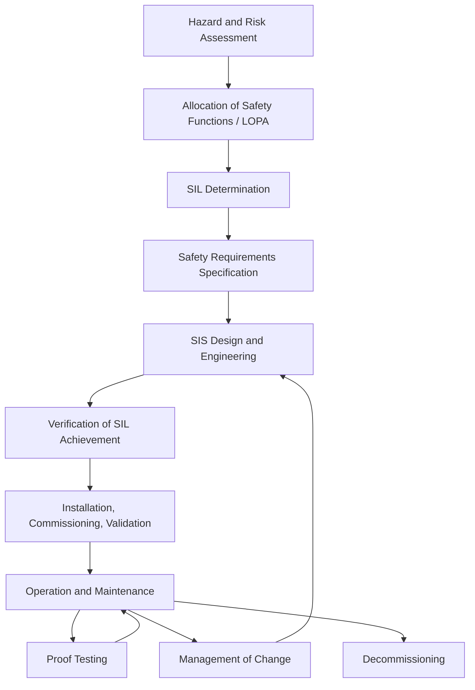

## IEC 61508 and IEC 61511 Framework Overview

### Purpose and Scope

IEC 61508 is the parent, generic functional safety standard titled "Functional Safety of Electrical/Electronic/Programmable Electronic Safety-related Systems" (E/E/PE, often abbreviated E/E/PES). It applies across all industry sectors and covers the entire safety lifecycle of safety-related systems that use electrical, electronic, or programmable electronic technology, including hardware and software.

IEC 61511 is the process-sector-specific application standard, titled "Functional Safety – Safety Instrumented Systems for the Process Industry Sector." It is derived from IEC 61508 and translates its generic requirements into a framework specifically for Safety Instrumented Systems (SIS) used in process plants (oil and gas, chemical, petrochemical, refining, and similar industries).

**Key Points**

- IEC 61508 addresses the design and manufacture of safety-related devices and subsystems (e.g., sensors, logic solvers, final elements) at the component/product level.
- IEC 61511 addresses the design, implementation, and management of a complete SIS at the plant/application level, using devices that are ideally already IEC 61508-certified.
- A device manufacturer typically works to IEC 61508; a process plant owner/operator, system integrator, or EPC typically works to IEC 61511.
- IEC 61511 was updated to a second edition in 2016 (parts 1–3), aligning terminology and structure more closely with IEC 61508 Edition 2 (2010).

### Relationship Between the Two Standards

$$\text{IEC 61508 (product/subsystem certification)} \rightarrow \text{IEC 61511 (SIS application in process plants)}$$

IEC 61511 assumes that logic solvers, sensors, and final elements used in a SIS are either:

1. Certified as compliant with IEC 61508 by a manufacturer (Type A or Type B elements, following defined hardware fault tolerance and safe failure fraction routes), or
2. "Prior use" justified — devices with a sufficiently documented field operating history in a similar application and environment may be used without formal IEC 61508 certification, per IEC 61511-1 Clause 11.5.3.

This division of labor means process engineers rarely need to perform IEC 61508's detailed hardware/software design verification themselves; instead, they select certified or prior-use-justified equipment and follow IEC 61511's lifecycle for the overall SIS.

### Structure of IEC 61508 (Parts 1–7)

- **Part 1** — General requirements: management of functional safety, competence, overall safety lifecycle, documentation, and functional safety assessment.
- **Part 2** — Requirements for E/E/PE safety-related systems: hardware design, architectural constraints (hardware fault tolerance vs. safe failure fraction), systematic capability.
- **Part 3** — Software requirements: software safety lifecycle, techniques for avoiding and controlling systematic software faults.
- **Part 4** — Definitions and abbreviations.
- **Part 5** — Examples of methods for determining Safety Integrity Levels (SIL), including risk graphs and risk matrices.
- **Part 6** — Guidelines for applying Parts 2 and 3.
- **Part 7** — Overview of techniques and measures (an informative catalog of methods referenced by other parts).

### Structure of IEC 61511 (Parts 1–3, 2016 Edition)

- **Part 1** — Framework, definitions, system, hardware, and application programming requirements. This is the normative core covering the SIS safety lifecycle from hazard and risk assessment through SIL determination, design, and operation.
- **Part 2** — Informative guidance and rationale for applying Part 1 (non-mandatory but widely used to interpret intent).
- **Part 3** — Informative guidance on determining required SIL levels, including example methods (risk matrix, risk graph, LOPA-style approaches referenced conceptually).

### The Overall Safety Lifecycle (IEC 61511 Perspective)

IEC 61511 organizes SIS work into a structured lifecycle, conceptually divided into three phases:

**Analysis phase**

- Process hazard and risk assessment (e.g., HAZOP, PHA)
- Allocation of safety functions to protection layers (often via LOPA)
- Determination of SIL for each Safety Instrumented Function (SIF)
- Development of the Safety Requirements Specification (SRS)

**Realization phase**

- SIS design and engineering (sensors, logic solver, final elements)
- Selection of devices per IEC 61508 certification or prior-use justification
- Verification that the design meets the specified SIL (via PFDavg or PFH calculations)
- Factory acceptance testing (FAT) and installation

**Operation phase**

- Installation, commissioning, and pre-startup validation
- Operation and maintenance, including proof testing
- Management of change (MOC)
- Decommissioning

### Safety Integrity Levels (SIL)

Both standards use a four-level SIL scale, with SIL 4 representing the highest integrity and most stringent requirements. SIL targets are defined differently depending on the mode of operation of the safety function:

**Low demand mode** (the safety function is activated less than once per year, or less than twice the proof-test frequency): integrity is measured by **Average Probability of Failure on Demand (PFDavg)**.

| SIL | PFDavg Range |
| --- | --- |
| 4 | $10^{-5} \le \text{PFDavg} < 10^{-4}$ |
| 3 | $10^{-4} \le \text{PFDavg} < 10^{-3}$ |
| 2 | $10^{-3} \le \text{PFDavg} < 10^{-2}$ |
| 1 | $10^{-2} \le \text{PFDavg} < 10^{-1}$ |

**High demand or continuous mode** (the safety function is activated more than once per year): integrity is measured by **Probability of Failure per Hour (PFH)**.

| SIL | PFH Range (per hour) |
| --- | --- |
| 4 | $10^{-9} \le \text{PFH} < 10^{-8}$ |
| 3 | $10^{-8} \le \text{PFH} < 10^{-7}$ |
| 2 | $10^{-7} \le \text{PFH} < 10^{-6}$ |
| 1 | $10^{-6} \le \text{PFH} < 10^{-5}$ |

**Example**

A SIF that closes an emergency shutdown valve on high pressure, tested annually and expected to activate roughly once every 10 years, is a low-demand SIF. If the calculated PFDavg for the loop (sensor + logic solver + valve) is $3.2 \times 10^{-3}$, the loop achieves SIL 2.

### SIL Determination Methods

IEC 61511-3 describes several qualitative and semi-quantitative methods for assigning target SILs to a SIF:

- **Risk matrix** — Categorizes consequence severity against likelihood/frequency bands; the intersection cell indicates a required SIL or "no SIF required."
- **Risk graph** — A decision-tree-style tool using parameters for consequence, exposure, avoidance possibility, and demand frequency to arrive at a SIL.
- **Layer of Protection Analysis (LOPA)** — A semi-quantitative method that identifies independent protection layers (IPLs) and calculates the residual risk reduction needed from the SIS, from which target PFDavg/SIL is derived. LOPA is the most widely used method in the process industry due to its balance of rigor and practicality.
- **Fully quantitative methods** (e.g., fault tree analysis, QRA) — Used for complex or high-consequence scenarios where more precision is warranted.

[Inference] The choice of method is often influenced by company standards, regulatory expectations, and the complexity/novelty of the process; LOPA is common in mainstream refining and chemical applications, while full QRA is more typical for very high-consequence or novel-technology facilities.

### Architectural Constraints and Hardware Fault Tolerance

Beyond meeting a PFDavg/PFH target, IEC 61508 and IEC 61511 impose architectural constraints to guard against systematic and random hardware failures, based on:

- **Hardware Fault Tolerance (HFT)** — The number of faults a subsystem can withstand and still perform its safety function (e.g., HFT = 1 means the subsystem tolerates one fault, typically implemented via redundancy such as a 1oo2 voting arrangement).
- **Safe Failure Fraction (SFF)** — The proportion of failures that are either safe or detected (and thus do not lead to a dangerous undetected state).
- **Systematic Capability (SC)** — A measure of confidence that a device is free from systematic faults (design/specification errors), relevant to IEC 61508 Edition 2 certification claims.

These constraints determine the minimum redundancy architecture required for a given SIL claim, independent of the calculated PFDavg — a design must satisfy both the quantitative target and the architectural minimums.

### Roles and Competence Requirements

**Key Points**

- Both standards emphasize functional safety management (FSM) as a foundation — a documented system for planning, controlling, and auditing all lifecycle activities.
- Personnel involved in any safety lifecycle phase must have documented competence appropriate to their role (IEC 61511-1 Clause 5), covering training, experience, and qualifications.
- A Functional Safety Assessment (FSA) — an independent review — is required at defined stages of the lifecycle, with the degree of independence increasing with the target SIL.
- IEC 61511 defines specific FSA stages, commonly labeled Stage 1 (post-design, pre-construction) through Stage 5 (post-decommissioning), though exact staging conventions vary by organization.

### Safety Requirements Specification (SRS)

The SRS is the central deliverable of the analysis phase and the primary handoff document into design. It specifies, for each SIF:

- A description of the safety function and the process condition it protects against
- The required SIL and mode of operation (demand vs. continuous)
- Response time requirements
- Proof test interval and test procedure
- Safe state definition
- Any manual shutdown or bypass/override requirements and associated management of change controls
- Failure behavior (fail-safe direction of final elements)

[Inference] Because the SRS is the contractual and technical baseline referenced throughout verification, commissioning, and later modifications, incomplete or ambiguous SRS content is frequently cited in industry incident investigations as a root contributor to SIS design or operational failures.

### Common Confusions and Clarifications

- **"SIL of a device" vs. "SIL of a SIF"**: A transmitter or valve does not have a SIL in isolation; only the complete safety instrumented function (sensor + logic solver + final element, as a system) achieves a SIL. Vendors often state a device is "SIL 2/3 capable," meaning it can be used within a loop targeting that SIL, not that the device alone provides it.
- **IEC 61508 certification is not mandatory for SIS design**: Prior-use justification is an explicit, standard-sanctioned alternative under IEC 61511, though it carries a documentation burden (proven, unmodified design; consistent operating environment; sufficient failure data).
- **BPCS vs. SIS**: The Basic Process Control System (BPCS) is explicitly excluded from IEC 61511's SIS scope unless it is being credited as an independent protection layer, in which case additional integrity requirements apply to prevent it from being treated as equivalent to a certified SIS.

### Relationship to Other Standards and Frameworks

IEC 61508/61511 sit within a broader landscape of process safety standards:

- **ISA 84** — The US adoption of IEC 61511 (ANSI/ISA-84.00.01), functionally aligned with the international standard.
- **API RP 14C / API 554/556/557** — API guidance for process industry safety systems, often used alongside IEC 61511 in oil and gas applications.
- **OSHA PSM (29 CFR 1910.119)** — U.S. regulatory framework for process safety management; SIS design under IEC 61511 typically supports PSM elements such as Process Hazard Analysis and Mechanical Integrity.
- **IEC 61508** also underlies sector-specific derivatives beyond process industries, such as IEC 62061 (machinery) and ISO 26262 (automotive), illustrating its role as a generic parent standard.

### Diagram: Standards Hierarchy (svg_diagram)

<svg xmlns="http://www.w3.org/2000/svg" viewBox="0 0 760 380">
<rect x="0" y="0" width="760" height="380" fill="#ffffff" />
<text x="380" y="28" font-family="Arial, sans-serif" font-size="18" font-weight="bold" text-anchor="middle" fill="#1a1a1a">IEC 61508 / IEC 61511 Standards Hierarchy (svg_diagram)</text>
<rect x="280" y="50" width="200" height="55" rx="6" fill="#2c5f8a" stroke="#1a3d5c" stroke-width="2" />
<text x="380" y="73" font-family="Arial, sans-serif" font-size="14" font-weight="bold" text-anchor="middle" fill="#ffffff">IEC 61508</text>
<text x="380" y="92" font-family="Arial, sans-serif" font-size="11" text-anchor="middle" fill="#ffffff">Generic E/E/PE Safety</text>
<line x1="380" y1="105" x2="380" y2="140" stroke="#555555" stroke-width="2" />
<line x1="150" y1="140" x2="610" y2="140" stroke="#555555" stroke-width="2" />
<line x1="150" y1="140" x2="150" y2="160" stroke="#555555" stroke-width="2" />
<line x1="380" y1="140" x2="380" y2="160" stroke="#555555" stroke-width="2" />
<line x1="610" y1="140" x2="610" y2="160" stroke="#555555" stroke-width="2" />
<rect x="50" y="160" width="200" height="55" rx="6" fill="#3d7a3d" stroke="#255525" stroke-width="2" />
<text x="150" y="183" font-family="Arial, sans-serif" font-size="13" font-weight="bold" text-anchor="middle" fill="#ffffff">IEC 61511</text>
<text x="150" y="201" font-family="Arial, sans-serif" font-size="10" text-anchor="middle" fill="#ffffff">Process Industry SIS</text>
<rect x="280" y="160" width="200" height="55" rx="6" fill="#8a5c2c" stroke="#5c3d1a" stroke-width="2" />
<text x="380" y="183" font-family="Arial, sans-serif" font-size="13" font-weight="bold" text-anchor="middle" fill="#ffffff">IEC 62061</text>
<text x="380" y="201" font-family="Arial, sans-serif" font-size="10" text-anchor="middle" fill="#ffffff">Machinery Safety</text>
<rect x="510" y="160" width="200" height="55" rx="6" fill="#7a3d6f" stroke="#552548" stroke-width="2" />
<text x="610" y="183" font-family="Arial, sans-serif" font-size="13" font-weight="bold" text-anchor="middle" fill="#ffffff">ISO 26262</text>
<text x="610" y="201" font-family="Arial, sans-serif" font-size="10" text-anchor="middle" fill="#ffffff">Automotive Safety</text>
<line x1="150" y1="215" x2="150" y2="245" stroke="#555555" stroke-width="2" />
<rect x="50" y="245" width="200" height="50" rx="6" fill="#c9dcef" stroke="#2c5f8a" stroke-width="1.5" />
<text x="150" y="266" font-family="Arial, sans-serif" font-size="11" font-weight="bold" text-anchor="middle" fill="#1a3d5c">ISA 84 (US)</text>
<text x="150" y="283" font-family="Arial, sans-serif" font-size="9" text-anchor="middle" fill="#1a3d5c">National Adoption</text>
<rect x="270" y="245" width="220" height="50" rx="6" fill="#c9dcef" stroke="#2c5f8a" stroke-width="1.5" />
<text x="380" y="266" font-family="Arial, sans-serif" font-size="11" font-weight="bold" text-anchor="middle" fill="#1a3d5c">SIS Safety Lifecycle</text>
<text x="380" y="283" font-family="Arial, sans-serif" font-size="9" text-anchor="middle" fill="#1a3d5c">Analysis / Realization / Operation</text>
<rect x="50" y="320" width="660" height="45" rx="6" fill="#f0f0f0" stroke="#999999" stroke-width="1" />
<text x="380" y="347" font-family="Arial, sans-serif" font-size="11" text-anchor="middle" fill="#333333">Supports regulatory frameworks such as OSHA PSM (29 CFR 1910.119) and API RP 14C</text>
</svg>

### Typical Documentation Trail

| Document | Phase | Purpose |
| --- | --- | --- |
| PHA/HAZOP Report | Analysis | Identifies hazards and initiating causes |
| LOPA Worksheet | Analysis | Determines required risk reduction and target SIL |
| Safety Requirements Specification (SRS) | Analysis | Defines functional and integrity requirements per SIF |
| SIL Verification Calculation | Realization | Confirms PFDavg/PFH and architectural constraints are met |
| Functional Safety Assessment Reports | All phases | Independent review at defined lifecycle gates |
| Proof Test Procedures | Operation | Periodic verification of SIS performance |
| Management of Change Records | Operation | Documents and re-verifies impact of modifications |

### Conclusion

IEC 61508 and IEC 61511 together form a layered framework: IEC 61508 establishes generic, cross-industry principles for certifying safety-related electrical, electronic, and programmable electronic components and subsystems, while IEC 61511 operationalizes those principles specifically for Safety Instrumented Systems in the process industry, from initial hazard identification through design, verification, operation, and eventual decommissioning. Their combined intent is to ensure that safety functions achieve a risk reduction commensurate with a rigorously determined, documented, and independently assessed Safety Integrity Level throughout the full lifecycle of the system.

**Related Topics**

- Layer of Protection Analysis (LOPA) methodology in depth
- SIL verification calculations (PFDavg, PFH, and common-cause failure modeling)
- Safety Requirements Specification (SRS) development in detail
- Proof testing strategies and partial stroke testing
- Management of Change (MOC) for Safety Instrumented Systems
- Common-cause failure (beta factor) analysis in redundant architectures
- Basic Process Control System (BPCS) vs. SIS independence requirements
- Functional Safety Assessment (FSA) staging and audit practices