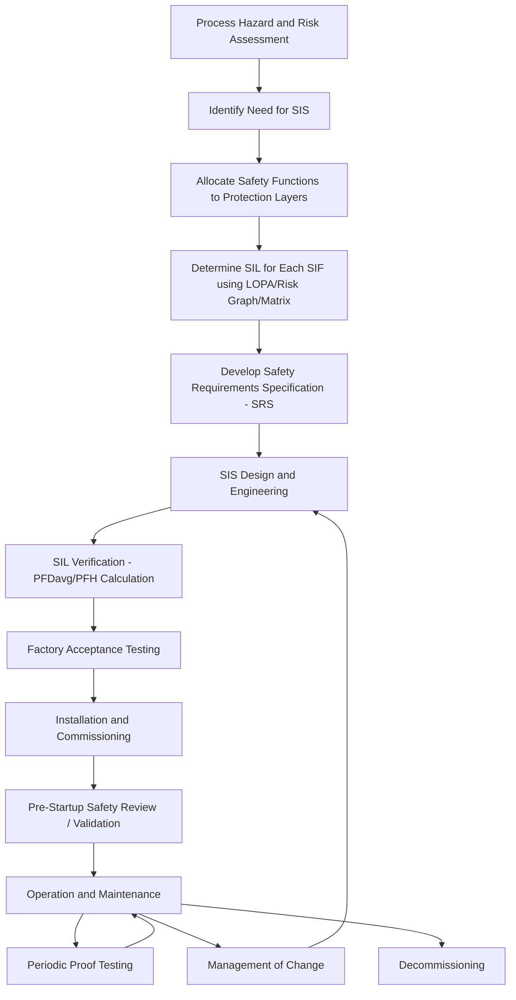

## Safety Instrumented Functions and the Safety Lifecycle

### Definition of a Safety Instrumented Function (SIF)

A Safety Instrumented Function (SIF) is a specific safety function implemented by a Safety Instrumented System (SIS) to achieve or maintain a safe state of a process, in response to a specific hazardous event. Each SIF is a complete loop consisting of three subsystems working in series:

$$\text{Sensor(s)} \rightarrow \text{Logic Solver} \rightarrow \text{Final Element(s)}$$

**Key Points**

- A SIF is defined at the function level, not the device level — a pressure transmitter alone is not a SIF; the complete loop that detects high pressure, processes the signal, and closes a shutdown valve is the SIF.
- A single SIS typically implements many SIFs, sharing a common logic solver but often having independent sensors and final elements.
- Each SIF has its own target Safety Integrity Level (SIL), proof test interval, and safe state definition, determined during the analysis phase of the safety lifecycle.
- A SIF is distinct from Basic Process Control System (BPCS) control loops, which regulate normal process operation rather than respond to hazardous deviations.

### Anatomy of a SIF

**Sensors (Input Elements)**

- Detect the process variable associated with the hazard (pressure, temperature, level, flow, gas concentration, fire/smoke).
- May be single, or arranged in voting architectures (1oo1, 1oo2, 2oo2, 2oo3) to balance safety (avoiding dangerous undetected failures) against spurious trip reduction.

**Logic Solver**

- Processes sensor input against a defined trip setpoint and executes the safety logic.
- Commonly a Safety PLC or a relay-based/solid-state logic system, selected for architectural constraints appropriate to the target SIL.
- Executes voting logic, diagnostics, and communicates final element commands.

**Final Elements (Output Elements)**

- Physically implement the safe state action: shutdown valves (ESDVs), trip solenoids, circuit breakers, relief devices activated by SIS command.
- Fail-safe design intent (e.g., fail-closed or fail-open depending on hazard direction) is a core specification item.

**Example**

A high-pressure trip SIF on a distillation column:

- **Sensor**: Two pressure transmitters in a 1oo2 voting arrangement
- **Logic Solver**: Safety PLC evaluating the voted signal against a high-pressure setpoint
- **Final Element**: A fail-closed emergency shutdown valve on the feed line, plus a fail-open valve to a flare header
- **Safe state**: Column isolated from feed, pressure relieved to flare
- **Target SIL**: SIL 2, established via LOPA during the analysis phase

### The Safety Lifecycle: Overview

IEC 61511 structures all SIS-related work — including definition of every SIF — around the Safety Lifecycle, a sequence of phases spanning conception through decommissioning. It ensures that safety requirements are systematically derived from hazard analysis, implemented with verified integrity, and sustained through operation.

### Phase 1: Hazard and Risk Assessment

- Techniques such as HAZOP, What-If Analysis, or Fault Tree Analysis identify hazardous scenarios and their initiating causes.
- Each scenario is examined for existing independent protection layers (IPLs) — e.g., relief valves, alarms with operator response, BPCS control.
- Where existing layers are insufficient to reduce risk to a tolerable level, a candidate SIF is identified as an additional protection layer.

### Phase 2: Allocation of Safety Functions

- Not every identified hazard requires a SIS-based SIF; some may be addressed by inherently safer design, mechanical protection (relief valves), or process/procedural controls.
- Where a SIF is selected, it must be functionally independent from the BPCS and from other protection layers credited in the risk assessment, to avoid common-cause vulnerabilities.

### Phase 3: SIL Determination

Common methods, applied per SIF:

- **LOPA (Layer of Protection Analysis)** — Most widely used; quantifies the frequency of the unmitigated hazardous event, subtracts risk reduction from credited IPLs, and calculates the residual risk reduction the SIF must provide, translating to a target PFDavg/SIL.
- **Risk graph** — Qualitative decision-tree method using consequence, exposure, avoidability, and demand rate parameters.
- **Risk matrix** — Tabular severity-versus-likelihood lookup.

[Inference] LOPA tends to be preferred in mainstream process industry practice because it produces a semi-quantitative, auditable basis for the SIL target, which is useful both for internal engineering justification and for regulatory/insurance review.

### Phase 4: Safety Requirements Specification (SRS)

The SRS is the definitive record of what each SIF must do. For every SIF, it specifies:

- Description of the hazardous event and the safety action taken
- Required SIL and demand mode (low demand vs. high demand/continuous)
- Trip setpoints and logic (including voting architecture)
- Response time requirement
- Safe state definition
- Proof test interval and test method
- Manual shutdown, reset, and bypass/override provisions with associated safeguards
- Interfaces with BPCS and alarm systems (including independence requirements)

**Key Points**

- The SRS is developed before detailed design begins and serves as the contractual baseline for all downstream verification and validation activities.
- Ambiguity or omission in the SRS is a frequently cited root or contributing cause in process safety incident investigations involving SIS underperformance.

### Phase 5: Design, Engineering, and SIL Verification

- Devices are selected based on IEC 61508 certification or documented prior-use justification.
- Architecture (voting, redundancy) is chosen to meet both the hardware fault tolerance/systematic capability constraints and the quantitative PFDavg/PFH target.
- SIL verification calculations combine component failure rate data, common-cause failure (beta factor) contributions, proof test intervals, and diagnostic coverage to confirm the design meets the SRS-specified target.

$$\text{PFDavg} \approx \frac{\lambda_{DU} \cdot TI}{2}$$

where $\lambda_{DU}$ is the dangerous undetected failure rate and $TI$ is the proof test interval — a simplified single-channel approximation; actual calculations for redundant architectures also account for common-cause factors and diagnostic coverage.

### Phase 6: Installation, Commissioning, and Validation

- Factory Acceptance Testing (FAT) confirms the logic solver programming and integration meet the SRS before shipment/installation.
- Site Acceptance Testing (SAT) and loop checks confirm correct field wiring, calibration, and device response.
- Pre-Startup Safety Review (PSSR) and formal SIS validation confirm that the installed system performs each SIF as specified under realistic (or simulated) trip conditions before the process is commissioned.

### Phase 7: Operation and Maintenance

- **Proof testing**: Periodic functional testing of each SIF, at the interval assumed in the PFDavg calculation, to detect dangerous undetected failures that diagnostics cannot catch (e.g., a manual full-stroke valve test).
- **Partial stroke testing (PST)**: A supplementary technique for valves, moving the valve slightly to detect a subset of failure modes without a full process trip, extending effective test coverage between full proof tests.
- **Bypassing/overriding**: Any temporary defeat of a SIF (e.g., during maintenance) must follow documented, authorized procedures with compensating measures and time limits, since it directly removes the credited risk reduction.
- **Management of Change (MOC)**: Any modification to a SIF's design, setpoint, logic, or physical configuration must be evaluated for safety impact and re-verified before implementation, feeding back into the design/verification phases.

### Phase 8: Decommissioning

- Formal removal of a SIF or SIS from service requires assessment of whether the hazard it protected against still exists and, if so, what compensating measures are implemented.

### Independence and Layers of Protection

A SIF's credited risk reduction depends on its independence from other protection layers. Typical layers, from process design outward, include:

| Layer | Example | Independent of SIS? |
| --- | --- | --- |
| Process design | Inherently safer design, vessel rating | Yes |
| BPCS control | Normal regulatory control loop | Must be independent for IPL credit |
| Alarms with operator action | High-pressure alarm, operator response | Must be independent for IPL credit |
| Safety Instrumented System (SIS) | The SIF itself | — |
| Physical protection | Relief valve, rupture disk | Yes |
| Plant/community emergency response | Evacuation, fire response | Yes |

[Inference] Common industry practice is to require that a SIF not share sensors, logic, or final elements with the BPCS or with any other credited IPL for the same scenario, since shared components would undermine the independence assumption used in the LOPA/SIL calculation; the precise independence criteria applied can vary by company standard.

### Common Pitfalls in SIF Definition

- **Combining unrelated hazards into one SIF**: Each distinct hazardous scenario should generally have its own SIF (or clearly justified shared logic) so that SIL targets and proof test intervals remain traceable to specific risk calculations.
- **Crediting BPCS as an IPL while also using it as part of the SIF path**: This double-counts risk reduction and violates independence assumptions.
- **Undocumented setpoint or logic changes**: Changes made outside MOC can silently invalidate the SIL verification without triggering a formal review.
- **Inadequate proof test coverage**: A proof test procedure that doesn't actually exercise the full failure mode set (e.g., not stroking a valve fully) can leave dangerous undetected failures unaddressed despite "passing" tests.

### Diagram: SIF Voting Architecture Example (svg_diagram)

<svg xmlns="http://www.w3.org/2000/svg" viewBox="0 0 760 320">
<rect x="0" y="0" width="760" height="320" fill="#ffffff" />
<text x="380" y="26" font-family="Arial, sans-serif" font-size="16" font-weight="bold" text-anchor="middle" fill="#1a1a1a">1oo2 Sensor Voting SIF Loop (svg_diagram)</text>
<rect x="30" y="70" width="150" height="50" rx="6" fill="#2c5f8a" stroke="#1a3d5c" stroke-width="2" />
<text x="105" y="99" font-family="Arial, sans-serif" font-size="12" font-weight="bold" text-anchor="middle" fill="#ffffff">Transmitter A</text>
<rect x="30" y="150" width="150" height="50" rx="6" fill="#2c5f8a" stroke="#1a3d5c" stroke-width="2" />
<text x="105" y="179" font-family="Arial, sans-serif" font-size="12" font-weight="bold" text-anchor="middle" fill="#ffffff">Transmitter B</text>
<line x1="180" y1="95" x2="270" y2="95" stroke="#555555" stroke-width="2" />
<line x1="180" y1="175" x2="270" y2="175" stroke="#555555" stroke-width="2" />
<line x1="270" y1="95" x2="270" y2="135" stroke="#555555" stroke-width="2" />
<line x1="270" y1="175" x2="270" y2="135" stroke="#555555" stroke-width="2" />
<rect x="270" y="110" width="140" height="50" rx="6" fill="#3d7a3d" stroke="#255525" stroke-width="2" />
<text x="340" y="132" font-family="Arial, sans-serif" font-size="11" font-weight="bold" text-anchor="middle" fill="#ffffff">1oo2 Voting</text>
<text x="340" y="149" font-family="Arial, sans-serif" font-size="10" text-anchor="middle" fill="#ffffff">Logic Solver</text>
<line x1="410" y1="135" x2="480" y2="135" stroke="#555555" stroke-width="2" />
<rect x="480" y="110" width="130" height="50" rx="6" fill="#8a5c2c" stroke="#5c3d1a" stroke-width="2" />
<text x="545" y="132" font-family="Arial, sans-serif" font-size="11" font-weight="bold" text-anchor="middle" fill="#ffffff">Safety PLC</text>
<text x="545" y="149" font-family="Arial, sans-serif" font-size="10" text-anchor="middle" fill="#ffffff">Trip Decision</text>
<line x1="610" y1="135" x2="680" y2="135" stroke="#555555" stroke-width="2" />
<rect x="580" y="200" width="150" height="50" rx="6" fill="#7a3d6f" stroke="#552548" stroke-width="2" />
<text x="655" y="222" font-family="Arial, sans-serif" font-size="11" font-weight="bold" text-anchor="middle" fill="#ffffff">ESD Valve</text>
<text x="655" y="239" font-family="Arial, sans-serif" font-size="10" text-anchor="middle" fill="#ffffff">Fail-Closed</text>
<line x1="680" y1="160" x2="680" y2="200" stroke="#555555" stroke-width="2" />
<rect x="30" y="260" width="700" height="45" rx="6" fill="#f0f0f0" stroke="#999999" stroke-width="1" />
<text x="380" y="287" font-family="Arial, sans-serif" font-size="10" text-anchor="middle" fill="#333333">Either transmitter detecting high pressure triggers logic solver; PLC commands valve to fail-safe (closed) state</text>
</svg>

### Related Standards Integration

- IEC 61511's SIF/lifecycle model provides the SIS-specific implementation of the broader Process Hazard Analysis (PHA) obligations found in regulatory frameworks such as OSHA PSM (29 CFR 1910.119) and equivalent process safety regulations.
- SIF documentation (SRS, verification calculations, proof test records) is typically a required artifact during PSM compliance audits and Mechanical Integrity program reviews.

### Conclusion

A Safety Instrumented Function is the fundamental unit of protection delivered by a Safety Instrumented System, comprising sensor, logic solver, and final element working together to bring a process to a defined safe state in response to a specific hazard. The Safety Lifecycle provides the disciplined, auditable sequence — from hazard identification and SIL determination through design verification, installation, operation, and eventual decommissioning — that ensures each SIF is not only specified correctly but continues to deliver its intended risk reduction throughout the life of the facility.

**Related Topics**

- Layer of Protection Analysis (LOPA) methodology in depth
- SIL verification calculations: PFDavg, PFH, and common-cause (beta factor) modeling
- Safety Requirements Specification (SRS) content and development practices
- Proof testing and partial stroke testing strategies
- Management of Change (MOC) for Safety Instrumented Systems
- Voting architectures and hardware fault tolerance (1oo1, 1oo2, 2oo3)
- BPCS/SIS independence and shared-component pitfalls
- Functional Safety Assessment (FSA) at lifecycle gates