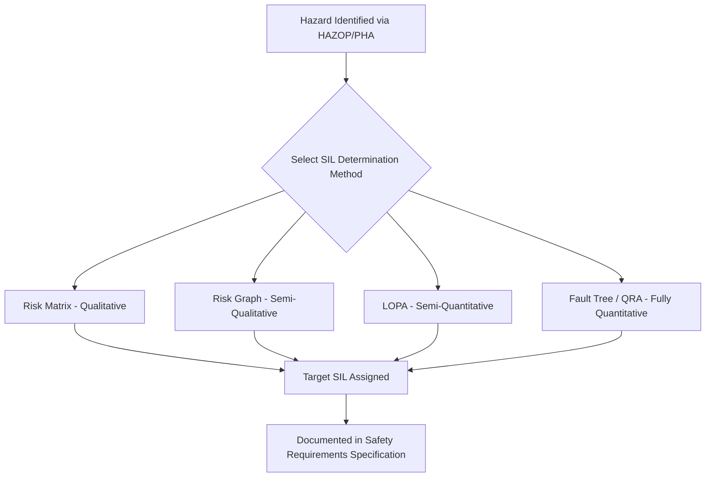
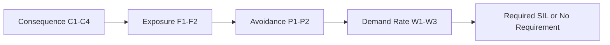

## Safety Integrity Level Determination Methods

### Purpose of SIL Determination

Safety Integrity Level (SIL) determination is the analytical process of assigning a required risk-reduction target to each Safety Instrumented Function (SIF), based on the gap between the unmitigated risk of a hazardous scenario and the tolerable risk level accepted by the organization or regulator. IEC 61511-3 provides informative guidance describing several accepted methods; the standard does not mandate one specific method, but requires that whichever method is used be applied consistently, be documented, and be defensible.

**Key Points**

- SIL determination happens during the analysis phase of the safety lifecycle, after hazards have been identified (typically via HAZOP) and before the Safety Requirements Specification (SRS) is finalized.
- All methods share the same underlying logic: estimate how often the hazard would occur without the SIF, determine how much risk reduction is needed to reach tolerable risk, and translate that risk reduction into a target SIL (PFDavg or PFH).
- Methods range from purely qualitative (risk matrix) to semi-quantitative (LOPA, risk graph) to fully quantitative (fault tree analysis, QRA).
- The method selected does not need to be the same across an entire facility; simpler scenarios may use a risk matrix while complex or high-consequence scenarios warrant LOPA or full quantitative analysis.

### Overview of the Main Methods

### Method 1: Risk Matrix

A risk matrix is a two-dimensional lookup table that maps consequence severity against event likelihood/frequency to a required SIL (or "no SIL required," or "SIS not suitable").

**How it works**

1. Define consequence severity categories (e.g., minor injury, serious injury, single fatality, multiple fatalities), often separately for safety, environmental, and financial impact.
2. Define likelihood/frequency bands (e.g., "once per 10 years," "once per 100 years," "once per 10,000 years") for the unmitigated event, before crediting the candidate SIF.
3. Locate the intersection cell; the matrix has been pre-populated by the organization (typically during corporate risk criteria development) with the required SIL for that combination.

**Example**

| Likelihood ↓ / Severity → | Minor | Serious Injury | Single Fatality | Multiple Fatalities |
| --- | --- | --- | --- | --- |
| Frequent (>1/yr) | SIL 1 | SIL 2 | SIL 3 | SIL 4 |
| Occasional (1/10yr) | — | SIL 1 | SIL 2 | SIL 3 |
| Rare (1/100yr) | — | — | SIL 1 | SIL 2 |
| Very Rare (1/1000yr) | — | — | — | SIL 1 |

**Key Points**

- Fast and simple to apply, making it useful for screening large numbers of scenarios (e.g., in an initial HAZOP-driven SIL screening pass).
- Coarse category boundaries can produce inconsistent results for scenarios that sit near a boundary, and it does not explicitly account for the risk-reduction credit from other independent protection layers (IPLs) unless the matrix is applied post-IPL.
- [Inference] Risk matrices are often favored for lower-consequence, high-volume scenario screening, with LOPA reserved for scenarios that fall into higher-severity categories, though the specific threshold for escalation is set by each company's risk management procedure.

### Method 2: Risk Graph

A risk graph is a decision-tree-style qualitative tool (the calibrated version appears in IEC 61508-5 and IEC 61511-3) that derives a SIL from four parameters, evaluated in sequence:

- **C (Consequence)**: Severity of the potential harm (e.g., C1 = minor injury, C4 = multiple fatalities)
- **F (Frequency/Exposure)**: How often personnel are exposed to the hazardous zone (e.g., F1 = rare, F2 = frequent/continuous)
- **P (Possibility of avoidance)**: Whether the hazard can be avoided once the failure occurs (e.g., P1 = possible under certain conditions, P2 = almost never)
- **W (Demand rate/probability of unwanted occurrence)**: How often the hazardous event would occur without the SIF (e.g., W1, W2, W3 as increasing frequency bands)

**How it works**

Starting from the consequence parameter, the assessor traces a path through the graph, answering each parameter in sequence, arriving at a starting point on a demand-rate scale (W1/W2/W3) that indicates the required SIL (or indicates "no safety requirements" or "a single E/E/PE system is not sufficient").

**Key Points**

- More structured than a plain risk matrix because it explicitly separates exposure and avoidability from raw consequence, reducing some of the coarseness of a simple matrix.
- Still fundamentally qualitative/judgment-based at each branch point, so consistency across assessors and sessions depends heavily on facilitator experience and calibration guidance.
- Calibrated risk graphs (with quantified frequency ranges attached to each branch) reduce, but do not eliminate, this subjectivity.

### Method 3: Layer of Protection Analysis (LOPA)

LOPA is the most widely used semi-quantitative method in the process industry. It builds directly on HAZOP scenario identification and adds order-of-magnitude quantification.

**How it works**

1. Select a specific HAZOP-identified scenario with a defined initiating cause and consequence.
2. Estimate the initiating event frequency (events per year), typically from generic industry failure rate data.
3. Identify all Independent Protection Layers (IPLs) credited for the scenario — each IPL must be independent, effective, and auditable (e.g., relief valve, BPCS alarm with operator response, physical containment).
4. Assign a Probability of Failure on Demand (PFD) to each IPL based on generic or plant-specific data.
5. Calculate the mitigated event frequency:

$$f_{mitigated} = f_{initiating} \times \prod_{i} PFD_{IPL_i}$$

6. Compare $f_{mitigated}$ against the tolerable risk frequency for that consequence severity; if a gap remains, a SIF is required, and the necessary additional PFD (and therefore SIL) is calculated as:

$$PFD_{SIF} = \frac{f_{tolerable}}{f_{mitigated,without\ SIF}}$$

**Example**

A reactor overpressure scenario:

- Initiating event: control valve fails open, frequency = $0.1$ /year
- Credited IPL 1: BPCS alarm + operator response, PFD = $0.1$
- Credited IPL 2: Relief valve, PFD = $0.01$
- Mitigated frequency without SIF: $0.1 \times 0.1 \times 0.01 = 1 \times 10^{-4}$ /year
- Tolerable frequency for this consequence (single fatality potential): $1 \times 10^{-5}$ /year
- Required additional PFD from SIF: $10^{-5} / 10^{-4} = 0.1$ → this falls within the SIL 1 PFDavg band, but companies often round up conservatively to the next SIL if the calculated PFD sits near a band boundary

**Key Points**

- LOPA provides an auditable numeric trail linking hazard frequency, credited protection layers, and the resulting SIL target, which is valuable for both engineering justification and regulatory/insurance review.
- IPL independence is the critical, often-scrutinized assumption: an IPL sharing a sensor, logic element, or final element with the SIF (or with another credited IPL) cannot be credited at full value.
- Generic failure rate and PFD data (from sources such as CCPS or company-specific reliability databases) introduces uncertainty; [Inference] many organizations apply conservative rounding or safety margins when a calculated result falls close to a SIL band boundary, though the specific margin practice varies by company.
- LOPA is typically conducted as a facilitated team exercise following the HAZOP, using standardized worksheets.

### Method 4: Fully Quantitative Methods (Fault Tree Analysis, QRA)

For complex, high-consequence, or novel-technology scenarios where LOPA's order-of-magnitude approach may be insufficient, fully quantitative methods are used.

**Fault Tree Analysis (FTA)**

- Models the logical combination of component and human failures leading to a top event, using AND/OR gates.
- Produces a calculated probability or frequency for the top event based on detailed failure rate data for each contributing branch.

**Quantitative Risk Assessment (QRA)**

- Integrates multiple hazard scenarios, consequence modeling (e.g., dispersion, fire, explosion effects), and frequency analysis to estimate societal or individual risk (e.g., individual risk per year, F-N curves).
- Often used to justify SIL targets for scenarios with potential for major accidents affecting multiple people or off-site populations.

**Key Points**

- These methods require more specialized expertise, more detailed data, and more time/cost than LOPA, so their use is typically reserved for scenarios where risk is high enough, or novel enough, to justify the additional rigor.
- Results are only as reliable as the underlying failure rate data and modeling assumptions; disclaimers about model behavior at extreme tail probabilities are common practice in QRA reporting.

### Comparison of Methods

| Method | Rigor | Typical Use Case | Output |
| --- | --- | --- | --- |
| Risk Matrix | Qualitative | Fast screening of numerous scenarios | SIL band from table lookup |
| Risk Graph | Semi-qualitative | Scenario-by-scenario judgment-based determination | SIL band from decision tree |
| LOPA | Semi-quantitative | Standard process industry practice for most SIFs | Numeric PFD/SIL target |
| FTA / QRA | Fully quantitative | High-consequence, complex, or novel scenarios | Calculated frequency/probability |

### Common Pitfalls in SIL Determination

- **IPL credit inflation**: Crediting protection layers that do not meet independence, effectiveness, or auditability criteria, which overstates achieved risk reduction and understates the true SIL requirement.
- **Inconsistent team calibration**: Different HAZOP/LOPA teams applying different implicit risk tolerance criteria across a facility, producing inconsistent SIL targets for similar hazards.
- **Ignoring common-cause dependencies between IPLs**: Two IPLs that share a sensor, power supply, or operator action path are not truly independent, even if nominally separate systems.
- **Boundary-case rounding inconsistency**: Not having a documented policy for how to round a calculated SIL that falls near a band boundary (e.g., PFD of $0.095$ near the SIL 1/SIL 2 boundary).
- **Treating BPCS as both a control system and a credited IPL for the same scenario** without additional integrity and independence safeguards, which can double-count risk reduction.

### Documentation Requirements

Regardless of method, IEC 61511 requires that the SIL determination for each SIF be documented with sufficient detail to allow independent review, including:

- The hazard scenario, initiating cause, and consequence description
- The method used and the specific parameters/data inputs (frequencies, PFDs, matrix criteria)
- The credited IPLs and justification for their independence and effectiveness
- The resulting target SIL and demand mode (low demand vs. high/continuous demand)
- Assumptions and any conservative margins applied

This documentation feeds directly into the Safety Requirements Specification (SRS) and is a key artifact reviewed during Functional Safety Assessments (FSAs) and process safety management audits.

### Diagram: LOPA Risk Reduction Concept (svg_diagram)

<svg xmlns="http://www.w3.org/2000/svg" viewBox="0 0 760 340">
<rect x="0" y="0" width="760" height="340" fill="#ffffff" />
<text x="380" y="26" font-family="Arial, sans-serif" font-size="16" font-weight="bold" text-anchor="middle" fill="#1a1a1a">LOPA Risk Reduction Concept (svg_diagram)</text>
<rect x="30" y="60" width="180" height="50" rx="6" fill="#8a2c2c" stroke="#5c1a1a" stroke-width="2" />
<text x="120" y="82" font-family="Arial, sans-serif" font-size="11" font-weight="bold" text-anchor="middle" fill="#ffffff">Initiating Event</text>
<text x="120" y="99" font-family="Arial, sans-serif" font-size="10" text-anchor="middle" fill="#ffffff">0.1 /year</text>
<line x1="210" y1="85" x2="270" y2="85" stroke="#555555" stroke-width="2" />
<rect x="270" y="60" width="180" height="50" rx="6" fill="#8a5c2c" stroke="#5c3d1a" stroke-width="2" />
<text x="360" y="82" font-family="Arial, sans-serif" font-size="11" font-weight="bold" text-anchor="middle" fill="#ffffff">IPL 1: BPCS Alarm</text>
<text x="360" y="99" font-family="Arial, sans-serif" font-size="10" text-anchor="middle" fill="#ffffff">PFD = 0.1</text>
<line x1="450" y1="85" x2="510" y2="85" stroke="#555555" stroke-width="2" />
<rect x="510" y="60" width="180" height="50" rx="6" fill="#8a5c2c" stroke="#5c3d1a" stroke-width="2" />
<text x="600" y="82" font-family="Arial, sans-serif" font-size="11" font-weight="bold" text-anchor="middle" fill="#ffffff">IPL 2: Relief Valve</text>
<text x="600" y="99" font-family="Arial, sans-serif" font-size="10" text-anchor="middle" fill="#ffffff">PFD = 0.01</text>
<line x1="360" y1="110" x2="360" y2="150" stroke="#555555" stroke-width="2" />
<rect x="230" y="150" width="260" height="45" rx="6" fill="#3d7a3d" stroke="#255525" stroke-width="2" />
<text x="360" y="172" font-family="Arial, sans-serif" font-size="11" font-weight="bold" text-anchor="middle" fill="#ffffff">Mitigated Frequency</text>
<text x="360" y="188" font-family="Arial, sans-serif" font-size="10" text-anchor="middle" fill="#ffffff">1 x 10^-4 /year</text>
<line x1="360" y1="195" x2="360" y2="225" stroke="#555555" stroke-width="2" />
<rect x="200" y="225" width="320" height="45" rx="6" fill="#2c5f8a" stroke="#1a3d5c" stroke-width="2" />
<text x="360" y="247" font-family="Arial, sans-serif" font-size="11" font-weight="bold" text-anchor="middle" fill="#ffffff">Tolerable Frequency Target</text>
<text x="360" y="263" font-family="Arial, sans-serif" font-size="10" text-anchor="middle" fill="#ffffff">1 x 10^-5 /year</text>
<line x1="360" y1="270" x2="360" y2="300" stroke="#555555" stroke-width="2" />
<rect x="230" y="300" width="260" height="35" rx="6" fill="#7a3d6f" stroke="#552548" stroke-width="2" />
<text x="360" y="322" font-family="Arial, sans-serif" font-size="11" font-weight="bold" text-anchor="middle" fill="#ffffff">Required SIF PFD = 0.1 (SIL 1)</text>
</svg>

### Conclusion

SIL determination translates the qualitative findings of hazard identification into a quantified, defensible integrity target for each Safety Instrumented Function. The choice among risk matrix, risk graph, LOPA, and fully quantitative methods reflects a trade-off between speed/simplicity and analytical rigor, with LOPA serving as the process industry's standard middle-ground approach. Regardless of method, the output — a documented target SIL, tied to a specific hazard scenario and set of credited protection layers — becomes the foundation for the Safety Requirements Specification and all subsequent design, verification, and operational activities in the safety lifecycle.

**Related Topics**

- Independent Protection Layer (IPL) criteria: independence, effectiveness, auditability
- LOPA worksheet structure and facilitation practices
- SIL verification calculations: PFDavg, PFH, and common-cause modeling
- Safety Requirements Specification (SRS) development
- Tolerable risk criteria and risk acceptance frameworks
- Human factors and operator response credit in LOPA
- Quantitative Risk Assessment (QRA) and consequence modeling techniques
- Calibration and consistency practices across HAZOP/LOPA teams