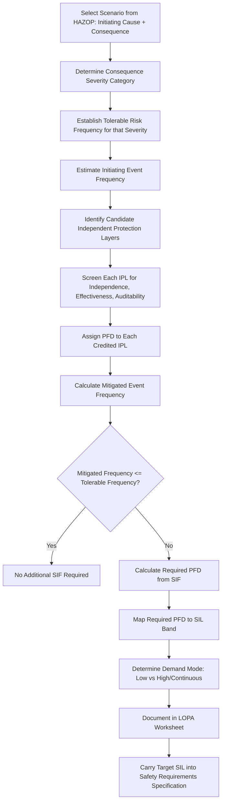

## LOPA to SIL Determination Workflow

### Purpose and Position in the Safety Lifecycle

Layer of Protection Analysis (LOPA) to SIL determination is the structured, step-by-step numerical procedure that converts a HAZOP-identified hazardous scenario into a quantified Safety Integrity Level target for a candidate Safety Instrumented Function (SIF). It sits immediately after hazard identification and immediately before the Safety Requirements Specification (SRS) is drafted, forming the analytical bridge between "a hazard exists" and "here is the integrity level the SIF must achieve."

**Key Points**

- LOPA is order-of-magnitude (semi-quantitative), deliberately using round-number data (frequencies and PFDs typically expressed as powers of ten) to avoid false precision.
- The workflow is scenario-by-scenario: each initiating cause/consequence pair identified in the HAZOP is analyzed separately, even if multiple scenarios share the same SIF.
- LOPA is normally conducted as a facilitated team exercise (process engineer, operations, instrumentation/controls engineer, and a trained LOPA facilitator), using standardized worksheets.
- The workflow output feeds directly into the SRS: target SIL, demand mode, and the specific IPLs credited (which must remain distinct from the SIF itself).

### Step-by-Step Workflow

### Step 1: Select the Scenario

Each LOPA worksheet addresses one specific pairing of an initiating cause and a consequence, drawn directly from a HAZOP or other hazard identification study node. A single HAZOP deviation (e.g., "high pressure in vessel V-101") may generate several distinct LOPA scenarios if there are multiple independent initiating causes (e.g., control valve failure, blocked outlet, external fire).

### Step 2: Determine Consequence Severity Category

The team classifies the worst credible consequence of the unmitigated scenario into a pre-defined severity category (e.g., minor injury, serious injury/single fatality, multiple fatalities, major environmental release, major financial loss). This classification is typically drawn from the organization's corporate risk matrix or risk criteria document, ensuring consistency with the tolerable risk framework used elsewhere in the facility.

### Step 3: Establish Tolerable Risk Frequency

Each severity category has an associated tolerable frequency — the maximum acceptable frequency of occurrence for a consequence of that severity, as defined by corporate risk criteria (often benchmarked against societal risk guidelines or regulatory expectations).

**Example**

| Consequence Category | Typical Tolerable Frequency (order of magnitude) |
| --- | --- |
| Minor injury | $10^{-2}$ /year |
| Serious injury / single fatality | $10^{-3}$ to $10^{-4}$ /year |
| Multiple fatalities | $10^{-5}$ /year |
| Major environmental release | $10^{-4}$ to $10^{-5}$ /year |

[Inference] These specific numeric thresholds vary by company and jurisdiction; the values shown illustrate the typical order-of-magnitude structure rather than a universal standard.

### Step 4: Estimate Initiating Event Frequency

The frequency of the initiating cause occurring, in events per year, is estimated using generic industry failure rate data (e.g., CCPS "Guidelines for Initiating Events and Independent Protection Layers," equipment reliability databases) or plant-specific historical data where available.

**Example** — typical generic order-of-magnitude values:

- Control valve fails to expected position: $0.1$ /year
- Pump seal failure: $0.1$–$1$ /year
- BPCS loop failure causing a demand: $0.1$–$1$ /year
- Human error (routine task, no stress): $10^{-2}$–$10^{-1}$ /year

### Step 5: Identify and Screen Candidate IPLs

An Independent Protection Layer (IPL) is a device, system, or human action capable of preventing the scenario from reaching its consequence, independent of the initiating event and of other credited IPLs. To be creditable, an IPL must satisfy three criteria:

- **Independent**: Not sharing a sensor, logic element, final element, or human action path with the initiating cause or with any other credited IPL for the same scenario.
- **Effective**: Capable of fully preventing the consequence, sized/rated appropriately for the scenario (e.g., a relief valve sized for the specific overpressure case).
- **Auditable**: Its performance and failure rate can be verified through documented testing, inspection, or maintenance records.

**Common IPL types and typical PFD ranges**

| IPL Type | Typical PFD (order of magnitude) |
| --- | --- |
| BPCS control loop (if not the initiating cause) | $10^{-1}$ |
| Operator response to alarm (adequate time, well-trained) | $10^{-1}$ |
| Relief valve (correctly sized) | $10^{-2}$ |
| Rupture disk | $10^{-2}$ to $10^{-3}$ |
| Dike/containment | $10^{-2}$ to $10^{-3}$ |
| Safety Instrumented Function (existing, separate scenario) | Per its own verified SIL |

[Inference] These PFD ranges are commonly cited industry planning values (e.g., as tabulated in CCPS guidance); actual credited values in a specific LOPA should be justified against plant-specific or vendor data where available rather than applied as fixed defaults.

### Step 6: Calculate Mitigated Event Frequency

With the initiating event frequency and the PFDs of all credited IPLs, the mitigated frequency of the consequence (without yet counting the candidate SIF) is:

$$f_{mitigated} = f_{initiating} \times \prod_{i=1}^{n} PFD_{IPL_i}$$

### Step 7: Compare Against Tolerable Frequency and Calculate Required SIF PFD

If $f_{mitigated}$ already meets or is below the tolerable frequency, no additional SIF is required for that scenario. If a gap remains, the required PFD from the candidate SIF is:

$$PFD_{SIF,required} = \frac{f_{tolerable}}{f_{mitigated}}$$

**Example (worked)**

- Scenario: Reactor overpressure due to cooling water failure
- Initiating event frequency: $f_{initiating} = 0.3$ /year
- Credited IPL 1 (BPCS high-temperature alarm + operator response): $PFD = 0.1$
- Credited IPL 2 (mechanical relief valve): $PFD = 0.01$
- $f_{mitigated} = 0.3 \times 0.1 \times 0.01 = 3 \times 10^{-4}$ /year
- Consequence category: single fatality potential; tolerable frequency $= 1 \times 10^{-5}$ /year
- $PFD_{SIF,required} = \dfrac{1 \times 10^{-5}}{3 \times 10^{-4}} \approx 0.033$

### Step 8: Map Required PFD to SIL Band

The calculated $PFD_{SIF,required}$ is mapped to the standard SIL bands (assuming low-demand mode, since the scenario above is triggered infrequently):

| SIL | PFDavg Range |
| --- | --- |
| 1 | $10^{-2} \le \text{PFDavg} < 10^{-1}$ |
| 2 | $10^{-3} \le \text{PFDavg} < 10^{-2}$ |
| 3 | $10^{-4} \le \text{PFDavg} < 10^{-3}$ |

In the worked example, $0.033$ falls within the SIL 1 band ($10^{-2}$ to $10^{-1}$). If the calculated value falls very close to a band boundary (e.g., $0.0095$, just under the SIL 1/SIL 2 line), many organizations apply a documented conservative-rounding policy and select the more stringent SIL.

### Step 9: Determine Demand Mode

The demand mode affects which integrity metric applies:

- **Low demand mode**: SIF is called upon no more than once per year (or less than twice the proof-test frequency) → target expressed as PFDavg.
- **High demand or continuous mode**: SIF is called upon more than once per year → target expressed as PFH (probability of failure per hour).

The initiating event frequency calculated in Step 4, combined with IPL PFDs, generally also indicates how often the SIF itself would actually be demanded, which confirms which mode applies.

### Step 10: Document and Hand Off to the SRS

The completed LOPA worksheet — scenario description, initiating cause, consequence category, tolerable frequency, credited IPLs with PFDs and independence justification, calculated mitigated frequency, required SIF PFD, and resulting target SIL/demand mode — becomes a formal input to the Safety Requirements Specification for that SIF.

### Worksheet Structure (Typical Fields)

| Field | Description |
| --- | --- |
| Scenario number | Unique identifier linking back to HAZOP node |
| Initiating cause | The specific failure or error that starts the scenario |
| Consequence description | Worst credible outcome without mitigation |
| Severity category | Corporate risk criteria classification |
| Initiating event frequency | Events per year, with data source cited |
| IPL 1, 2, 3... | Each credited layer, with PFD and independence justification |
| Mitigated frequency | Calculated per the formula above |
| Tolerable frequency | From corporate risk criteria |
| Required SIF PFD | Calculated gap |
| Target SIL and demand mode | Final output, carried to SRS |
| Notes/assumptions | Any conservative margins or special considerations |

### Common Pitfalls in the LOPA Workflow

- **Crediting non-independent layers**: Counting an alarm and a trip that share the same sensor or the same operator action as two separate IPLs.
- **Over-crediting operator response**: Assuming reliable operator intervention without verifying adequate time, clear procedures, and training — generic guidance typically caps human response PFD around $10^{-1}$ at best, and higher (less reliable) under time pressure or ambiguous alarm conditions.
- **Double-counting the BPCS**: Using the BPCS control loop as the initiating cause in one scenario and as a credited IPL in another related scenario without checking for shared failure modes.
- **Not revisiting LOPA after design changes**: A later change to process conditions, equipment, or credited IPLs (e.g., relief valve resizing) can invalidate the original calculation; this is a Management of Change (MOC) trigger.
- **Skipping documentation of data sources**: Using undocumented or unjustified frequency/PFD values undermines the auditability that gives LOPA its credibility during Functional Safety Assessments.

### Diagram: LOPA Calculation Flow (svg_diagram)

<svg xmlns="http://www.w3.org/2000/svg" viewBox="0 0 760 300">
<rect x="0" y="0" width="760" height="300" fill="#ffffff" />
<text x="380" y="26" font-family="Arial, sans-serif" font-size="16" font-weight="bold" text-anchor="middle" fill="#1a1a1a">LOPA Calculation Flow (svg_diagram)</text>
<rect x="20" y="60" width="160" height="55" rx="6" fill="#8a2c2c" stroke="#5c1a1a" stroke-width="2" />
<text x="100" y="83" font-family="Arial, sans-serif" font-size="11" font-weight="bold" text-anchor="middle" fill="#ffffff">Initiating Frequency</text>
<text x="100" y="100" font-family="Arial, sans-serif" font-size="10" text-anchor="middle" fill="#ffffff">0.3 /year</text>

<text x="205" y="93" font-family="Arial, sans-serif" font-size="18" text-anchor="middle" fill="`#333333`">x</text>

<rect x="230" y="60" width="140" height="55" rx="6" fill="#8a5c2c" stroke="#5c3d1a" stroke-width="2" />
<text x="300" y="83" font-family="Arial, sans-serif" font-size="11" font-weight="bold" text-anchor="middle" fill="#ffffff">IPL 1 PFD</text>
<text x="300" y="100" font-family="Arial, sans-serif" font-size="10" text-anchor="middle" fill="#ffffff">0.1</text>

<text x="380" y="93" font-family="Arial, sans-serif" font-size="18" text-anchor="middle" fill="`#333333`">x</text>

<rect x="400" y="60" width="140" height="55" rx="6" fill="#8a5c2c" stroke="#5c3d1a" stroke-width="2" />
<text x="470" y="83" font-family="Arial, sans-serif" font-size="11" font-weight="bold" text-anchor="middle" fill="#ffffff">IPL 2 PFD</text>
<text x="470" y="100" font-family="Arial, sans-serif" font-size="10" text-anchor="middle" fill="#ffffff">0.01</text>

<text x="550" y="93" font-family="Arial, sans-serif" font-size="18" text-anchor="middle" fill="`#333333`">=</text>

<rect x="570" y="60" width="170" height="55" rx="6" fill="#3d7a3d" stroke="#255525" stroke-width="2" />
<text x="655" y="83" font-family="Arial, sans-serif" font-size="11" font-weight="bold" text-anchor="middle" fill="#ffffff">Mitigated Freq.</text>
<text x="655" y="100" font-family="Arial, sans-serif" font-size="10" text-anchor="middle" fill="#ffffff">3 x 10^-4 /yr</text>
<line x1="655" y1="115" x2="655" y2="150" stroke="#555555" stroke-width="2" />
<rect x="480" y="150" width="260" height="50" rx="6" fill="#2c5f8a" stroke="#1a3d5c" stroke-width="2" />
<text x="610" y="170" font-family="Arial, sans-serif" font-size="11" font-weight="bold" text-anchor="middle" fill="#ffffff">Tolerable Freq: 1e-5 /yr</text>
<text x="610" y="187" font-family="Arial, sans-serif" font-size="10" text-anchor="middle" fill="#ffffff">Required SIF PFD = 0.033</text>
<line x1="610" y1="200" x2="610" y2="235" stroke="#555555" stroke-width="2" />
<rect x="500" y="235" width="220" height="40" rx="6" fill="#7a3d6f" stroke="#552548" stroke-width="2" />
<text x="610" y="260" font-family="Arial, sans-serif" font-size="12" font-weight="bold" text-anchor="middle" fill="#ffffff">Target: SIL 1</text>
</svg>

### Conclusion

The LOPA-to-SIL workflow provides a disciplined, order-of-magnitude numerical path from a HAZOP-identified hazard scenario to a defensible, documented target Safety Integrity Level. By sequentially estimating initiating event frequency, screening and quantifying independent protection layers, and comparing the resulting mitigated frequency against a tolerable risk threshold, the workflow yields both the required SIF PFD and the demand mode needed to complete the Safety Requirements Specification — making it the standard analytical backbone connecting process hazard analysis to Safety Instrumented System design in the process industry.

**Related Topics**

- Independent Protection Layer (IPL) independence, effectiveness, and auditability criteria
- CCPS generic failure rate and PFD data sources for LOPA
- Conservative rounding policies for boundary-case SIL determination
- Safety Requirements Specification (SRS) content and structure
- SIL verification calculations: PFDavg, PFH, and common-cause modeling
- Human factors and operator response reliability in LOPA credit
- Management of Change (MOC) triggers affecting existing LOPA studies
- Enabling conditions and conditional modifiers in advanced LOPA