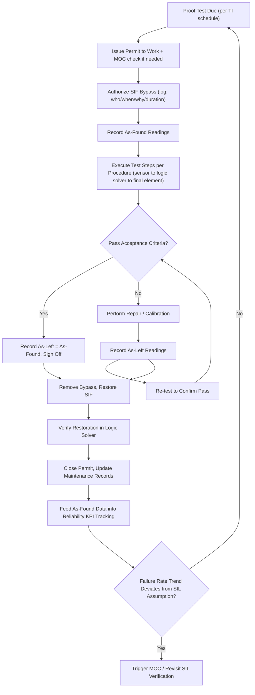

## Proof Testing and SIS Maintenance

### Overview

Proof testing is the periodic, planned verification that a Safety Instrumented Function (SIF) performs its intended safety action on demand, and that it detects failures which normal automatic diagnostics cannot catch. SIS maintenance is the broader lifecycle activity — inspection, calibration, bypassing, repair, and documentation — that keeps the Safety Instrumented System (SIS) capable of achieving the Safety Integrity Level (SIL) assigned during the Safety Requirements Specification (SRS). IEC 61511 and IEC 61508 treat proof testing as a mandatory input to the probability of failure on demand (PFDavg) calculation; without it, the assumed SIL is unverifiable and the protection layer credit taken in the Layer of Protection Analysis (LOPA) is invalid.

### Why Proof Testing Exists: Dangerous Undetected Failures

**Key Points**

- SIS components fail in four categories: safe detected (SD), safe undetected (SU), dangerous detected (DD), and dangerous undetected (DU).
- Automatic diagnostics (internal self-tests, comparison logic, line-fault detection) catch DD failures immediately, prompting repair.
- DU failures are invisible until either a real demand occurs (and the SIF fails to act) or a proof test uncovers them.
- Proof testing exists specifically to convert latent DU failures into detected, repairable failures before a demand happens.

The PFDavg for a periodically tested component approximates:

$$PFD_{avg} \approx \lambda_{DU} \times \frac{TI}{2}$$

where $\lambda_{DU}$ is the dangerous undetected failure rate and $TI$ is the proof test interval. This relationship is why proof test interval and proof test coverage are the two levers most directly controlled by the maintenance organization to keep a SIF within its claimed SIL.

### Proof Test Coverage

**Key Points**

- Proof Test Coverage (PTC) is the fraction of dangerous failure modes that a given test procedure actually detects, not the fraction of test steps completed.
- A "full" or "complete" proof test targets PTC close to 100%; a "partial" proof test (common for control valves that cannot be fully stroked online) may only achieve 60–85% PTC.
- Low PTC leaves a residual population of undetected dangerous failures that continue to accumulate between full overhauls, which must be accounted for separately in the PFDavg model (often via a "staggered" or two-stage test regime).

**Example**

A pressure transmitter proof test that only injects a mid-range pressure and checks the 4–20 mA output against a reference meter may miss failure modes affecting the high or low end of range, or failure modes in the trip relay downstream. A more complete test injects multiple points across the range, verifies the trip setpoint and deadband, confirms the discrete output/relay actually de-energizes, and checks response time — pushing PTC higher.

### Proof Test Interval Determination

**Key Points**

- The proof test interval (TI) is not arbitrary; it is derived from the target PFDavg (from SIL verification calculations) and the known or assumed $\lambda_{DU}$ for each component, using manufacturer failure rate data (e.g., exida, SINTEF/OREDA, or FMEDA reports).
- IEC 61511 requires the interval to be documented and justified in the SIS design/verification package, not just inherited from a vendor default.
- Shortening TI reduces PFDavg but increases spurious trip risk (nuisance trips from testing) and maintenance cost/labor; the interval is a risk-cost optimization, not a "shorter is always better" decision.
- Staggered testing (testing redundant channels of a voted architecture, e.g., 2oo3, at different times) can reduce the effective PFDavg contribution compared to testing all channels simultaneously.

[Inference] In practice, many operating companies converge on 1-, 2-, 3-, or 5-year proof test intervals aligned with turnaround cycles, adjusting downward for components with poor field reliability history and upward (with SIL verification support) for high-integrity, well-diagnosed smart instrumentation.

### Types of Proof Tests

**Key Points**

- **Full (100%) proof test** — exercises the complete SIF end-to-end: sensor to logic solver to final element, including the actual safety action (e.g., valve fully closes, breaker trips).
- **Partial proof test** — verifies a subset of the failure modes, typically because full-stroke testing would require a process shutdown (e.g., partial stroke testing of an emergency shutdown valve).
- **Comparison/redundancy test** — cross-checks redundant sensors against each other to catch drift, useful as an interim check between full proof tests.
- **Overlapping/staggered test** — splits the full test into segments performed at different times to reduce downtime impact while still achieving full coverage over a cycle.

### Partial Stroke Testing (PST)

**Key Points**

- PST moves a shutdown valve a small percentage of its travel (commonly 10–20%) to confirm it is not stuck, without moving it far enough to interrupt the process.
- PST typically detects valve-sticking and some actuator/positioner failures but does not verify full closure, full stroke time, or seat-tightness — so it is a partial, not full, proof test.
- PST is often automated via a digital valve controller/positioner and can be scheduled far more frequently than a full proof test (e.g., monthly or quarterly vs. every 3–5 years), because it does not require a shutdown.
- Using PST reduces the effective $\lambda_{DU}$ contribution from the valve between full proof tests but must be modeled explicitly in the PFDavg calculation (a valve with PST is not treated as fully proof tested).

**Example**

An ESD valve on a compressor suction line is scheduled for automated PST monthly (valve strokes to 85% open and back, confirming no sticking) and a full proof test (complete stroke to 0%, seat leak test, stroke time verification) every turnaround (typically 3–4 years). The combined regime is credited in the SIL verification calculation as a two-stage test model.

### Proof Test Procedure Development

**Key Points**

- A proof test procedure must be written per SIF (or per component within a SIF) and must specify: test method, acceptance criteria, required test equipment, bypass/impairment steps, restoration steps, and documentation requirements.
- Procedures should be derived from the failure modes identified in the FMEDA (Failure Modes, Effects, and Diagnostic Analysis) for the specific component model, not generic checklists.
- Test procedures must define pass/fail criteria quantitatively (e.g., "trip setpoint within ±1% of SRS value," "valve closure time ≤ 5 seconds") rather than qualitatively ("valve appears to close").
- The procedure should explicitly state what constitutes a "failure found" versus "as-found deficiency corrected," since this data feeds back into failure rate tracking and Management of Change (MOC) triggers.

**Output**

A typical proof test procedure documents, at minimum:

1. SIF identification and tag numbers
2. Pre-test conditions (permits, bypass authorization, process state)
3. As-found readings (before any adjustment)
4. Step-by-step test actions with acceptance criteria
5. As-left readings (after calibration/repair, if performed)
6. Restoration confirmation (bypass removed, alarms/trips re-enabled)
7. Sign-off (technician, verifier, and typically an independent reviewer per IEC 61511 competency requirements)

### Bypassing and Impairment Management

**Key Points**

- A SIF is impaired (bypassed, inhibited, or forced) during proof testing, which removes or reduces the protection layer's risk reduction for that duration — this must be managed as a Management of Change / Temporary Deviation, not treated as routine.
- IEC 61511 and most company Process Safety Management programs require: written authorization prior to bypass, a maximum allowable bypass duration, compensating measures (e.g., increased operator monitoring, temporary administrative controls) while the SIF is impaired, and automatic or procedural tracking of open bypasses.
- Bypass management systems (physical keyed bypass switches, logic-solver-managed bypasses with forced I/O logging, or software bypass permissives) should log who, when, why, and for how long — this log is an auditable PSM record.
- Multiple simultaneous bypasses on redundant channels of the same SIF (e.g., bypassing two channels of a 2oo3 voting scheme at once) can eliminate the entire safety function's protection and must be explicitly prohibited or tightly controlled by procedure.

**Example**

A refinery procedure requires: (1) a Permit to Work referencing the specific SIF tag, (2) Operations shift supervisor sign-off before the bypass is activated, (3) an automatic 8-hour bypass timer with escalation alarm if exceeded, (4) a compensating measure of continuous operator rounds on the affected unit, and (5) mandatory removal confirmation logged in the SIS logic solver's bypass register before the work permit can be closed.

### Functional Testing vs. Proof Testing vs. Diagnostic Testing

**Key Points**

- **Diagnostic testing** is automatic, continuous, and performed by the device/logic solver itself (e.g., line-break detection, internal watchdog); it requires no manual intervention and contributes to the DC (Diagnostic Coverage) term in PFDavg.
- **Functional testing** is a broader manual verification that a system behaves as designed, which may include non-safety-related checks (alarms, sequence logic, HMI indications).
- **Proof testing** is specifically the manual/periodic test targeting the SIF's dangerous undetected failure modes, sized and scheduled to support the PFDavg calculation.
- These terms are often used loosely in industry, but for SIL verification documentation the distinction matters: only proof testing (with its defined PTC and TI) is a valid input to the PFDavg equation.

### SIS Maintenance Program Elements

**Key Points**

- **Preventive maintenance** — calibration, cleaning, lubrication, and inspection performed on a schedule independent of failure detection, intended to reduce failure rate drift over time.
- **Corrective maintenance** — repair triggered by a detected failure (via diagnostics, proof test, or demand event); Mean Time to Repair (MTTR) for this work is itself a PFDavg input for systems with automatic diagnostics.
- **Spare parts management** — SIS-critical spares should be identified, stocked, and controlled (including firmware/software revision control) so that repairs do not introduce uncontrolled changes to a certified safety function.
- **Competency management** — IEC 61511 requires personnel performing proof tests and maintenance on SIS to be demonstrably competent (training records, certification, or documented experience), since improper testing can itself introduce dangerous failures.
- **Documentation and record-keeping** — proof test results, as-found/as-left data, bypass logs, and repair records must be retained and be auditable against the SRS and SIL verification assumptions for the life of the SIS.

### Management of Change (MOC) Interaction

**Key Points**

- Any deviation discovered during proof testing that indicates the installed component no longer matches the assumptions in the SIL verification (wrong failure rate class, wrong test interval achievable, repeated as-found failures) should trigger a formal MOC review, not just a repair-and-close action.
- Replacing a failed component with a non-identical part (different model, different manufacturer) requires MOC review to confirm the replacement's SIL capability (via its own certificate/FMEDA data) is equivalent or better.
- Persistent "as-found failed" results across multiple test cycles for the same component type are a leading indicator that the assumed $\lambda_{DU}$ is optimistic and the SIL verification should be revisited (this is a core input into periodic SIS performance/KPI review under IEC 61511 Clause 16 and 19).

### SIS Performance Monitoring and KPIs

**Key Points**

- Organizations should track: proof test completion rate (on-time vs. overdue), as-found failure rate per SIF, demand rate on each SIF (actual trips), spurious trip rate, and bypass frequency/duration.
- A rising as-found failure rate or a demand rate approaching the design assumption is a signal that either maintenance quality, test interval, or component selection needs review.
- These KPIs are typically reviewed at a defined frequency (annually or per management system requirements) as part of the overall Functional Safety Management (FSM) audit required by IEC 61511 Clause 5.

### Common Pitfalls

**Key Points**

- Treating vendor-recommended calibration intervals as equivalent to the SIL-verification-derived proof test interval — they are not necessarily the same and vendor intervals may not address all dangerous failure modes.
- Performing partial stroke tests and crediting them as full proof tests in the PFDavg calculation without adjusting the test coverage assumption.
- Allowing bypasses to remain active past their authorized duration due to lack of automated tracking or escalation.
- Using generic checklists not derived from the actual FMEDA/failure mode data for the specific instrument model installed.
- Failing to feed as-found failure data back into a reliability database, so the organization never learns whether its assumed failure rates are accurate.

### Illustrative Diagram: Proof Test and Bypass Workflow (svg_diagram)

### Related Topics

- SIL Verification and PFDavg Calculation Methods
- Failure Modes, Effects, and Diagnostic Analysis (FMEDA)
- Layer of Protection Analysis (LOPA) and Protection Layer Credit
- Safety Requirements Specification (SRS) Development
- Voting Architectures (1oo1, 1oo2, 2oo3) and Redundancy Design
- Management of Change (MOC) for Safety Instrumented Systems
- Functional Safety Management (FSM) Audits per IEC 61511 Clause 5
- Spurious Trip Rate vs. Safety Availability Trade-offs