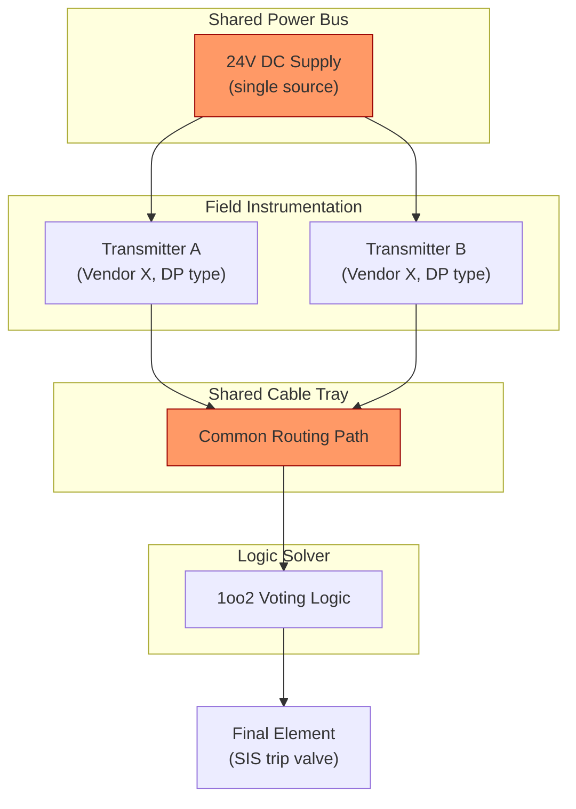

## Common Cause Failures and Independence of Protection Layers

### Definition and Scope

A common cause failure (CCF) is the simultaneous or near-simultaneous failure of two or more components, channels, or protection layers resulting from a single shared cause, where that cause is not itself a consequence of the failures. In Process Safety Management, CCFs are the primary threat to the risk-reduction credit claimed for redundant Safety Instrumented Systems (SIS) and for the independence assumed between layers of protection in a Layer of Protection Analysis (LOPA).

The core danger of CCF is that it violates the statistical independence assumption underlying reliability calculations for redundant architectures (e.g., 1oo2, 2oo3). Without accounting for CCF, redundancy appears to reduce failure probability multiplicatively; with CCF present, a shared root cause can defeat all redundant channels at once, collapsing the intended risk reduction.

### Common Cause vs. Common Mode vs. Independent Failures

**Key Points**

- **Independent (random) failure**: A component fails due to an internal, uncorrelated cause (e.g., random hardware fault, component aging) unrelated to failures in other components.
- **Common cause failure (CCF)**: Multiple components fail due to a single shared external or systemic cause (e.g., a single miscalibrated reference standard used to calibrate all transmitters).
- **Common mode failure**: A subset of CCF in which multiple components fail in the *same manner* — not merely simultaneously, but through the identical failure mechanism (e.g., all channels fail-low due to the same firmware defect).

All common mode failures are common cause failures, but not all common cause failures are common mode — two channels could fail via different mechanisms (one mechanically, one electrically) yet still share a single triggering cause, such as a flood that submerged both regardless of construction.

### Sources and Categories of Common Cause Failures

CCF sources are typically classified using frameworks that separate the *coupling factor* (what links the failures) from the *root cause* (why the failure occurred). IEC 61508 and IEC 61511 both require explicit CCF quantification for any claimed redundancy.

#### 1. Design-Related CCF

- Systematic design errors replicated across all channels (identical specification flaw baked into every redundant unit)
- Common software/firmware defects in identical logic solvers or smart transmitters
- Inadequate design margins that are exceeded simultaneously across all channels under the same process condition

#### 2. Manufacturing-Related CCF

- Defective production batch (all sensors from one lot share a manufacturing flaw)
- Identical component tolerances that fail together at the same stress threshold

#### 3. Environmental CCF

- Shared physical environment: fire, flood, vibration, extreme temperature affecting co-located channels
- Electromagnetic interference (EMI) or power transients affecting all channels on a shared power bus
- Corrosive atmosphere degrading all sensing elements of the same material

#### 4. Operational and Maintenance-Related CCF

- Shared calibration error (all transmitters zeroed against the same faulty reference)
- Human error during a single maintenance activity that touches all redundant channels (e.g., one technician closes all isolation valves during a "single" test)
- Common test procedure defect applied identically to every channel

#### 5. Utility/Support System CCF

- Shared power supply, air supply, or hydraulic supply feeding all redundant elements
- Common cabling routed through a single cable tray or junction box (single fire or mechanical damage event defeats all channels — a frequent audit finding)

#### 6. Systemic/Organizational CCF

- Weak safety culture producing simultaneous procedural violations
- Common training deficiency affecting all operators/technicians

### Independence of Protection Layers (IPL) — Core Principle

LOPA treats each Independent Protection Layer (IPL) as capable of independently preventing a specific consequence, and the overall risk reduction is calculated by multiplying together the Probability of Failure on Demand (PFD) of each IPL. This multiplication is only valid if the layers are truly independent of one another and of the initiating event.

For a layer to qualify as an IPL under ISA/IEC standards (ISA-84 / IEC 61511), it must satisfy three independence criteria:

1. **Independent of the initiating event** — The IPL's ability to function must not be degraded by whatever caused the initiating event.
2. **Independent of the other IPLs credited** — No single failure (device, sensor, human, utility) may disable more than one IPL simultaneously.
3. **Independent, specific, dependable, and auditable** — Beyond independence, the layer must reliably detect the condition and take action to prevent the consequence, and its performance must be auditable/verifiable.

$$PFD_{total} = PFD_1 \times PFD_2 \times \cdots \times PFD_n \quad \text{(valid only under true independence)}$$

If a common cause links two credited layers, this multiplicative formula understates the actual probability of failure, sometimes by orders of magnitude — the essential hazard of undetected CCF in LOPA studies.

### Common Independence Violations in PSM Practice

**Example**

A BPCS (Basic Process Control System) loop and a SIS both use the same pressure transmitter type, tapped into the same process nozzle, powered from the same 24V DC power supply, and terminated in the same marshalling cabinet. Although logically presented as two separate layers (control loop alarm + SIS trip), they share:

- The same process tap (plugging defeats both)
- The same power source (loss of power defeats both)
- The same cabinet (fire or flood defeats both)

This is a textbook independence violation: the BPCS cannot be credited as an IPL alongside the SIS if the initiating event category includes BPCS failure, and even where it can, the shared tap/power/cabinet represents CCF exposure requiring either physical separation or a derated PFD credit.

Other frequently cited violations:

- Using the BPCS as an IPL when the BPCS itself is the source of the initiating event (e.g., a control loop failure that also disables the alarm running on the same controller)
- Crediting two SIS-triggered trips from redundant logic solvers that share a single common I/O card
- Relying on the same operator to respond to both an alarm and a subsequent manual intervention within too short a time window (human as a shared "component")
- Sharing a single pressure relief path with a SIS-actuated block valve on the same line without independent isolation

### Beta Factor Model (β-Factor Method)

The simplest and most widely used quantitative CCF model in SIS reliability calculations (per IEC 61508-6) is the beta factor model. It assumes a fixed fraction β of a single channel's dangerous failure rate is attributable to common cause, striking simultaneously across all redundant channels.

For a system with a per-channel dangerous failure rate $\lambda_D$, the failure rate is split:

$$\lambda_{D} = (1-\beta)\lambda_D + \beta\lambda_D$$

where $(1-\beta)\lambda_D$ is the independent portion (only affects one channel) and $\beta\lambda_D$ is the common cause portion (affects all redundant channels simultaneously).

For a 1oo2 (one-out-of-two) voted architecture, the average PFD approximates:

$$PFD_{avg,1oo2} \approx \frac{(1-\beta)^2 (\lambda_{DU})^2 (TI)^2}{3} + \beta \lambda_{DU} \frac{TI}{2}$$

where $\lambda_{DU}$ is the dangerous undetected failure rate per channel and $TI$ is the proof test interval. The second term — the CCF contribution — often dominates the total PFD for well-designed redundant systems, because the independent-failure term shrinks quadratically with added redundancy while the CCF term does not. This is why adding more redundant channels yields diminishing safety returns once CCF is significant: a 2oo3 architecture is not proportionally safer than 1oo2 if β is not simultaneously reduced.

**β values are typically estimated in the range of 0.01–0.10 (1%–10%)** for well-engineered systems with diversity and separation, and can rise well above that for poorly separated, identical, co-located channels. [Inference — exact β assignment is scenario-specific and derived from checklist scoring methods below; treat the numeric range as an illustrative order-of-magnitude norm from IEC 61508-6 Annex D, not a universal constant.]

### CCF Checklist Scoring (IEC 61508-6 Annex D Method)

IEC 61508-6 provides a structured scoring checklist to derive a defensible β value rather than guessing. Scoring categories include:

| Category | What It Assesses |
| --- | --- |
| Separation/segregation | Physical distance, independent wiring/routing, separate cabinets |
| Diversity | Different technology, manufacturer, or design principle between channels |
| Complexity/design/application experience | Simplicity and field-proven maturity of the design |
| Assessment/analysis and feedback of data | Whether failure data is collected and fed back into design improvement |
| Procedures/human interface | Quality of documented procedures, operator training, and human-factor design |
| Competence, training, and safety culture | Personnel qualification and organizational safety maturity |
| Environmental control | Protection against temperature, humidity, EMI, vibration |
| Environmental testing | Whether equipment was tested for the environment it operates in |

Each category is scored against defined criteria; the aggregate score maps to a β value via a lookup table, with additional adjustment when diagnostic coverage (via automatic diagnostics) further reduces the effective undetected common cause fraction ($\beta_D$, applied to detected/diagnosed faults, is typically lower than β applied to undetected faults).

### Design Strategies to Reduce CCF and Preserve Independence

**Key Points**

- **Diversity**: Use different technologies, manufacturers, or measurement principles for redundant channels (e.g., pair a differential-pressure level transmitter with a radar level transmitter rather than two identical DP transmitters) so a single design flaw or manufacturing defect cannot defeat both.
- **Physical separation**: Route cabling through separate trays/conduits, use separate junction boxes, and physically distance sensors to prevent a single local event (fire, impact, flood) from disabling all channels.
- **Independent power and utility feeds**: Supply redundant channels from separate, ideally independently backed-up power sources and instrument air headers.
- **Staggered/independent testing**: Test redundant channels on different schedules and, where feasible, by different technicians, to avoid a single procedural error or miscalibrated test standard defeating all channels in one activity.
- **Independent maintenance procedures**: Use distinct calibration standards or reference instruments for each channel where practical.
- **Functional independence from the BPCS**: Ensure the SIS logic solver, I/O, sensors, and final elements are physically and logically separate from the BPCS used for normal control, per IEC 61511 requirements for SIS/BPCS separation.
- **Environmental hardening**: Rate all redundant channel components for the actual environmental extremes of the installation, not just nominal conditions.
- **Segregation of protection layers**: Ensure sensors, logic, and final elements for different credited IPLs (e.g., relief valve vs. SIS) do not share taps, tie-ins, or actuation energy sources.

### Human Factors as a Common Cause

Human error is one of the most underestimated CCF sources in PSM audits. A single technician performing an identical (flawed) calibration step across all redundant transmitters, or an operator responding to multiple alarms using the same (mistaken) mental model, effectively couples otherwise independent hardware channels through a shared human action. LOPA credit for "operator response to alarm" as an IPL is particularly vulnerable: if the same alarm system, same operator, and same time window are shared with another credited layer, independence is violated by the human interface, not the hardware.

### Relationship to SIL Verification

IEC 61511 requires that Safety Integrity Level (SIL) verification calculations explicitly include CCF contribution via β or an equivalent method — a SIL verification that only computes independent-failure PFD and omits the β term is non-compliant and non-conservative. Auditors and third-party SIL verification reviewers specifically check:

- Whether a β-factor (or equivalent CCF model) was applied to every voted architecture in the safety function
- Whether the β value used is justified by a documented checklist score (not an assumed default)
- Whether claimed IPLs in the LOPA are cross-checked against the SIS/BPCS architecture for shared components

### Illustrative Architecture: CCF Exposure in a 1oo2 SIS Loop

The diagram highlights two CCF-exposed nodes (shared power bus and shared cable tray) that defeat the intended 1oo2 redundancy despite using two physically distinct transmitters — a common finding in as-built SIS audits where design intent (redundancy) diverges from installed reality (shared single points of failure).

### Worked Example: Beta Factor Impact on PFD

**Example**

Given a 1oo2 pressure transmitter voting architecture with $\lambda_{DU} = 5 \times 10^{-6}$ per hour, proof test interval $TI = 8760$ hours (annual), compare independent-only vs. CCF-inclusive PFD:

Independent-only term (no CCF, β = 0, hypothetical):

$$PFD_{indep} \approx \frac{(\lambda_{DU} \cdot TI)^2}{3} = \frac{(5\times10^{-6} \times 8760)^2}{3} \approx 6.4\times10^{-4}$$

With β = 0.05 (5%, typical for moderate diversity/separation):

$$PFD_{CCF} \approx \beta \lambda_{DU}\frac{TI}{2} = 0.05 \times 5\times10^{-6} \times \frac{8760}{2} \approx 1.1\times10^{-3}$$

$$PFD_{avg,1oo2} \approx (1-\beta)^2 \times 6.4\times10^{-4} + 1.1\times10^{-3} \approx 5.8\times10^{-4} + 1.1\times10^{-3} \approx 1.7\times10^{-3}$$

The CCF term nearly triples the total PFD relative to the independent-failure term alone in this case — illustrating why CCF cannot be neglected in SIL verification and why simply adding redundancy without addressing β yields limited real-world benefit. [Inference — numeric outcome is illustrative for these input parameters; actual PFD depends on the specific λ_DU, TI, and β derived for the real installation.]

### Common Audit Findings Related to CCF/Independence

- Redundant transmitters sharing a single process impulse line or nozzle
- SIS and BPCS logic solvers sharing the same I/O card or power supply
- Relief valve and SIS trip sharing the same block valve or actuation air header
- Proof testing of all redundant channels performed by one technician in a single session using one (possibly miscalibrated) test set
- LOPA IPL credit given to "operator action" for two separate scenarios relying on the same single console operator within overlapping time windows
- No documented β-factor justification in SIL verification calculations, or a default β applied without a completed checklist

**Related Topics**

- Layer of Protection Analysis (LOPA) methodology and IPL qualification criteria
- SIL determination methods (risk graph, risk matrix, LOPA-based SIL selection)
- Proof testing strategies and staggered testing to reduce CCF exposure
- SIS architecture selection (1oo1, 1oo2, 2oo2, 2oo3, MooN voting)
- BPCS/SIS separation requirements under IEC 61511
- Diagnostic coverage and its effect on β_D vs. β
- Human factors engineering in alarm management and operator response IPLs
- Failure Modes, Effects, and Diagnostic Analysis (FMEDA) for SIS component selection