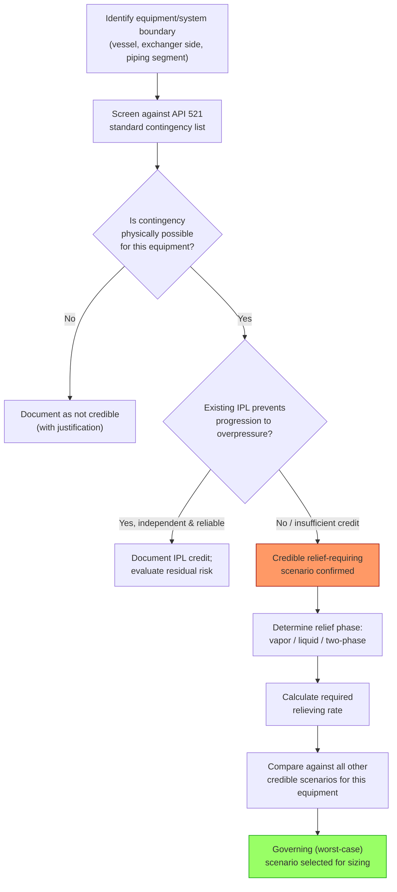

## Overpressure Scenario Identification

### Definition and Purpose

Overpressure scenario identification is the systematic process of determining all credible causes by which a vessel, system, or piece of equipment could exceed its Maximum Allowable Working Pressure (MAWP), forming the foundational step of pressure relief system design under API 520/521 and ASME Boiler and Pressure Vessel Code Section VIII. Every relief device design basis traces back to a specific identified overpressure scenario; without exhaustive and rigorous scenario identification, the relief system cannot be sized correctly, regardless of how accurate the downstream sizing calculations are.

The output of this process is a documented list of credible contingencies, each characterized by its root cause, required relieving rate, and the relief device or devices intended to protect against it. API 521 (Pressure-relieving and Depressuring Systems) provides the standard taxonomy of overpressure causes referenced industry-wide.

### Regulatory and Standards Framework

- **API 520 Part I & II** — Sizing, selection, and installation of pressure-relieving devices
- **API 521** — Guide for pressure-relieving and depressuring systems; the primary source for the standard list of overpressure contingencies
- **ASME BPVC Section VIII, Division 1/2** — Vessel design code establishing MAWP and requiring overpressure protection
- **OSHA PSM (29 CFR 1910.119)** — Requires that Process Hazard Analysis (PHA) identify overpressure scenarios as part of hazard evaluation for covered processes
- **IEC 61511 / ISA-84** — Where SIS is credited as protection against an overpressure scenario, requires the scenario be part of the documented LOPA/SIF basis

### Standard API 521 Contingency Categories

API 521 organizes credible overpressure causes into standard categories. Each vessel or system in a process unit must be evaluated against every applicable category — omitting a category without documented justification is a common audit and PHA finding.

#### 1. Blocked Outlet / Closed Outlet

Flow into a vessel or system continues while the outlet is blocked (valve closure, plugging, actuator failure), causing pressure to rise until the source's shutoff pressure (for a pump) or upstream pressure (for a compressor or connected system) is reached.

#### 2. External Fire

Fire exposure to a vessel containing liquid causes vapor generation via heat input through the wetted wall area; for a vessel with only vapor/gas, fire causes gas expansion and wall weakening. API 521 provides specific heat input equations depending on whether adequate drainage and firefighting are present.

$$Q = 21000 \, F \, A^{0.82} \quad \text{(adequate drainage/firefighting, BTU/hr, wetted area in ft}^2\text{)}$$

$$Q = 34500 \, F \, A^{0.82} \quad \text{(inadequate drainage/firefighting)}$$

where $F$ is an environmental/insulation factor and $A$ is the wetted surface area exposed to fire.

#### 3. Cooling Water Failure

Loss of cooling water to condensers, coolers, or reactor jackets removes the heat sink, causing vapor accumulation in condensing systems or runaway temperature rise in exothermic reactors.

#### 4. Electrical Power Failure

Loss of power can stop cooling, agitation, or control functions simultaneously across multiple systems — frequently the *worst-case single-event* scenario because it can defeat multiple independent-seeming protections at once (see Common Cause Failures).

#### 5. Instrument Air Failure

Loss of instrument air drives pneumatically actuated control valves to their fail-safe position; if the fail-safe position for a given valve is fail-open on a feed line (rather than fail-closed), this becomes an overpressure initiating event rather than a protective response.

#### 6. Chemical Reaction (Runaway Reaction)

Uncontrolled exothermic reaction generates heat and/or gas faster than the relief system or cooling capacity can remove it; requires reaction calorimetry data (e.g., from Accelerating Rate Calorimetry/ARC or Vent Sizing Package/VSP testing) to establish worst-case rates for two-phase or vapor relief sizing.

#### 7. Abnormal Heat/Vapor Input

Includes loss of a downstream process pull-through condition, tube rupture allowing high-pressure fluid into a lower-pressure system, or a control valve failing wide open and admitting excess heating medium.

#### 8. Overfilling

Continued liquid inflow with no outflow or level control failure, leading to liquid overfill and possible hydraulic overpressure of the vessel once it is liquid-full (liquid is far less compressible than vapor, so overfill scenarios can generate very rapid, very high overpressure).

#### 9. Failure of Automatic Controls

Malfunction of a level, pressure, flow, or temperature controller that normally maintains safe operating conditions, particularly where the controller output directly manipulates a variable affecting system pressure.

#### 10. Utility Failure (Steam, Nitrogen, Instrument Air Combined Loss)

Simultaneous or cascading utility failures (e.g., a total plant power outage triggering loss of cooling water pumps, instrument air compressors, and agitation simultaneously) — must be evaluated as a single overarching contingency, not as independent unrelated events, because they typically share root causes.

#### 11. Tube Rupture

Failure of a heat exchanger tube allowing high-pressure fluid to enter the low-pressure side, which may not have been designed for the higher pressure; API 521 provides specific guidance for sizing relief for this scenario based on the pressure differential and tube bore.

#### 12. Thermal Expansion (Liquid Expansion / Blocked-In Liquid)

Liquid trapped between two block valves (or between a block valve and a check valve) expands when heated (solar radiation, ambient heat gain, or adjacent hot piping), generating very high hydraulic pressure rise per degree of temperature increase since liquids are nearly incompressible — this scenario is frequently under-recognized and is a common source of thermal relief valve (TRV) omissions in as-built audits.

#### 13. Control Valve Failure

Failure of a control valve to its fail-safe position (fail-open admitting more flow, or fail-closed blocking outflow) depending on valve action and instrument air/power status.

#### 14. External Explosion / Vapor Cloud Explosion Impingement

Overpressure or fire exposure from an external explosion event affecting nearby equipment (typically addressed via siting/spacing rather than relief valve sizing directly).

### Systematic Scenario Identification Methodology

**Key Points**

- **Equipment-by-equipment review**: Every pressure vessel, exchanger shell/tube side, and closed piping system between isolation points must be independently evaluated against the full API 521 contingency list.
- **Cross-reference to PHA/HAZOP**: Overpressure scenarios identified in a HAZOP (using guidewords such as "More Pressure," "No Flow," "Reverse Flow") must be reconciled with the relief system design basis — a scenario surfaced in HAZOP but absent from the relief valve datasheet basis is a design-basis gap.
- **Worst-case single contingency principle**: Per API 521, relief devices are typically sized for the single worst-case credible contingency, not for the simultaneous occurrence of multiple unrelated contingencies, *unless* those contingencies share a common cause (e.g., total power failure causing simultaneous loss of cooling and loss of control).
- **Consider connected/downstream systems**: A vessel's overpressure exposure can originate from an adjacent system through open valves, common headers, or relief manifold interconnections — requiring "interconnected systems" review, not just isolated equipment review.
- **Two-phase and vapor/liquid disengagement**: For scenarios involving boiling or flashing liquids (fire case, runaway reaction), determine whether the relief case is vapor-only, liquid-only, or two-phase, since this fundamentally changes the required relief device sizing methodology (see DIERS methodology for two-phase flow).

### Determining Credibility of a Scenario

Not every theoretically conceivable overpressure path is a *credible* scenario requiring relief valve sizing. API 521 and typical company engineering practice apply screening criteria:

- Does an independent protection layer with adequate reliability already prevent the scenario from progressing to overpressure (and can it be credited per LOPA independence rules)?
- Is the scenario physically possible given the plant's actual configuration (e.g., a "loss of cooling water" scenario is not credible if the vessel has no cooling water service)?
- Does a single initiating event plausibly cascade into multiple simultaneous failures (e.g., total power failure), and if so, has the *combined* worst case been used rather than treating each downstream failure independently?

Where a Safety Instrumented Function (SIF) is credited as the sole protection against a scenario (rather than a mechanical relief device), the scenario must still be documented in the relief system design basis as a "non-relieving" or "protected by SIS" case, and the SIF's SIL must be independently verified — mechanical relief devices remain the traditionally preferred protection where relief to a safe disposal system is feasible, per the general hierarchy that relief devices are typically viewed as a final independent layer.

### Overpressure Scenario Identification Process Flow

### Worked Example: Scenario Screening for a Distillation Column Reboiler

**Example**

A distillation column with a steam-heated reboiler is evaluated for overpressure contingencies:

| Contingency | Credible for This Equipment? | Basis |
| --- | --- | --- |
| Blocked outlet (column overhead) | Yes | Overhead line block valve could be inadvertently closed |
| External fire | Yes | Column is in a process unit with fire exposure potential per API 521 wetted-area rules |
| Cooling water failure | Yes | Overhead condenser relies on cooling water; failure stops vapor condensation, causing column pressure rise |
| Loss of instrument air | Yes | Reflux control valve fails to a position increasing vapor load |
| Tube rupture | Yes | Steam-side pressure exceeds column-side design pressure; rupture admits high-pressure steam |
| Chemical reaction | No | No exothermic reaction occurs in this separation service |
| Thermal expansion (blocked-in liquid) | Yes | Bottoms line segment between two block valves exposed to solar heating |

Each "Yes" scenario is independently sized for required relieving rate; the **governing case** is the single contingency yielding the highest required relief load, and the installed relief device(s) must accommodate that governing case while the non-governing scenarios are documented to confirm the same device also covers them (or requires separate protection if it does not).

### Common Pitfalls in Overpressure Scenario Identification

- Treating multiple independent utility failures as unrelated single contingencies when they share a common triggering event (total power loss), understating the true worst case (see Common Cause Failures and Independence of Protection Layers)
- Omitting thermal expansion (blocked-in liquid) scenarios on piping segments between block valves, especially on cold service lines exposed to solar gain
- Failing to re-evaluate the relief basis after a process modification (Management of Change) that alters connected equipment, setpoints, or control valve fail-safe positions
- Assuming a scenario is "not credible" solely because a BPCS control loop normally prevents it, without evaluating BPCS failure modes and their overlap with the scenario's own initiating cause
- Not considering reverse flow scenarios through check valves that may stick or fail, allowing high-pressure fluid to backflow into lower-pressure equipment
- Under-sizing for two-phase relief in reactive or flashing services by defaulting to vapor-only sizing methodology

**Related Topics**

- Relief Device Sizing Methodology (vapor, liquid, two-phase/DIERS)
- Relief Header and Flare System Design
- Fire Case Heat Input Calculations per API 521
- Runaway Reaction Characterization (ARC/VSP Testing)
- Management of Change (MOC) Impact on Relief System Basis
- Layer of Protection Analysis (LOPA) for Overpressure Scenarios
- Relief Valve Selection (Conventional, Balanced Bellows, Pilot-Operated)
- Rupture Disk Applications and Combination Systems