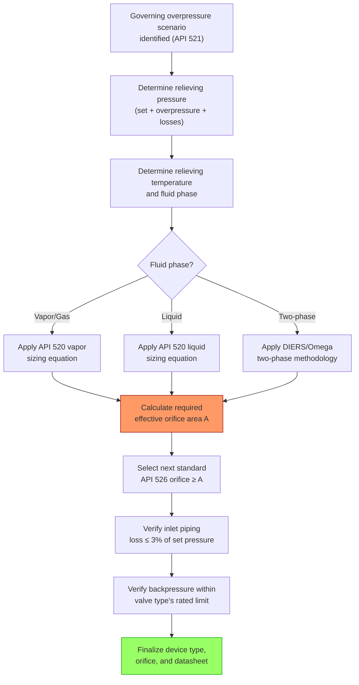

## Relief Device Sizing per API 520 and 521

### Purpose and Scope

Relief device sizing is the quantitative engineering process of determining the minimum required relieving capacity (mass or volumetric flow rate) and the corresponding minimum orifice area of a pressure relief valve (PRV) or rupture disk, once a governing overpressure scenario has been identified. API 520 Part I provides the sizing formulas and device selection criteria; API 521 supplies the required relieving rate methodology for each contingency type. The two standards function together: API 521 answers "how much must be relieved and under what conditions," while API 520 answers "what orifice size and device type accomplishes that."

Correct sizing requires establishing, for the governing scenario: the relieving pressure, relieving temperature, fluid phase (vapor, liquid, or two-phase), required mass/volumetric flow rate, and the physical properties of the relieving fluid at relieving conditions.

### Key Terminology and Pressure Definitions

**Key Points**

- **MAWP (Maximum Allowable Working Pressure)**: The maximum gauge pressure permissible at the top of a vessel in its normal operating position, at the designated coincident temperature.
- **Set Pressure**: The inlet gauge pressure at which the relief valve is set to begin opening under service conditions.
- **Overpressure**: The pressure increase over the set pressure, expressed as a percentage of set pressure, during relief. Standard allowable overpressure is 10% for a single relief device on non-fire contingencies, and 16% (or up to 21% per some code editions) for fire-only contingencies, and 21% where multiple devices are installed and only one is the primary device.
- **Relieving Pressure**: Set pressure plus allowable overpressure plus any inlet piping losses; the pressure condition used in the sizing calculation.
- **Accumulation**: The pressure increase over MAWP permitted during relief, distinguished from overpressure (which is referenced to set pressure) — for a single valve set at MAWP, accumulation and overpressure percentages coincide.
- **Backpressure**: The pressure existing at the outlet of a relief device while it is relieving, arising from the relief header/flare system; classified as built-up (from flow resistance) or superimposed (static pressure already in the header from other sources).

### Required Relieving Rate — Scenario-Specific Methods (API 521)

Each overpressure contingency (see Overpressure Scenario Identification) has a defined method for computing the required relieving rate:

#### Blocked Outlet

Relieving rate equals the maximum rate the upstream source (pump curve at shutoff-adjacent conditions, compressor characteristic curve, or upstream regulator) can deliver into the blocked system.

#### External Fire (Vapor-Generation Case)

$$W = \frac{Q}{h_{fg}}$$

where $Q$ is the fire heat input (per the wetted-area equations in Overpressure Scenario Identification) and $h_{fg}$ is the latent heat of vaporization of the contained liquid at relieving conditions. For unwetted vessels containing only gas, a separate gas-heating relief case per API 521 Section 4 applies instead, addressing wall temperature rise and potential metal strength loss.

#### Cooling Water Failure / Loss of Condensing Duty

Relieving rate equals the vapor generation rate corresponding to the maximum heat input to the system (e.g., full reboiler duty) once the condensing heat sink is lost, evaluated at relieving pressure and temperature.

#### Chemical Reaction (Runaway Reaction)

Relieving rate is derived from experimental reaction calorimetry (ARC, VSP2, or similar), scaled to the worst-case credible reaction rate at relieving temperature and pressure, and evaluated for whether the discharge is vapor, liquid, or two-phase using the DIERS (Design Institute for Emergency Relief Systems) methodology.

#### Thermal Expansion (Blocked-In Liquid)

$$Q_{TRV} = \frac{\alpha \, Q_{heat}}{\rho \, c_p \, \beta}$$

A simplified, commonly used approximation for a thermal relief valve (TRV) on a liquid-full line segment, where $\alpha$ is a unit-conversion/absorption factor, $Q_{heat}$ is the incident heat input rate (solar or process), $\rho$ is liquid density, $c_p$ is specific heat, and $\beta$ is the liquid's coefficient of thermal expansion. In practice, many thermal relief applications on blocked-in liquid lines use small, standardized TRVs (e.g., 3/4 in. x 1 in.) sized primarily by rule-of-thumb capacity rather than a full heat-balance calculation, since required rates are typically very small (a few gpm) relative to other governing cases. [Inference — the applicability of standardized small-TRV sizing versus a full calculated heat balance is company/engineering-practice dependent and should be confirmed against the specific relieving system's design basis.]

#### Control Valve Failure / Instrument Air Failure

Relieving rate equals the maximum flow the failed-open control valve (or the upstream source it exposes) can pass into the protected system at relieving pressure, often computed via standard control valve flow coefficient ($C_v$) equations.

#### Tube Rupture

Relieving rate is based on flow through the ruptured tube's cross-sectional area (or a defined fraction, per API 521 guidance, often based on double the single tube bore area to represent a full guillotine-type break exposing both ends) at the high-side/low-side pressure differential.

### API 520 Sizing Equations by Fluid Phase

#### Vapor/Gas Relief — Critical (Sonic) Flow

For a relief valve operating at or below critical backpressure ratio (typically true when backpressure is less than ~50-55% of relieving pressure for many gases), API 520 Part I provides the standard critical-flow orifice sizing equation:

$$A = \frac{W}{C \, K_d \, P_1 \, K_b \, K_c} \sqrt{\frac{T \, Z}{M}}$$

where:

- $A$ = required effective discharge area (in²)
- $W$ = required flow rate (lb/hr)
- $C$ = gas constant based on the ratio of specific heats ($k = C_p/C_v$)
- $K_d$ = effective coefficient of discharge (typically 0.975 for a valve with a National Board certified $K_d$, per API 520)
- $P_1$ = relieving pressure (psia, = set pressure + overpressure + atmospheric, adjusted for inlet losses)
- $K_b$ = capacity correction factor for backpressure (balanced bellows valves only; = 1.0 for conventional valves in critical flow or for backpressures below the critical value)
- $K_c$ = combination correction factor for rupture disk installed upstream of the PRV (= 1.0 if no rupture disk, 0.9 if a rupture disk is installed in combination, per code default absent specific certified test data)
- $T$ = relieving temperature (°R)
- $Z$ = compressibility factor at relieving conditions
- $M$ = molecular weight of the relieving fluid

#### Liquid Relief (Non-Flashing)

$$A = \frac{Q}{38 \, K_d \, K_w \, K_c \, K_v} \sqrt{\frac{G}{P_1 - P_2}}$$

where:

- $Q$ = required flow rate (US gpm)
- $K_d$ = discharge coefficient for liquid service (typically 0.65 for conventional/balanced valves per API 520 default)
- $K_w$ = correction factor for backpressure on balanced bellows valves in liquid service
- $K_v$ = viscosity correction factor (applied when relieving fluid viscosity is significant; requires iterative calculation since it depends on the calculated orifice Reynolds number)
- $G$ = specific gravity of the liquid at relieving temperature (relative to water)
- $P_1 - P_2$ = differential between relieving pressure and total backpressure

#### Two-Phase and Flashing Flow

Two-phase relief sizing (common in runaway reaction and flashing liquid scenarios) departs from the single-phase API 520 equations and typically uses the DIERS methodology (Homogeneous Equilibrium Model, HEM) or the simplified Omega method, treating the vapor-liquid mixture's combined mass flux at the throat. This is a substantially more complex sizing basis requiring specialized calculation tools or software, and is addressed in dedicated two-phase relief sizing treatments rather than the single-phase API 520 formulas above.

### Standard Orifice Designations (API 526)

API 526 standardizes PRV orifice letter designations (D through T) with fixed effective discharge areas, allowing selection of the next-larger standard orifice once the required area $A$ is calculated:

| Orifice | Area (in²) | Orifice | Area (in²) |
| --- | --- | --- | --- |
| D | 0.110 | L | 2.853 |
| E | 0.196 | M | 3.60 |
| F | 0.307 | N | 4.34 |
| G | 0.503 | P | 6.38 |
| H | 0.785 | Q | 11.05 |
| J | 1.287 | R | 16.0 |
| K | 1.838 | T | 26.0 |

The next standard orifice size at or above the calculated required area is selected; undersizing to a smaller standard orifice than calculated is non-compliant.

### Relief Device Selection Considerations

**Key Points**

- **Conventional spring-loaded PRV**: Simple, reliable, but set pressure and capacity are affected by variable backpressure; suitable where backpressure is low and constant (typically superimposed backpressure below ~10% of set pressure without correction).
- **Balanced bellows PRV**: Bellows isolates the valve's spring/bonnet from backpressure effects, permitting reliable operation with variable or high backpressure (up to typically 30-50% of set pressure, using the $K_b$ correction factor); also protects the spring from corrosive relieving fluid.
- **Pilot-operated PRV**: Uses process pressure via a pilot to hold the main valve closed; offers tight shutoff near set pressure, high capacity for a given size, and is well suited to high operating-pressure-to-set-pressure ratios and high or variable backpressure applications.
- **Rupture disk**: Non-reclosing device, used alone (for rapid-response, fouling-prone, or highly corrosive services) or in combination upstream of a PRV (to isolate the valve from corrosive/fouling process fluid, requiring the $K_c$ combination correction factor and, per API 520, a means of monitoring the interspace between disk and valve for disk integrity).
- **Combination disk + PRV**: Common where the process fluid would foul or corrode a PRV's seat; requires burst tolerance coordination so the disk bursts reliably before or at the PRV's set pressure.

### Inlet and Outlet Piping Considerations

- **Inlet piping pressure drop**: API 520 limits the non-recoverable pressure loss in the inlet piping between the protected equipment and the PRV to 3% of set pressure, to prevent valve chatter and capacity loss; requires an inlet line sizing check independent of the orifice sizing itself.
- **Outlet/discharge piping backpressure**: Built-up backpressure from the discharge piping and header (from relief flow resistance) plus any superimposed backpressure (existing header pressure from other simultaneously relieving devices) must be evaluated against the valve type's backpressure limitations; exceeding the limit for a conventional valve can cause the valve to fail to open fully or to re-close prematurely (chatter).

### Overall Sizing Process Flow

### Worked Example: Vapor Relief Sizing (Fire Case)

**Example**

A vessel requires relief for the external fire scenario with the following relieving-condition data:

- Required flow $W = 45{,}000$ lb/hr
- Relieving pressure $P_1 = 250$ psia (set 200 psig + 10% overpressure + atmospheric, adjusted)
- Relieving temperature $T = 660$ °R
- Compressibility $Z = 0.95$
- Molecular weight $M = 44$ (propane-like fluid)
- Gas constant $C = 356$ (for $k \approx 1.15$)
- $K_d = 0.975$, $K_b = 1.0$ (conventional valve, backpressure below critical), $K_c = 1.0$ (no rupture disk)

$$A = \frac{45{,}000}{356 \times 0.975 \times 250 \times 1.0 \times 1.0}\sqrt{\frac{660 \times 0.95}{44}} = \frac{45{,}000}{86{,}775}\sqrt{14.25} \approx 0.519 \times 3.775 \approx 1.96 \text{ in}^2$$

The calculated area of approximately $1.96 \text{ in}^2$ requires the next standard API 526 orifice at or above this value, which is orifice **K** (1.838 in²) if slightly under, or **L** (2.853 in²) if the calculated value exceeds K — in this case, since 1.96 > 1.838, orifice **L** (2.853 in²) would be selected. [Inference — this worked calculation uses representative property values for illustration; production sizing requires verified fluid property data (Z, M, k) at actual relieving conditions from process simulation or physical property references.]

### Common Sizing Pitfalls

- Using operating conditions instead of relieving conditions (set pressure + overpressure) for density/property lookups
- Neglecting inlet piping pressure losses, leading to valve chatter in service despite a "correctly sized" orifice on paper
- Applying single-phase vapor or liquid equations to a scenario that is actually two-phase or flashing (e.g., a subcooled liquid that flashes across the valve due to pressure drop)
- Failing to re-verify backpressure correction factors after downstream flare header modifications or when multiple devices relieve simultaneously
- Rounding the required area down to a smaller standard orifice rather than up
- Omitting the rupture disk combination correction factor $K_c$ when a disk is installed upstream of the PRV without specific certified $K_dd$ test data

**Related Topics**

- Two-Phase and DIERS Methodology for Reactive/Flashing Relief
- Relief Header and Flare System Hydraulic Design
- Rupture Disk Selection and Combination Systems
- Inlet/Outlet Piping Design Criteria for Relief Devices
- API 526 Standard Flanged Steel Pressure-Relief Valves
- Backpressure Correction Factors and Valve Chatter Prevention
- Relief Valve Testing, Inspection, and In-Service Reliability