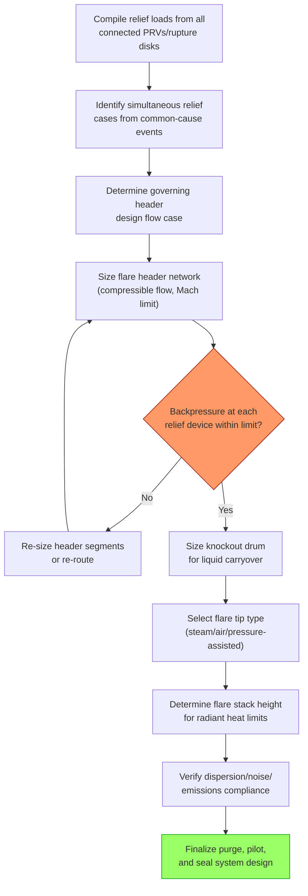

## Flare and Vent System Design

### Purpose and Scope

Flare and vent system design encompasses the collection, transport, and safe disposal of relief device discharges from pressure relief valves (PRVs), rupture disks, blowdown/depressuring systems, and process vents. The system must safely gather potentially large, simultaneous, and intermittent flows from across a process unit or entire plant and dispose of them without creating secondary hazards — overpressure of the relief header itself, excessive noise, radiant heat exposure to personnel and equipment, toxic ground-level concentrations, or unacceptable emissions. API 521 (Pressure-relieving and Depressuring Systems) is the primary design guidance standard; API 537 covers flare system details specifically.

A flare/vent system is fundamentally a network hydraulics and combustion (or dispersion) engineering problem layered on top of the relief scenario identification and device sizing work performed upstream (see Overpressure Scenario Identification and Relief Device Sizing per API 520 and 521).

### Flare vs. Vent: Core Distinction

**Key Points**

- **Flare system**: Collects combustible relief and vent streams and routes them to an elevated or ground-level flare for controlled combustion, converting hydrocarbons and other combustibles into primarily CO₂ and water vapor before atmospheric release.
- **Vent system (cold vent)**: Releases relief/vent streams directly to atmosphere without combustion, used only for non-combustible, non-toxic, or otherwise acceptable-to-disperse streams (e.g., steam, nitrogen, certain inert purges) where flaring would provide no environmental or safety benefit.
- **Selection driver**: The choice between flaring and cold venting is governed by the composition of the relieving stream (combustibility, toxicity), regulatory emissions requirements, and the practicality of achieving safe dispersion at ground level without ignition.

### Flare System Components

#### Relief/Flare Header Network

The piping network collecting discharge from individual relief devices across the unit and routing it to a common header, sized to handle the governing (often multiple-simultaneous) relief case without exceeding backpressure limits on any connected relief device (see Relief Device Sizing per API 520 and 521 for backpressure limitations by valve type).

#### Knockout (KO) Drum

A vessel installed upstream of the flare tip to separate entrained liquids from the vapor stream before combustion, preventing "flaming rain" (burning liquid droplets falling from the flare tip) and protecting the flare tip from liquid carryover damage. Sized based on the terminal settling velocity of the largest droplet size to be removed (commonly a 300–600 micron design basis) using Souders-Brown-type vapor-liquid separation sizing.

#### Flare Stack/Tip

The elevated structure and burner tip where combustion occurs. Height is set primarily by radiant heat exposure limits at grade (see Radiant Heat and Dispersion Design below); tip design (steam-assisted, air-assisted, pressure-assisted, or unassisted) is selected to achieve smokeless combustion across the expected flow range.

#### Liquid Seal / Molecular Seal

A liquid seal drum or a molecular seal (a baffled internal device using the density difference between purge gas and air) prevents flashback of flame into the header and prevents air ingress into the flare system during low-flow or no-flow conditions, which could otherwise create a flammable mixture inside the header.

#### Purge Gas System

Continuous low-flow purge (fuel gas, nitrogen, or a mixture) maintains a minimum positive velocity through the header and tip to prevent air ingress; purge rate is a balance between adequate flashback/ingress protection and minimizing ongoing purge gas consumption and emissions.

#### Pilot and Ignition System

Continuously burning pilots (or automatically re-ignited pilots with flame detection) ensure reliable ignition of the relieving stream at the tip; loss of pilot flame is itself a monitored and alarmed condition in most modern flare systems.

#### Steam or Air Assist System

Injects steam (or forced air) at the flare tip to entrain additional air into the flame, improving mixing and achieving smokeless combustion at higher relief rates; over-steaming can quench the flame and cause incomplete combustion, so steam rate is typically ratio-controlled to flow.

### Flare Header Hydraulic Design

The header network must be sized so that the calculated backpressure at every connected relief device, under the governing simultaneous-relief scenario, does not exceed that device's allowable backpressure limit (per its valve type — see Relief Device Sizing per API 520 and 521).

$$\Delta P = f \frac{L}{D} \frac{\rho v^2}{2}$$

Header pressure drop calculations use compressible gas flow equations (rather than simple incompressible Darcy-Weisbach) because flare header velocities can approach or exceed sonic conditions during large relief events; API 521 and industry practice typically limit header design velocity as a fraction of sonic (Mach) velocity — commonly targeting a Mach number in the range of 0.5 or below for normal operating cases, with higher transient Mach numbers sometimes accepted for the single worst-case governing relief event. [Inference — exact Mach number design limits vary by company engineering standard and specific header segment; treat as an illustrative industry-practice range rather than a fixed code requirement.]

#### Determining the Governing Flow Case

Unlike individual relief device sizing (based on a single worst-case scenario per device), the flare header must be sized for the worst-case **combination** of simultaneous relief events plausible from a single common-cause initiating event (e.g., total power failure triggering multiple devices across the unit to relieve at once) — requiring a plant-wide or unit-wide simultaneity study, not just device-by-device sizing.

### Radiant Heat and Dispersion Design

Flare stack height and location must ensure that radiant heat flux at any location where personnel could be present (grade, platforms, adjacent equipment) remains within acceptable exposure limits, particularly during the maximum credible flaring event.

**Key Points**

- **Allowable radiant heat flux** per API 521 is commonly tiered by exposure duration and location type, e.g., approximately 1500 BTU/hr·ft² for areas with unlimited personnel exposure/escape time is not required, versus lower limits (around 500 BTU/hr·ft²) for areas where personnel may need extended exposure, with higher transient limits permitted for short-duration emergency scenarios where personnel have escape routes. [Unverified — specific numeric flux limits and their exact conditions vary across API 521 editions and company-specific standards; the governing edition's tables should be consulted directly for a specific design.]
- **Radiant heat calculation** typically uses a point-source or multi-point-source model for the flame, incorporating flame emissivity, fraction of heat radiated (commonly assumed in the range of 0.2–0.3 for hydrocarbon flares depending on tip design and assist type), and the inverse-square relationship with distance from the flame center.
- **Flare stack height** is iteratively determined to satisfy the radiant heat limit at the nearest point of concern (grade, control room, nearby occupied structures) for the maximum design flaring rate.
- **Dispersion modeling** for toxic or otherwise hazardous non-combusted releases (including incomplete combustion products or emergency cold-venting scenarios) uses atmospheric dispersion models to confirm ground-level concentrations remain below acceptable exposure limits at the plant boundary or nearest occupied location.

### Noise Considerations

Flare combustion, particularly at high flow with steam or air assist, generates substantial noise; flare tip design (multi-point or staged tips, noise-suppressing tip geometries) and stack height/location are also evaluated against applicable community and occupational noise limits, especially for flares located near populated areas or subject to routine (non-emergency) flaring.

### Flare System Design Process Flow

### Ground Flares and Enclosed Flares

Where elevated flares are impractical (space constraints, visibility/aesthetic requirements, or the need for smokeless combustion at all rates without a visible flame) enclosed ground flares are used: multiple burners arranged within a refractory-lined enclosure that shields the flame from view and wind while promoting more complete, smokeless combustion across a wide turndown range. These systems typically have a lower maximum capacity than elevated flares and are more commonly applied to continuous or routine vent streams and vapor recovery unit backup service rather than the largest emergency relief cases, which usually still require an elevated flare or a combination system.

### Vapor Recovery and Flare Minimization

Many modern facilities integrate a Vapor Recovery Unit (VRU) upstream of the flare header to capture and compress low-pressure, continuous vent and blowdown gas for reuse (fuel gas system or process recycle) rather than routing it to the flare, reducing both routine flaring emissions and flare gas consumption; the flare then serves primarily as the emergency/upset backup disposal path when VRU capacity is exceeded or unavailable.

### Common Design and Operational Pitfalls

- Sizing the flare header for individual device-by-device worst cases rather than the plant-wide common-cause simultaneous relief scenario, understating required header capacity
- Insufficient purge rate leading to air ingress and a flammable mixture inside the header/flare system during low-flow periods
- Over-steaming or under-steaming the flare tip, causing incomplete combustion (visible smoke or poor destruction efficiency) rather than the intended near-complete combustion
- Undersized knockout drum leading to liquid carryover ("flaming rain") during large liquid-containing relief events
- Failing to re-evaluate flare header hydraulics and radiant heat exposure after new relief devices are tied into an existing header (a common Management of Change gap)
- Inadequate liquid seal or molecular seal maintenance allowing flashback risk during low or reverse-flow transients

**Related Topics**

- Relief Device Sizing per API 520 and 521
- Blowdown and Depressuring System Design
- Vapor Recovery Unit (VRU) Integration
- Atmospheric Dispersion Modeling for Toxic Releases
- Flare Gas Recovery and Emissions Minimization
- Knockout Drum and Liquid Separation Sizing
- Management of Change (MOC) Impact on Relief System Basis