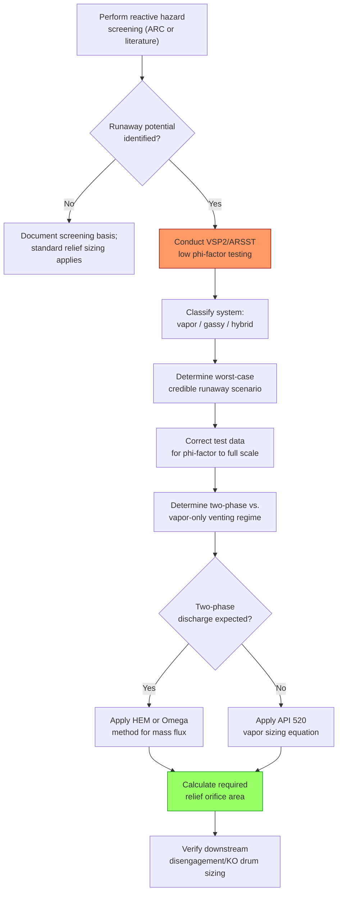

## Two-Phase and Runaway Reaction Relief Sizing

### Purpose and Scope

Two-phase and runaway reaction relief sizing addresses the emergency relief system (ERS) design for scenarios where the relieving fluid is not a simple single-phase vapor or liquid, but a two-phase (vapor-liquid) mixture — most critically arising from runaway exothermic chemical reactions, but also from any flashing liquid relief case. Sizing for these scenarios departs fundamentally from the standard API 520 single-phase equations (see Relief Device Sizing per API 520 and 521) because the two-phase mass flux through the relief valve orifice can differ dramatically — often being substantially lower per unit area than vapor-only flow — meaning a device sized using vapor-only assumptions can be critically undersized if the actual discharge is two-phase.

The dominant industry methodology for this class of problem originates from the DIERS (Design Institute for Emergency Relief Systems) research program, sponsored by AIChE, and is codified in API 520 Part I (2020+ editions incorporate DIERS-based guidance) and detailed further in the DIERS Project Manual and API RP 520/521 technical guidance.

### Why Runaway Reactions Require Special Treatment

**Key Points**

- **Rate of energy release is not constant**: Unlike a fire case (a defined external heat input) or blocked outlet (a defined flow rate), a runaway exothermic reaction's heat generation rate typically accelerates with temperature (often following Arrhenius-type kinetics), meaning the worst-case relieving rate occurs late in the runaway, not at its onset.
- **Two-phase venting can occur even for "vapor" systems**: As a reacting liquid boils/vents under pressure relief, entrained liquid (froth or foam) can be carried out with the vapor, especially in viscous, foamy, or highly agitated/boiling systems — meaning the relief device may see a two-phase discharge even when the reaction mixture is nominally a boiling liquid rather than a gas-generating reaction.
- **Vapor-only sizing under-predicts required area**: Because two-phase mass flux through an orifice is generally lower than the equivalent vapor-only mass flux at the same pressure, a valve sized assuming pure vapor discharge when the actual flow is two-phase will pass less mass than required, resulting in continued system pressure rise beyond the relief device's intended control.
- **Runaway reactions may be gassy, vapor (tempered), or hybrid systems**: Classification of the reacting system's venting behavior (see below) determines which sizing methodology and which experimental data are needed.

### Reacting System Classification

Systems are classified by DIERS methodology based on their venting behavior during a runaway:

#### Vapor (Tempered) Systems

The reaction mixture's vapor pressure rises with temperature such that venting removes latent heat, and the resulting evaporative cooling "tempers" (self-limits) the temperature and reaction rate rise — the boiling point at relieving pressure effectively caps further temperature rise as long as adequate venting occurs.

#### Gassy Systems

The runaway reaction itself generates permanent (non-condensable) gas as a reaction product, independent of the system's vapor pressure/temperature relationship; venting removes gas but does not remove significant latent heat, so temperature is not self-tempered by venting alone and continues to rise with the reaction's progress.

#### Hybrid Systems

Both vapor-pressure-driven tempering and permanent gas generation occur simultaneously, requiring a combined sizing approach accounting for both effects.

### Required Experimental Data

Two-phase/runaway relief sizing cannot be reliably performed from first-principles kinetics alone in most practical cases; it requires experimental characterization of the actual reacting system under conditions representative of a real overpressure event (adiabatic, low thermal inertia, low heat loss):

- **Accelerating Rate Calorimetry (ARC)**: Measures self-heat rate and pressure rise versus temperature in a small, low-thermal-inertia sample cell, useful for initial screening of reactive hazard potential and onset temperature.
- **Vent Sizing Package (VSP2) or similar (e.g., Advanced Reactive System Screening Tool, ARSST)**: Larger-scale, low phi-factor (low thermal inertia) calorimetry specifically designed to generate the temperature-rate, pressure-rate, and vent-sizing-relevant data needed for DIERS-based relief calculations, including simulated venting behavior.
- **Phi-factor ($\phi$) correction**: Accounts for the thermal inertia of the test cell itself; a phi-factor close to 1.0 indicates the test data closely represents adiabatic behavior of the full-scale vessel, while values significantly above 1.0 require correction of the measured self-heat rate to estimate true adiabatic (full-scale) behavior.

$$\phi = \frac{m_{sample} c_{p,sample} + m_{cell} c_{p,cell}}{m_{sample} c_{p,sample}}$$

### DIERS Two-Phase Flow Methodology

#### Homogeneous Equilibrium Model (HEM)

The HEM assumes the vapor and liquid phases are in thermodynamic and mechanical equilibrium (same velocity, no slip) as the mixture accelerates through the relief device, and is the most rigorous and commonly applied two-phase flow model for DIERS-based sizing. Mass flux is calculated by integrating the equilibrium flow relationship along the flow path from upstream stagnation conditions to the throat, identifying the maximum (critical) mass flux condition.

$$G_{crit} = \left(-\frac{dP}{dv}\right)^{1/2}_{s}$$

The critical mass flux $G_{crit}$ is found at the point along the isentropic flash path where the derivative of pressure with respect to specific volume (at constant entropy) reaches its critical value — computed numerically by evaluating the flashing two-phase fluid's thermodynamic properties at successive pressure steps from relieving pressure down toward the throat/backpressure condition.

#### Omega Method

A simplified, closed-form approximation to the HEM developed to avoid the need for iterative flash calculations at multiple pressure steps, using a single dimensionless parameter ($\omega$) characterizing the fluid's compressibility behavior near the relieving condition, calculated from fluid properties at the upstream (stagnation) state alone. The Omega method trades some accuracy for substantially simplified calculation and is widely used for preliminary or screening-level two-phase sizing before more rigorous HEM analysis if needed.

$$\omega = \frac{\rho_g}{\rho_f}\left(\frac{c_{p,f} T_1 P_1}{v_{fg}^2}\right)\left(\frac{dv_g}{dP}\right)_{sat}+ \frac{c_{p,f} T_1 P_1}{v_{fg}^2}\left(\frac{v_{fg}}{h_{fg}}\right)^2$$

Where subscripts $f$ and $g$ denote saturated liquid and vapor properties respectively at the upstream relieving condition, and $v_{fg}$, $h_{fg}$ are the differences in specific volume and enthalpy between vapor and liquid phases. [Inference — the Omega correlation has several published forms depending on whether the fluid is treated as a low-quality, high-quality, or subcooled flashing case; the specific form must be matched to the fluid's actual state, and practitioners typically use validated software rather than manual calculation for production sizing.]

### Reactor Relief Sizing Process (DIERS-Based)

### Downstream Disengagement and Knockout Considerations

Two-phase discharge from a runaway reaction relief event carries substantial liquid (and potentially reactive/hazardous) material into the downstream relief piping and disposal system, requiring the knockout drum and downstream flare/quench system (see Flare and Vent System Design) to be specifically evaluated for the reactive relief case, not just for conventional relief loads — including consideration of whether the vented material could continue reacting downstream, requiring quench systems or dedicated reactive relief disposal (e.g., dump tanks, quench tanks) rather than direct routing to a standard flare header.

### Worked Example: Vapor-Only vs. Two-Phase Sizing Comparison

**Example**

For a given runaway reaction relief case with identical upstream conditions (relieving pressure, temperature, required heat removal rate), a vapor-only sizing calculation (incorrectly assuming the reactor vents pure vapor) may yield a required orifice area substantially smaller than a correct two-phase (HEM-based) calculation for the same heat release rate, because a significant fraction of the vented mass in the two-phase case is liquid rather than latent-heat-absorbing vapor alone — meaning far more total mass (and therefore larger orifice area) must be vented to remove the same amount of energy compared to a vapor-only assumption. The magnitude of this difference is system-specific (dependent on froth/swell behavior, viscosity, and the vapor-liquid disengagement height in the actual vessel), and is precisely why field-representative VSP2 testing (which observes actual venting/swell behavior) is preferred over generic vapor-only assumptions for reactive systems. [Inference — the direction (two-phase requiring larger area than naive vapor-only sizing) is a well-established DIERS finding; the specific magnitude for any given system requires system-specific test data and calculation rather than a general numeric factor.]

### Common Pitfalls in Two-Phase/Runaway Relief Sizing

- Assuming a reacting/boiling system vents as pure vapor without testing for actual two-phase/foamy venting behavior, leading to undersized relief devices
- Using calorimetry data from a high phi-factor test cell without proper correction, underestimating the true adiabatic self-heat rate of the full-scale vessel
- Failing to identify the worst-case credible initiating scenario for the runaway (e.g., loss of cooling combined with continued reactant feed, rather than loss of cooling alone)
- Neglecting downstream disengagement and knockout drum sizing for the two-phase relief case, leading to liquid/reactive material carryover into the flare or vent system
- Applying the Omega method outside the fluid property range/assumptions for which the specific correlation form was derived
- Not accounting for reaction continuing (and continuing to generate heat/gas) within the downstream relief piping and disposal system after the primary relief event begins

**Related Topics**

- Relief Device Sizing per API 520 and 521
- Flare and Vent System Design
- Reactive Chemical Hazard Screening and Calorimetry (ARC, VSP2, ARSST)
- Overpressure Scenario Identification
- Quench and Dump Tank System Design for Reactive Relief
- Vent Sizing Software and Simulation Tools for Two-Phase Flow