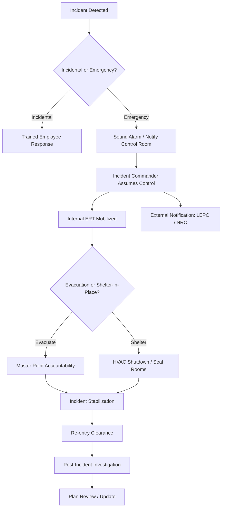

## Emergency Response Plan Components

### Overview

An Emergency Response Plan (ERP) is a documented set of procedures designed to protect personnel, the environment, and facility assets during unplanned releases of hazardous materials, fires, explosions, or other process safety incidents. Within a Process Safety Management (PSM) framework, the ERP operationalizes the facility's response capability, translating hazard analysis (e.g., PHA findings) into actionable emergency procedures. In the United States, OSHA 29 CFR 1910.38 (Emergency Action Plans) and 1910.120(q) (Emergency Response to Hazardous Substance Releases) establish baseline regulatory requirements, while EPA's Risk Management Program (40 CFR Part 68) and RCRA Contingency Planning (40 CFR Part 264/265 Subpart D) impose additional elements for facilities handling regulated substances.

### Core Components

#### 1. Purpose, Scope, and Applicability

- **Key Points**
  - Defines the facilities, processes, and hazard scenarios covered by the plan
  - Establishes activation criteria (what triggers plan implementation)
  - Distinguishes between incidental releases (handled by trained employees) and emergency releases (requiring evacuation and outside response), consistent with the OSHA 1910.120(q) distinction

#### 2. Roles and Responsibilities

- Incident Commander (IC) and Incident Command System (ICS) structure
- On-Scene Coordinator, Emergency Response Team (ERT) members, Safety Officer
- Employee responsibilities (evacuation vs. assist-and-report duties)
- External responder liaison roles (fire department, HAZMAT teams, mutual aid)

**Example**

A mid-size chemical plant designates the Shift Supervisor as initial Incident Commander until the Emergency Response Coordinator arrives on-site, at which point command transfers formally, with the transfer announced over the facility radio channel to avoid a command vacuum.

#### 3. Hazard and Risk Assessment Basis

- Linkage to Process Hazard Analysis (PHA), worst-case and alternative release scenarios from the Risk Management Plan (RMP)
- Consequence modeling outputs (vapor cloud dispersion distances, thermal radiation zones, overpressure radii) used to define protective action distances
- Identification of vulnerable receptors (on-site personnel, neighboring facilities, public receptors, environmentally sensitive areas)

#### 4. Notification and Communication Procedures

- Internal alarm systems (distinct tones for fire, toxic release, evacuation, shelter-in-place)
- Notification sequence: discovering employee → control room/shift supervisor → Incident Commander → emergency responders → regulatory agencies
- External notification requirements: National Response Center (for CERCLA/EPCRA reportable quantities), state emergency response commissions, Local Emergency Planning Committees (LEPCs)
- Community notification systems (reverse-911, sirens) where applicable under EPCRA

**Example**

$$t_{notify} = t_{detect} + t_{verify} + t_{escalate}$$

Facilities often set an internal target (e.g., $t_{notify} \le 15$ minutes) from detection to external agency notification for reportable releases.

#### 5. Evacuation and Shelter-in-Place Procedures

- Primary and secondary evacuation routes, with muster/assembly points
- Accountability procedures (headcount systems, badge-in/badge-out, visitor logs)
- Shelter-in-place criteria and procedures (HVAC shutdown, room sealing) for scenarios where outdoor evacuation increases exposure risk
- Provisions for mobility-impaired personnel and contractors unfamiliar with the site

#### 6. Emergency Equipment and Resources

- Fixed systems: fire water monitors, deluge systems, foam suppression, gas detection networks
- Personal Protective Equipment (PPE) staging, including Level A–D HAZMAT suits where applicable
- Emergency shutdown systems (ESD) and isolation valve locations
- Spill containment materials, absorbents, and secondary containment activation
- Equipment inspection and maintenance schedule to ensure readiness

#### 7. Medical Support and First Aid

- On-site first aid/medical response capability
- Coordination with local hospitals, including pre-notification of chemical exposure specifics for treatment planning
- Decontamination procedures before medical transport

#### 8. Training and Drills

- Initial and refresher training frequency (OSHA 1910.120(q) specifies annual refresher for HAZWOPER-covered responders)
- Tabletop exercises, functional drills, and full-scale exercises
- Drill evaluation and after-action review (AAR) process feeding back into plan revisions

#### 9. Post-Emergency and Recovery Procedures

- Re-entry authorization criteria (atmospheric monitoring clearance, structural inspection)
- Incident investigation initiation (root cause analysis, per PSM element 1910.119(m))
- Equipment restart procedures and Management of Change (MOC) review if temporary modifications were made during response
- Environmental remediation and waste disposal coordination

#### 10. Plan Maintenance and Review

- Periodic review cycle (typically annual, or after significant incidents/near misses)
- Update triggers: process changes, staffing changes, facility layout changes, lessons learned from drills or actual incidents
- Document control and distribution list to ensure current revision availability

### Regulatory Cross-References

| Component | Primary Standard |
| --- | --- |
| Emergency Action Plan minimum elements | OSHA 29 CFR 1910.38 |
| Emergency response to hazardous substance releases | OSHA 29 CFR 1910.120(q) |
| Risk Management Program emergency response coordination | EPA 40 CFR 68.90–68.96 |
| RCRA Contingency Plan | 40 CFR 264/265 Subpart D |
| Community right-to-know / LEPC coordination | EPCRA Section 303 |

### Diagram: Emergency Response Activation Flow (svg_diagram)

**Conclusion**

An effective Emergency Response Plan integrates hazard assessment, clear command structure, tested notification pathways, and resourced response capability into a single coordinated document. Its value is realized only through regular training, drilling, and revision based on lessons learned; a plan that is never exercised is [Inference] likely to underperform during an actual event due to unfamiliarity and untested assumptions.

**Related Topics**

- Incident Command System (ICS) Structure for Industrial Facilities
- Risk Management Plan (RMP) Worst-Case and Alternative Release Scenarios
- HAZWOPER Training Requirements (1910.120)
- Mutual Aid Agreements and Community Emergency Coordination
- Post-Incident Investigation and Root Cause Analysis
- Management of Change (MOC) During Emergency Restart