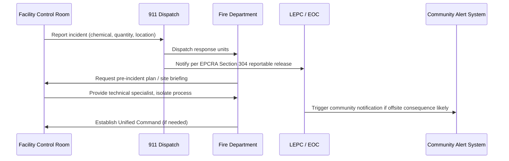

## Coordination with Local Emergency Responders

### Overview

Coordination with local emergency responders is the set of pre-planned, formalized relationships and interfaces between a facility's emergency response organization and external responders — fire departments, hazmat teams, law enforcement, emergency medical services (EMS), and local emergency planning authorities. Under OSHA's Process Safety Management standard (29 CFR 1910.119) and the related Emergency Action Plan standard (29 CFR 1910.38), and reinforced by EPA's Risk Management Program (40 CFR 68) and the Emergency Planning and Community Right-to-Know Act (EPCRA), this coordination ensures that when a facility's internal response capability is exceeded, external responders can act quickly, safely, and effectively.

Poor coordination is a recurring root cause in major incident investigations (e.g., CSB findings on West Fertilizer, BP Texas City) — not because responders lacked skill, but because they lacked facility-specific information, pre-established communication channels, or joint training with the facility.

### Regulatory Basis

- **29 CFR 1910.119(n)** — Emergency Planning and Response: requires covered facilities to comply with 1910.38 (Emergency Action Plans) at minimum, and implies a coordinated response capability for facilities with employee-based emergency response.
- **29 CFR 1910.120(q)** — Hazardous Waste Operations and Emergency Response (HAZWOPER): governs training and coordination for facilities whose personnel perform emergency response to hazardous substance releases, including interface with outside responders.
- **EPCRA Section 303** — Requires Local Emergency Planning Committees (LEPCs) to develop emergency response plans that incorporate facility-specific hazard information.
- **40 CFR 68.90–68.95 (EPA RMP)** — Requires coordination with local response agencies, particularly for Program 2 and 3 processes.
- **NFPA 1600** — Standard on Continuity, Emergency, and Crisis Management, often used as a voluntary framework for coordinating plans with responders.

[Inference] Facilities that maintain their own emergency brigade under 1910.120(q) have more extensive coordination obligations than those that fully evacuate and rely on external responders, since the interface point and command structure differ substantially between these two response philosophies.

### Core Elements of Coordination

#### 1. Pre-Incident Planning and Site Familiarization

- **Facility walkthroughs**: Scheduled site visits by fire department and hazmat teams to familiarize responders with layout, access points, process units, and hazard locations.
- **Pre-incident plans (pre-plans)**: Facility-specific documents given to the fire department detailing process chemistry, quantities, tank/vessel locations, shutoff valve locations, utility isolation points, and staging areas.
- **Site maps**: Provided to responders showing hydrant locations, access roads, assembly points, and hazardous material storage.

#### 2. Hazard Communication to Responders

- **Material Safety Data Sheets (SDS)** or facility hazard inventories shared under EPCRA Section 312 (Tier II reporting).
- **Process hazard summaries**: Simplified, non-technical descriptions of what could go wrong (fire, explosion, toxic release) and expected consequences (used for LEPC planning, not detailed PHA data).
- **Quantity and location data**: Threshold quantities of regulated substances (per 1910.119 Appendix A or 40 CFR 68.130) reported to the LEPC and State Emergency Response Commission (SERC).

#### 3. Joint Training and Exercises

- **Tabletop exercises**: Discussion-based scenario walkthroughs involving facility and responder personnel.
- **Functional exercises**: Test specific capabilities (e.g., notification systems, incident command activation) without full deployment.
- **Full-scale exercises**: Simulate an actual emergency with deployment of resources, often required periodically by RMP Program 3 facilities and encouraged by CSB recommendations.
- **After-action reviews (AARs)**: Structured debriefs identifying gaps in coordination, communication, or resource allocation.

#### 4. Communication and Notification Protocols

- **Direct notification lines**: Dedicated phone lines, radio channels, or automated alert systems between the facility and 911/dispatch.
- **Standardized notification content**: What chemical, how much, wind direction, evacuation status — often using a structured format (e.g., ERG guidebook references, CAMEO/ALOHA outputs).
- **Community notification integration**: Reverse-911 systems, sirens, or Wireless Emergency Alerts triggered jointly by the facility and local Emergency Operations Center (EOC).

#### 5. Incident Command Interface

- Facilities typically operate under **Incident Command System (ICS)**, per NIMS, and must define how facility incident command transfers to (or integrates with) the arriving Incident Commander (usually the senior fire official).
- **Unified Command** structures are common when multiple jurisdictions or agencies (fire, hazmat, EPA, state environmental agency) are involved simultaneously.
- Facility personnel typically transition from "Incident Commander" to a **Technical Specialist** or **Liaison Officer** role once external responders assume command — this handoff point must be explicitly defined in the Emergency Action Plan.

### Key Points

- Coordination must be established **before** an incident, not improvised during one — this is the central design principle behind pre-incident planning.
- The facility retains process-specific technical knowledge (what's in the tank, how it reacts) that responders need but do not inherently possess; responders bring tactical firefighting/hazmat capability the facility typically lacks.
- LEPCs serve as the formal coordination body under EPCRA, bridging facility, responder, and community stakeholders.
- Coordination scope should match facility risk tier — a Program 1 RMP facility has lighter coordination obligations than a Program 3 facility with catastrophic release potential.
- Mutual aid agreements extend coordination beyond the immediate local department to regional hazmat teams when local capability is insufficient.

### Roles and Responsibilities Matrix

| Stakeholder | Primary Responsibility | Coordination Activity |
| --- | --- | --- |
| Facility EHS/PSM Manager | Maintain hazard inventory, update pre-plans | Annual pre-plan review with fire department |
| Facility Incident Commander (initial) | Initial response, notification, command until handoff | Notify 911/dispatch, brief arriving IC |
| Local Fire Department | Tactical firefighting, initial hazmat triage | Site familiarization visits, joint drills |
| Regional/County Hazmat Team | Technical hazmat mitigation | Specialized response for Level B/A releases |
| LEPC | Community emergency response planning | Annual plan review, Tier II data collection |
| Local EMS | Medical treatment, triage, transport | Joint casualty-handling exercises |
| State Emergency Response Commission (SERC) | State-level coordination, reporting oversight | EPCRA compliance tracking |

### Example: Notification Protocol Structure

A structured facility-to-responder notification typically follows this sequence:

### Example: Facility-Responder Interface Diagram (svg_diagram)

<svg xmlns="http://www.w3.org/2000/svg" viewBox="0 0 760 420">
<text x="380" y="28" text-anchor="middle" font-size="18" font-weight="bold" fill="#1a1a1a">Facility–Responder Coordination Interface (svg_diagram)</text>
<rect x="30" y="60" width="220" height="120" rx="8" fill="#e8f0fe" stroke="#1a56db" stroke-width="2" />
<text x="140" y="90" text-anchor="middle" font-size="14" font-weight="bold" fill="#1a1a1a">Facility</text>
<text x="140" y="112" text-anchor="middle" font-size="11" fill="#333">- Process hazard data</text>
<text x="140" y="130" text-anchor="middle" font-size="11" fill="#333">- Site pre-plans</text>
<text x="140" y="148" text-anchor="middle" font-size="11" fill="#333">- Initial responder</text>
<text x="140" y="166" text-anchor="middle" font-size="11" fill="#333">- Technical specialist role</text>
<rect x="290" y="60" width="220" height="120" rx="8" fill="#fef3e8" stroke="#c2410c" stroke-width="2" />
<text x="400" y="90" text-anchor="middle" font-size="14" font-weight="bold" fill="#1a1a1a">Coordination Layer</text>
<text x="400" y="112" text-anchor="middle" font-size="11" fill="#333">- Notification protocols</text>
<text x="400" y="130" text-anchor="middle" font-size="11" fill="#333">- Joint training/exercises</text>
<text x="400" y="148" text-anchor="middle" font-size="11" fill="#333">- LEPC plan integration</text>
<text x="400" y="166" text-anchor="middle" font-size="11" fill="#333">- Mutual aid agreements</text>
<rect x="550" y="60" width="200" height="120" rx="8" fill="#eafbea" stroke="#15803d" stroke-width="2" />
<text x="650" y="90" text-anchor="middle" font-size="14" font-weight="bold" fill="#1a1a1a">External Responders</text>
<text x="650" y="112" text-anchor="middle" font-size="11" fill="#333">- Fire / Hazmat</text>
<text x="650" y="130" text-anchor="middle" font-size="11" fill="#333">- EMS</text>
<text x="650" y="148" text-anchor="middle" font-size="11" fill="#333">- Law enforcement</text>
<text x="650" y="166" text-anchor="middle" font-size="11" fill="#333">- Incident Commander</text>
<line x1="250" y1="120" x2="290" y2="120" stroke="#333" stroke-width="2" marker-end="url(#arrow)" />
<line x1="510" y1="120" x2="550" y2="120" stroke="#333" stroke-width="2" marker-end="url(#arrow)" />
<rect x="150" y="230" width="460" height="150" rx="8" fill="#f5f5f5" stroke="#666" stroke-width="1.5" />
<text x="380" y="255" text-anchor="middle" font-size="13" font-weight="bold" fill="#1a1a1a">Local Emergency Planning Committee (LEPC)</text>
<text x="380" y="278" text-anchor="middle" font-size="11" fill="#333">Formal body under EPCRA Section 303</text>
<text x="380" y="298" text-anchor="middle" font-size="11" fill="#333">Aggregates Tier II data, facility risk info,</text>
<text x="380" y="316" text-anchor="middle" font-size="11" fill="#333">and community response capability into</text>
<text x="380" y="334" text-anchor="middle" font-size="11" fill="#333">a unified local emergency response plan</text>
<text x="380" y="356" text-anchor="middle" font-size="11" fill="#333">Reviewed annually with facility &amp; responders</text>
<line x1="140" y1="180" x2="300" y2="230" stroke="#666" stroke-width="1.5" stroke-dasharray="4,3" marker-end="url(#arrow)" />
<line x1="650" y1="180" x2="470" y2="230" stroke="#666" stroke-width="1.5" stroke-dasharray="4,3" marker-end="url(#arrow)" />
</svg>

### Common Pitfalls

- **Outdated pre-plans**: Facility modifications (new units, changed inventories) not reflected in responder-facing documents — a frequent PSM management-of-change (MOC) gap.
- **No defined command handoff**: Ambiguity over when facility incident command transfers to the arriving fire IC causes delays and duplicated or conflicting actions.
- **One-way communication**: Facilities sharing hazard data without joint drills means responders have information but no practiced familiarity applying it under stress.
- **Ignoring mutual aid limits**: Assuming a neighboring jurisdiction's hazmat team can respond within an assumed timeframe without a signed, tested mutual aid agreement. [Inference] Response time assumptions not validated through actual drills are a common source of planning gap identified in post-incident reviews, since travel time and resource availability can vary significantly from paper estimates.
- **Community notification gaps**: Facility believes LEPC/EOC will notify the public, while LEPC assumes the facility triggers notification — a responsibility ambiguity that has contributed to delayed public warnings in historical incidents.

### Best Practices

- Conduct **annual joint reviews** of pre-incident plans with the primary responding fire department, updating for any MOC-driven changes.
- Maintain a **24/7 direct notification line** to local dispatch, separate from general facility phone systems.
- Include external responders in **at least one full-scale exercise per year** (or per applicable regulatory cycle) with documented AAR follow-up.
- Explicitly document the **incident command transfer criteria** in the facility's Emergency Action Plan (e.g., "command transfers to Fire Department IC upon arrival of first-due engine").
- Participate actively in **LEPC meetings**, not merely submitting Tier II reports passively.
- Provide responders **pre-staged technical resources**: SDS binders, CAMEO/ALOHA modeling outputs, and facility layout maps at a designated Incident Command Post location.
- Establish **mutual aid agreements** with neighboring facilities' hazmat teams or regional response coalitions for capabilities exceeding local department capacity.

### Related Topics

- Emergency Action Plans (29 CFR 1910.38)
- Incident Command System (ICS) and NIMS Integration
- EPCRA Tier II Reporting and LEPC Structure
- Mutual Aid Agreements and Regional Hazmat Response
- Community Right-to-Know and Public Notification Systems
- Post-Incident Investigation and After-Action Review Processes
- HAZWOPER Emergency Response Training Requirements (1910.120(q))