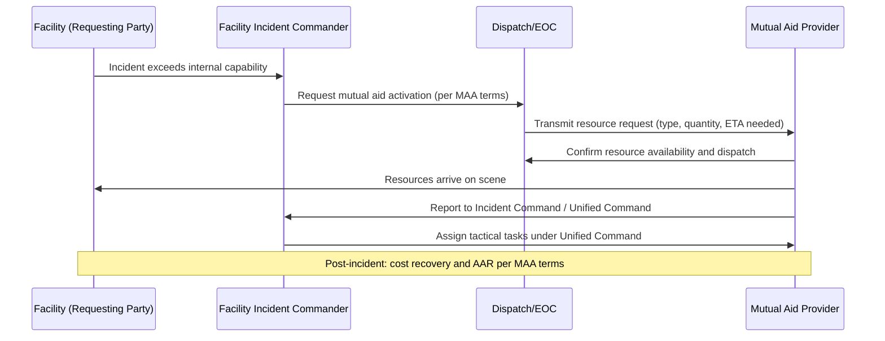

## Mutual Aid Agreements

### Overview

A mutual aid agreement (MAA) is a formal, pre-negotiated arrangement between two or more entities — facilities, municipalities, fire departments, industrial associations, or jurisdictions — to share emergency response resources (personnel, equipment, expertise) during incidents that exceed a single party's response capability. In Process Safety Management (PSM) contexts, mutual aid agreements are a critical component of Emergency Planning and Response, addressing the gap between what a facility's internal emergency organization and local first responders can handle alone, and what a major process safety incident (large fire, toxic release, explosion) may actually require.

Mutual aid is distinct from routine coordination with local responders (covered separately) in that it establishes **contractual or formalized commitments** for resource-sharing, often crossing jurisdictional or corporate boundaries, with defined terms for activation, command authority, liability, and cost recovery.

### Regulatory and Standards Basis

- **29 CFR 1910.119(n)** references compliance with 1910.38, which implicitly supports mutual aid as part of an adequate emergency response capability when internal resources are insufficient.
- **40 CFR 68.90–68.95 (EPA RMP)** — Program 3 facilities with employee emergency response often rely on mutual aid to meet response adequacy expectations, particularly for hazmat-level incidents.
- **EPCRA Section 303** — LEPCs frequently broker or formalize regional mutual aid frameworks as part of the local emergency response plan.
- **NIMS (National Incident Management System)** — Provides the resource typing and credentialing framework (via FEMA) that underpins interoperable mutual aid, especially for multi-jurisdictional and multi-agency response.
- **Emergency Management Assistance Compact (EMAC)** — A state-to-state mutual aid framework that can be invoked for catastrophic incidents exceeding regional capacity, though this operates above the facility/local level.
- **API RP 2021 / NFPA 600** — Industry-specific mutual aid frameworks common in petrochemical sectors (e.g., regional industrial mutual aid organizations for fire and hazmat response).

[Inference] Facilities in industrial clusters (refinery corridors, chemical parks) tend to have more mature, multi-party mutual aid structures than standalone facilities, since shared risk profiles and geographic proximity create stronger incentives for formalized resource-sharing arrangements.

### Types of Mutual Aid Agreements

#### 1. Automatic Mutual Aid

Pre-authorized, immediate dispatch of the nearest capable resource regardless of jurisdictional boundary, without requiring a separate request at the time of the incident. Common for fire suppression response along shared borders.

#### 2. Mutual Aid (Request-Based)

Resources are shared only upon a specific request from the affected party during an incident; requires an activation call by an authorized official.

#### 3. Industrial Mutual Aid

Agreements between industrial facilities (often competitors within the same region) to share hazmat teams, foam supplies, fire apparatus, or technical specialists. Frequently coordinated through industry associations (e.g., regional chemical/refinery mutual aid organizations).

#### 4. Regional/Intergovernmental Mutual Aid

Agreements between municipalities or counties, often formalized through state emergency management offices, covering broader public-sector resource sharing (fire, EMS, law enforcement).

#### 5. Statewide/Interstate Mutual Aid

Frameworks like EMAC that activate when local and regional mutual aid capacity is exceeded, typically for declared disasters rather than single-facility PSM incidents.

### Core Components of a Mutual Aid Agreement

| Component | Description |
| --- | --- |
| Scope of Resources | Defines what personnel, apparatus, or expertise are covered (e.g., foam trucks, hazmat technicians, technical specialists) |
| Activation Procedure | Who can request aid, through what channel (dispatch, direct call), and required authorization level |
| Command Authority | Specifies who directs responding mutual aid resources — typically the receiving jurisdiction's Incident Commander under Unified Command |
| Liability and Indemnification | Establishes which party bears liability for injuries, equipment damage, or errors during mutual aid response |
| Cost Recovery | Defines whether/how the requesting party reimburses the responding party for personnel time, consumables (foam, extinguishing agent), and equipment wear |
| Workers' Compensation Coverage | Clarifies which entity's workers' comp applies to responding personnel while operating outside their home jurisdiction |
| Training/Credentialing Requirements | Minimum certifications (e.g., HAZWOPER, NFPA 472 hazmat technician level) required for personnel to be dispatched under the agreement |
| Duration and Termination | Agreement renewal terms, termination notice periods, and periodic review cycles |
| Equipment Compatibility | Ensures interoperability (hose couplings, radio frequencies, PPE standards) between responding parties |

### Key Points

- Mutual aid agreements must be **signed and tested before an incident** — verbal or informal "we'll help if needed" understandings are not defensible during CSB or regulatory post-incident review.
- **Command authority clarity** is essential: mutual aid resources typically operate under the Incident Commander of the jurisdiction/facility receiving aid, not their home agency's chain of command, once on scene.
- **Liability and cost-recovery terms** are often the most heavily negotiated part of an MAA, since ambiguity here creates legal and financial risk for the responding party.
- Equipment and training **compatibility** (hose threads, PPE ratings, radio interoperability) must be verified in advance, not discovered during response.
- Mutual aid capacity should be **validated through drills**, not assumed from the signed document alone — a written agreement without a tested activation process may fail under real incident timing pressure.

### Example: Mutual Aid Activation Sequence

### Example: Mutual Aid Network Structure (svg_diagram)

<svg xmlns="http://www.w3.org/2000/svg" viewBox="0 0 760 380">
<text x="380" y="28" text-anchor="middle" font-size="18" font-weight="bold" fill="#1a1a1a">Regional Industrial Mutual Aid Network (svg_diagram)</text>
<circle cx="380" cy="190" r="70" fill="#e8f0fe" stroke="#1a56db" stroke-width="2" />
<text x="380" y="185" text-anchor="middle" font-size="13" font-weight="bold" fill="#1a1a1a">Facility A</text>
<text x="380" y="202" text-anchor="middle" font-size="11" fill="#333">(Requesting)</text>
<circle cx="150" cy="90" r="60" fill="#fef3e8" stroke="#c2410c" stroke-width="2" />
<text x="150" y="86" text-anchor="middle" font-size="12" font-weight="bold" fill="#1a1a1a">Facility B</text>
<text x="150" y="102" text-anchor="middle" font-size="10" fill="#333">Hazmat team</text>
<circle cx="610" cy="90" r="60" fill="#fef3e8" stroke="#c2410c" stroke-width="2" />
<text x="610" y="86" text-anchor="middle" font-size="12" font-weight="bold" fill="#1a1a1a">Facility C</text>
<text x="610" y="102" text-anchor="middle" font-size="10" fill="#333">Foam apparatus</text>
<circle cx="150" cy="300" r="60" fill="#eafbea" stroke="#15803d" stroke-width="2" />
<text x="150" y="296" text-anchor="middle" font-size="12" font-weight="bold" fill="#1a1a1a">County Fire</text>
<text x="150" y="312" text-anchor="middle" font-size="10" fill="#333">Command authority</text>
<circle cx="610" cy="300" r="60" fill="#f3e8fe" stroke="#7e22ce" stroke-width="2" />
<text x="610" y="296" text-anchor="middle" font-size="12" font-weight="bold" fill="#1a1a1a">Regional Hazmat</text>
<text x="610" y="312" text-anchor="middle" font-size="10" fill="#333">Specialist team</text>
<line x1="220" y1="120" x2="330" y2="165" stroke="#333" stroke-width="1.5" />
<line x1="540" y1="120" x2="430" y2="165" stroke="#333" stroke-width="1.5" />
<line x1="210" y1="270" x2="330" y2="215" stroke="#333" stroke-width="1.5" />
<line x1="550" y1="270" x2="430" y2="215" stroke="#333" stroke-width="1.5" />

<text x="380" y="360" text-anchor="middle" font-size="11" fill="#555">Each connection represents a bilateral or multilateral MAA with defined activation terms</text>

</svg>

### Common Pitfalls

- **Unsigned or expired agreements**: MAAs not formally renewed lapse silently, leaving facilities believing coverage exists when it does not.
- **Undefined command structure**: Responding mutual aid personnel arriving without clarity on who they report to, causing tactical confusion during the response.
- **Equipment incompatibility discovered on scene**: Mismatched hose couplings, incompatible foam concentrate types, or non-interoperable radio systems discovered during an actual incident rather than during pre-planning.
- **No cost recovery mechanism**: Disputes over reimbursement for consumed foam, fuel, or personnel overtime that were never addressed in the original agreement, straining future cooperation.
- **Assuming response time from paper estimates**: [Inference] Actual mutual aid arrival times can differ meaningfully from distance-based estimates due to traffic, availability of on-duty personnel, or simultaneous demand during a large-scale incident, which is why periodic drills matter for validating realistic response windows rather than relying solely on the signed agreement.
- **Neglecting workers' compensation and liability clarity**: Ambiguity over which entity's insurance covers a responder injured while operating under another party's incident command.

### Best Practices

- Maintain a **current roster** of signed mutual aid agreements, reviewed at a defined cadence (e.g., annually) and updated after any organizational or resource changes.
- Conduct **joint equipment compatibility checks** (coupling adapters, radio interoperability testing, foam compatibility) independent of live incidents.
- Include mutual aid partners in **regular tabletop and full-scale exercises** to validate both the activation process and realistic response timing.
- Clearly document **command transfer and Unified Command structure** in the agreement itself, referencing ICS/NIMS terminology for consistency.
- Establish **standing cost-recovery formulas** (e.g., FEMA resource typing cost schedules) to avoid ad hoc negotiation during or after an incident.
- Verify **credentialing alignment** (HAZWOPER levels, NFPA 472 certification tiers) so dispatched personnel are qualified for the tasks they may be assigned.
- Integrate mutual aid triggers into the facility's **Emergency Action Plan and notification protocols**, specifying the escalation threshold at which mutual aid is requested.

### Related Topics

- Coordination with Local Emergency Responders
- Incident Command System (ICS) and Unified Command
- Emergency Action Plans (29 CFR 1910.38)
- HAZWOPER Training and Certification Levels (29 CFR 1910.120(q))
- Regional Hazmat Response Team Structures
- Emergency Management Assistance Compact (EMAC)
- Post-Incident Cost Recovery and After-Action Review Processes