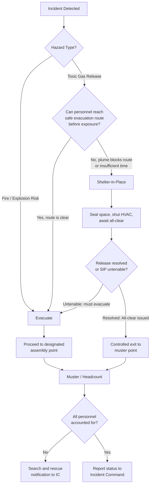

## Evacuation, Shelter-in-Place, and Muster Procedures

### Overview

Evacuation, shelter-in-place (SIP), and muster procedures are the three principal protective action strategies deployed during a process safety emergency, each suited to different hazard types and release scenarios. Selecting the correct strategy — and executing it through a well-defined, drilled procedure — is one of the most consequential decisions in emergency response, directly affecting personnel and public safety outcomes. These procedures are core deliverables of a facility's Emergency Action Plan (29 CFR 1910.38) and Emergency Response Plan under PSM (29 CFR 1910.119(n)), and are informed by hazard and consequence modeling performed during Process Hazard Analysis (PHA).

The strategic decision of *which* protective action to invoke (not merely *how* to execute one) is itself a critical safety judgment: choosing evacuation when shelter-in-place was appropriate — or vice versa — has contributed to worker and community casualties in historical chemical release incidents.

### Regulatory and Standards Basis

- **29 CFR 1910.38** — Emergency Action Plans: requires procedures for emergency evacuation, including type of evacuation and exit route assignments.
- **29 CFR 1910.119(n)** — PSM Emergency Planning and Response: requires an emergency response plan addressing evacuation for personnel during a catastrophic release.
- **40 CFR 68 (EPA RMP)** — Requires consideration of offsite consequence analysis, which informs community shelter-in-place versus evacuation guidance developed jointly with LEPCs.
- **NFPA 101** — Life Safety Code, governing means of egress and evacuation route design.
- **DHS/FEMA Shelter-in-Place Guidance** — Provides the general public-facing framework often adapted by facilities for onsite SIP procedures.
- **ANSI/ASSP Z590 series** — References muster/headcount accountability practices as part of overall emergency management systems.

### The Three Protective Action Strategies

#### 1. Evacuation

Movement of personnel away from a hazard to a location of safety, typically outside the facility or to a designated remote assembly area.

**When appropriate:**

- Fire, explosion risk, or structural collapse hazard
- Hazard is localized and evacuation route remains safe to traverse
- Release is expected to worsen or the safe zone is far enough to reach before exposure

**Key elements:**

- Defined **primary and secondary evacuation routes**, clearly marked and free of obstruction
- **Assembly points** located upwind/uphill of likely hazard zones, at a safe standoff distance
- **Total vs. partial evacuation** criteria (e.g., partial evacuation of unaffected units while isolating the incident area)
- **Evacuation triggers**: alarm types, PA announcements, or gas detection thresholds that automatically or procedurally initiate evacuation

#### 2. Shelter-in-Place (SIP)

Personnel remain indoors, sealing the space against outside air infiltration, when moving through or being outdoors is more hazardous than staying put — typically for airborne toxic releases where evacuation would expose personnel to the plume.

**When appropriate:**

- Toxic gas release where the outdoor concentration exceeds safe exposure limits and evacuation route would pass through the plume
- Insufficient time to safely evacuate before exposure
- Release is expected to be short-duration or dissipate before shelter becomes untenable

**Key elements:**

- **HVAC shutdown** procedures to stop outside air intake
- **Sealing protocols**: closing doors, windows, and vents; taping gaps if using designated SIP rooms
- **Designated SIP rooms/areas**: interior rooms with minimal exterior wall exposure, ideally above ground level for heavier-than-air gases (or below grade considerations vary by gas density)
- **Communication continuity**: maintaining radio/phone contact with control room or EOC during shelter period
- **All-clear protocol**: criteria and method for notifying personnel when it is safe to exit shelter

#### 3. Muster (Accountability Assembly)

A structured headcount and accountability process conducted at designated assembly points, used both during evacuation and as a standalone accountability check during other emergency types (e.g., confirming all personnel are accounted for after a plant-wide alarm).

**Key elements:**

- **Muster point assignments** by work area, shift, or department
- **Accountability methods**: badge swipe systems, physical headcount sheets, muster point captains/wardens
- **Visitor and contractor accountability**: sign-in/sign-out logs cross-referenced at muster
- **Missing person protocol**: escalation procedure when headcount does not reconcile, including search-and-rescue notification to incident command

### Decision Logic: Selecting the Protective Action

### Key Points

- **Evacuation and shelter-in-place are not interchangeable defaults** — the correct choice depends on hazard type, release characteristics, wind direction, and personnel location relative to the plume, determined in advance through consequence modeling and confirmed in real time by the control room or incident commander.
- **Muster/accountability is required regardless of which protective action is chosen** — a facility cannot confirm safety without a reconciled headcount.
- **SIP is a temporary measure**, not a substitute for evacuation when the release is prolonged or shelter integrity degrades; procedures must define the threshold for escalating from SIP to evacuation.
- **Alarm differentiation matters**: facilities should use distinct audible/visual signals for evacuation versus shelter-in-place to avoid personnel executing the wrong action under stress.
- **Visitor, contractor, and disability accommodation** must be explicitly addressed — these populations are less likely to know facility-specific routes and assembly points without direct guidance.

### Example: Muster Point Accountability Matrix

| Muster Point | Area Covered | Warden Responsible | Accountability Method | Capacity |
| --- | --- | --- | --- | --- |
| MP-1 (North Lot) | Process Units 1–3, Control Room | Shift Supervisor A | Badge swipe + visual headcount | 80 personnel |
| MP-2 (South Gate) | Warehouse, Maintenance Shop | Maintenance Lead | Physical sign-in sheet | 40 personnel |
| MP-3 (Admin Building Lobby) | Office/Admin staff, visitors | HR Coordinator | Visitor log cross-reference | 60 personnel |
| MP-4 (Contractor Laydown Yard) | Active contractor crews | Contractor Safety Rep | Contractor daily sign-in roster | Variable |

### Example: Shelter-in-Place Room Layout Considerations (svg_diagram)

<svg xmlns="http://www.w3.org/2000/svg" viewBox="0 0 700 380">
<text x="350" y="28" text-anchor="middle" font-size="18" font-weight="bold" fill="#1a1a1a">SIP Room Selection Criteria (svg_diagram)</text>
<rect x="40" y="60" width="620" height="280" fill="none" stroke="#999" stroke-width="1.5" stroke-dasharray="6,4" />
<text x="60" y="80" font-size="11" fill="#777">Building footprint</text>
<rect x="260" y="140" width="180" height="140" fill="#eafbea" stroke="#15803d" stroke-width="2.5" />
<text x="350" y="200" text-anchor="middle" font-size="13" font-weight="bold" fill="#1a1a1a">Designated</text>
<text x="350" y="218" text-anchor="middle" font-size="13" font-weight="bold" fill="#1a1a1a">SIP Room</text>
<text x="350" y="240" text-anchor="middle" font-size="10" fill="#333">Interior, minimal exterior</text>
<text x="350" y="255" text-anchor="middle" font-size="10" fill="#333">wall exposure</text>
<rect x="60" y="80" width="180" height="80" fill="#fde8e8" stroke="#b91c1c" stroke-width="1.5" />
<text x="150" y="115" text-anchor="middle" font-size="10" fill="#7f1d1d">Exterior wall zone</text>
<text x="150" y="130" text-anchor="middle" font-size="10" fill="#7f1d1d">(avoid for SIP)</text>
<rect x="460" y="80" width="180" height="80" fill="#fde8e8" stroke="#b91c1c" stroke-width="1.5" />
<text x="550" y="115" text-anchor="middle" font-size="10" fill="#7f1d1d">Exterior wall zone</text>
<text x="550" y="130" text-anchor="middle" font-size="10" fill="#7f1d1d">(avoid for SIP)</text>
<line x1="200" y1="180" x2="260" y2="180" stroke="#333" stroke-width="1.5" marker-end="url(#a2)" />
<text x="215" y="172" font-size="9" fill="#555">Seal</text>
<circle cx="350" cy="160" r="6" fill="#1a56db" />
<text x="365" y="164" font-size="9" fill="#333">HVAC shutoff point</text>
</svg>

### Common Pitfalls

- **Ambiguous alarm signals**: Using a single tone for all emergencies forces personnel to guess whether to evacuate or shelter, increasing response time and error risk.
- **Assembly points inside the hazard footprint**: Muster points not validated against consequence modeling (e.g., placed within a vapor cloud explosion overpressure radius or downwind toxic plume path).
- **SIP rooms without verified sealing capability**: Interior rooms selected for convenience rather than tested air infiltration performance.
- **No escalation criteria from SIP to evacuation**: Personnel remaining sheltered indefinitely without a defined trigger to transition to evacuation if conditions worsen or shelter becomes untenable.
- **Incomplete accountability for transient populations**: Contractors, delivery drivers, and visitors not captured in the muster process, delaying "all accounted for" confirmation to incident command.
- **Drills that never test the decision point**: Practicing evacuation routes alone without exercising the judgment call between evacuation and SIP under realistic (simulated) hazard conditions. [Inference] Facilities that drill only the mechanics of one protective action tend to underperform when an actual incident requires them to correctly choose between competing strategies, since the decision-making skill itself is what typically goes unpracticed.

### Best Practices

- Base protective action zones and muster point locations on **documented consequence modeling** (e.g., CAMEO/ALOHA plume and overpressure outputs), not intuition.
- Use **distinct, well-understood alarm tones** for evacuation versus shelter-in-place, reinforced through signage and periodic training.
- Conduct **combined drills** that require personnel to interpret a scenario and select the correct protective action, not just execute a pre-announced drill type.
- Maintain **real-time accountability systems** (electronic badge tracking where feasible) to accelerate headcount reconciliation.
- Pre-identify and **stock SIP rooms** with sealing materials (tape, plastic sheeting), communication devices, and basic supplies for extended shelter duration.
- Explicitly train **muster wardens** on missing-person escalation procedures and communication protocols to incident command.
- Address **special populations** (mobility-impaired personnel, visitors, contractors) with named buddy-system or dedicated assistance procedures.
- Review and update evacuation routes and muster points whenever facility layout changes occur, coordinated through Management of Change (MOC).

### Related Topics

- Coordination with Local Emergency Responders
- Mutual Aid Agreements
- Offsite Consequence Analysis and Dispersion Modeling
- Emergency Action Plans (29 CFR 1910.38)
- Alarm Management and Emergency Notification Systems
- Incident Command System (ICS) and Accountability Protocols
- Management of Change (MOC) Impacts on Emergency Planning