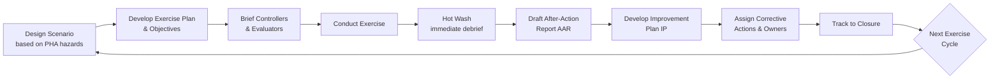

## Emergency Drills and Exercise Evaluation

### Overview

Emergency drills and exercise evaluation constitute the validation and continuous-improvement mechanism for a facility's entire Emergency Planning and Response program. Written plans, notification protocols, and mutual aid agreements have no proven reliability until they are exercised under realistic conditions and rigorously evaluated. This element closes the loop between planning (what should happen) and performance (what actually happens), generating the corrective action data needed to improve response capability over time.

Within Process Safety Management, drills and exercises also serve as objective evidence — for internal audits, PSM compliance audits, and CSB or regulatory post-incident reviews — that emergency response capability is not merely documented but demonstrated.

### Regulatory and Standards Basis

- **29 CFR 1910.38(e)/(f)** — Requires employee training on emergency action plans; while not mandating drills explicitly, this is widely interpreted as requiring practical demonstration of understanding.
- **29 CFR 1910.120(q)(2) and (q)(9)** — HAZWOPER requires periodic emergency response training and refresher training, including drills for personnel with emergency response duties.
- **40 CFR 68 (EPA RMP)** — Program 3 facilities implementing employee emergency response programs are expected to periodically test that capability, aligned with the emergency response program elements.
- **NFPA 1600 / NFPA 1620** — Provide standard frameworks for exercise design (1600: Continuity/Emergency/Crisis Management; 1620: Pre-Incident Planning), including exercise types and evaluation methodology.
- **HSEEP (Homeland Security Exercise and Evaluation Program)** — A widely adopted federal methodology for exercise design, conduct, and evaluation, applicable to industrial facilities coordinating with public-sector responders.
- **CCPS Guidelines for Technical Planning for On-Site Emergencies** — Industry guidance on drill frequency, scenario design, and evaluation criteria specific to process safety hazards.

### Exercise Types (HSEEP-Aligned Progression)

Exercises are typically designed in an increasing order of complexity and realism, often building toward a full-scale exercise over a multi-year cycle.

#### 1. Orientation / Seminar

Informal discussion introducing plans, roles, and procedures to participants; no scenario is played out. Used to build shared understanding before more demanding exercises.

#### 2. Tabletop Exercise (TTX)

Facilitated, discussion-based exercise where participants talk through their response to a simulated scenario in a low-stress setting, without deploying actual resources. Tests decision-making, coordination, and plan familiarity.

#### 3. Drill

A coordinated, supervised activity testing a single, specific operation or function (e.g., fire extinguisher use, evacuation route walkthrough, notification system activation) rather than a full response.

#### 4. Functional Exercise (FE)

Tests one or more functions (e.g., incident command activation, notification, resource coordination) in a simulated, time-pressured environment, typically from a control room or Emergency Operations Center, without full physical deployment of field resources.

#### 5. Full-Scale Exercise (FSE)

The most resource-intensive and realistic exercise type: deploys actual personnel and equipment, activates the complete response organization including external responders, and tests the entire system end-to-end under conditions simulating a real incident.

### Exercise Design Components

| Component | Description |
| --- | --- |
| Scenario | Realistic, credible incident based on facility-specific hazards (informed by PHA findings, worst-case/alternative release scenarios) |
| Objectives | Specific, measurable capabilities being tested (e.g., "notify LEPC within 15 minutes of release confirmation") |
| Exercise Plan (ExPlan) | Documented scope, timeline, participant roles, and safety controls for conducting the exercise itself |
| Controllers | Personnel who manage exercise flow, inject scenario updates, and ensure realism without compromising safety |
| Evaluators | Personnel (often independent of the response organization) who observe performance against objectives using structured evaluation tools |
| Simulation Cell (SimCell) | Role-players simulating external entities (media, LEPC, regulatory agencies) not physically present |
| Safety Controller | Dedicated role ensuring the exercise itself does not create real hazards (critical for FSEs involving live equipment or simulated releases) |

### Evaluation Methodology

#### Evaluation Criteria Structure

Evaluators assess performance against pre-defined objectives using structured tools, typically capturing:

- **Strengths**: What worked as intended
- **Areas for Improvement (AFIs)**: Gaps between expected and actual performance
- **Corrective Action Recommendations**: Specific, assignable follow-up actions

#### After-Action Review (AAR) / Improvement Plan (IP)

The standard HSEEP-aligned output combining:

- **Hot wash**: Immediate, informal debrief with participants directly following the exercise, capturing first impressions before details fade
- **AAR document**: Formal written analysis of performance against each objective, including timeline reconstruction where relevant
- **Improvement Plan (IP)**: Assigns each corrective action a responsible party and target completion date, tracked to closure

#### Common Performance Metrics

- Time from incident detection to notification of internal responders
- Time from notification to external responder (911/fire department) contact
- Time to LEPC/community notification (where offsite consequence applies)
- Accuracy and completeness of information relayed during notification
- Time to achieve incident command establishment/handoff
- Muster/accountability reconciliation time
- Percentage of exercise objectives fully met vs. partially met vs. not met

### Exercise Cycle and Evaluation Workflow

### Key Points

- **Exercises must be evaluated against pre-defined, measurable objectives** — an exercise conducted without documented objectives produces impressions rather than actionable evaluation data.
- **Progressive complexity matters**: jumping directly to a full-scale exercise without tabletop and functional exercises first tends to surface basic plan gaps mid-exercise rather than in a lower-stakes setting.
- **The hot wash and AAR are not optional formalities** — they are the primary mechanism by which drills translate into actual program improvement; an exercise without documented follow-through provides limited lasting value.
- **Corrective actions must be tracked to closure**, not merely logged — unresolved AFIs recurring across multiple exercise cycles indicate a systemic gap in the improvement process itself.
- **Realistic scenario design**, grounded in actual PHA-identified worst-case and alternative release scenarios, produces more valid evaluation data than generic or overly simplified scenarios.

### Example: Sample Drill Evaluation Scorecard

| Objective | Target | Actual | Status | AFI Noted |
| --- | --- | --- | --- | --- |
| Notify fire department | Within 5 minutes of confirmed release | 7 minutes | Partially Met | Control room notification checklist step skipped |
| Establish incident command | Within 10 minutes of first responder arrival | 9 minutes | Met | — |
| Complete muster headcount | Within 15 minutes of evacuation alarm | 22 minutes | Not Met | Contractor sign-in log not current at time of drill |
| Notify LEPC (simulated) | Within 30 minutes | 28 minutes | Met | — |

### Drill Frequency Considerations

[Inference] Drill frequency is typically risk-tiered rather than uniform across a facility, since higher-consequence processes (e.g., those with catastrophic worst-case release potential under RMP) generally warrant more frequent full-scale testing than lower-risk operations, though specific cadence is facility- and regulation-dependent rather than fixed by a single universal standard.

Representative frequency approach used by many facilities:

- **Tabletop exercises**: Annually, at minimum
- **Functional exercises**: Annually or biennially, often alternating years with full-scale exercises
- **Full-scale exercises**: Every 1–3 years, frequently timed to satisfy RMP Program 3 or LEPC joint exercise expectations
- **Notification/alarm drills**: Quarterly or more frequent, given their low resource cost and high value for muscle-memory retention

### Common Pitfalls

- **Scripted, low-stress scenarios** that fail to test real decision-making under time pressure or ambiguity, producing a false sense of readiness.
- **No independent evaluators** — response personnel evaluating their own performance tends to under-identify gaps compared to independent observation.
- **Skipping the hot wash**: Delaying debrief until formal AAR drafting loses perishable, in-the-moment observations from participants.
- **AFIs without assigned ownership or deadlines**: Improvement Plan items that list a problem but no accountable owner rarely get resolved before the next exercise cycle.
- **Exercising only internal response**, never involving external responders or LEPC partners, leaves the external interface (a frequent real-incident failure point) untested.
- **Treating full-scale exercises as pass/fail theater** rather than genuine evaluation opportunities, discouraging honest reporting of gaps due to perceived stakes.

### Best Practices

- Base every exercise scenario on **documented PHA findings**, particularly worst-case and alternative release scenarios already identified for RMP or PSM purposes.
- Use **independent evaluators** with structured evaluation guides tied directly to stated objectives.
- Conduct a **hot wash immediately** following every exercise, regardless of type or scale.
- Maintain a **formal Improvement Plan tracking system**, reviewed at a fixed cadence until each corrective action is closed.
- Vary scenario types and hazard categories across the exercise cycle (fire, toxic release, natural disaster impact on process safety) rather than repeating the same scenario.
- Include **external responders, LEPC representatives, and mutual aid partners** in at least the functional and full-scale exercise tiers.
- Use **quantitative performance metrics** (notification times, accountability reconciliation times) alongside qualitative observations to enable trend analysis across exercise cycles.
- Periodically **audit the exercise program itself** — confirming exercises are actually occurring at the planned frequency and that corrective actions are genuinely closed, not just marked closed.

### Related Topics

- Coordination with Local Emergency Responders
- Mutual Aid Agreements
- Evacuation, Shelter-in-Place, and Muster Procedures
- Process Hazard Analysis (PHA) Worst-Case Scenario Development
- Incident Command System (ICS) Training
- Management of Change (MOC) and Emergency Plan Updates
- Root Cause Analysis and Corrective Action Tracking Systems