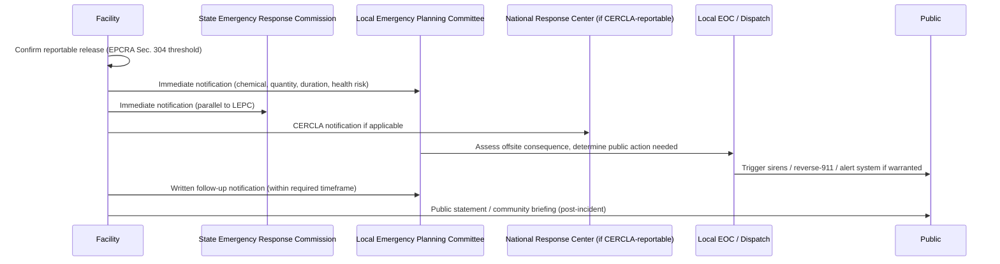

## Community Right-to-Know and Public Notification

### Overview

Community Right-to-Know and Public Notification refers to the legal, procedural, and technical framework by which facilities handling hazardous chemicals disclose hazard information to the public and provide timely warning during an actual release. It rests on the principle that communities living near hazardous facilities have a legal right to know what chemicals are present, in what quantities, and what protective actions to take during an emergency. In Process Safety Management contexts, this element connects internal process safety practice to external stakeholder trust, regulatory compliance, and public health protection — and is a distinct but closely related discipline to Coordination with Local Emergency Responders.

The foundational U.S. legal framework is the **Emergency Planning and Community Right-to-Know Act (EPCRA)**, enacted in 1986 following the Bhopal disaster, which established mandatory hazard reporting and public notification infrastructure that remains the backbone of community right-to-know practice today.

### Regulatory and Standards Basis

- **EPCRA (42 U.S.C. 11001 et seq.)** — The primary U.S. statute; establishes four core reporting requirements:
  - **Section 302/303** — Facility notification to State Emergency Response Commissions (SERCs) and Local Emergency Planning Committees (LEPCs) for Extremely Hazardous Substances above threshold planning quantities.
  - **Section 304** — Emergency release notification requiring immediate reporting of releases exceeding reportable quantities to the LEPC and SERC.
  - **Sections 311/312** — Hazardous chemical inventory reporting (SDS submission and Tier I/Tier II forms) to LEPCs, SERCs, and local fire departments.
  - **Section 313** — Toxic Release Inventory (TRI) reporting, requiring annual public disclosure of specified toxic chemical releases and transfers.
- **40 CFR 68 (EPA RMP)** — Requires public availability of certain Risk Management Plan elements (via EPA's public data systems) and, since amendments in recent years, has strengthened public information access provisions following major incident reviews.
- **CERCLA Section 103** — Governs emergency release notification to the National Response Center, complementing EPCRA's local/state notification.
- **State and local right-to-know statutes** — Many states impose additional disclosure requirements beyond the federal EPCRA baseline.
- **Seveso III Directive (EU)** — The European analog, requiring public information provisions for establishments handling dangerous substances, including public access to safety report summaries.

[Inference] Facilities in jurisdictions with both EPCRA obligations and stricter state-level right-to-know statutes typically design their public notification programs around the more stringent requirement rather than maintaining separate compliance tracks, since a unified program tends to be more operationally manageable than parallel systems.

### Core Components

#### 1. Routine Hazard Disclosure (Pre-Incident)

- **Tier II Reporting**: Annual submission of hazardous chemical inventory data (chemical identity, quantity, storage location) to the LEPC, SERC, and local fire department.
- **Toxic Release Inventory (TRI)**: Annual public reporting of releases and waste management of listed toxic chemicals, published in EPA's publicly accessible TRI database.
- **Safety Data Sheets (SDS) availability**: Provided to LEPCs and fire departments, and often made available to the public upon request.
- **Risk Management Plan (RMP) public data elements**: Certain RMP information (facility name, location, regulated substances, general hazard summary) is publicly accessible, balancing right-to-know against security-sensitive process details.

#### 2. Emergency Release Notification (During Incident)

- **Immediate notification** to the LEPC and SERC upon a reportable release under EPCRA Section 304, including chemical identity, estimated quantity, time and duration of release, and known/anticipated health risks.
- **Follow-up written notification** required within a defined period after the initial emergency notification, providing more complete incident details.
- **Public alerting systems**: Sirens, reverse-911/wireless emergency alerts, and social media/press notifications, typically triggered jointly by the facility, LEPC, and local Emergency Operations Center based on offsite consequence assessment.

#### 3. Community Engagement and Transparency

- **Public meetings and LEPC participation**: Facilities often participate in periodic LEPC meetings open to community input, particularly following any reportable incident.
- **Community advisory panels (CAPs)**: Some facilities, particularly in the chemical sector, maintain voluntary community advisory structures beyond minimum EPCRA requirements.
- **Responsible Care / industry voluntary programs**: Sector initiatives (e.g., American Chemistry Council's Responsible Care) that encourage disclosure practices exceeding regulatory minimums.

### Notification Pathway During a Release Event

### Key Points

- **Community right-to-know is a continuous obligation, not solely an incident-response activity** — routine Tier II and TRI reporting build the baseline hazard awareness that makes emergency notification meaningful to responders and the public.
- **Two parallel notification tracks exist**: internal/regulatory notification (LEPC, SERC, NRC) and public alerting (sirens, alerts, media) — both must function, but they serve different audiences and have different triggers.
- **RMP public data availability intentionally balances transparency against security risk** — full process-specific vulnerability details are generally not made public, while general hazard and regulated substance information is.
- **LEPCs are the primary institutional bridge** between facility hazard data and community-level emergency planning, making active facility participation essential rather than optional compliance.
- **Timeliness of public notification during an actual release is often the most scrutinized element** in post-incident reviews — delayed community warning has been a recurring finding in major chemical release investigations.

### Example: Tier II Reporting Data Elements

| Data Element | Description |
| --- | --- |
| Chemical Identity | Name, CAS number, hazard classification |
| Physical/Health Hazards | Fire, reactivity, acute/chronic health hazard categories |
| Maximum Quantity Onsite | Range or specific quantity present at any time during reporting year |
| Average Daily Quantity | Typical onsite inventory level |
| Storage Location | Building/area, storage type (tank, drum, etc.) |
| Storage Conditions | Temperature, pressure, containment type |

### Common Pitfalls

- **Treating EPCRA reporting as a purely administrative filing task**, disconnected from the emergency response and community relations functions that depend on the same data being accurate and current.
- **Outdated Tier II data**: Chemical inventories or quantities changed without corresponding Tier II updates, undermining both LEPC planning and first-responder pre-incident knowledge.
- **Ambiguous ownership of public notification triggers**: Facility assumes the LEPC/EOC will handle public alerting, while the LEPC assumes the facility initiates it — a coordination gap addressed more fully under Coordination with Local Emergency Responders, but equally relevant here.
- **Minimal, compliance-only community engagement**: Meeting only the legal minimum notification requirements can erode community trust, particularly evident after incidents where affected residents report feeling uninformed regardless of technical compliance.
- **Confusing RMP public data with full process safety information**: Some public stakeholders and media may expect facility-specific vulnerability details that are intentionally withheld for security reasons; poor communication of this distinction can itself become a trust issue.

### Best Practices

- Maintain **Tier II and SDS data currency** through integration with Management of Change (MOC) processes, so inventory changes automatically flag required reporting updates.
- Establish **clear, pre-defined public notification trigger criteria** jointly with the LEPC and local EOC, documented in the facility's emergency response plan.
- Participate actively in **LEPC meetings and joint exercises**, not merely submitting required reports.
- Develop **plain-language public communication templates** in advance for use during an actual release, avoiding the need to draft technical-to-public translations under incident time pressure.
- Consider **voluntary transparency measures** (community advisory panels, proactive public briefings) that exceed EPCRA minimums, particularly for facilities in industrial-adjacent residential areas.
- Ensure notification and reporting workflows draw from a **single, current source of hazard and inventory data** shared consistently across EPCRA reporting, RMP submissions, and emergency response planning.
- Debrief and formally review **public notification performance** as part of after-action reviews following both drills and actual incidents, treating community communication as a measurable response capability alongside technical response elements.

### Related Topics

- Coordination with Local Emergency Responders
- Mutual Aid Agreements
- Evacuation, Shelter-in-Place, and Muster Procedures
- Emergency Drills and Exercise Evaluation
- Toxic Release Inventory (TRI) Reporting Under EPCRA Section 313
- EPA Risk Management Program Public Data Provisions
- Management of Change (MOC) Integration with Regulatory Reporting