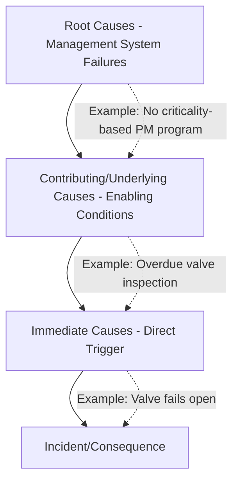
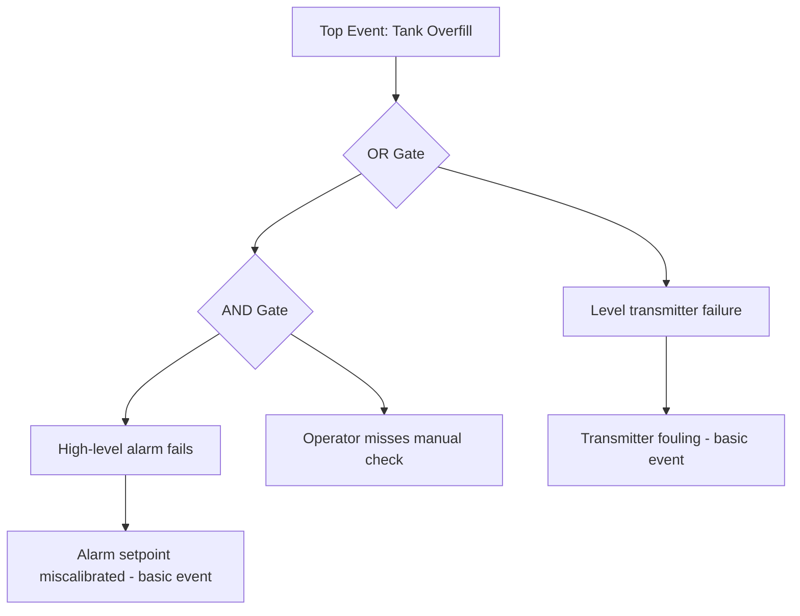

## Root Cause Analysis Techniques

### Overview

Root Cause Analysis (RCA) is the structured process of identifying the underlying causes of an incident rather than stopping at surface-level or proximate causes. In Process Safety Management (PSM), RCA distinguishes between three causal levels: **immediate causes** (the direct trigger, e.g., a valve failed open), **contributing/underlying causes** (conditions that enabled the immediate cause, e.g., inadequate preventive maintenance), and **root causes** (systemic management system failures, e.g., a maintenance program lacking criticality-based inspection intervals). Multiple techniques exist, each suited to different incident types, complexity levels, and organizational maturity.

### Causal Hierarchy Concept

**Key Point:** Effective RCA techniques are designed specifically to prevent investigators from stopping at the immediate cause, which is the most common failure mode in low-maturity investigations.

### Major RCA Techniques

#### 1. Five Whys

**Description:** An iterative interrogative technique where "why" is asked repeatedly (conventionally five times, though the actual number varies) until a systemic root cause is reached.

**Process:**

1. State the problem clearly.
2. Ask "why did this happen?" and record the answer.
3. For each answer, ask "why" again.
4. Continue until further "why" questions yield no new useful information or a management system failure is identified.

**Example:**

- Problem: Reactor overpressure alarm was not acknowledged in time.
- Why 1: Operator was managing three other simultaneous alarms.
- Why 2: The alarm system generated a flood of low-priority alarms during the upset.
- Why 3: Alarm rationalization had not been performed on this system.
- Why 4: The site had no formal alarm management program.
- Why 5 (Root Cause): No corporate policy mandated ISA-18.2 alarm management practices across sites.

**Strengths:** Simple, fast, requires no special software, effective for straightforward incidents with a single dominant causal chain.

**Limitations:** Prone to stopping too early or following a single linear path when the actual causation is multi-branched; highly dependent on facilitator skill and team knowledge; [Inference] tends to produce inconsistent depth across different facilitators for the same incident type, though this is a widely cited practical observation rather than a formally quantified metric.

#### 2. Fault Tree Analysis (FTA)

**Description:** A deductive, top-down technique that starts with an undesired top event (e.g., "vessel rupture") and works backward using Boolean logic gates (AND, OR) to map all possible combinations of lower-level failures that could produce it.

**Structure:**

- **Top event** — the incident or undesired outcome.
- **Intermediate events** — contributing failure combinations.
- **Basic events** — root-level component or human failures, typically the terminus of the tree.
- **Logic gates** — AND gates require all inputs to occur; OR gates require any single input.

**Example (simplified):**

**Strengths:** Rigorous, quantifiable (can incorporate failure probabilities for quantitative risk assessment), well suited to complex engineered systems with multiple safeguards (layers of protection).

**Limitations:** Time-intensive; requires trained analysts; best applied to incidents involving equipment/system interactions rather than purely organizational or behavioral root causes. [Unverified] The specific probability values used in quantitative FTA depend heavily on the quality of underlying failure rate data, which varies significantly by industry database and equipment vintage.

#### 3. TapRooT

**Description:** A proprietary, structured RCA system combining a root cause tree (a pre-built taxonomy of ~30+ generic causal categories), SnapCharT sequencing diagrams, and Safeguard Analysis. Widely used in process industries and licensed by TapRooT/System Improvements Inc.

**Core Components:**

- **SnapCharT** — a visual timeline/sequence-of-events diagram built collaboratively with the team, showing conditions and causal factors alongside chronological events.
- **Root Cause Tree** — a dichotomous decision-tree questionnaire guiding investigators through generic root cause categories (Human Engineering, Procedures, Training, Quality Control, Communications, Management Systems, etc.) to prevent premature or biased conclusions.
- **Corrective Action Helper** — links identified root causes to a generic guidance table of effective corrective action types, discouraging purely disciplinary or "retrain the employee" fixes.

**Strengths:** Highly structured, reduces facilitator subjectivity and cognitive bias through the guided tree; strong audit trail; widely accepted by regulators and insurers as a credible methodology.

**Limitations:** Requires paid training/certification and licensed software or manuals; steeper learning curve than Five Whys; [Inference] may be perceived as overly bureaucratic for minor incidents, though this is an organizational judgment rather than a technical limitation of the method.

#### 4. Kepner-Tregoe (KT) Problem Analysis

**Description:** A structured comparative-analysis technique that defines the problem in terms of "IS" versus "IS NOT" (what is affected vs. what is not, where, when, and to what extent), then identifies distinguishing changes that correlate with the onset of the problem.

**Process:**

1. Specify the deviation (what, where, when, extent).
2. Specify what it is **not** (comparable situations unaffected).
3. Identify distinctions between the IS and IS NOT conditions.
4. Identify changes associated with those distinctions.
5. Test possible causes against all specification data.
6. Verify the most probable cause.

**Example:** A specific reactor train experiences repeated seal failures while an identical parallel train does not. KT analysis would systematically compare operating conditions, maintenance history, and component batch/vendor differences between the two trains to isolate the distinguishing factor (e.g., a batch of seals sourced from a different supplier during a specific date range).

**Strengths:** Excellent for intermittent or hard-to-reproduce problems and for comparative analysis between similar systems/units; strong logical rigor.

**Limitations:** Less effective for single, non-recurring catastrophic events where no comparable "IS NOT" baseline exists; requires disciplined data-gathering.

#### 5. Bowtie Analysis

**Description:** A visual technique that combines fault tree logic (left side — threats leading to the top event) with event tree logic (right side — consequences following the top event), centered on a hazard/top event, with preventive and mitigative barriers displayed explicitly.

**Structure:**

- **Hazard** — the underlying hazard (e.g., flammable liquid under pressure).
- **Top event** — loss of control of the hazard (e.g., loss of containment).
- **Threats** (left side) — causes that could lead to the top event.
- **Preventive barriers** — safeguards between threats and the top event.
- **Consequences** (right side) — outcomes following the top event.
- **Mitigative barriers** — safeguards between the top event and consequences.
- **Escalation factors** — conditions that defeat a barrier.

**Illustration (SVG_diagram) — Bowtie Structure**

<svg xmlns="http://www.w3.org/2000/svg" viewBox="0 0 800 400">
<text x="400" y="25" font-size="16" font-weight="bold" text-anchor="middle" fill="#1a1a1a">Bowtie Diagram Structure (svg_diagram)</text>

<rect x="20" y="80" width="140" height="30" fill="#f4d1d1" stroke="#a33" />
<text x="90" y="100" font-size="11" text-anchor="middle">Threat 1: Corrosion</text>
<rect x="20" y="150" width="140" height="30" fill="#f4d1d1" stroke="#a33" />
<text x="90" y="170" font-size="11" text-anchor="middle">Threat 2: Overpressure</text>
<rect x="20" y="220" width="140" height="30" fill="#f4d1d1" stroke="#a33" />
<text x="90" y="240" font-size="11" text-anchor="middle">Threat 3: Human Error</text>

<rect x="200" y="80" width="120" height="30" fill="#d1e8f4" stroke="#357" />
<text x="260" y="100" font-size="10" text-anchor="middle">Inspection Program</text>
<rect x="200" y="150" width="120" height="30" fill="#d1e8f4" stroke="#357" />
<text x="260" y="170" font-size="10" text-anchor="middle">Relief Valve</text>
<rect x="200" y="220" width="120" height="30" fill="#d1e8f4" stroke="#357" />
<text x="260" y="240" font-size="10" text-anchor="middle">Procedure/Training</text>

<line x1="160" y1="95" x2="200" y2="95" stroke="#333" />
<line x1="160" y1="165" x2="200" y2="165" stroke="#333" />
<line x1="160" y1="235" x2="200" y2="235" stroke="#333" />
<line x1="320" y1="95" x2="380" y2="180" stroke="#333" />
<line x1="320" y1="165" x2="380" y2="180" stroke="#333" />
<line x1="320" y1="235" x2="380" y2="180" stroke="#333" />

<circle cx="400" cy="180" r="25" fill="#ffcc00" stroke="#333" stroke-width="2" />
<text x="400" y="184" font-size="9" text-anchor="middle" font-weight="bold">TOP EVENT</text>

<rect x="480" y="80" width="120" height="30" fill="#d1f4d8" stroke="#373" />
<text x="540" y="100" font-size="10" text-anchor="middle">Emergency Shutdown</text>
<rect x="480" y="150" width="120" height="30" fill="#d1f4d8" stroke="#373" />
<text x="540" y="170" font-size="10" text-anchor="middle">Containment/Dike</text>
<rect x="480" y="220" width="120" height="30" fill="#d1f4d8" stroke="#373" />
<text x="540" y="240" font-size="10" text-anchor="middle">Fire Suppression</text>
<line x1="420" y1="180" x2="480" y2="95" stroke="#333" />
<line x1="420" y1="180" x2="480" y2="165" stroke="#333" />
<line x1="420" y1="180" x2="480" y2="235" stroke="#333" />

<rect x="640" y="80" width="140" height="30" fill="#f4d1d1" stroke="#a33" />
<text x="710" y="100" font-size="11" text-anchor="middle">Personnel Injury</text>
<rect x="640" y="150" width="140" height="30" fill="#f4d1d1" stroke="#a33" />
<text x="710" y="170" font-size="11" text-anchor="middle">Environmental Release</text>
<rect x="640" y="220" width="140" height="30" fill="#f4d1d1" stroke="#a33" />
<text x="710" y="240" font-size="11" text-anchor="middle">Asset/Equipment Loss</text>
<line x1="600" y1="95" x2="640" y2="95" stroke="#333" />
<line x1="600" y1="165" x2="640" y2="165" stroke="#333" />
<line x1="600" y1="235" x2="640" y2="235" stroke="#333" />

<text x="400" y="380" font-size="11" text-anchor="middle" fill="#555">Left: Prevention (Fault Tree logic) | Right: Mitigation (Event Tree logic)</text>

</svg>

**Strengths:** Highly visual and intuitive for communicating to non-specialists and management; explicitly maps which barriers failed, directly supporting Layers of Protection Analysis (LOPA) linkage; useful both proactively (hazard assessment) and retroactively (post-incident, to show which barriers failed and why).

**Limitations:** Can oversimplify complex causal interactions into single-line threat-to-consequence paths; does not inherently handle combinations of simultaneous failures as rigorously as FTA's AND/OR logic.

#### 6. Change Analysis (Kepner-Tregoe variant / MORT-derived)

**Description:** Compares the incident condition against a known-good baseline condition (before a change, or an unaffected comparable system) to isolate what changed. Frequently used when an incident follows a Management of Change (MOC) event.

**Example:** A pump seal fails three weeks after a lubricant supplier substitution. Change analysis would explicitly tabulate all changes (people, equipment, materials, procedures, environment) between the pre-failure baseline and the failure period to isolate the lubricant change as the primary candidate cause.

#### 7. Barrier Analysis / Energy Trace and Barrier Analysis (ETBA)

**Description:** Focuses on identifying the hazardous energy source involved in the incident (e.g., pressure, chemical, kinetic, thermal) and tracing its path to determine which barriers should have contained it and why they failed.

**Process:**

1. Identify the hazardous energy/target pairs involved.
2. Trace the path of energy flow from source to target (person, equipment, environment).
3. Identify barriers that existed, or should have existed, along that path.
4. Determine why each barrier failed or was absent.

**Strengths:** Well suited to acute energy-release incidents (explosions, thermal burns, mechanical impact); complements bowtie and FTA by focusing specifically on barrier performance.

### Comparative Selection Guide

| Technique | Best Suited For | Complexity | Typical Team Size |
| --- | --- | --- | --- |
| Five Whys | Simple, single-chain causation | Low | 1–3 |
| Fault Tree Analysis | Complex engineered systems, multiple safeguard combinations | High | 3–6 (technical specialists) |
| TapRooT | Organizations wanting standardized, auditable methodology across all incident types | Medium–High | 3–8 |
| Kepner-Tregoe | Intermittent problems, comparative analysis between similar units | Medium | 2–5 |
| Bowtie Analysis | Communicating barrier failures to management; linking to LOPA | Medium | 3–6 |
| Change Analysis | Incidents following MOC events or known process changes | Low–Medium | 2–4 |
| Barrier/ETBA | Acute energy-release incidents | Medium | 3–5 |

### Common Pitfalls Across All Techniques

- **Premature closure** — stopping at the first plausible cause rather than continuing to systemic/management system levels.
- **Confirmation bias** — selecting evidence that supports a pre-existing theory about what happened.
- **Single-cause fixation** — most process safety incidents involve multiple, often coincident, contributing factors (Swiss Cheese Model); techniques that only support linear causal chains (e.g., poorly facilitated Five Whys) can miss parallel contributing failures.
- **Blame substitution for causation** — labeling "operator error" as a root cause without asking why the error was possible or likely (procedural, training, or interface design gaps).
- **Inconsistent methodology across incidents** — using different techniques ad hoc between investigations reduces trend analysis capability across a facility's incident history.

### Integrating Techniques

In practice, mature PSM programs often layer techniques rather than choosing only one:

- **SnapCharT/timeline** (from TapRooT or generic sequence-of-events charting) to establish the factual sequence.
- **Five Whys or Root Cause Tree** to drill into each causal factor identified in the timeline.
- **Bowtie Analysis** to communicate barrier failures to leadership and link findings to existing LOPA/safeguard documentation.
- **FTA** reserved for the most complex or high-consequence events requiring quantitative rigor.

**Note:** [Inference] The specific combination and sequencing of techniques used varies significantly by organizational maturity, incident severity, and available facilitator expertise; there is no single universally mandated combination in PSM regulation.

### Related Topics

- Investigation Team Formation and Independence
- Layers of Protection Analysis (LOPA) and Its Link to Bowtie Barriers
- Human Factors and Human Performance Analysis in RCA
- Corrective and Preventive Action (CAPA) Development from RCA Findings
- Management of Change (MOC) as a Root Cause Category
- Alarm Management and ISA-18.2 Standards
- Swiss Cheese Model and Defense-in-Depth Concepts
- Quantitative Risk Assessment (QRA) Using Fault Tree Data
- CSB Investigation Reports as RCA Case Studies
- Trending and Aggregate Analysis of Recurring Root Causes Across Multiple Incidents