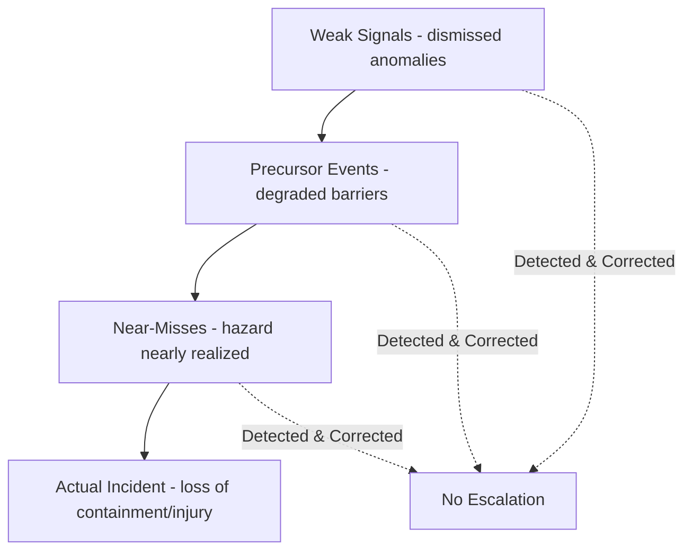
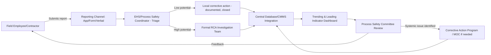

## Near-Miss and Precursor Reporting Systems

### Overview

Near-miss and precursor reporting systems are proactive components of Process Safety Management (PSM) that capture events, conditions, and deviations that did **not** result in an actual loss of containment, injury, or significant consequence, but had the potential to do so under slightly different circumstances. These systems shift incident investigation from a purely reactive discipline (responding after harm occurs) to a leading-indicator discipline, allowing organizations to identify and correct systemic weaknesses before they manifest as major incidents.

### Definitions and Terminology

**Near-Miss**

An event where an undesired outcome (injury, release, damage) did not occur, but could have occurred under slightly different conditions. Example: a relief valve lifts and successfully vents overpressure with no release beyond the flare system — the design worked as intended, but the underlying process upset that caused the overpressure is itself a signal of a systemic issue.

**Precursor (or Precursor Event)**

A broader category than near-miss, encompassing any abnormal condition, deviation, or weak signal that indicates a barrier or safeguard has degraded, failed, or been bypassed — even if no immediate hazardous condition resulted. Example: a safety instrumented system (SIS) proof test reveals a failed solenoid valve that had been in a failed state for an unknown period; no incident occurred, but a layer of protection was silently unavailable.

**Weak Signal**

A subtler variant of precursor — an anomaly that, in isolation, appears minor or unremarkable, but which, when aggregated with other weak signals, indicates a developing systemic problem. CCPS and academic process safety literature (drawing on High Reliability Organization theory) emphasize that catastrophic incidents are frequently preceded by numerous weak signals that were individually dismissed.

#### Causal Relationship to Actual Incidents

**Key Point:** The purpose of a mature reporting system is to intervene as far to the left of this chain as possible — correcting weak signals and precursors before they compound into near-misses or actual incidents.

### Regulatory and Industry Context

**OSHA 1910.119**

The PSM standard's incident investigation trigger language (1910.119(m)(1)) explicitly extends to incidents that "resulted in, or could reasonably have resulted in a catastrophic release" — meaning near-misses with catastrophic potential fall under the same 48-hour investigation initiation requirement as actual releases, even though many organizations under-apply this requirement to near-misses in practice.

**CCPS Guidance**

The Center for Chemical Process Safety's "Guidelines for Process Safety Metrics" and dedicated near-miss reporting guidance materials treat near-miss frequency and quality of reporting as a core leading indicator of process safety performance, distinct from lagging indicators (actual incident counts, injury rates).

**API RP 754**

American Petroleum Institute Recommended Practice 754 establishes a Tier system for process safety event classification (Tier 1 through Tier 4), with Tier 3 and Tier 4 events specifically capturing challenges to safety systems and operating discipline deviations — effectively formalizing precursor and near-miss data into a structured metrics hierarchy.

| API RP 754 Tier | Description | Example |
| --- | --- | --- |
| Tier 1 | Loss of Primary Containment (LOPC) with significant consequence | Major release, fire, explosion |
| Tier 2 | LOPC with lesser consequence | Minor release requiring response |
| Tier 3 | Challenges to safety systems | Relief valve lift, demand on SIS, near-miss LOPC below Tier 1/2 threshold |
| Tier 4 | Operating discipline and management system performance indicators | Inspection backlogs, procedure deviations, delayed PM completion |

### Core Components of a Reporting System

#### 1. Reporting Mechanism

- **Accessibility** — reporting channels must be low-friction: paper forms, mobile apps, intranet portals, or verbal reporting to supervisors with subsequent documentation.
- **Anonymity/confidentiality options** — many mature systems allow anonymous submission to reduce fear of reprisal, particularly for reports that might implicate a coworker's or supervisor's decision.
- **Timeliness** — systems should encourage reporting as close to the event as possible to preserve detail accuracy.

#### 2. Triage and Classification

Incoming reports are typically screened by a designated coordinator (often EHS or process safety staff) and classified by:

- **Potential severity** — using a risk matrix to estimate what could have happened under worst-case circumstances, not what actually happened.
- **Investigation depth required** — minor precursors may warrant a simple corrective action; high-potential near-misses may trigger a full RCA using the same techniques applied to actual incidents (Five Whys, TapRooT, Bowtie, etc.).

#### 3. Investigation and Analysis

High-potential near-misses should be investigated with the same rigor as actual incidents, since the only difference between the near-miss and a catastrophic event was often chance timing, minor circumstance, or a barrier performing exactly as designed.

#### 4. Trending and Aggregate Analysis

- **Pattern detection** — individual precursors may seem isolated, but trending across time, unit, or equipment type can reveal systemic issues (e.g., a specific valve model failing across multiple units).
- **Leading indicator dashboards** — near-miss and precursor rates, categorized by type, are tracked as leading indicators alongside lagging indicators (recordable incidents, LOPC events).

#### 5. Corrective Action Tracking and Closure

- Findings from near-miss investigations feed the same corrective action management system used for actual incidents.
- **Verification of effectiveness** — closure should not simply confirm the action was completed, but that it actually addresses the underlying precursor condition.

#### 6. Feedback Loop to Reporters

- Reporters should receive acknowledgment and, where appropriate, information on the resulting corrective action. Systems that provide no visible feedback tend to see reporting rates decline over time, as employees perceive reports as disappearing without effect.

### Organizational and Cultural Prerequisites

#### Just Culture

As with formal incident investigations, near-miss reporting systems depend heavily on a just culture that distinguishes human error and at-risk behavior (systemic/coaching response) from reckless behavior (disciplinary response). If employees believe reporting a near-miss will result in punitive action against themselves or colleagues, reporting rates drop sharply and the organization loses visibility into precursor conditions.

#### Leadership Visibility and Response

- Leadership must visibly act on near-miss data (resource allocation, schedule changes, capital approval for corrective actions) rather than treating reports as a compliance checkbox.
- **Key Point:** A high near-miss reporting rate is not inherently a negative indicator — in mature process safety cultures, an increasing near-miss reporting rate often reflects growing trust in the system and heightened hazard awareness, not deteriorating safety performance. Conversely, artificially low near-miss counts in a facility with known process complexity can itself be a red flag for underreporting.

#### Normalization of Deviance

A recognized cultural failure mode (documented extensively in the *Columbia* and *Challenger* space shuttle accident analyses, and analogously in process safety incidents such as BP Texas City) where repeated precursor events without consequence lead an organization to redefine the precursor as "normal" or acceptable rather than as a warning signal. Reporting systems must include mechanisms (e.g., periodic aggregate review by a process safety committee) to counteract this drift, since individual reports may each appear unremarkable while the trend is not.

### System Architecture Example

### Practical Example

**Scenario:** A control room operator notices that a high-level alarm on a distillation column activated but auto-acknowledged without operator response due to a nuisance alarm suppression rule, and the level briefly approached (but did not reach) the high-high trip setpoint before normal control action brought it back down.

**Without a precursor reporting system:** The event is not logged anywhere beyond the historian data; no one reviews it; the alarm suppression rule remains in place.

**With a mature precursor reporting system:**

1. Operator submits a near-miss report via the shift log/reporting app, noting the alarm suppression behavior.
2. Coordinator classifies it as Tier 3 (challenge to safety system) under API RP 754 given proximity to the high-high trip.
3. A brief investigation (Five Whys or change analysis) reveals the alarm suppression rule was added six months earlier to reduce alarm flood during a specific startup sequence but was never scoped to exclude this scenario.
4. Corrective action: alarm rationalization review scheduled; suppression rule logic corrected via MOC.
5. Aggregate trend review later reveals three similar suppression-related precursors across different columns, prompting a facility-wide alarm management program review.

### Metrics and Leading Indicators

Common near-miss/precursor metrics tracked by mature programs:

- **Near-miss reporting rate** (reports per employee per period) — often trended upward as a sign of cultural health, in contrast to lagging incident rates which are trended downward as a performance goal.
- **Near-miss to actual incident ratio** — a very high ratio (many near-misses reported relative to actual incidents) is generally interpreted as healthy detection and correction; a low or declining ratio may indicate underreporting.
- **Time to closure** of corrective actions arising from near-miss investigations.
- **Repeat precursor rate** — recurrence of the same or similar precursor type, indicating the underlying root cause was not effectively addressed in a prior corrective action.

**Disclaimer:** Actual thresholds and target values for these metrics vary substantially by industry sector, facility complexity, and regulatory jurisdiction; behavior of any specific reporting system implementation may vary based on organizational culture, software tooling, and management commitment.

### Common Pitfalls

- **Treating near-miss reports as a compliance metric only** — collecting reports without meaningful investigation or corrective action undermines both safety value and future reporting willingness.
- **Punitive response to reporters** — even indirect consequences (e.g., a supervisor expressing frustration at a reported precursor) rapidly suppress future reporting.
- **Underinvestment in triage** — without adequate coordinator capacity, high volumes of reports go unreviewed, effectively nullifying the system's value.
- **No aggregate trending** — reviewing reports individually without periodic pattern analysis misses systemic issues that only become visible in aggregate.
- **Reporting fatigue** — overly burdensome reporting forms or unclear categorization schemes reduce participation over time; system design should minimize friction.
- **Siloed systems** — near-miss data kept separate from actual incident investigation databases and corrective action tracking systems prevents integrated root cause trending across the full causal severity spectrum.

### Related Topics

- Investigation Team Formation and Independence
- Root Cause Analysis Techniques
- API RP 754 Process Safety Event Classification
- Leading vs. Lagging Process Safety Indicators (CCPS Metrics Guidelines)
- Just Culture Frameworks and Disciplinary Decision Trees
- Alarm Management and ISA-18.2 Standards
- Management of Change (MOC) Process
- High Reliability Organization (HRO) Theory in Process Safety
- Normalization of Deviance and Organizational Drift
- Corrective and Preventive Action (CAPA) Tracking Systems