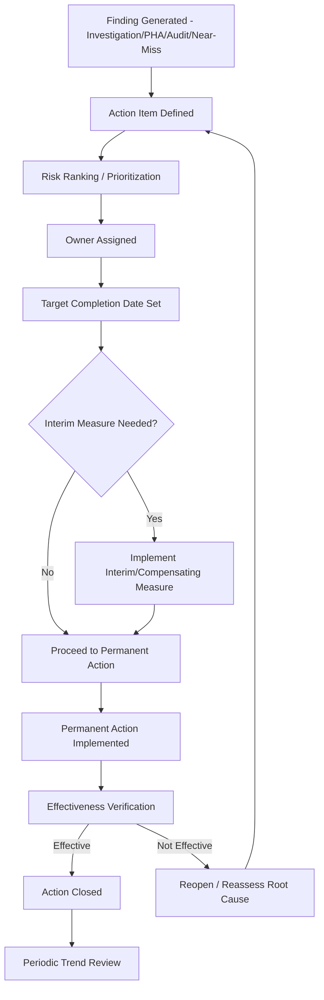

## Corrective Action Tracking and Effectiveness Verification

### Overview

Corrective Action Tracking and Effectiveness Verification is the closed-loop management system that ensures findings from incident investigations, near-miss reports, audits, and process hazard analyses (PHAs) translate into implemented changes that actually eliminate or reduce the underlying risk. Under Process Safety Management (PSM), this is one of the most frequently cited compliance gaps: organizations often perform thorough investigations and generate sound recommendations, but fail to track them to completion or verify that the implemented action actually worked as intended.

### Regulatory Basis

**29 CFR 1910.119(m)(4)-(6) — Incident Investigation**

The PSM standard requires that:

- A report be prepared documenting findings and recommendations resulting from the investigation.
- The employer establish a system to promptly address and resolve the incident report findings and recommendations, with resolutions and corrective actions documented.
- The report be reviewed with all affected personnel whose job tasks are relevant to the findings.
- Reports be retained for five years.

**29 CFR 1910.119(o) — Compliance Audits**

Similarly requires that deficiencies identified in PSM compliance audits be documented and that the employer "promptly" address them, again requiring a tracking mechanism to closure.

**29 CFR 1910.119(e)(5) — Process Hazard Analysis**

PHA recommendations are subject to the same requirement: the employer must establish a system to promptly address findings and document resolution.

**Common Regulatory Thread:** Across (e), (m), and (o), OSHA does not merely require that recommendations be generated — it requires a documented, trackable resolution system with defined timelines. OSHA inspectors and compliance audits frequently examine the corrective action tracking log itself as primary evidence of PSM program health, independent of the quality of the original investigations.

### Core Concepts

#### Corrective Action vs. Preventive Action (CAPA distinction)

- **Corrective Action** — addresses the root cause of a problem that has already occurred, preventing recurrence of that specific failure mode.
- **Preventive Action** — addresses a potential problem identified proactively (e.g., via near-miss reporting or PHA), preventing initial occurrence.
- Both follow the same tracking and verification lifecycle in most PSM management systems, even though the trigger differs.

#### Interim vs. Permanent Actions

- **Interim/compensating measures** — temporary risk-reduction actions implemented immediately while a permanent fix is engineered, procured, or scheduled (e.g., increased manual monitoring frequency while a replacement instrument is on order).
- **Permanent corrective action** — the engineered, procedural, or systemic fix that addresses the root cause on a durable basis.
- **Key Point:** Interim measures must themselves be tracked and should not be allowed to become de facto permanent solutions through organizational inertia — a recognized failure pattern in major incident case histories (e.g., extended "temporary" bypass of safety systems).

### Corrective Action Lifecycle

### Key Elements of a Tracking System

#### 1. Centralized Action Item Database

- A single system of record (dedicated PSM software, CMMS module, or enterprise GRC/EHS platform) capturing every action item regardless of source (incident investigation, PHA, audit, near-miss, MOC, mechanical integrity inspection).
- **Traceability field** — each action item should be linked back to its originating finding/document, enabling audit trail reconstruction.
- [Inference] Fragmented tracking across spreadsheets, email, and paper systems is one of the most commonly cited weaknesses in PSM programs during regulatory audits, though the specific prevalence varies by organization and has not been comprehensively quantified across the industry as a single statistic.

#### 2. Risk-Based Prioritization

Action items are typically ranked using a risk matrix (severity × likelihood) to set appropriate completion timelines:

| Risk Ranking | Typical Target Timeline | Example |
| --- | --- | --- |
| Critical/Immediate | Before startup / within days | Safety-critical interlock found non-functional |
| High | 30–90 days | Relief valve sizing discrepancy found in PHA |
| Medium | 90–180 days | Procedure update needed for a non-critical step |
| Low | Next scheduled turnaround/budget cycle | Minor labeling or documentation improvement |

#### 3. Ownership and Accountability

- Each action item assigned to a specific, named individual (not a department or generic role), with a defined due date.
- Escalation paths for overdue items — typically automated notifications to the owner's supervisor or a process safety steering committee when items pass their due date without extension justification.

#### 4. Extension and Deviation Management

- Legitimate schedule changes (e.g., awaiting capital budget approval, long-lead equipment procurement) should be documented with justification and a revised date, not left silently overdue.
- **Key Point:** A pattern of repeated extensions without underlying justification is itself a leading indicator of management system weakness and is a common focus area in PSM audits and CSB investigations of major incidents.

#### 5. Effectiveness Verification

This is the step most frequently overlooked in immature systems: confirming that a "completed" action actually **works** as intended, not merely that a task was performed.

**Verification Approaches by Action Type:**

| Corrective Action Type | Verification Method |
| --- | --- |
| Equipment replacement/upgrade | Post-implementation functional test, inspection record review |
| Procedure revision | Confirm training completed; observe task performance against revised procedure; monitor for recurrence of the deviation the procedure was meant to prevent |
| Alarm/interlock logic change | Functional test/proof test of the new logic; review of subsequent alarm/trip history |
| Training program change | Competency assessment post-training; monitor relevant near-miss/incident trend for the target behavior |
| Management system/policy change | Audit of compliance with the new policy after a defined period; review of related metric trends (e.g., near-miss reporting rate, overdue PM backlog) |

**Verification Timing:** Effectiveness verification should occur on a delay sufficient to observe real operating conditions relevant to the original failure mode — closing an action immediately upon physical completion (e.g., "valve replaced") without observing subsequent performance risks declaring an ineffective fix as resolved.

#### 6. Closure Criteria and Sign-off

- Formal closure requires documented evidence of both **implementation** and **effectiveness verification**, typically with sign-off from someone independent of the person who implemented the action (mirroring the independence principle applied to investigation teams).
- Closure documentation retained per regulatory record-retention requirements (five years minimum under 1910.119(m), though many organizations retain longer for trend analysis purposes).

### Example: Full Lifecycle Walkthrough

**Finding:** Incident investigation into a pump seal failure identifies root cause as inadequate vibration monitoring frequency, which failed to detect progressive bearing wear.

1. **Action item defined:** "Increase vibration monitoring frequency on Pump P-101 from quarterly to monthly; evaluate for permanent online vibration monitoring."
2. **Risk ranking:** High (repeat failure risk on a critical service pump).
3. **Owner assigned:** Reliability Engineer, target date 45 days for interim frequency change; 180 days for online monitoring evaluation.
4. **Interim measure:** Monthly manual vibration readings implemented within one week, logged in CMMS.
5. **Permanent action:** Online vibration monitoring system installed and integrated into the plant historian/DCS alarm system at day 165.
6. **Effectiveness verification:** At 90 days post-installation, reliability engineering reviews vibration trend data to confirm the system is correctly detecting known baseline vibration signatures and that alarm thresholds are appropriately set (not generating nuisance alarms, not missing early-stage degradation based on comparison with manual readings taken in parallel during commissioning).
7. **Closure:** Action closed with attached trend report and independent sign-off from the maintenance manager (not the reliability engineer who implemented the change).
8. **Trend review:** Six months later, the periodic process safety committee review confirms no repeat seal failures on P-101 and notes the online monitoring approach as a candidate for broader rollout to other critical pumps — feeding back into the corrective action system as a new proactive action item.

### Metrics for Program Health

- **Percentage of action items closed on original due date** (without extension).
- **Average age of open action items**, segmented by risk ranking.
- **Overdue action item count**, trended over time.
- **Effectiveness verification completion rate** — percentage of closed items with documented verification evidence, as distinct from mere implementation confirmation.
- **Repeat finding rate** — recurrence of substantively similar findings, which may indicate prior corrective actions were ineffective or improperly verified.

**Disclaimer:** Actual acceptable thresholds for these metrics (e.g., what percentage of on-time closure is considered healthy) vary by organization, industry sector, and regulatory jurisdiction; behavior and appropriate targets should be calibrated to each facility's specific risk profile and PSM program maturity.

### Common Pitfalls

- **Closing actions on implementation alone** — marking an item "complete" once a physical or procedural change is made, without verifying it actually addresses the root cause.
- **No independent closure review** — allowing the same person who implemented the action to also verify and close it, reducing objectivity.
- **Interim measures becoming permanent by default** — temporary compensating measures persisting indefinitely without a tracked plan or deadline for the permanent fix.
- **Fragmented tracking systems** — action items scattered across multiple spreadsheets, email threads, or disconnected software modules, preventing aggregate trend visibility and complicating audits.
- **Under-resourced ownership** — assigning action items to individuals without the authority, budget access, or bandwidth to actually complete them, leading to chronic overdue status.
- **No escalation mechanism** — overdue items with no automatic notification or management visibility, allowing risk-bearing gaps to persist silently.
- **Treating recommendations as optional** — informally deprioritizing lower-severity findings without formal risk acceptance documentation and sign-off from an appropriate authority level.

### Related Topics

- Investigation Team Formation and Independence
- Root Cause Analysis Techniques
- Near-Miss and Precursor Reporting Systems
- Process Hazard Analysis (PHA) Recommendation Tracking
- Management of Change (MOC) Process
- Process Safety Management Auditing (1910.119(o))
- Mechanical Integrity Program and Inspection Scheduling
- Process Safety Metrics: Leading and Lagging Indicators (CCPS/API RP 754)
- Risk Matrices and Prioritization Methodologies
- Recordkeeping and Retention Requirements Under PSM