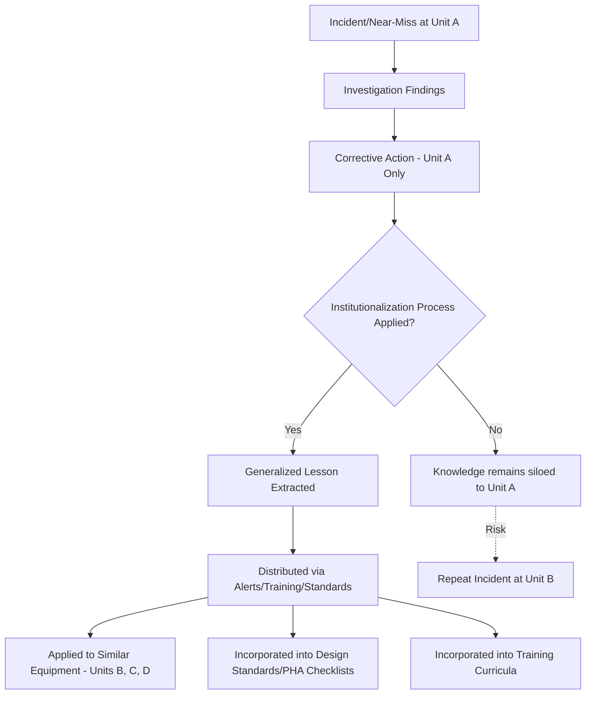

## Institutionalizing Lessons Learned

### Overview

Institutionalizing Lessons Learned is the discipline of converting incident investigation findings, near-miss data, and corrective action outcomes into durable organizational knowledge that persists beyond the individuals directly involved in the original event. Without institutionalization, lessons remain confined to the memory of the investigation team, the specific unit where the incident occurred, or a single corrective action record — leaving the rest of the organization, future employees, and other facilities exposed to the same root cause. This is distinct from corrective action tracking (which resolves a specific finding) in that it addresses knowledge transfer and organizational memory at scale, across time, sites, and personnel turnover.

### Why Institutionalization Fails Without Deliberate Design

Process safety incident history repeatedly shows that many major incidents are, in some causal respect, repeats of previously known failure modes — either from the same facility's own history or from well-documented industry incidents. CCPS and CSB investigations of major incidents frequently note that the specific hazard or failure mechanism involved had been previously identified in an internal investigation, industry alert, or even the facility's own PHA, but the finding did not translate into durable, organization-wide awareness or design/procedural change.

**Key Point:** A finding that is correctly identified and even correctly closed as a corrective action can still fail to become an institutionalized lesson if the underlying principle is not generalized and distributed beyond the specific equipment or unit involved.

### Core Mechanisms for Institutionalization

#### 1. Lessons-Learned Alerts / Safety Bulletins

- Concise, standardized documents summarizing an incident's key facts, root cause, and applicable corrective actions, distributed proactively across a facility, business unit, or entire corporation.
- Typically triggered automatically for any incident meeting a severity threshold or involving a safety-critical system, not left to discretionary judgment of the local investigation team.
- **Structure commonly includes:** brief incident description, what happened, why it happened (root cause, generalized), what changed as a result, and — critically — a prompt asking the receiving unit to self-assess whether the same condition could exist at their site ("Does this apply to us?").

#### 2. Cross-Site Applicability Reviews

- A structured process requiring other facilities within a company (particularly those with similar process technology, equipment vendors, or unit operations) to formally document whether a lesson from one site's incident applies to their own operation, and if so, to open a corresponding action item in their own tracking system.
- **Key distinction from a simple bulletin:** this creates an auditable requirement for a response, rather than passive information distribution that recipients may or may not act upon.

#### 3. Integration into Design and Engineering Standards

- Generalized lessons are codified into internal engineering standards, specifications, or design basis documents so that future projects automatically inherit the lesson without relying on institutional memory of the original incident.
- Example: if an investigation determines that a specific gasket material is incompatible with a particular process chemistry under certain temperature excursions, this should be reflected in the material selection standard for that service, not merely fixed on the specific vessel involved.

#### 4. Incorporation into PHA/HAZOP Checklists and Guidewords

- Facilitators conducting future Process Hazard Analyses should have access to a library of past incident causes relevant to the process type under review, ensuring previously realized failure modes are explicitly considered as credible scenarios rather than rediscovered independently (or missed) by each new PHA team.
- Some organizations maintain a "what-if" or scenario library specifically populated from historical incident data as a standing input to PHA revalidation cycles.

#### 5. Training Curriculum Updates

- Root causes involving human performance, procedural gaps, or skill/knowledge deficits should feed directly into operator and engineer training programs, ideally using de-identified or appropriately framed case studies from the organization's own incident history (or well-documented industry incidents such as CSB investigations) as teaching material.
- **Key Point:** Training case studies drawn from real, well-explained incidents (with clear causal chains) are consistently identified in process safety education literature as more effective for retention and hazard recognition than generic or hypothetical scenarios, because they connect abstract principles to concrete, credible failure sequences.

#### 6. Management of Change (MOC) Triggers

- Where a lesson learned implies a permanent change to a standard, procedure, or design basis, the change itself should be processed through the formal MOC system, ensuring the change is properly reviewed, communicated, and documented — not implemented informally as a side effect of closing an action item.

#### 7. Aggregate Trend Analysis and Periodic Review

- Beyond individual lesson distribution, periodic (e.g., annual) review of aggregated incident and near-miss data across the organization to identify recurring themes that may not be obvious from any single event.
- This level of institutionalization operates at the management-system level — identifying, for example, that multiple unrelated incidents across different units share a common root cause category (e.g., inadequate management of temporary/contractor personnel), which may warrant a policy-level response rather than a series of individual technical fixes.

### Organizational Roles and Structures Supporting Institutionalization

| Role/Structure | Function |
| --- | --- |
| Process Safety Steering Committee | Reviews aggregate incident/near-miss trends across sites; approves cross-site alert distribution; sponsors policy-level changes |
| Corporate Process Safety Group | Maintains standardized lessons-learned template; tracks cross-site applicability review completion; liaises with engineering standards owners |
| Site Process Safety Coordinator | Local point of contact for receiving and acting on cross-site alerts; ensures local applicability reviews are completed and documented |
| Engineering Standards Committee | Owns the process for incorporating validated lessons into design/engineering standards documents |
| Training Department | Integrates case studies and updated procedures into curricula; tracks completion of updated training modules |

### Distinguishing Institutionalization from Simple Documentation

A common misconception is that retaining investigation reports (as required by 1910.119(m)(5), five-year retention) constitutes institutionalization. In practice, a filed report that is never actively distributed, indexed for searchability, or incorporated into forward-looking processes (PHA, design standards, training) provides limited protective value beyond regulatory compliance, since:

- New personnel joining after the incident have no natural exposure to the original report.
- Other units or sites are unlikely to proactively search historical investigation archives unless prompted.
- The specific technical details of an old report may not be recognized as relevant to a new, superficially different but causally similar scenario unless the underlying principle has been generalized and actively surfaced.

**[Inference]** Passive archival without active distribution and process integration is widely regarded in process safety literature as insufficient for genuine institutional learning, though the degree of insufficiency is necessarily qualitative rather than a precisely measured deficiency, since it depends on organization-specific factors such as turnover rate, unit similarity, and existing knowledge-sharing culture.

### Example: Institutionalization Workflow

**Scenario:** An investigation at Site A determines that a check valve installed backward during a maintenance turnaround caused a reverse-flow event that damaged a compressor. The root cause includes both a specific procedural gap (no mandatory flow-direction verification step in the maintenance work instruction) and a broader finding (check valve orientation was not clearly marked on the piping isometric drawings used by the maintenance crew).

1. **Immediate corrective action (Site A only):** Compressor repaired; maintenance work instruction revised to add a flow-direction verification step; piping isometrics updated to clearly mark valve orientation for that specific line.
2. **Lesson generalization:** The process safety coordinator recognizes the underlying issue — reliance on installer judgment for flow-direction-critical components without independent verification — as a generalizable pattern, not unique to this specific valve or line.
3. **Cross-site alert issued:** A lessons-learned bulletin is distributed to all sites with similar check-valve-critical services, requiring each site to confirm whether their own piping isometrics clearly indicate flow-direction-critical valve orientations and whether their maintenance procedures include independent verification steps.
4. **Engineering standard update:** The corporate piping design standard is revised to require flow-direction annotation on isometric drawings for all check valves in safety-critical or reverse-flow-sensitive services, ensuring future projects inherit the requirement by default.
5. **Training update:** A case study based on the incident (with plant-identifying details appropriately generalized) is added to the mechanical maintenance training curriculum's module on valve installation verification.
6. **PHA checklist update:** "Check valve installed in incorrect orientation" is added as a standing consideration in the HAZOP guideword library for any future PHA involving check-valve-dependent flow control.
7. **Aggregate review:** At the annual process safety trend review, this finding is cross-referenced against other minor maintenance-verification-related near-misses from the past year; if a pattern emerges, it may prompt a broader review of maintenance work instruction quality control practices across the organization.

### Metrics for Institutionalization Program Health

- **Cross-site applicability review completion rate** — percentage of distributed lessons-learned alerts with a documented completion of the applicability review at each relevant site, within a defined timeframe.
- **Time from finding to standard/procedure update** — elapsed time between generalized lesson identification and its incorporation into a design standard, procedure, or training curriculum.
- **Repeat incident/near-miss rate for previously identified failure modes** — the most direct (though lagging) measure of institutionalization effectiveness; a recurrence of a substantively similar root cause elsewhere in the organization after a lesson was distributed indicates a gap in the institutionalization process itself, not merely the original corrective action.
- **Training module currency** — percentage of relevant training curricula updated within a target timeframe following a significant lesson-learned distribution.

### Common Pitfalls

- **Treating distribution as institutionalization** — sending an email or posting a bulletin without requiring documented acknowledgment or applicability assessment from recipients.
- **Failure to generalize** — closing the specific finding at the originating unit without extracting and communicating the broader principle applicable elsewhere.
- **No mechanism for cross-site accountability** — lessons-learned programs that rely on voluntary, undocumented review by other sites tend to see inconsistent uptake.
- **Institutional knowledge loss through personnel turnover** — lessons that exist only in the memory of specific long-tenured employees rather than in codified standards, procedures, and training materials are vulnerable to being lost when those individuals leave or retire.
- **Alert fatigue** — excessive volume or poor prioritization of distributed lessons-learned bulletins can lead recipients to deprioritize or superficially process them; severity-based triggering and concise, actionable formatting help mitigate this.
- **Disconnected systems** — lessons-learned processes that operate independently from PHA revalidation, MOC, and training update cycles, requiring manual cross-referencing rather than integrated triggers.
- **No feedback loop to confirm effectiveness** — similar to corrective action tracking, failing to verify that a distributed lesson actually resulted in a real change at recipient sites, rather than a documented but superficial "reviewed, no action needed" response.

### Related Topics

- Investigation Team Formation and Independence
- Root Cause Analysis Techniques
- Near-Miss and Precursor Reporting Systems
- Corrective Action Tracking and Effectiveness Verification
- Process Hazard Analysis (PHA) Revalidation Cycles
- Management of Change (MOC) Process
- Process Safety Culture and High Reliability Organization (HRO) Principles
- Employee Training and Competency Assurance Programs
- Process Safety Metrics: Leading and Lagging Indicators
- Industry Incident Databases and External Lessons Learned (CSB, API, CCPS Process Safety Beacon)