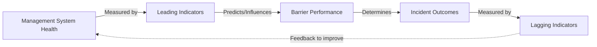
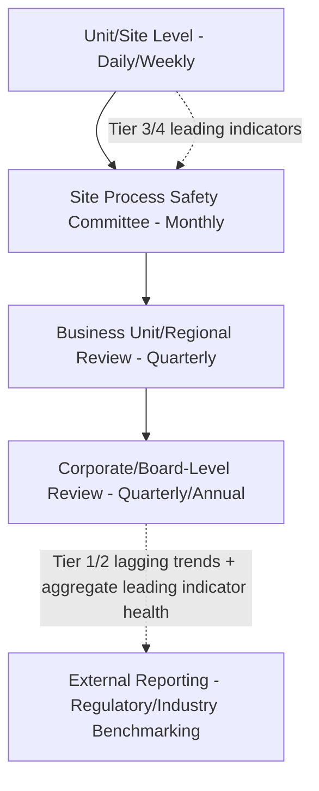

## Leading Versus Lagging Indicators

### Overview

Leading and lagging indicators are the two fundamental categories of Process Safety Management (PSM) metrics used to measure and manage risk within a facility or organization. Lagging indicators measure outcomes that have already occurred — they tell an organization how it has performed. Leading indicators measure the health of the underlying management systems and barriers that are intended to prevent those outcomes — they tell an organization how it is likely to perform. A mature process safety measurement program uses both categories together, since lagging indicators alone provide no early warning capability, and leading indicators alone provide no confirmation that risk reduction efforts are translating into actual outcome improvement.

### Foundational Distinction

**Key Point:** Lagging indicators answer "what happened?" Leading indicators answer "how well are we positioned to prevent what could happen?" The core value of leading indicators is that they can be acted upon *before* an incident occurs, whereas lagging indicators are inherently after-the-fact.

### Regulatory and Industry Context

**CCPS Guidelines for Process Safety Metrics**

The Center for Chemical Process Safety's process safety metrics guidance is the primary industry reference establishing the leading/lagging framework for the chemical and refining sectors, building on earlier work by the UK Health and Safety Executive (HSE) and the Baker Panel report following the 2005 BP Texas City incident, which explicitly criticized the industry's historical over-reliance on personal injury lagging indicators (e.g., OSHA recordable rate) as a proxy for process safety performance.

**API RP 754 — Process Safety Performance Indicators for the Refining and Petrochemical Industries**

Establishes a four-tier classification system (summarized below) that operationalizes the leading/lagging distinction into a structured hierarchy, widely adopted across the hydrocarbon processing industry.

**OSHA PSM Standard (29 CFR 1910.119)**

Does not explicitly mandate a leading/lagging metrics framework by name, but requirements such as compliance auditing (1910.119(o)), mechanical integrity inspection scheduling (1910.119(j)), and PHA recommendation tracking (1910.119(e)) generate the underlying data that leading indicator programs typically draw upon.

### The Baker Panel Finding (Historical Context)

Following the 2005 BP Texas City refinery explosion, the independent panel led by James Baker III found that the facility and corporation had relied heavily on personal injury/occupational safety statistics (a lagging indicator focused on individual worker injuries, e.g., slips, falls, vehicle incidents) as evidence of strong safety performance, while process safety-specific leading indicators (equipment integrity backlogs, safety system deferred maintenance, PHA recommendation closure rates) showed significant degradation that was not being tracked or escalated with equivalent rigor. This finding is widely credited with catalyzing the industry's formal adoption of distinct process safety metrics frameworks, separate from traditional occupational safety metrics.

**[Inference]** The Baker Panel's specific findings are well documented in its published report; the broader claim that this finding was the primary catalyst for industry-wide leading indicator adoption reflects a consensus view in process safety literature, though multiple contributing factors (CCPS's own prior guidance development, other incident investigations) also played a role.

### API RP 754 Tier Structure

| Tier | Category | Type | Description | Example |
| --- | --- | --- | --- | --- |
| Tier 1 | Loss of Primary Containment (LOPC) — significant consequence | Lagging | Major, high-consequence process safety events | Large hydrocarbon release with fire, explosion, or serious injury |
| Tier 2 | LOPC — lesser consequence | Lagging | Process safety events below Tier 1 threshold but still a loss of containment | Minor leak requiring response but below major consequence criteria |
| Tier 3 | Challenges to safety systems | Leading (near-real-time) | Demands on safeguards that did not result in LOPC | Relief valve lift, safety instrumented system (SIS) trip, near-miss LOPC |
| Tier 4 | Operating discipline and management system performance | Leading | Underlying management system health indicators | PHA recommendation backlog, overdue mechanical integrity inspections, procedure deviation rate |

**Key distinction within the tier structure:** Tiers 1 and 2 are outcome-based (lagging); Tiers 3 and 4 are predictive/systemic (leading), with Tier 4 representing the deepest leading indicators — measuring the health of the management systems that ultimately determine Tier 3 and Tier 1/2 performance.

### Common Lagging Indicators

- **Process Safety Total Incident Rate (PSTIR)** — Tier 1 and Tier 2 events per 200,000 work hours (mirroring OSHA recordable rate calculation convention).
- **Loss of Primary Containment (LOPC) count** — number of unplanned releases exceeding a defined threshold quantity.
- **Fire and explosion incidents.**
- **Fatalities and serious injuries attributable to process safety events** (as distinct from general occupational injuries such as slips/trips/falls).
- **Environmental release volume/count** exceeding regulatory reportable quantities.
- **Regulatory citations and fines** related to process safety.

**Limitation:** Lagging indicators, by definition, only register after a failure has already occurred. In facilities with low incident frequency (which is the goal), lagging indicators can provide a false sense of security — an extended period without a Tier 1 event does not necessarily mean underlying risk is well controlled; it may simply mean latent weaknesses have not yet been triggered by the right combination of circumstances.

### Common Leading Indicators

#### Tier 3 (Near-Real-Time Safety System Challenges)

- Relief device activations (excluding those from planned/expected process conditions).
- Safety Instrumented System (SIS) demand/trip counts.
- Near-miss reports with high-potential severity classification.

#### Tier 4 (Operating Discipline / Management System Health)

- **PHA recommendation closure rate and backlog age.**
- **Mechanical integrity inspection completion rate** (percentage of scheduled inspections completed on time; overdue inspection backlog).
- **Management of Change (MOC) completion rate and cycle time**, and percentage of changes implemented without a completed MOC (a particularly significant indicator, since bypassing MOC is a recurring root cause theme in major incident investigations).
- **Training and competency assurance completion rates** for safety-critical roles.
- **Preventive maintenance (PM) compliance rate** on safety-critical equipment.
- **Alarm management performance** — alarm flood frequency, percentage of alarms within design standard rates (per ISA-18.2).
- **Corrective action closure rate and average age of open items** from investigations and audits.
- **Process safety competency/staffing levels** relative to defined requirements.
- **Near-miss reporting rate** — counterintuitively, an *increasing* reporting rate is often interpreted as a positive leading indicator (reflecting improved hazard awareness and reporting culture), in contrast to most other leading indicators where lower values are generally favorable.

### Comparative Summary Table

| Attribute | Leading Indicators | Lagging Indicators |
| --- | --- | --- |
| Timing | Measured before/during ongoing operations | Measured after an event has occurred |
| Purpose | Predict and enable proactive intervention | Confirm outcomes; measure historical performance |
| Actionability | High — can trigger corrective action before harm occurs | Low — the event has already happened |
| Data availability | Often requires deliberate system design to capture (e.g., near-miss reporting infrastructure) | Typically already captured via incident reporting/regulatory requirements |
| Risk of misinterpretation | Can be numerous and require careful selection to avoid measuring activity rather than effectiveness | Can create false confidence during low-incident periods despite underlying risk |
| Example | PHA recommendation backlog age | Tier 1 LOPC event count |

### Selecting and Designing an Effective Metrics Program

#### Avoiding "Activity Metrics" Masquerading as Leading Indicators

A common design flaw is selecting metrics that measure whether an activity occurred (e.g., "number of safety meetings held") rather than whether a management system is actually functioning effectively (e.g., "percentage of safety-critical equipment inspections completed within their defined interval, with findings closed within target timeframe"). **Key Point:** An effective leading indicator should have a demonstrable or reasonably inferable causal link to the barriers that prevent Tier 1/2 events — not merely reflect organizational busyness.

#### Balancing Metric Volume

- Too few leading indicators risk missing significant blind spots in specific management system areas (e.g., tracking only mechanical integrity while ignoring MOC or training completion).
- Too many leading indicators risk diluting management attention and can obscure genuinely significant trends within a large dashboard of lower-priority data points.
- CCPS guidance generally recommends selecting a focused set of indicators directly tied to the facility's most significant identified process safety risks (informed by PHA findings and incident history) rather than a generic, one-size-fits-all metric list.

#### Site-Specific and Risk-Informed Selection

- [Inference] Metrics should ideally be weighted toward the specific hazard scenarios and safeguards identified as most significant in a facility's own PHA/LOPA studies, since a generic industry metric set may not capture the barriers most relevant to that facility's particular risk profile; however, the precise weighting methodology is organization-specific and not standardized across the industry.

### Governance and Reporting Cadence

- **Frequency alignment:** Leading indicators (especially Tier 4) are typically reviewed at higher frequency (monthly or even weekly at unit level) since they are intended to enable timely intervention; lagging indicators are commonly reported quarterly/annually for trend and benchmarking purposes, though any Tier 1 event typically triggers immediate escalation regardless of reporting cadence.
- **Board and executive visibility:** Following the Baker Panel's recommendations, many corporations now require board-level or senior executive review of process safety leading indicators specifically (not merely aggregate injury statistics), reflecting the recognition that process safety risk requires distinct executive attention from occupational safety risk.

### Practical Example: Interpreting a Combined Dashboard

**Scenario:** A refinery's Tier 1/2 lagging indicator trend shows zero major LOPC events for the past 18 months — an apparently strong lagging performance record. However, the Tier 4 leading indicator dashboard shows:

- Mechanical integrity inspection completion rate has declined from 95% to 78% over the same period.
- MOC average cycle time has increased, with a rising percentage of changes flagged as implemented before MOC documentation was finalized.
- PHA recommendation backlog age has grown, with several high-risk-ranked items now significantly overdue.

**Interpretation:** Despite the favorable lagging indicator trend, the leading indicator degradation signals accumulating latent risk — inspection backlogs mean undetected equipment degradation may be occurring; MOC discipline erosion increases the likelihood that undocumented or improperly reviewed changes introduce new hazards; PHA recommendation delays mean previously identified risk-reduction measures remain unimplemented. **Key Point:** This is precisely the scenario the Baker Panel highlighted — favorable lagging data can coexist with, and even mask, deteriorating underlying process safety management system health, making leading indicators essential for proactive risk management rather than reliance on absence of recent incidents alone.

### Common Pitfalls

- **Over-reliance on lagging indicators alone** — using absence of recent incidents as the primary evidence of good process safety performance, without visibility into underlying management system health.
- **Conflating occupational safety and process safety lagging indicators** — a low OSHA recordable injury rate (slips, falls, ergonomic injuries) does not indicate low process safety risk (loss of containment, fire, explosion potential), since these reflect different hazard categories and different underlying management systems.
- **Selecting activity-based rather than outcome/health-based leading indicators** — tracking metrics that measure whether a task was performed rather than whether the underlying barrier is actually functioning effectively.
- **Metric proliferation without prioritization** — excessive numbers of tracked leading indicators diluting management focus and obscuring the most significant trends.
- **Insufficient escalation linkage** — leading indicator degradation identified at the unit level but not effectively escalated to a level of the organization with authority to allocate resources for correction.
- **Static metric sets** — failing to periodically revisit and update the leading indicator set as the facility's risk profile, PHA findings, or incident history evolve.
- **Treating near-miss reporting rate inconsistently** — misinterpreting a rising near-miss reporting rate as a negative trend (more problems) rather than potentially a positive trend (better detection and reporting culture), without considering the broader reporting culture context.

### Related Topics

- Corrective Action Tracking and Effectiveness Verification
- Near-Miss and Precursor Reporting Systems
- API RP 754 Process Safety Event Classification
- Process Hazard Analysis (PHA) and LOPA Methodologies
- Management of Change (MOC) Process
- Mechanical Integrity Programs and Inspection Scheduling
- Process Safety Culture and High Reliability Organization (HRO) Principles
- Board and Executive Governance of Process Safety Performance
- Alarm Management and ISA-18.2 Standards
- Benchmarking and Industry Data Sharing (CCPS, API Process Safety Performance Indicators)