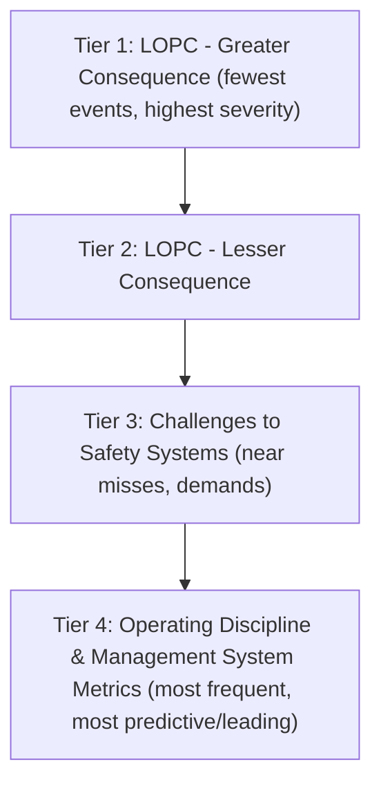

## API RP 754 Tiered Indicator Framework

### Overview

API Recommended Practice 754 (Process Safety Performance Indicators for the Refining and Petrochemical Industries) establishes a standardized methodology for measuring process safety performance across the hydrocarbon and chemical processing industries. First published in 2010 following recommendations from the Baker Panel report on the 2005 Texas City refinery explosion, and revised in subsequent editions, the standard organizes process safety events into a four-tier pyramid that distinguishes lagging indicators (Tiers 1–2), near-miss/challenge indicators (Tier 3), and leading operational discipline indicators (Tier 4). The framework is widely adopted alongside CCPS (Center for Chemical Process Safety) metrics guidance and is referenced by many corporate PSM governance programs even outside refining/petrochemical, including upstream and chemical manufacturing.

### The Four-Tier Structure

#### Tier 1 — Loss of Primary Containment (LOPC) Events with Greater Consequence

- **Key Points**
  - Represents the most severe unplanned or uncontrolled releases resulting in significant consequence
  - Qualifying consequence thresholds include: injury with days away from work, hospital admission or fatality, fire/explosion with significant damage, release exceeding specified quantity thresholds within one hour, or evacuation/shelter-in-place of the public
  - Release quantity thresholds are substance-specific, tied to hazard classification (e.g., flammability, toxicity) and referenced against tables in the standard

**Example**

A relief valve lifts on a hydrocarbon vessel, releasing greater than the specified threshold quantity of a flammable liquid within one hour, resulting in a flash fire that causes recordable injury — this qualifies as a Tier 1 event.

#### Tier 2 — LOPC Events with Lesser Consequence

- Captures LOPC events that exceed defined thresholds but do not meet the higher-severity Tier 1 consequence criteria
- Lower quantity release thresholds than Tier 1, or consequences such as first-aid-level injury, minor fire, or a safe operating limit excursion combined with a release
- Serves as an intermediate lagging indicator, capturing events that represent a meaningful loss of containment but were contained before escalating

#### Tier 3 — Challenges to Safety Systems

- Near-miss and demand-based indicators reflecting when a safety system or barrier was actually challenged, even if no release occurred
- Examples: demands on relief valves, activation of emergency shutdown systems, inspection/turnaround findings requiring unplanned action, spurious trips of safety instrumented systems (SIS), and exceedances of safe operating limits without release
- Intended to capture "layers of protection" being consumed, providing earlier warning than Tier 1/2 metrics

**Example**

A pressure safety valve (PSV) lifts due to a control system malfunction but the released material is fully contained by the flare system with no LOPC above threshold — this is tracked as a Tier 3 challenge event, not a Tier 1/2 LOPC.

#### Tier 4 — Operating Discipline and Management System Performance

- Leading indicators measuring the health of underlying process safety management systems
- Facility- or company-defined metrics such as: percentage of PHA action items closed on schedule, overdue inspections, percentage of safety-critical equipment tests completed on time, training completion rates, MOC backlog
- Tier 4 metrics are intentionally not standardized across the industry since they reflect each organization's specific management system elements and priorities

### The Pyramid Relationship

The pyramid shape reflects the expectation that Tier 4 and Tier 3 events are far more numerous than Tier 1 events, and that trends in lower tiers can provide earlier warning of degrading process safety performance before a Tier 1 event occurs. [Inference] This ordering assumes a reasonably functioning reporting culture; underreporting at Tier 3/4 undermines the framework's leading-indicator value.

### Reporting and Normalization

- Tier 1 and Tier 2 rates are typically normalized per 200,000 work hours, consistent with OSHA recordable injury rate conventions, to allow benchmarking across facilities of different sizes
- Companies commonly publish Tier 1 and Tier 2 rates in sustainability/EHS reports; Tier 3 and Tier 4 metrics are more often used internally for operational management
- API RP 754 provides definitions and consequence thresholds but does not mandate public disclosure; disclosure practices vary by company and jurisdiction

### Relationship to Other Frameworks

| Framework | Relationship |
| --- | --- |
| CCPS Process Safety Metrics Guidance | Conceptually aligned tiered approach; CCPS guidance predates and informed API 754 |
| OSHA PSM (1910.119) | API 754 metrics are not an OSHA regulatory requirement but are commonly used to demonstrate PSM program health |
| EPA RMP | Independent regulatory reporting; API 754 Tier 1 events may overlap with RMP-reportable accidental releases but use different consequence criteria |
| IOGP (International Association of Oil & Gas Producers) | IOGP Report 456 adapts similar tiered indicator concepts for upstream operations |

### Implementation Considerations

- Requires a robust incident classification and investigation process to consistently apply Tier 1/2 consequence thresholds
- Data quality depends on reporting culture; Tier 3 in particular is vulnerable to underreporting if near-misses are not actively encouraged and non-punitively received
- Facilities typically integrate Tier 1–4 tracking into their existing incident management and MOC systems rather than maintaining a separate parallel system

**Conclusion**

The API RP 754 tiered framework provides a structured, industry-benchmarked method for distinguishing severe loss-of-containment events from earlier warning signals embedded in safety system challenges and management system performance. Its principal value lies not in any single tier but in trending across tiers over time to detect erosion of process safety performance before it manifests as a major incident.

**Related Topics**

- CCPS Process Safety Metrics and Guidelines
- Loss of Primary Containment (LOPC) Classification Criteria
- Leading vs. Lagging Indicators in Process Safety
- Safety Instrumented System (SIS) Demand Rate Tracking
- Process Safety Culture and Underreporting Bias
- Benchmarking Process Safety Performance Across Facilities