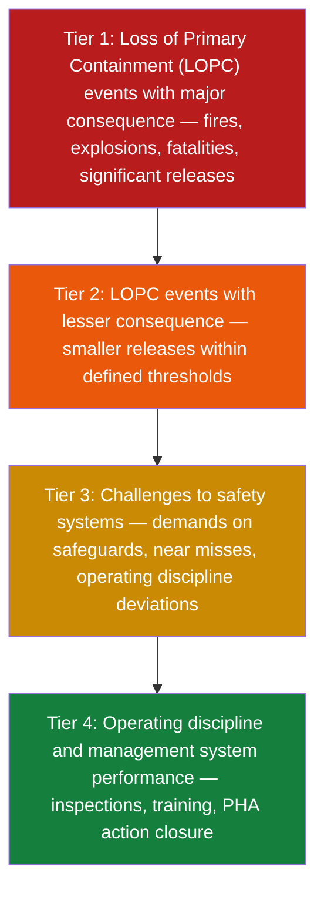
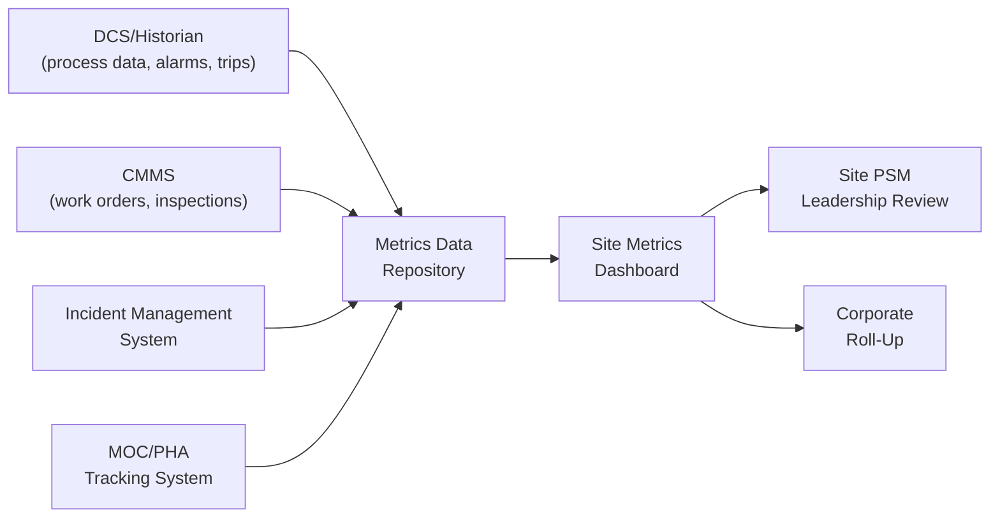
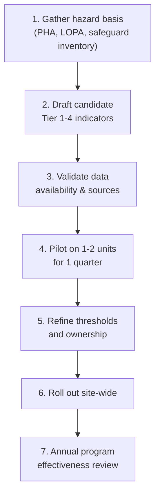

## Designing a Site-Level Metrics Program

### Purpose and Scope

A site-level metrics program translates corporate PSM policy and regulatory expectations (OSHA PSM 29 CFR 1910.119, EPA RMP, API RP 754, CCPS guidelines) into a measurable, site-specific system that tracks process safety performance, detects deteriorating conditions before incidents occur, and drives accountability across operations, maintenance, and engineering functions. The program must be designed — not simply assembled from generic indicators — because a mismatched metrics set produces false assurance, alert fatigue, or blind spots specific to the site's process hazards.

**Key Points**

- The program should be hazard-driven: derived from the site's Process Hazard Analysis (PHA), Layers of Protection Analysis (LOPA), and safeguard inventory, not copied wholesale from another facility.
- It must balance lagging indicators (outcomes) with leading indicators (precursors to loss of containment).
- Governance, data quality, and response protocols are as important as indicator selection itself.

---

### Foundational Framework: API RP 754

API RP 754 ("Process Safety Performance Indicators for the Refining and Petrochemical Industries") is the dominant industry framework for structuring a tiered metrics program, and is widely adapted outside refining/petrochemical contexts.

#### The Four-Tier Pyramid

- **Tier 1 and Tier 2** are lagging indicators — they measure actual loss of primary containment (LOPC) and are reported against consequence thresholds (quantity released, injury, fire, explosion).
- **Tier 3** indicators are leading/near-leading — they count challenges to safety systems (e.g., relief valve lifts, high-high level trips, inspection findings requiring immediate action).
- **Tier 4** indicators are the most leading — they measure the health of underlying management systems (percentage of PHA recommendations closed on time, percentage of safety-critical equipment inspections completed on schedule, training compliance).

[Inference] Many sites find Tier 3 the hardest tier to design well, because it requires an accurate, current safeguard inventory tied to specific hazard scenarios; without that inventory, Tier 3 counts become arbitrary.

---

### Step 1: Establish the Hazard and Safeguard Basis

Before selecting any indicator, the program must be anchored to the site's actual hazards.

#### Inputs Required

- Current PHA/HAZOP studies for all covered processes
- LOPA worksheets identifying Independent Protection Layers (IPLs)
- Safety Instrumented System (SIS) logic and Safety Integrity Level (SIL) verification reports
- Relief system design basis (PSVs, rupture discs)
- Incident and near-miss history (minimum 3–5 years)
- Mechanical integrity (MI) inspection data (RBI plans, corrosion rates)

#### Deriving Candidate Metrics from Safeguards

For each safety-critical safeguard identified in LOPA, ask: *"What would indicate this safeguard is degrading, has been challenged, or has been bypassed?"* This question directly generates Tier 3 candidates. For example:

| Safeguard | Degradation Indicator | Challenge Indicator |
| --- | --- | --- |
| High-level SIS trip | % of proof tests completed on schedule | Count of SIS trips (actual demands) |
| Relief valve | % overdue for inspection/test | Count of relief valve lifts |
| Fireproofing | Inspection deficiency backlog | N/A (passive) |
| Operator response procedure | Training/competency compliance % | Alarm flood events requiring procedure invocation |

---

### Step 2: Select Indicators Across All Four Tiers

#### Tier 1 and Tier 2 (Lagging — LOPC Events)

Design decisions required:

- **Consequence thresholds**: API RP 754 defines specific quantity/consequence thresholds per hazard category (flammable, toxic, etc.), but sites should confirm these align with the substances actually handled.
- **Normalization basis**: Report as a rate (e.g., Tier 1 + Tier 2 events per 200,000 work-hours) to allow trending independent of activity level, consistent with common industry practice for comparability across time periods and sites.
- **Root-cause tagging**: Every Tier 1/2 event should be tagged to a management system failure category (mechanical integrity, management of change, procedures, training) at the point of investigation closure, so Tier 4 data can later be correlated.

#### Tier 3 (Leading — Challenges to Safeguards)

Common Tier 3 categories to design into the program:

- Demands on relief devices (lifts, activations)
- Demands on SIS (trips, including spurious trips, which should be tracked separately from valid trips)
- Regulated substance detections above action levels from fixed gas detection
- Inspection or test results outside acceptance criteria on safety-critical equipment
- Findings from process safety audits classified as "high" or "immediate action required"

#### Tier 4 (Leading — Management System Health)

Common Tier 4 categories:

- PHA/HAZOP recommendation closure rate and cycle time
- Management of Change (MOC) backlog and overdue MOCs
- Percentage of safety-critical inspections/tests completed on schedule (MI, instrumented protective functions)
- Process safety training compliance rate
- Contractor process safety orientation completion rate
- Incident investigation action item closure rate and timeliness

**Example**

A refinery unit's Tier 3/4 dashboard might track:

- Relief valve lifts: 2 this quarter (both investigated, root cause: fouling)
- SIS valid trips: 1; spurious trips: 3 (spurious trip rate trending up — flagged for instrument reliability review)
- Overdue MOCs: 4, all under 30 days overdue
- PHA recommendation closure: 87% within target (target: 90%)

---

### Step 3: Design the Data Architecture

#### Data Sources and Integration

#### Design Considerations

- **Single source of truth per metric**: each indicator should have one authoritative data source to avoid reconciliation disputes (e.g., relief valve lifts sourced from historian tags, not manual logs, wherever instrumentation permits).
- **Data quality controls**: define who validates raw data before it enters the dashboard, and on what cadence (commonly weekly for Tier 3, monthly for Tier 4).
- **Automation vs. manual entry**: automate wherever data already exists electronically (historian, CMMS); reserve manual entry for genuinely qualitative inputs (audit findings, near-miss narratives) to reduce transcription error and reporting lag.
- **Threshold and trigger logic**: metrics that cross a pre-defined threshold should automatically trigger a defined response (e.g., three spurious SIS trips in a quarter triggers an instrument reliability investigation), which should be encoded into the reporting system rather than left to reviewer discretion.

[Unverified] The specific automation feasibility depends heavily on the site's existing historian/CMMS configuration and tag naming conventions, which vary widely between facilities.

---

### Step 4: Establish Governance and Review Cadence

A metrics program without a governance structure decays into a reporting exercise. Governance design should specify:

#### Review Tiers and Frequency

| Level | Frequency | Focus | Typical Attendees |
| --- | --- | --- | --- |
| Shift/Daily | Daily | Tier 3 acute triggers (trips, lifts) | Shift supervisor, unit operators |
| Site Weekly | Weekly | Tier 3 trends, overdue action items | Site PSM coordinator, operations/maintenance leads |
| Site Monthly | Monthly | All four tiers, action item aging | Site manager, department heads |
| Corporate Quarterly | Quarterly | Tier 1/2 trends, site benchmarking | Corporate HSE, site manager |
| Management Review | Annual | Program effectiveness, target-setting | Site leadership, corporate PSM |

#### Roles and Accountability

- **Metric owner**: a named individual accountable for each indicator's data accuracy and for driving corrective action when the metric breaches threshold — this should not default to "the PSM coordinator" for every metric, but be distributed to the function that owns the underlying safeguard (e.g., maintenance owns MI overdue percentage).
- **Escalation path**: define explicitly what happens when a metric breaches threshold for one, two, or three consecutive periods, including who is notified and what action is mandatory versus discretionary.
- **Target-setting process**: targets should be set using historical baseline plus a defined improvement increment, reviewed annually, and never set so loosely that a degrading trend fails to breach threshold before an incident occurs.

**Key Points**

- Governance failure — not indicator selection — is the most common reason metrics programs fail to prevent incidents; sites frequently collect the right data but do not act on adverse trends in time.
- Metric ownership must sit with the function that controls the underlying process, not centrally with EHS/PSM staff alone.

---

### Step 5: Avoid Common Design Pitfalls

- **Lagging-indicator-only programs**: Tier 1/2-only dashboards look clean but provide no warning before an incident; a design review should confirm the leading-to-lagging ratio is deliberate, not accidental.
- **Gaming risk**: indicators tied to individual performance evaluations (e.g., "near miss reports per operator") can incentivize under-reporting; design metrics and incentive structures separately, and consider tracking reporting *rate* trends rather than raw counts to detect suppression.
- **Metric proliferation**: tracking too many indicators dilutes attention; CCPS guidance and practitioner experience generally favor a focused set of well-understood Tier 3/4 metrics directly tied to major hazard scenarios over a large undifferentiated list. [Inference] The right number is site- and hazard-specific, but a program with dozens of Tier 3/4 metrics typically indicates insufficient prioritization against the site's major accident hazards.
- **Static thresholds**: thresholds set once at program launch and never revisited become meaningless as equipment ages or process conditions change; build a periodic threshold review into governance.
- **Siloed ownership**: if Tier 4 metrics (MOC backlog, PHA closure) are owned solely by EHS with no operations/engineering accountability, closure rates tend to stagnate.

---

### Step 6: Site-Level Dashboard Example (Illustrative)

<svg xmlns="http://www.w3.org/2000/svg" viewBox="0 0 760 380" font-family="sans-serif">
<text x="20" y="25" font-size="16" font-weight="bold" fill="#111827">Site PSM Metrics Dashboard — Illustrative Example (svg_diagram)</text>

<rect x="20" y="45" width="340" height="90" fill="#fee2e2" stroke="#b91c1c" stroke-width="1.5" rx="6" />
<text x="35" y="65" font-size="13" font-weight="bold" fill="#7f1d1d">Tier 1/2 — LOPC Events (rate per 200,000 hrs)</text>
<text x="35" y="85" font-size="12" fill="#374151">Tier 1: 0 (target: 0)</text>
<text x="35" y="102" font-size="12" fill="#374151">Tier 2: 0.12 (target: &lt;0.15)</text>
<text x="35" y="119" font-size="12" fill="#15803d">Status: On Target</text>

<rect x="400" y="45" width="340" height="90" fill="#fef3c7" stroke="#ca8a04" stroke-width="1.5" rx="6" />
<text x="415" y="65" font-size="13" font-weight="bold" fill="#78350f">Tier 3 — Safeguard Challenges</text>
<text x="415" y="85" font-size="12" fill="#374151">Relief lifts: 2 | Valid SIS trips: 1</text>
<text x="415" y="102" font-size="12" fill="#374151">Spurious trips: 3 (up from 1)</text>
<text x="415" y="119" font-size="12" fill="#b45309">Status: Watch — instrument reliability review triggered</text>

<rect x="20" y="150" width="720" height="90" fill="#dcfce7" stroke="#15803d" stroke-width="1.5" rx="6" />
<text x="35" y="170" font-size="13" font-weight="bold" fill="#14532d">Tier 4 — Management System Health</text>
<text x="35" y="190" font-size="12" fill="#374151">PHA recommendation closure: 87% (target 90%)</text>
<text x="35" y="207" font-size="12" fill="#374151">Overdue MOCs: 4 (all &lt;30 days)</text>
<text x="35" y="224" font-size="12" fill="#374151">MI inspections on schedule: 96% | Training compliance: 98%</text>

<text x="20" y="270" font-size="13" font-weight="bold" fill="`#111827`">90-Day Trend Indicators</text>

<line x1="30" y1="330" x2="730" y2="330" stroke="`#9ca3af`" stroke-width="1" />

<line x1="30" y1="330" x2="30" y2="290" stroke="`#9ca3af`" stroke-width="1" />

<polyline points="30,320 130,315 230,300 330,310 430,295 530,305 630,285 730,290" fill="none" stroke="`#2563eb`" stroke-width="2" />

<text x="600" y="280" font-size="11" fill="`#2563eb`">Spurious SIS trips (rising — flagged)</text>

</svg>

---

### Regulatory and Standards Alignment

- **OSHA PSM (29 CFR 1910.119)**: while OSHA does not mandate a specific metrics framework, compliance audits and incident investigations under this standard implicitly require documented evidence that safety-critical systems (MI, MOC, training, PHA) are functioning — which a well-designed Tier 4 program directly supports.
- **EPA RMP**: risk management plan compliance similarly benefits from documented Tier 3/4 trending as evidence of an operating management system.
- **CCPS Process Safety Metrics guidance**: complements API RP 754 with additional guidance on near-miss reporting design and metric definition consistency; sites drawing from both sources should reconcile terminology (e.g., ensure "near miss" is defined consistently across both frameworks in site procedures).
- **API RP 754 (current edition)**: sites should verify they are working from the current edition, since threshold definitions and consequence categories have been revised across editions. [Unverified] The exact current edition and any recent revisions should be confirmed against API's published standard, as edition updates occur periodically.

---

### Implementation Roadmap

**Next Steps**

- Conduct a safeguard inventory workshop with PHA/LOPA leads to derive candidate Tier 3 indicators
- Define data source of record and validation owner for each metric before dashboard build
- Draft escalation and threshold-breach response protocol for governance sign-off
- Pilot the dashboard on one or two representative units before full-site rollout
- Establish annual metrics program effectiveness review as a standing governance item

**Related Topics**

- Tier 1/2/3/4 Indicator Definitions per API RP 754 (detailed criteria)
- Near-Miss Reporting System Design and Anti-Gaming Controls
- Management of Change (MOC) Backlog Metrics and Governance
- Mechanical Integrity Inspection Scheduling and Overdue Tracking
- Alarm Management and Alarm Flood Metrics as Leading Indicators
- Corporate PSM Metrics Roll-Up and Cross-Site Benchmarking
- Incident Investigation Root-Cause Taxonomy and Trending