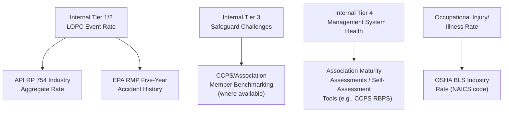
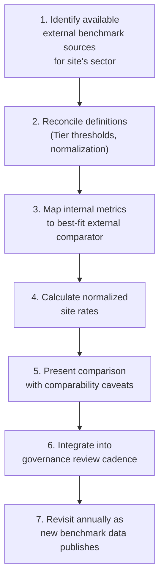

## Benchmarking Against Industry Data

### Purpose and Scope

Benchmarking against industry data places a site's process safety performance in context against peer facilities, industry associations, and regulatory datasets. It answers a question that internal trending alone cannot: *is this site's performance level acceptable relative to what is achievable in the industry, or merely stable relative to its own history?* Effective benchmarking requires careful attention to data comparability, normalization, and the limitations of aggregate industry statistics — misapplied benchmarking can create false confidence as easily as it can drive improvement.

**Key Points**

- Benchmarking is a complement to, not a replacement for, internal leading/lagging indicator trending.
- Comparability depends on matching hazard profile, process type, and normalization basis; raw comparisons across dissimilar sites are frequently misleading.
- Industry data sources vary in scope, definitions, and reporting rigor — sites must understand a dataset's methodology before drawing conclusions from it.

---

### Primary Industry Data Sources

#### API RP 754 Industry Aggregate Data

The American Petroleum Institute periodically publishes aggregate Tier 1 and Tier 2 process safety event rates across participating refining and petrochemical facilities. Data is generally reported as events per 200,000 work-hours, consistent with the reporting convention defined in the standard itself.

- **Scope**: primarily U.S. refining and petrochemical facilities; participation is voluntary among reporting companies.
- **Use**: provides an industry-wide Tier 1/Tier 2 rate against which a site can compare its own normalized event rate.
- **Limitation**: aggregation across many process types can mask hazard-specific performance differences; a site handling higher-hazard materials may appear to underperform a blended average that includes lower-hazard operations. [Inference] Sites should seek segment-specific breakouts where available rather than relying solely on the overall industry average.

#### OSHA and EPA Public Datasets

- **OSHA Injury and Illness Data (Form 300A) and Enforcement/Inspection Data**: publicly searchable, allows comparison of citation history and injury/illness rates (though these are primarily occupational safety rather than process safety metrics, and should not be conflated with PSM performance).
- **EPA RMP*eSubmit Database**: contains facility-reported Risk Management Plan data, including five-year accident history, which can be used to benchmark accident frequency and consequence types across facilities handling similar regulated substances.
- **Limitation**: these datasets reflect reportable thresholds and regulatory definitions, which do not necessarily align with a site's internal Tier 1/2/3 definitions; direct numeric comparison requires reconciling definitions first.

#### CCPS and Industry Association Benchmarking Programs

The Center for Chemical Process Safety (CCPS) and sector-specific associations (e.g., American Chemistry Council's Responsible Care program) operate member benchmarking initiatives that aggregate process safety metrics, incident data, and management system maturity assessments across participating companies.

- **Use**: often provides more granular leading-indicator benchmarking (Tier 3/4-type data) than public regulatory datasets, since public regulatory reporting rarely captures near-miss or management-system-health metrics.
- **Limitation**: participation and data quality vary by member company; benchmarking cohorts may be self-selected toward higher-performing or more mature programs, which can bias the comparison set upward. [Inference] A site benchmarking solely against association participants should recognize this potential selection bias rather than treating the cohort as representative of the industry as a whole.

#### Insurance and Loss Data Consortiums

Property/casualty insurers and loss-prevention organizations (e.g., through underwriting engineering reports) sometimes provide aggregate loss frequency and severity data across insured facility portfolios, which can supplement other benchmarks, particularly for major loss/catastrophic event frequency where public datasets are sparse.

---

### Step 1: Define the Comparability Basis Before Comparing Numbers

Before comparing a site's metric to an external dataset, the design process must establish whether the comparison is valid.

#### Comparability Checklist

| Dimension | Question to Resolve |
| --- | --- |
| Process type | Does the benchmark cohort handle comparable process hazards (e.g., refining vs. specialty chemicals vs. LNG)? |
| Definition alignment | Does the benchmark's Tier 1/2 (or equivalent) definition match the site's internal definition and consequence thresholds? |
| Normalization basis | Is the benchmark rate normalized the same way (work-hours, production volume, per-facility)? |
| Reporting period | Does the benchmark's reporting window align with the site's comparison period (avoiding stale multi-year-old benchmarks against current-year internal data)? |
| Reporting completeness | Is participation in the benchmark mandatory/comprehensive, or voluntary and potentially self-selected? |

[Inference] Skipping this checklist is the most common cause of benchmarking programs producing conclusions that do not survive scrutiny during management review or audit.

---

### Step 2: Select Appropriate Benchmark Metrics

Not all internal metrics have a suitable external benchmark. A benchmarking program should map each internal Tier to the best-available external comparator.

- **Tier 1/2 (lagging)**: benchmark against API RP 754 aggregate rates or EPA RMP accident history for facilities with comparable NAICS/process codes.
- **Tier 3 (leading)**: benchmark data is sparser publicly; association member programs are typically the best available source, with the selection-bias caveat noted above.
- **Tier 4 (management system health)**: rather than numeric benchmarking, this is often better assessed through maturity-model self-assessment against a published framework such as CCPS's Risk-Based Process Safety (RBPS) framework, which describes expected practices per management system element rather than a numeric target.

---

### Step 3: Normalize and Adjust for Hazard Profile

Raw benchmark comparison should be adjusted for known differences in hazard exposure between the site and the comparison cohort.

#### Example Normalization Approach

$$\text{Adjusted Rate} = \frac{\text{Site LOPC Events}}{\text{Site Work-Hours}} \times 200{,}000$$

This produces a rate directly comparable to the standard API RP 754 reporting convention, provided the underlying LOPC event definitions have been reconciled per the Step 1 checklist.

**Example**

A site records 3 Tier 2 events over 1,200,000 work-hours in a calendar year.

$$\text{Site Tier 2 Rate} = \frac{3}{1{,}200{,}000} \times 200{,}000 = 0.50 \text{ events per 200,000 hrs}$$

If the published industry aggregate Tier 2 rate for comparable facilities is 0.35, the site would be benchmarked as performing below the industry average on this specific measure — but before drawing that conclusion, the site should confirm the industry figure's consequence threshold definitions match its own internal Tier 2 classification criteria, and that the comparison cohort's process hazard profile is genuinely comparable.

---

### Step 4: Integrate Benchmarking into Governance

Benchmarking results should feed into, not sit outside, the site's existing PSM governance structure (see the site-level metrics program design).

#### Governance Integration Points

| Review Level | Benchmarking Role |
| --- | --- |
| Site Monthly Review | Track internal trend against most recent available benchmark; flag material gaps |
| Corporate Quarterly Review | Compare site's performance against sister-site and industry benchmarks; identify best-practice sharing opportunities |
| Annual Management Review | Reassess target-setting using updated industry benchmark data; revise improvement targets |

- **Cadence mismatch caution**: most external industry benchmarks (API RP 754 aggregates, association data) are published annually or with a lag; governance design should account for this lag rather than expecting real-time external comparison.
- **Action triggers**: define what happens when a site benchmarks unfavorably against industry data for a given metric — commonly, a gap analysis against RBPS elements or a targeted PHA revalidation for the underperforming process area.

---

### Step 5: Avoid Common Benchmarking Pitfalls

- **Comparing dissimilar hazard profiles**: benchmarking a high-hazard unit against a blended industry average that includes lower-hazard processes tends to understate the true performance gap or falsely reassure leadership.
- **Definitional drift**: internal Tier definitions that have evolved over time (e.g., after adopting a revised API RP 754 edition) can silently break comparability with historical benchmark trend lines; document the definition version in effect for every reporting period.
- **Overreliance on lagging benchmarks**: because Tier 1/2 events are rare at a single site, small-sample statistical noise can make single-year benchmarking comparisons unreliable; [Inference] multi-year rolling averages are generally more defensible than single-year snapshots for lagging-indicator benchmarking, particularly at smaller sites with low event counts.
- **Treating benchmarking as a scorecard rather than a diagnostic**: the objective is to identify specific management system gaps to close, not to produce a favorable ranking; a program that stops at "we're better than average" without investigating leading-indicator or management-system detail forfeits most of the value of benchmarking.
- **Ignoring benchmark cohort self-selection**: association and insurance benchmarking cohorts often skew toward more mature programs; treating their aggregate as "the industry" rather than "a subset of higher-performing peers" can set unrealistically aggressive internal targets — or, conversely, an unrealistically lenient one if the true industry-wide baseline is worse.

---

### Illustrative Benchmarking Summary Dashboard

<svg xmlns="http://www.w3.org/2000/svg" viewBox="0 0 760 340" font-family="sans-serif">
<text x="20" y="25" font-size="16" font-weight="bold" fill="#111827">Site vs. Industry Benchmark Summary — Illustrative (svg_diagram)</text>

<line x1="80" y1="280" x2="720" y2="280" stroke="#374151" stroke-width="1.5" />
<line x1="80" y1="60" x2="80" y2="280" stroke="#374151" stroke-width="1.5" />
<text x="30" y="70" font-size="11" fill="#374151">0.6</text>
<text x="30" y="170" font-size="11" fill="#374151">0.3</text>
<text x="30" y="280" font-size="11" fill="#374151">0.0</text>

<rect x="150" y="170" width="60" height="110" fill="#2563eb" />
<text x="150" y="295" font-size="11" fill="#111827">Site Tier 2</text>
<text x="155" y="160" font-size="11" fill="#111827">0.50</text>

<rect x="230" y="203" width="60" height="77" fill="#9ca3af" />
<text x="222" y="295" font-size="11" fill="#111827">Industry Tier 2</text>
<text x="235" y="193" font-size="11" fill="#111827">0.35</text>

<rect x="420" y="270" width="60" height="10" fill="#2563eb" />
<text x="415" y="295" font-size="11" fill="#111827">Site Tier 1</text>
<text x="425" y="260" font-size="11" fill="#111827">0.02</text>

<rect x="500" y="265" width="60" height="15" fill="#9ca3af" />
<text x="490" y="295" font-size="11" fill="#111827">Industry Tier 1</text>
<text x="505" y="255" font-size="11" fill="#111827">0.03</text>

<rect x="600" y="60" width="14" height="14" fill="#2563eb" />
<text x="620" y="72" font-size="12" fill="#111827">Site Rate</text>
<rect x="600" y="82" width="14" height="14" fill="#9ca3af" />
<text x="620" y="94" font-size="12" fill="#111827">Industry Rate</text>

<text x="80" y="320" font-size="11" fill="`#6b7280`">Rates per 200,000 work-hours. Illustrative figures only.</text>

</svg>

---

### Regulatory and Standards Context

- **No regulatory mandate to benchmark**: OSHA PSM and EPA RMP do not require external benchmarking as a compliance element; benchmarking is a voluntary performance-improvement practice, though it is frequently cited as a recognized and generally accepted good practice supporting continuous improvement expectations under PSM.
- **API RP 754**: remains the primary standardized framework enabling apples-to-apples Tier 1/2 industry comparison in the refining/petrochemical sector specifically.
- **CCPS RBPS**: provides the most widely used maturity-benchmarking framework for management system elements (Tier 4-equivalent), independent of numeric event-rate benchmarking.

[Unverified] The specific current participation levels, most recent published aggregate rates, and any recent revisions to API RP 754's reporting methodology should be verified against API's current published materials, as these are updated periodically and were not independently confirmed for this response.

---

### Implementation Roadmap

**Next Steps**

- Identify which published industry datasets align with the site's specific process type and hazard profile
- Reconcile the site's internal Tier 1–4 definitions against the definitions used in each candidate benchmark source
- Establish a normalized rate calculation methodology and document the formula and assumptions used
- Define governance triggers for unfavorable benchmark comparisons (e.g., mandatory gap analysis against RBPS elements)
- Schedule annual refresh of benchmark data alignment with the corporate quarterly review cycle

**Related Topics**

- API RP 754 Tier Definitions and Consequence Thresholds (Detailed Criteria)
- CCPS Risk-Based Process Safety (RBPS) Maturity Self-Assessment
- Designing a Site-Level Metrics Program
- EPA RMP*eSubmit Data Interpretation and Limitations
- Statistical Considerations in Low-Frequency Event Rate Comparisons
- Target-Setting Methodology for Process Safety Performance Indicators
- Corporate PSM Metrics Roll-Up and Cross-Site Benchmarking