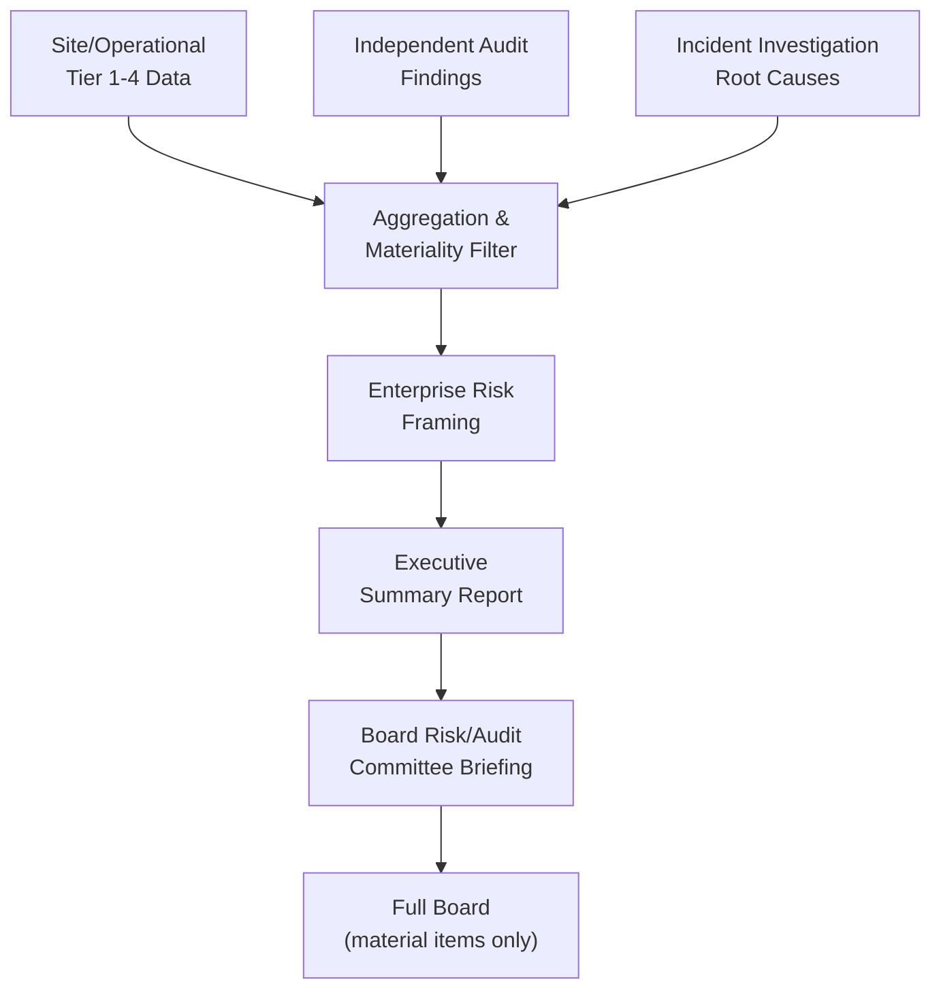
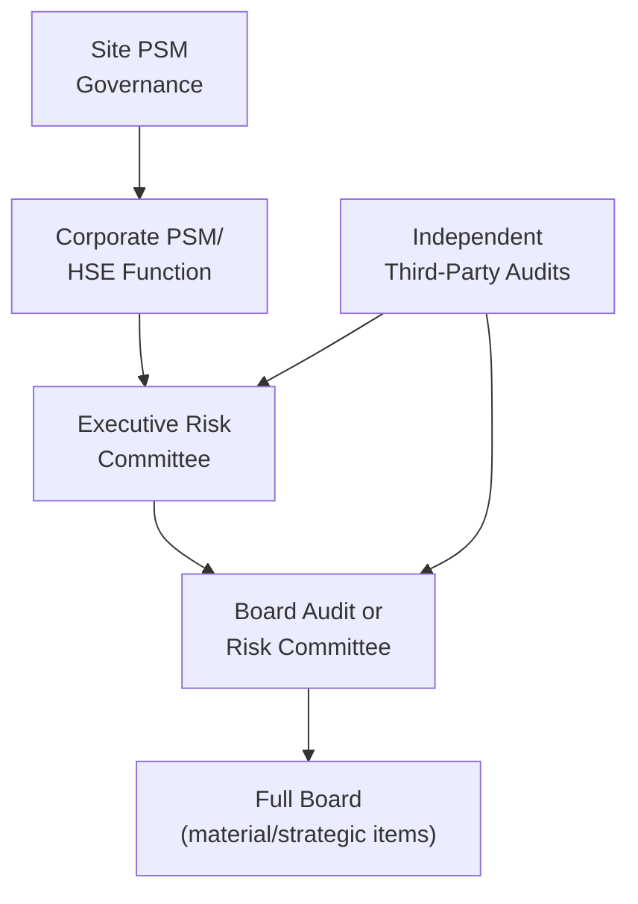
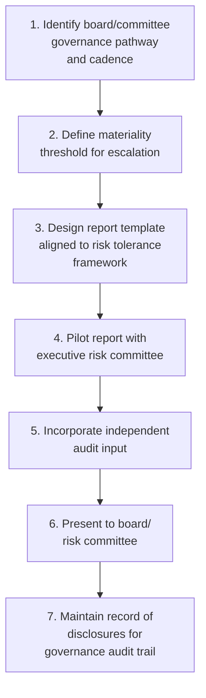

## Communicating Risk to Executive Leadership and the Board

### Purpose and Scope

Communicating process safety risk to executive leadership and the board requires translating technical hazard data, metrics, and audit findings into a form that supports informed governance decisions — capital allocation, risk tolerance-setting, and organizational accountability — without either overwhelming non-technical audiences with detail or oversimplifying to the point of concealing material risk. This is a distinct discipline from operational metrics reporting: the audience, decision authority, and required framing differ substantially at the board level.

**Key Points**

- Board and executive communication must connect process safety performance to enterprise risk, not present it as a standalone technical topic.
- The content must be calibrated to decision rights: boards typically approve risk tolerance and major capital/resourcing decisions, not day-to-day operational responses.
- Transparency about deteriorating trends and unresolved risk is a governance obligation, not merely a communication preference — boards cannot exercise oversight duties on information they are not given.

---

### Why This Differs from Operational Reporting

Site-level metrics dashboards (Tier 1–4, per API RP 754) are designed for operational and technical audiences who understand safeguard architecture and can interpret raw indicator counts. Executive and board reporting requires a different translation layer.

| Dimension | Site/Operational Reporting | Executive/Board Reporting |
| --- | --- | --- |
| Primary question | "Is this unit's safeguard performing as designed?" | "Is our overall risk exposure and risk management capability acceptable, and what decisions does it require of us?" |
| Level of technical detail | High — specific safeguards, tags, tests | Low — aggregated trends, categorized exposure, decision-relevant detail only |
| Time horizon | Daily/weekly/monthly | Quarterly/annual, with emphasis on trend and trajectory |
| Framing | Tiered indicators (API RP 754) | Enterprise risk register, risk appetite, capital/resourcing implications |
| Decision sought | Corrective action, escalation | Resource allocation, risk tolerance acceptance, strategic prioritization |

[Inference] A common failure mode is presenting the site-level dashboard essentially unmodified to the board, which either buries the material signal in operational noise or fails to connect the data to the decisions the board is actually responsible for making.

---

### Structuring the Content: What Boards Need to See

#### Core Content Elements

1. **Aggregate risk posture summary**: a small number of headline indicators (e.g., total Tier 1/2 event rate trend, count of major hazard scenarios with degraded safeguards) presented against risk tolerance/target, not a full tiered breakdown.
2. **Trend and trajectory, not point-in-time snapshots**: boards need to know whether risk is improving, stable, or deteriorating over a multi-period horizon, since a single period's figure in isolation supports no decision.
3. **Material exposures requiring board awareness or action**: specific unresolved high-consequence findings (e.g., a major hazard scenario where a critical safeguard has been degraded for an extended period), framed with consequence, likelihood context, and remediation status/timeline.
4. **Resourcing and capital implications**: where addressing an identified gap requires capital investment, headcount, or schedule commitments beyond current budget, this should be explicit and quantified where possible.
5. **Comparison to risk tolerance / risk appetite statement**: where the organization has an articulated risk appetite (common in mature ERM frameworks), performance should be shown against that stated tolerance, not just against historical self-comparison.
6. **Independent assurance input**: summary of findings from internal/external process safety audits, particularly where audit findings diverge from what operational metrics alone would suggest.

#### Structuring the Narrative

The materiality filter step is the critical translation point: not every Tier 3 deviation belongs in front of the board, but a pattern of Tier 3 deviations indicating a systemic management-system weakness does.

---

### Framing Techniques for Non-Technical Audiences

#### Risk Matrix Presentation

A consequence/likelihood risk matrix is one of the most effective tools for board-level risk communication because it requires no process safety background to interpret, provided the axes and categories are clearly defined.

<svg xmlns="http://www.w3.org/2000/svg" viewBox="0 0 640 420" font-family="sans-serif">
<text x="20" y="25" font-size="16" font-weight="bold" fill="#111827">Illustrative Board-Level Risk Matrix (svg_diagram)</text>

<rect x="120" y="60" width="90" height="60" fill="#fef9c3" stroke="#9ca3af" />
<rect x="210" y="60" width="90" height="60" fill="#fde68a" stroke="#9ca3af" />
<rect x="300" y="60" width="90" height="60" fill="#fca5a5" stroke="#9ca3af" />
<rect x="390" y="60" width="90" height="60" fill="#f87171" stroke="#9ca3af" />
<rect x="480" y="60" width="90" height="60" fill="#dc2626" stroke="#9ca3af" />

<rect x="120" y="120" width="90" height="60" fill="#dcfce7" stroke="#9ca3af" />
<rect x="210" y="120" width="90" height="60" fill="#fef9c3" stroke="#9ca3af" />
<rect x="300" y="120" width="90" height="60" fill="#fde68a" stroke="#9ca3af" />
<rect x="390" y="120" width="90" height="60" fill="#fca5a5" stroke="#9ca3af" />
<rect x="480" y="120" width="90" height="60" fill="#f87171" stroke="#9ca3af" />

<rect x="120" y="180" width="90" height="60" fill="#dcfce7" stroke="#9ca3af" />
<rect x="210" y="180" width="90" height="60" fill="#dcfce7" stroke="#9ca3af" />
<rect x="300" y="180" width="90" height="60" fill="#fef9c3" stroke="#9ca3af" />
<rect x="390" y="180" width="90" height="60" fill="#fde68a" stroke="#9ca3af" />
<rect x="480" y="180" width="90" height="60" fill="#fca5a5" stroke="#9ca3af" />

<rect x="120" y="240" width="90" height="60" fill="#dcfce7" stroke="#9ca3af" />
<rect x="210" y="240" width="90" height="60" fill="#dcfce7" stroke="#9ca3af" />
<rect x="300" y="240" width="90" height="60" fill="#dcfce7" stroke="#9ca3af" />
<rect x="390" y="240" width="90" height="60" fill="#fef9c3" stroke="#9ca3af" />
<rect x="480" y="240" width="90" height="60" fill="#fde68a" stroke="#9ca3af" />

<rect x="120" y="300" width="90" height="60" fill="#dcfce7" stroke="#9ca3af" />
<rect x="210" y="300" width="90" height="60" fill="#dcfce7" stroke="#9ca3af" />
<rect x="300" y="300" width="90" height="60" fill="#dcfce7" stroke="#9ca3af" />
<rect x="390" y="300" width="90" height="60" fill="#dcfce7" stroke="#9ca3af" />
<rect x="480" y="300" width="90" height="60" fill="#fef9c3" stroke="#9ca3af" />

<text x="10" y="95" font-size="11" fill="`#111827`">Catastrophic</text>

<text x="30" y="155" font-size="11" fill="`#111827`">Major</text>

<text x="15" y="215" font-size="11" fill="`#111827`">Moderate</text>

<text x="30" y="275" font-size="11" fill="`#111827`">Minor</text>

<text x="10" y="335" font-size="11" fill="`#111827`">Negligible</text>

<text x="130" y="380" font-size="11" fill="`#111827`">Rare</text>

<text x="225" y="380" font-size="11" fill="`#111827`">Unlikely</text>

<text x="315" y="380" font-size="11" fill="`#111827`">Possible</text>

<text x="400" y="380" font-size="11" fill="`#111827`">Likely</text>

<text x="500" y="380" font-size="11" fill="`#111827`">Frequent</text>

<text x="280" y="400" font-size="12" font-weight="bold" fill="`#111827`">Likelihood</text>

<circle cx="345" cy="150" r="9" fill="#1e3a8a" stroke="#fff" stroke-width="2" />
<text x="360" y="145" font-size="11" fill="#1e3a8a">Item A: Unit 3 relief system upgrade (pending)</text>
</svg>

- **Design guidance**: consequence categories should be defined in terms the board already uses elsewhere in enterprise risk reporting (e.g., financial impact, regulatory/reputational impact, safety impact bands), with process safety severity definitions mapped onto those categories rather than introducing a parallel, unfamiliar scale.
- Plot a small number of material, unresolved risk items on the matrix (not routine Tier 3 events) so that the visual highlights genuinely board-relevant items.

#### Trend Visualization Over Detail

Boards generally respond better to a clear multi-year or multi-quarter trend line with a stated target/tolerance line than to a table of raw figures. Where a metric is trending adversely, the accompanying narrative should state: what is driving the trend, what has been done in response, and what resourcing or decision is being requested, if any.

---

### Governance Structures for Board-Level Risk Communication

#### Common Reporting Pathways

- **Board committee structure**: process safety risk is commonly routed through an Audit Committee, Risk Committee, or a dedicated Safety/EHS Committee where one exists; the appropriate pathway depends on the organization's governance structure and should be confirmed against the company's own committee charters. [Unverified] Committee naming and mandate scope vary significantly by company and jurisdiction and cannot be generalized reliably.
- **Reporting frequency**: quarterly summary reporting with immediate escalation protocols for material events or newly identified high-consequence gaps is a common pattern, though the specific cadence is a governance design choice for the organization, not a regulatory requirement in most jurisdictions.
- **Independent assurance input**: board-level risk committees often place particular weight on findings from independent (non-operational) audit functions specifically because internal operational reporting can be subject to unconscious optimism bias or organizational pressure to present favorable trends.

---

### Content to Explicitly Avoid or Handle Carefully

- **Raw Tier 3 event counts without context**: presenting, for example, "14 relief valve lifts this quarter" without benchmarking against what is expected/normal for the site's equipment population invites misinterpretation as either alarming or reassuring without basis.
- **Overly technical safeguard terminology**: SIL levels, IPL credit calculations, and LOPA scenario nomenclature should generally be translated into plain-language consequence/likelihood statements for board audiences, with technical detail available in appendix or on request rather than in the primary narrative.
- **Burying adverse trends in aggregate positive figures**: a favorable overall Tier 1/2 rate should not be permitted to obscure a specific deteriorating Tier 3/4 trend in a particular hazard category; board materials should be structured so a genuinely material adverse trend cannot be diluted into an aggregate "green" status.
- **Omitting resourcing implications**: presenting a risk finding without the associated cost/timeline of remediation removes the board's ability to make the resourcing decision that is often the entire point of the escalation.

**Key Points**

- The goal of board reporting is enabling informed decisions and oversight, not producing a reassuring narrative; content design should be stress-tested against the question "would this framing survive scrutiny after an incident, if one occurred in the area being reported on?"
- Independent audit findings should be given comparable weight to internally generated metrics, precisely because they are less subject to internal reporting incentives.

---

### Legal, Governance, and Duty-of-Care Considerations

- **Director oversight duties**: in most corporate governance frameworks, boards hold a duty of oversight regarding material risks to the enterprise, which in process-safety-intensive industries has been treated in some jurisdictions' case law and governance guidance as extending to major accident hazard risk specifically. [Unverified] The precise scope and legal standard for director oversight liability regarding process safety risk varies by jurisdiction and evolving case law, and should be confirmed with qualified legal counsel rather than treated as settled across all jurisdictions.
- **Documentation of what was communicated**: because board oversight adequacy can become a matter of scrutiny after a major incident, maintaining a clear record of what risk information was presented to the board and when is itself a governance control, independent of the communication's content quality.
- **Avoiding selective disclosure**: risk communication design should avoid structures where unfavorable information is systematically filtered out before reaching the board-level committee, since this undermines the oversight function the reporting structure exists to serve.

---

### Building the Executive/Board Report: Practical Template Structure

1. **Executive summary** (1 page): overall risk posture, 2–3 headline trends, any items requiring board decision this cycle.
2. **Performance against risk tolerance**: aggregate Tier 1/2 trend vs. target; count/status of major hazard scenarios with any degraded safeguard.
3. **Material items for board awareness/action**: each with consequence framing, current status, remediation timeline, resourcing requirement if applicable.
4. **Independent assurance summary**: key findings from the most recent internal/external process safety audit cycle.
5. **Forward look**: known upcoming risk exposures (e.g., planned turnaround, new process introduction via MOC) requiring board awareness ahead of time.
6. **Appendix (optional, on request)**: detailed Tier 3/4 data for committee members wanting deeper technical detail.

---

### Implementation Roadmap

**Next Steps**

- Confirm the organization's board committee structure and reporting pathway for process safety risk with corporate governance/legal counsel
- Define materiality thresholds that determine what escalates from operational reporting to executive/board reporting
- Align risk severity categories used in process safety reporting with the enterprise risk appetite framework already used elsewhere in board reporting
- Develop a standard executive/board report template incorporating trend, tolerance comparison, and resourcing implications
- Establish a documented record-keeping practice for board risk disclosures

**Related Topics**

- Designing a Site-Level Metrics Program
- Benchmarking Against Industry Data
- Enterprise Risk Management (ERM) Integration with Process Safety
- Risk Tolerance and Risk Appetite Statement Development
- Independent Process Safety Auditing and Assurance Programs
- Major Accident Hazard Governance and Director Oversight Duties
- Incident Investigation Reporting for Executive Audiences