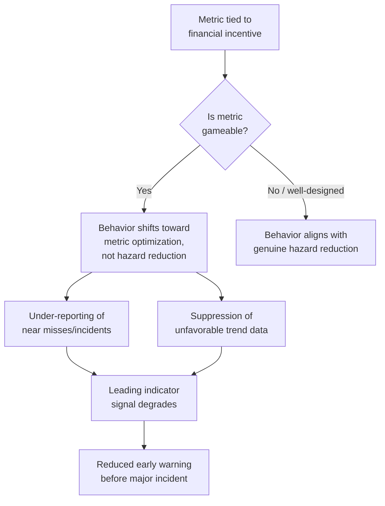
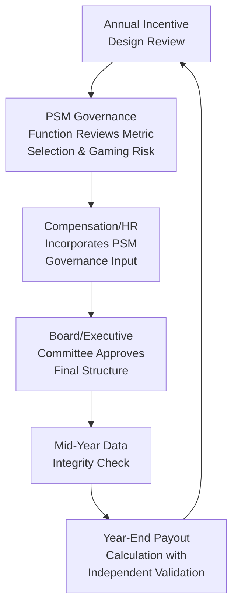
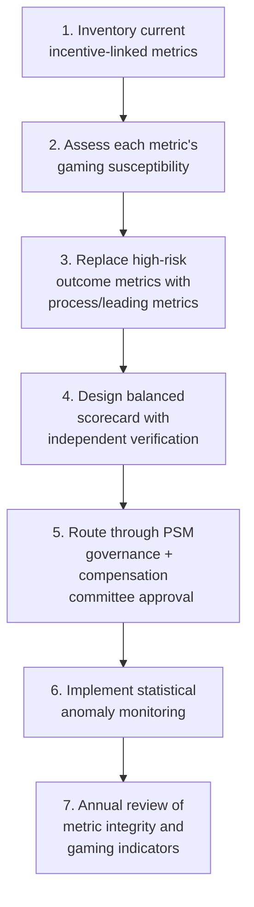

## Linking Process Safety Performance to Incentives

### Purpose and Scope

Linking process safety performance to compensation and incentive structures is intended to reinforce management system accountability by tying financial or career consequences to leading and lagging indicator outcomes. Done well, it aligns organizational incentives with hazard management; done poorly, it is one of the most well-documented mechanisms for producing perverse behavior — under-reporting, gaming of metrics, and suppression of near-miss data — that actively undermines the process safety program it was meant to support. Program design must therefore treat incentive-metric selection and structure as a safety-critical design decision in its own right, not a routine HR/compensation exercise.

**Key Points**

- Metric choice for incentive purposes is not interchangeable with metric choice for operational monitoring; a metric that is excellent for trending can be a poor or dangerous choice for incentive-linking.
- Lagging-indicator-only incentive programs (e.g., bonus tied to total recordable injury rate) have a well-established history of incentivizing under-reporting rather than genuine hazard reduction.
- Incentive design should be reviewed by the same governance function responsible for process safety metrics integrity, not designed in isolation by compensation/HR functions.

---

### The Core Design Tension

#### Why Incentive-Linking Is Attractive

- Creates visible, personal accountability for process safety performance among operations and site leadership.
- Signals organizational priority — what gets measured and rewarded is understood as what leadership actually values, independent of stated policy.
- Can drive attention and resourcing toward process safety in organizations where it competes with production/cost incentives for management attention.

#### Why It Is High-Risk If Poorly Designed

[Inference] The single most cited failure pattern in incentive design literature and post-incident investigations is tying incentive compensation directly to a raw, individually-attributable count (e.g., "zero recordable injuries" or "zero reported near misses" per team) rather than to a rate, trend, or systemic management indicator that cannot be as easily influenced by non-reporting.

---

### Metric Selection: What Should and Should Not Be Incentivized

#### Generally Considered Higher-Risk to Incentivize Directly

| Metric Type | Why It Is Risky as an Incentive Metric |
| --- | --- |
| Raw near-miss/incident report counts (lower is "better") | Directly incentivizes non-reporting; near-miss reporting should be encouraged, not suppressed |
| Individual-level Tier 1/2 event counts | Small sample sizes at individual/team level make this highly susceptible to noise and concealment |
| "Zero incidents" absolute targets tied to bonus payout | Creates strong pressure to reclassify or delay reporting of events near a threshold |

#### Generally Considered Lower-Risk / More Defensible to Incentivize

| Metric Type | Why It Is More Defensible |
| --- | --- |
| Management system completion metrics (e.g., % PHA actions closed on schedule, % MI inspections completed on time) | Objectively verifiable, difficult to game without an audit trail exposing it, and directly reflects management system diligence rather than outcome luck |
| Near-miss/hazard reporting *rate* (higher is better, up to a reasonable point) | Incentivizes reporting rather than suppressing it, directly counteracting the gaming risk of outcome-based metrics |
| Audit/assessment scores against a defined framework (e.g., RBPS element maturity) | Reflects systemic capability rather than a single noisy outcome measure |
| Leadership engagement metrics (e.g., completion of scheduled safety walks/PHA participation) | Measures process safety leadership behavior directly, which is within full management control |

**Key Points**

- A defensible incentive metrics set generally favors process/management-system metrics (Tier 4-type) over outcome metrics (Tier 1/2-type), specifically because process metrics are harder to game and more directly reflect controllable management behavior.
- Where outcome metrics are used, they should be structured as *rates over a meaningful aggregation period and population*, never as raw counts at a small team/individual level, to reduce the statistical incentive to suppress isolated events.

---

### Structural Design Principles

#### Principle 1: Separate Reporting Behavior from Outcome Incentives

Design the incentive structure so that reporting a near miss or hazard never reduces an individual's or team's incentive outcome relative to not reporting it. This typically means:

- Excluding near-miss/hazard reports from any metric where "fewer is better."
- Where feasible, structuring near-miss reporting itself as a positively incentivized behavior (higher reporting rate contributes positively), which directly reverses the suppression incentive.

#### Principle 2: Weight Incentive Metrics Toward Organizational, Not Individual, Level

$$\text{Incentive Weight} \propto \frac{1}{\text{Susceptibility to Individual Concealment}}$$

Metrics assessed at site, business unit, or corporate level are harder for any single individual to conceal or manipulate than metrics assessed at the individual or small-team level, because they aggregate across many data points and are subject to more independent verification.

#### Principle 3: Use a Balanced Scorecard, Not a Single Metric

A single incentive metric — however well chosen — concentrates gaming incentive on that one measure. A balanced set spanning Tier 3/4 management system metrics, leadership engagement behaviors, and audit outcomes distributes incentive pressure and makes systemic gaming across all components simultaneously much harder to sustain undetected.

**Example**

An illustrative site leadership incentive scorecard structure:

| Component | Weight | Metric | Gaming Resistance |
| --- | --- | --- | --- |
| MI/PHA management system health | 30% | % safety-critical inspections/PHA actions completed on schedule | High — audit-verifiable |
| Leadership engagement | 20% | Completion of scheduled process safety leadership walks/reviews | High — calendar/attendance verifiable |
| Near-miss/hazard reporting rate | 20% | Reporting rate vs. site historical baseline (higher is better) | High — reverses suppression incentive |
| Independent audit score | 20% | Most recent internal/external PSM audit score | High — externally verified |
| Tier 1/2 event rate | 10% | Site-level rate vs. multi-year trend (not raw count) | Moderate — low weighting limits gaming payoff |

[Inference] The specific weighting split shown is illustrative; actual weighting should reflect the organization's risk profile and the relative maturity of its existing management systems, and should be periodically reviewed rather than fixed permanently.

---

### Governance and Anti-Gaming Controls

#### Verification Requirements

- **Independent data validation**: incentive-linked metrics should be validated by a function independent of the individuals whose compensation depends on them (e.g., corporate PSM/audit function validating site-reported data before it feeds compensation calculations), not self-certified by the incentivized party.
- **Periodic audit of incentive metric integrity**: include a specific audit scope item checking for statistical anomalies suggestive of gaming (e.g., a sudden drop in near-miss reporting immediately following introduction of an incentive tied to that report count going down).
- **Whistleblower/reporting protections**: maintain a confidential channel for reporting suspected suppression or manipulation of safety data tied to incentive outcomes, with explicit non-retaliation protection.

#### Review Cadence

- The PSM governance function — not compensation/HR alone — should hold explicit review authority over which process safety metrics are eligible for incentive linkage, precisely because HR/compensation functions typically lack the domain expertise to assess a metric's gaming susceptibility.

---

### Common Pitfalls

- **"Zero" targets on rare-event metrics**: setting a hard zero-incident threshold for bonus eligibility on a metric with naturally low, noisy counts creates disproportionate pressure to conceal the one event that would break the target, particularly late in a measurement period.
- **Short-term measurement periods**: annual bonus cycles measured against quarterly-noisy safety data can create a "wait until next quarter to report" dynamic near period-end; using rolling or multi-period averages reduces this specific pressure point.
- **Uniform incentive structure regardless of role**: applying the same outcome-based safety metric to a corporate executive and a first-line supervisor ignores that the supervisor has far less individual control over rare Tier 1/2 outcomes, while having substantial control over management-system-level Tier 4 behaviors; role-appropriate metric selection avoids incentivizing people for outcomes outside their span of control.
- **No mechanism to detect gaming after the fact**: an incentive program without built-in statistical/audit monitoring for anomalous metric shifts around incentive-sensitive dates has no way of catching manipulation even when the underlying gaming risk was well understood at design time.
- **Ignoring interaction with production/cost incentives**: if a competing production or cost-based incentive exists alongside the safety incentive with materially larger financial weight, the safety incentive may have negligible actual influence on behavior; [Inference] relative incentive weighting across competing organizational priorities is frequently a more decisive factor in real behavior than the specific safety metric chosen.

---

### Regulatory and Standards Context

- **No direct regulatory mandate**: OSHA PSM and EPA RMP do not prescribe incentive compensation structures; this is an organizational management-system design choice, though CSB (U.S. Chemical Safety Board) incident investigation reports have, in specific cases, identified poorly designed incentive structures (particularly those tied to raw injury/incident counts) as a contributing organizational factor. [Unverified] Specific CSB findings regarding incentive structures are case-specific to the incidents investigated and should not be generalized as a universal regulatory finding without reviewing the particular investigation report referenced.
- **CCPS guidance**: addresses incentive design as part of broader "Process Safety Culture" guidance, generally cautioning against outcome-based individual incentive metrics for the reasons described above and favoring process/leading-indicator-based incentive design.
- **Corporate governance disclosure**: in some jurisdictions and for some public companies, executive compensation structures tied to safety performance metrics are subject to proxy statement disclosure requirements; [Unverified] the specific disclosure obligations vary by jurisdiction and regulatory regime and should be confirmed with corporate legal/governance counsel rather than assumed.

---

### Implementation Roadmap

**Next Steps**

- Inventory all current compensation/bonus structures that reference process safety or injury/incident metrics
- Assess each existing incentive metric against the gaming-susceptibility criteria in this reference
- Propose a balanced scorecard shifting weight toward management-system and leadership-behavior metrics
- Establish independent data validation for any metric that feeds compensation calculations
- Implement periodic statistical monitoring for reporting-rate anomalies around incentive-sensitive reporting periods

**Related Topics**

- Designing a Site-Level Metrics Program
- Process Safety Culture Assessment and Development
- Near-Miss and Hazard Reporting System Design
- Communicating Risk to Executive Leadership and the Board
- Independent Process Safety Auditing and Assurance Programs
- Organizational Factors in Incident Investigation (CSB Case Studies)
- Balanced Scorecard Design for Safety-Critical Industries