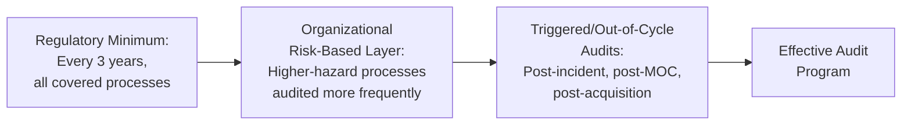
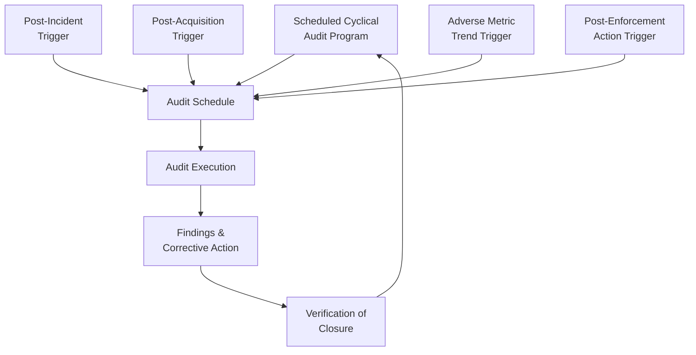
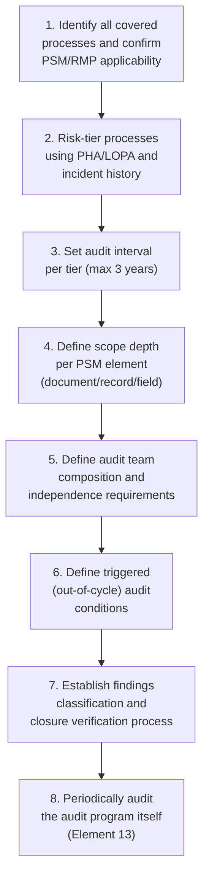

## Compliance Audit Scope and Frequency

### Purpose and Scope

Compliance audits verify that a facility's process safety management system conforms to applicable regulatory requirements and, typically, to the organization's own internal PSM procedures. Scope and frequency design determines whether an audit program provides meaningful, timely assurance or merely satisfies a minimum regulatory checkbox. This reference addresses how to define audit scope (what is covered and to what depth) and frequency (how often, and what triggers an out-of-cycle audit) for a defensible, effective compliance audit program.

**Key Points**

- Audit frequency has an explicit regulatory floor under OSHA PSM (29 CFR 1910.119(o)) and EPA RMP (40 CFR 68.79/68.58), but scope depth and rigor are largely left to the organization to define.
- Scope should be risk-based and cover all fourteen PSM elements, not just the elements most recently associated with an incident or citation.
- Audit frequency and scope should be distinguished from continuous metrics monitoring (see site-level metrics program) — auditing is a periodic, structured conformance verification, not real-time performance tracking.

---

### Regulatory Baseline Requirements

#### OSHA PSM — 29 CFR 1910.119(o)

OSHA's Process Safety Management standard requires that employers certify that they have evaluated compliance with the provisions of the PSM standard at least every three years, to verify that the procedures and practices developed under the standard are adequate and are being followed.

Key regulatory requirements embedded in this element:

- **Frequency**: at least every three years (a maximum interval, not a recommended one).
- **Audit team competency**: the audit must be conducted by at least one person knowledgeable in the process.
- **Written findings**: a report of findings must be developed.
- **Response to findings**: the employer must promptly determine and document an appropriate response to each finding, and document that deficiencies have been corrected.
- **Record retention**: the two most recent compliance audit reports must be retained (this is a minimum retention requirement, not a maximum).

#### EPA RMP — 40 CFR 68.79 (Program 3) / 68.58 (Program 2)

EPA's Risk Management Program rule contains a parallel compliance audit requirement, generally mirroring the three-year cycle and independent competency requirements, applicable to covered processes under Program 2 and Program 3 risk management programs.

[Unverified] Exact paragraph citations and any recent amendments to EPA RMP audit provisions should be verified against the current Code of Federal Regulations text, as EPA has revised RMP rule provisions periodically (including amendments following the 2024 RMP rule changes), and this reference may not reflect the most current regulatory text.

#### Regulatory Floor vs. Effective Practice

[Inference] Organizations with mature PSM programs commonly audit higher-hazard or historically weaker-performing processes on a shorter interval than the three-year regulatory maximum, reserving the full three-year interval for lower-hazard covered processes with a strong compliance history — though the specific interval chosen is a risk-based organizational decision, not a separate regulatory tier.

---

### Defining Audit Scope

#### Scope Dimension 1: The Fourteen PSM Elements

A comprehensive compliance audit scope should address all fourteen elements of the OSHA PSM standard (and, where applicable, corresponding RMP Program 2/3 elements), rather than a subset:

1. Employee Participation
2. Process Safety Information (PSI)
3. Process Hazard Analysis (PHA)
4. Operating Procedures
5. Training
6. Contractors
7. Pre-Startup Safety Review (PSSR)
8. Mechanical Integrity (MI)
9. Hot Work Permit
10. Management of Change (MOC)
11. Incident Investigation
12. Emergency Planning and Response
13. Compliance Audits (auditing the audit program itself, including verification that prior findings were closed)
14. Trade Secrets

#### Scope Dimension 2: Depth of Verification

For each element, scope design should specify the verification method, since "checking that a procedure exists" is a substantially weaker audit than "verifying the procedure is followed in practice."

| Verification Depth | Example | Rigor |
| --- | --- | --- |
| Document review | Does a written MOC procedure exist? | Lowest |
| Record sampling | Sample 10 MOCs from the past year; are all required approvals documented? | Moderate |
| Field verification | Walk down 5 sampled MOCs in the field; does as-built condition match the approved MOC documentation? | Higher |
| Interview-based verification | Interview operators on PSSR expectations; do stated practices match written procedure? | Higher |
| Combined/triangulated | Cross-reference document, record, field, and interview findings for consistency | Highest |

**Key Points**

- A defensible audit scope combines document review with record sampling and field verification for at least the higher-hazard PSM elements (PHA, MI, MOC), since document-only review can miss significant gaps between written procedure and actual practice.
- Sampling methodology (how records are selected, sample size, and rationale) should be documented in the audit protocol so findings are statistically defensible and reproducible by a different audit team.

#### Scope Dimension 3: Process and Unit Coverage

- **Covered process definition**: confirm which specific processes meet the PSM/RMP "covered process" threshold (based on threshold quantities of listed highly hazardous chemicals) before finalizing audit scope, since audit obligations attach at the covered-process level.
- **Boundary conditions**: clarify treatment of interconnected systems, shared utilities, and processes that feed into or receive from a covered process, as scope boundary decisions materially affect what the audit does and does not verify.

---

### Setting Audit Frequency: Risk-Based Tiering

#### Illustrative Frequency Tiering Model

| Process/Unit Risk Tier | Basis | Illustrative Audit Interval |
| --- | --- | --- |
| Highest hazard (e.g., processes with catastrophic consequence potential per PHA/LOPA, or history of Tier 1/2 events) | Consequence severity + incident history | Every 1–2 years |
| Moderate hazard, strong compliance history | Moderate consequence, no significant recent findings | Every 2–3 years |
| Lower hazard, strong compliance history | Lower consequence potential | Up to the 3-year regulatory maximum |
| Any process regardless of tier | Regulatory floor | Not to exceed 3 years under OSHA PSM/EPA RMP |

[Inference] This tiering approach is a widely used risk-based practice in mature PSM programs, but the specific interval boundaries shown are illustrative; an organization's actual tiering thresholds should be derived from its own PHA/LOPA consequence categorization and incident history, and the three-year maximum under 1910.119(o) must never be exceeded for any covered process regardless of tiering.

#### Triggers for Out-of-Cycle (Unscheduled) Audits

Beyond the routine cyclical schedule, frequency design should specify conditions that trigger an audit ahead of the next scheduled interval:

- Following a Tier 1 or significant Tier 2 event, particularly where investigation findings suggest a systemic rather than isolated cause
- Following acquisition of a facility or process not previously audited under the acquiring organization's program
- Following a major process modification via MOC that substantially changes the hazard profile
- Following a pattern of adverse Tier 3/4 metric trends (see site-level metrics program) suggesting management system degradation
- Following a regulatory enforcement action or citation at the site or a sister site with a similar process

---

### Audit Team Composition and Independence

- **Regulatory minimum**: at least one team member knowledgeable in the specific process being audited, per 1910.119(o)(2).
- **Independence considerations**: while OSHA does not mandate full independence from the audited unit, a design that includes at least some team members independent of day-to-day operation of the audited process (e.g., corporate PSM staff, personnel from a different site, or third-party auditors) reduces the risk of findings being unconsciously softened by familiarity or organizational proximity.
- **Third-party/external audits**: periodically incorporating external, independent auditors (even beyond regulatory minimum frequency) is a recognized good practice for surfacing findings that a fully internal team may be less likely to identify, particularly for elements where internal audit fatigue or normalization of deviance may have developed over time.

---

### Findings Management and Closure Verification

A compliance audit's scope design is incomplete without a defined findings-closure process, since OSHA 1910.119(o)(3)–(4) explicitly requires documented response to findings and documented correction of deficiencies.

#### Findings Classification (Illustrative)

| Classification | Definition | Typical Closure Timeline |
| --- | --- | --- |
| Critical/Immediate | Direct, significant risk to safe operation | Immediate/days |
| High | Significant compliance gap, moderate risk | 30–90 days |
| Medium | Compliance gap, lower immediate risk | 90–180 days |
| Low/Observation | Minor gap or improvement opportunity | Next audit cycle or as resourced |

- **Closure verification**: findings should not be marked closed based solely on a corrective action being initiated; verification that the corrective action was actually implemented and effective should occur before closure, ideally by someone independent of the person who implemented the fix.
- **Element 13 self-check**: because "Compliance Audits" is itself one of the fourteen PSM elements, the audit program should periodically audit itself — specifically verifying that prior audit findings were tracked to closure and that audit frequency requirements were actually met across all covered processes.

---

### Common Pitfalls

- **Uniform three-year interval regardless of risk**: applying the regulatory maximum uniformly to all covered processes, including the highest-hazard ones, forfeits the assurance value that more frequent auditing of higher-risk processes would provide; the three-year figure is a ceiling, not a target.
- **Document-only scope**: an audit scope limited to confirming procedures exist on paper, without record sampling or field verification, can pass a facility with a significant gap between written procedure and actual practice.
- **Findings without independent closure verification**: self-certified closure by the same function responsible for the original gap undermines the credibility and actual risk-reduction value of the finding.
- **Ignoring triggered-audit conditions**: relying solely on the cyclical schedule without a defined post-incident/post-MOC/post-acquisition trigger mechanism can leave a materially changed risk profile unaudited for up to three years.
- **Scope creep away from all fourteen elements**: focusing audit resources disproportionately on elements associated with the most recent incident or citation, at the expense of comprehensive fourteen-element coverage, can leave other elements' compliance gaps undetected for a full cycle or longer.

---

### Implementation Roadmap

**Next Steps**

- Confirm the complete list of covered processes and applicable regulatory basis (OSHA PSM, EPA RMP Program 2/3)
- Risk-tier all covered processes using existing PHA/LOPA consequence data and incident history
- Draft or revise the audit protocol specifying verification depth (document/record/field/interview) per PSM element
- Define out-of-cycle audit trigger criteria and route through PSM governance for approval
- Establish independent closure-verification responsibility separate from corrective action implementation

**Related Topics**

- Designing a Site-Level Metrics Program
- Audit Team Selection and Competency Requirements
- Findings Classification and Corrective Action Tracking Systems
- Management of Change (MOC) as an Audit Trigger
- Mechanical Integrity Program Auditing
- Third-Party and External PSM Audit Programs
- Element 13 Self-Assessment: Auditing the Compliance Audit Program