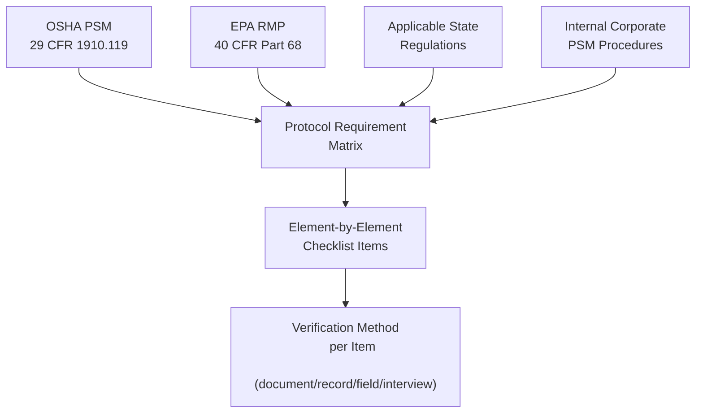
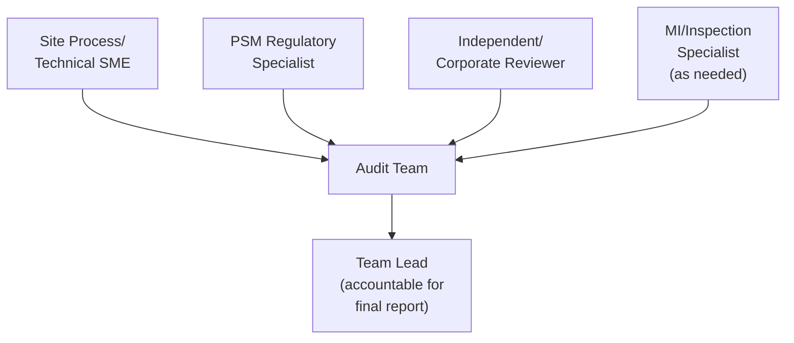
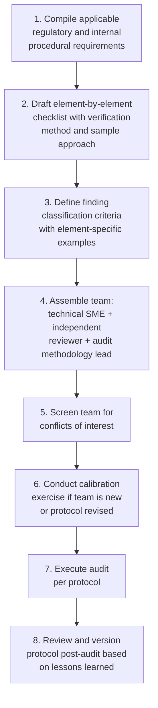

## Audit Protocol Development and Team Selection

### Purpose and Scope

Audit protocol development and team selection determine whether a compliance audit produces reliable, reproducible, and defensible findings or an inconsistent assessment shaped more by the individual auditor's judgment than by objective conformance criteria. This reference addresses how to build a written audit protocol (the instrument that guides what auditors check and how) and how to select and qualify the team that executes it, complementing the scope and frequency design covered separately.

**Key Points**

- A protocol converts regulatory and internal procedural requirements into specific, checkable verification steps — without one, audit consistency depends entirely on individual auditor experience and memory.
- Team composition must satisfy the OSHA PSM regulatory minimum (at least one member knowledgeable in the process) while also addressing independence, technical breadth, and audit methodology competency.
- Protocol and team design should be documented and version-controlled, since both are themselves subject to audit under PSM Element 13 (auditing the audit program).

---

### Audit Protocol Development

#### Step 1: Establish the Protocol's Regulatory and Internal Basis

A defensible protocol is built by cross-referencing two sources for every checklist item:

1. **External regulatory requirements**: OSHA PSM (29 CFR 1910.119), EPA RMP (40 CFR Part 68), and any applicable state or local requirements (e.g., California's Cal/OSHA PSM or CalARP programs, which in some cases impose additional requirements beyond federal PSM/RMP). [Unverified] The specific content and current status of state-level PSM/RMP analogs should be verified against the applicable state's current regulatory text, as these vary by state and are amended independently of federal rules.
2. **Internal procedural requirements**: the organization's own written PSM procedures, which may exceed regulatory minimums; a protocol should verify conformance to the more stringent of the two where they diverge.

#### Step 2: Structure the Protocol by PSM Element

The protocol should be organized to ensure systematic coverage of all fourteen PSM elements (Employee Participation, PSI, PHA, Operating Procedures, Training, Contractors, PSSR, MI, Hot Work, MOC, Incident Investigation, Emergency Planning, Compliance Audits, Trade Secrets), with each element broken into discrete, checkable line items rather than broad open-ended questions.

**Example: Protocol Line Items for the MOC Element**

| Checklist Item | Verification Method | Sample Size/Approach | Pass/Fail or Rating Criteria |
| --- | --- | --- | --- |
| Written MOC procedure exists and addresses technical, mechanical, personnel, and temporary changes | Document review | Single review of current procedure | Procedure addresses all required change categories |
| MOC reviews document technical basis for the change | Record sampling | Sample 10 MOCs from past 12 months | ≥90% of sampled MOCs contain documented technical basis |
| Required disciplines (operations, maintenance, safety) reviewed and approved MOC prior to implementation | Record sampling | Same sample as above | 100% of sampled MOCs show all required approvals prior to implementation date |
| As-built condition matches approved MOC documentation | Field verification | Field walk-down of 5 sampled MOCs | 100% match, or documented/approved as-built deviation |
| PSI updated to reflect approved changes | Cross-reference record review | Same sample, cross-check against PSI element | 100% of sampled MOCs reflected in updated PSI within defined timeframe |
| Operators are aware of and trained on recent changes affecting their area | Interview | Interview 3–5 operators in affected area | Operators can describe recent relevant changes accurately |

[Inference] The specific sample sizes and pass/fail thresholds shown are illustrative; actual thresholds should be calibrated to the organization's process count, historical finding rates, and statistical confidence requirements, and are a program design decision rather than a fixed regulatory figure.

#### Step 3: Define Rating/Classification Criteria in Advance

To avoid inconsistent severity judgments between auditors or audit cycles, the protocol should pre-define what constitutes each finding classification (see compliance audit scope and frequency for the illustrative Critical/High/Medium/Low structure) with element-specific examples, so two different auditors reviewing the same gap would classify it consistently.

#### Step 4: Build in Protocol Version Control and Periodic Update

- The protocol should be reviewed and updated when regulations change (e.g., following EPA RMP rule amendments), when internal procedures are revised, and following each audit cycle to incorporate lessons learned about ambiguous or ineffective checklist items.
- Version history should be retained, since demonstrating which protocol version was in effect for a given audit is relevant to defending audit adequacy after the fact.

---

### Protocol Document Structure (Illustrative Template)

1. **Audit scope statement**: covered processes, PSM elements, and boundary conditions included in this audit cycle.
2. **Regulatory and internal basis reference**: citations to the specific regulatory and procedural sources the protocol implements.
3. **Element-by-element checklist**: structured per Step 2 above, with verification method, sample approach, and rating criteria for each item.
4. **Sampling methodology appendix**: documented rationale for sample selection (e.g., random sampling of MOCs, stratified sampling weighted toward higher-hazard equipment for MI records).
5. **Findings documentation template**: standardized format for recording each finding, its classification, supporting evidence, and responsible party for corrective action.
6. **Team roles and sign-off requirements**: who conducts each element's review, and who provides final sign-off on the completed audit report.

---

### Audit Team Selection

#### Regulatory Minimum

OSHA 1910.119(o)(2) requires that the audit be conducted by at least one person knowledgeable in the process being audited. This is a floor, not a sufficient team design by itself for a comprehensive, defensible audit.

#### Building a Complete Team: Required Competencies

| Competency | Why Needed | Typical Source |
| --- | --- | --- |
| Process/technical knowledge of the specific unit | Regulatory minimum; enables identification of technically meaningful gaps vs. superficial paperwork gaps | Site process/production engineering |
| PSM regulatory and standards knowledge | Ensures checklist items are correctly interpreted against actual regulatory text | Corporate PSM/EHS function, external consultant |
| Audit methodology/sampling competency | Ensures sampling approach and evidence-gathering are statistically and methodologically sound | Internal audit function, trained PSM auditors |
| Mechanical integrity/inspection expertise | Needed for meaningful MI element review (RBI, inspection record interpretation) | Reliability/inspection engineering |
| Independence from the audited unit | Reduces risk of findings being unconsciously softened due to organizational proximity | Corporate staff, different site personnel, third-party auditors |

#### Independence Design Choices

| Team Composition Model | Independence Level | Typical Use Case |
| --- | --- | --- |
| Fully internal, site-based team | Lowest | Not recommended as sole model for regulatory compliance audits |
| Site team + corporate PSM function member | Moderate | Common baseline model meeting regulatory minimum with added independence |
| Site team + cross-site peer reviewer(s) | Higher | Adds independence while retaining internal PSM knowledge |
| Third-party/external audit firm | Highest | Periodic supplement to internal cycle; valuable for surfacing normalized deviance internal teams may miss |

**Key Points**

- A team composed entirely of personnel from the audited site, however technically competent, carries a higher risk of unconsciously softened findings due to familiarity; incorporating at least one member independent of daily site operations is a widely recommended practice.
- Periodic (not necessarily every cycle) use of fully external third-party auditors is a recognized good practice specifically because external auditors have no organizational stake in the outcome and are less subject to normalization-of-deviance blind spots that can develop among personnel embedded in the process.

#### Team Lead Accountability

- Designate a single team lead accountable for the final audit report content, sign-off, and for ensuring the documented response-to-findings requirement under 1910.119(o)(3) is initiated.
- The team lead should have sufficient organizational standing to escalate findings without being overridden by site production pressure — [Inference] this is one reason many organizations designate the team lead role from the corporate PSM/audit function rather than from site leadership, though the appropriate reporting line is an organizational design choice.

---

### Auditor Training and Qualification

- **Formal audit methodology training**: team members conducting record sampling and field verification should be trained in basic audit techniques (evidence sufficiency, sampling rationale, objective vs. subjective findings language) even if they are technical subject matter experts in the process itself.
- **Calibration exercises**: periodically having two auditors independently assess the same sample set and comparing findings classification is a useful practice for surfacing and correcting inconsistent application of the protocol's rating criteria.
- **Conflict of interest screening**: team members should not audit an element or process for which they held direct operational or approval responsibility during the audit period, to avoid effectively auditing their own work.

---

### Common Pitfalls

- **Open-ended checklist items without defined verification method**: an item like "Verify MOC procedure is followed" without specifying sample size, record selection method, or pass/fail criteria produces inconsistent rigor between audit cycles and auditors.
- **Team composed solely of site personnel**: even when technically competent, this configuration is more vulnerable to unconsciously softened findings and is generally not considered a best-practice standalone model.
- **No documented sampling rationale**: findings based on an undocumented or seemingly arbitrary record selection are more vulnerable to challenge, both internally and in the event of regulatory scrutiny after an incident.
- **Static, never-updated protocol**: a protocol left unrevised despite regulatory amendments or internal procedure changes will progressively verify conformance against outdated requirements.
- **No conflict-of-interest screening**: allowing a team member to audit an area they were personally responsible for creates both an actual and perceived independence problem that undermines the credibility of the finding.
- **Team lead without escalation authority**: a team lead who can be overridden by site production leadership on finding classification undermines the audit's core purpose as an independent conformance check.

---

### Implementation Roadmap

**Next Steps**

- Compile the current regulatory basis matrix (OSHA PSM, EPA RMP, applicable state programs) and cross-reference against internal PSM procedures
- Draft or revise the element-by-element checklist with explicit verification methods and sampling approach for each item
- Define finding classification criteria with element-specific examples to standardize severity judgments across auditors
- Assemble a team model incorporating at least one member independent of the audited site's daily operations
- Screen proposed team members for conflicts of interest against the specific processes/elements they will audit

**Related Topics**

- Compliance Audit Scope and Frequency
- Findings Classification and Corrective Action Tracking Systems
- Third-Party and External PSM Audit Programs
- Management of Change (MOC) as an Audit Trigger
- Mechanical Integrity Program Auditing
- Process Safety Culture and Normalization of Deviance
- Element 13 Self-Assessment: Auditing the Compliance Audit Program