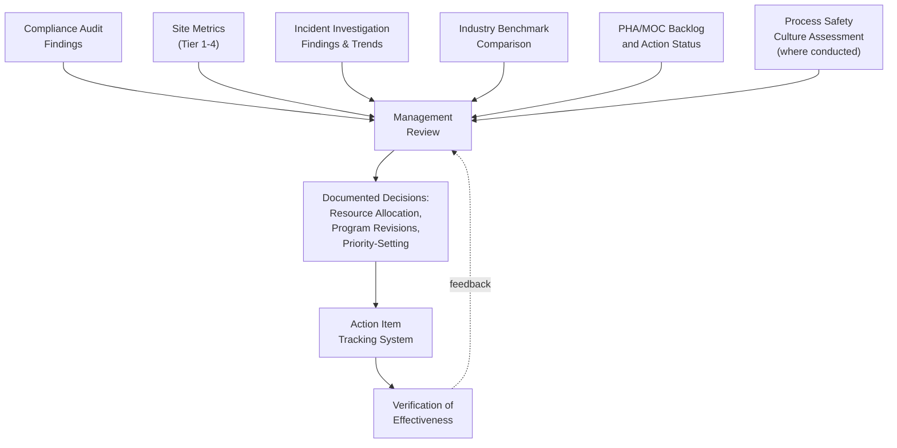
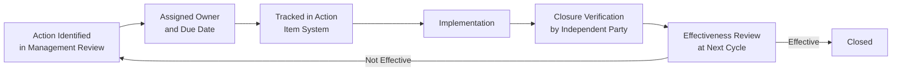
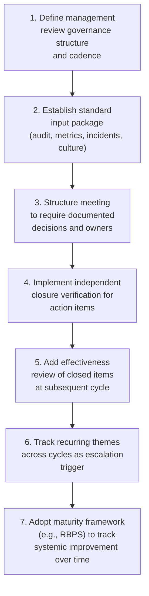

## Management Review and Continuous Improvement

### Purpose and Scope

Management review is the governance mechanism through which senior site and corporate leadership periodically evaluate the overall health, adequacy, and effectiveness of the process safety management system — synthesizing audit findings, metrics trends, incident investigations, and management-of-change activity into decisions about resource allocation, program revision, and organizational priority-setting. Continuous improvement is the resulting discipline of using that review to systematically close gaps and raise management system maturity over time, rather than treating each audit or metrics cycle as an isolated event. This element closes the loop across the entire PSM system: it is where compliance auditing, metrics, and incident learning are integrated into actionable organizational decisions.

**Key Points**

- Management review is a distinct activity from compliance auditing — auditing verifies conformance to specific requirements, while management review evaluates the overall adequacy and effectiveness of the system as a whole, including areas not captured by a checklist.
- Effective management review requires structured inputs (audit findings, metrics, incident data) and a defined output (documented decisions, resource commitments, and accountability assignments) — a review that produces discussion but no documented decision has limited continuous improvement value.
- Continuous improvement should be evidenced by trackable action item closure and periodic reassessment of whether closed actions actually achieved their intended effect, not merely by the existence of a review meeting.

---

### Distinguishing Management Review from Compliance Auditing

| Dimension | Compliance Audit | Management Review |
| --- | --- | --- |
| Question asked | "Does the system conform to specific regulatory/procedural requirements?" | "Is the overall system adequate, effective, and appropriately resourced given current risk?" |
| Primary output | Findings against checklist criteria, classified by severity | Strategic decisions, resource commitments, program revisions |
| Frequency driver | Regulatory requirement (e.g., 3-year maximum under 1910.119(o)) | Organizational governance cadence (commonly annual, sometimes more frequent) |
| Participants | Audit team with process/regulatory expertise | Senior site and corporate leadership |
| Scope | Defined by protocol, element-by-element | Holistic — synthesizes audit, metrics, incident, and culture inputs |

[Inference] A common design weakness is treating the compliance audit's findings response (required under 1910.119(o)(3)–(4)) as equivalent to a full management review; the audit response process addresses specific findings, while management review is intended to also address systemic questions the audit checklist may not directly surface — for example, whether the organization has adequate PSM staffing and expertise overall.

---

### Structuring Management Review Inputs

#### Core Input Categories

1. **Compliance audit findings and closure status**: not just open findings, but a review of whether closed findings from prior cycles have actually prevented recurrence of the underlying issue.
2. **Metrics trends (Tier 1–4)**: multi-period trends rather than single-period snapshots, consistent with the trending approach in the site-level metrics program.
3. **Industry benchmark comparison**: where the site's performance stands relative to industry data, providing external context for internal trend interpretation.
4. **Incident investigation findings**: recurring root-cause categories across multiple investigations, which often reveal systemic issues that individual investigations do not surface in isolation.
5. **PHA and MOC backlog status**: aging and closure-rate data on recommendation and change management backlogs.
6. **Resource and staffing adequacy**: whether current PSM staffing, budget, and organizational structure are adequate for current process risk and workload — a question rarely answered by a compliance checklist but central to management review's purpose.
7. **Process safety culture indicators**: where formal culture assessments are conducted, their findings regarding reporting climate, psychological safety, and normalization of deviance risk.

---

### Management Review Governance Structure

#### Review Levels and Cadence

| Level | Frequency | Focus | Typical Participants |
| --- | --- | --- | --- |
| Site Management Review | Annual (minimum); some organizations conduct semi-annually | Site-specific findings, metrics, resourcing needs | Site manager, department heads, site PSM coordinator |
| Corporate/Business Unit Review | Annual | Cross-site trends, resource allocation across sites, program standardization | Corporate PSM/HSE leadership, site managers |
| Executive/Board-Level Review | Annual, with quarterly interim updates | Enterprise risk posture, major resourcing decisions, risk tolerance | Executive leadership, board risk/audit committee (see communicating risk to executive leadership) |

[Unverified] Neither OSHA PSM nor EPA RMP prescribes a specific management review frequency or format as a distinct regulatory element in the way compliance audits are prescribed; management review frequency is generally an organizational governance design choice informed by good practice guidance (e.g., CCPS) rather than a direct regulatory citation, though this should be confirmed against current regulatory text and any applicable consensus standards the organization has committed to follow.

#### Meeting Structure (Illustrative)

1. **Review of prior action item status**: closure rate, effectiveness verification, and reasons for any overdue items.
2. **Metrics and trend presentation**: Tier 1–4 trends against target/tolerance, framed per the aggregation principles used for executive reporting.
3. **Audit and incident findings synthesis**: recurring themes across the review period, not a re-litigation of individual findings already tracked elsewhere.
4. **Resource and program adequacy discussion**: explicit assessment of whether current staffing, budget, and program design are adequate for current risk.
5. **Documented decisions and commitments**: specific, assigned, dated actions — the output that distinguishes management review from a general discussion meeting.

---

### From Review to Continuous Improvement: Closing the Loop

#### Action Item Lifecycle

- **Independent closure verification**: consistent with the principle applied in compliance auditing, action items should not be self-certified closed by the person who implemented them; a separate reviewer should confirm implementation before the item is marked closed.
- **Effectiveness review, not just closure tracking**: the continuous improvement discipline requires revisiting closed items at a subsequent review cycle to confirm the underlying issue did not recur — closing an action item is not equivalent to confirming it worked.
- **Recurring theme escalation**: when the same root-cause category recurs across multiple incident investigations or audit cycles despite documented corrective actions, this pattern itself should become a management review agenda item, since it suggests the corrective actions taken were treating symptoms rather than the underlying systemic cause.

**Example**

A site's management review identifies that MOC-related findings have appeared in the audit report for three consecutive cycles despite documented corrective actions each time. Rather than logging a fourth similar corrective action, the review escalates this as a systemic issue, commissions a focused root-cause analysis of the MOC program itself (potentially examining staffing, training adequacy, or system usability), and allocates dedicated resources to address the underlying cause rather than the recurring symptom.

---

### Maturity Models for Continuous Improvement

Organizations commonly use a maturity framework — such as CCPS's Risk-Based Process Safety (RBPS) model — to assess management system maturity across all twenty RBPS elements (a broader framework than the fourteen OSHA PSM elements) as an input to management review, tracking maturity progression over successive review cycles rather than only tracking discrete finding closure.

| Maturity Stage (Illustrative) | Characteristics |
| --- | --- |
| Reactive | Actions driven primarily by incidents and regulatory minimums |
| Compliant | Meets regulatory requirements consistently; limited proactive improvement |
| Proactive | Leading indicators actively used to prevent incidents; systemic issue identification |
| Resilient/Generative | Continuous improvement embedded in culture; organization anticipates and adapts to emerging risk |

[Inference] Maturity stage terminology and boundaries vary across different published frameworks (CCPS RBPS, various consulting maturity models); the four-stage illustration above is a commonly used pattern for conceptual purposes, not a single universally standardized scale, and organizations should select and consistently apply one framework rather than blending terminology from multiple models.

---

### Common Pitfalls

- **Review without documented decisions**: a management review meeting that discusses findings and trends but produces no assigned, dated action commitments provides limited continuous improvement value and is difficult to demonstrate as effective if scrutinized after an incident.
- **Treating audit response as equivalent to management review**: responding to specific audit findings (a regulatory requirement) is necessary but not sufficient; management review must also address systemic and resourcing questions the audit checklist does not directly probe.
- **No effectiveness verification of closed actions**: tracking closure rate alone, without periodically confirming the underlying issue did not recur, can create a false impression of program improvement while systemic issues persist.
- **Self-certified closure**: allowing the same function responsible for implementing a corrective action to also certify it closed removes an important independence check.
- **Ignoring recurring themes across investigations**: treating each incident investigation and audit cycle as fully independent, without tracking recurring root-cause patterns across cycles, can leave a systemic issue unaddressed indefinitely despite each individual instance being "closed."
- **Resourcing discussion omitted**: a management review that reviews findings and metrics but never explicitly addresses whether the PSM program is adequately staffed and resourced for current risk misses one of the review's most important governance functions.

---

### Regulatory and Standards Context

- **OSHA PSM**: does not contain a distinct "management review" element by that name; the closest direct regulatory analog is the documented response-to-findings requirement within the Compliance Audits element (1910.119(o)(3)–(4)), though broader management review as described here extends beyond that specific regulatory requirement into general good management practice.
- **EPA RMP**: similarly does not prescribe a standalone management review requirement beyond its compliance audit provisions.
- **CCPS RBPS**: explicitly includes "Measurement and Metrics" and "Management Review and Continuous Improvement" as distinct pillar elements within its broader twenty-element framework, providing the most direct published good-practice framework reference for this topic.
- **ISO 45001 / process safety-adjacent management system standards**: organizations operating under broader integrated management system standards may have management review requirements defined at the corporate management system level (e.g., ISO 45001's management review clause) that should be reconciled with PSM-specific review to avoid duplicative or conflicting governance structures. [Unverified] The specific integration approach between ISO-based management system reviews and PSM-specific management review is organization-specific and was not independently verified against a particular company's integrated management system documentation.

---

### Implementation Roadmap

**Next Steps**

- Define or formalize the site and corporate management review cadence and required input package
- Establish a documented decision/action template requiring assigned owner, due date, and independent closure verification
- Build a mechanism for tracking recurring root-cause themes across audit and incident investigation cycles
- Select and consistently apply a maturity framework (e.g., CCPS RBPS) to track management system improvement over successive review cycles
- Explicitly incorporate a resourcing/staffing adequacy assessment into each management review cycle

**Related Topics**

- Compliance Audit Scope and Frequency
- Audit Protocol Development and Team Selection
- Designing a Site-Level Metrics Program
- Communicating Risk to Executive Leadership and the Board
- Incident Investigation Root-Cause Taxonomy and Trending
- Process Safety Culture Assessment and Development
- CCPS Risk-Based Process Safety (RBPS) Framework Overview