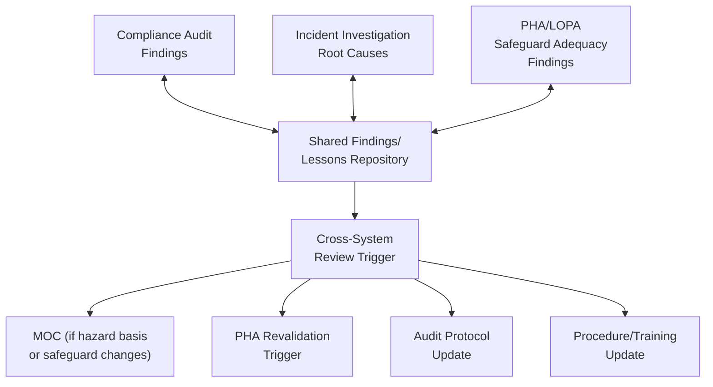
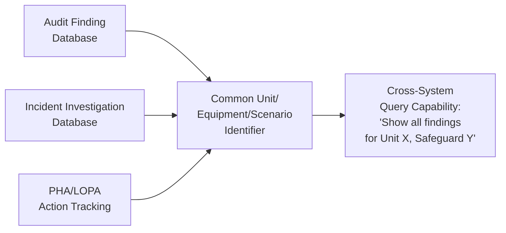
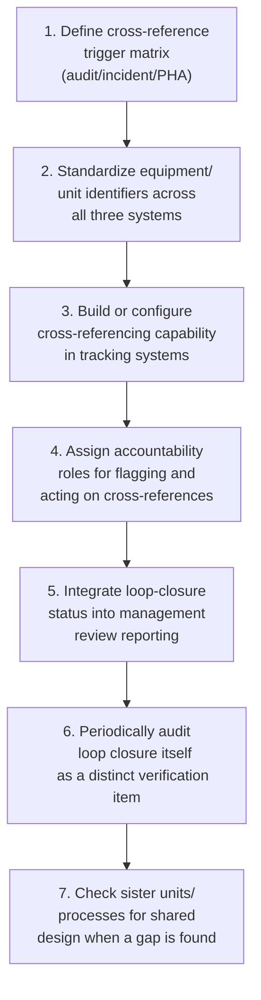

## Closing the Loop Between Audits, Incidents, and Hazard Analyses

### Purpose and Scope

Closing the loop refers to the deliberate integration of findings across three normally separate PSM activities — compliance audits, incident investigations, and process hazard analyses (PHA/LOPA) — so that a finding or lesson discovered in one activity is systematically checked against and fed into the other two, rather than remaining siloed within the system that generated it. Without this integration, an organization can have three technically compliant, individually well-run programs that nonetheless fail to communicate with each other, leaving a hazard identified in one system uncorrected in the others. This is a structural design topic, distinct from the design of any single program.

**Key Points**

- The three systems ask related but different questions: audits ask "does the system conform to requirements," incidents ask "what happened and why," and PHA/LOPA ask "what could happen and are safeguards adequate" — a finding relevant to one question is very often relevant to the other two.
- Loop closure requires both a data/documentation link (so a finding is traceable across systems) and a governance/process link (so someone is accountable for propagating relevant findings).
- Failure to close this loop is a recurring theme in major incident investigations, where post-incident review has found that a hazard or safeguard gap was previously identified through a different mechanism (a prior audit, a related incident elsewhere, or an unrevalidated PHA) but never propagated to the system that could have prevented the incident.

---

### Why These Three Systems Must Be Linked

#### The Gap Without Integration

- An **audit** may find that a specific safety-critical instrument's proof-test interval is overdue, without necessarily checking whether the LOPA credit taken for that instrument's SIL rating assumed a shorter test interval than what is actually being achieved in practice.
- An **incident investigation** may identify that a relief valve lifted due to a scenario not anticipated in the original PHA, without a defined mechanism ensuring the PHA is revalidated to add that scenario — leaving the same unaddressed gap for every other similar unit that shares the design.
- A **PHA** may identify a safeguard as an Independent Protection Layer (IPL) based on an assumption (e.g., "operator responds within 10 minutes") that a prior incident investigation or audit already found to be unrealistic in practice — without a link between the two, the PHA's LOPA credit remains based on an assumption already contradicted by operational evidence.

[Inference] This pattern — a relevant finding existing somewhere in the organization's records but not reaching the system where it would have prevented recurrence or informed a hazard assessment — is one of the most frequently cited organizational/systemic factors in major incident post-mortems, though the specific causal contribution varies by incident and should be assessed on a case-by-case basis rather than assumed universally present.

---

### Step 1: Establish Cross-Reference Triggers

Design specific, predefined conditions under which a finding in one system must trigger a review in another. This should not be left to individual judgment on a case-by-case basis, since inconsistent application is the most common way the loop fails silently.

#### Illustrative Trigger Matrix

| Source Finding | Must Trigger Review In | Rationale |
| --- | --- | --- |
| Audit finding: safety-critical device proof-test/inspection significantly overdue or repeatedly failing test | PHA/LOPA (does the IPL credit assumption still hold?) | Degraded safeguard reliability directly undermines the risk reduction the PHA assumed |
| Incident: safeguard demanded/activated in a scenario not represented in the current PHA | PHA revalidation for the specific unit and, where design is shared, sister units | Indicates a gap in hazard identification, not just a single equipment failure |
| Incident: root cause attributed to a management system element (e.g., MOC, training) | Compliance audit protocol (add or strengthen relevant checklist item) | The audit protocol may not currently probe deeply enough to catch this failure mode elsewhere |
| PHA/LOPA revalidation: safeguard reliability assumption revised downward | Compliance audit scope (verify actual field performance against revised assumption) | Ensures the audit checks the specific assumption the hazard analysis now depends on |
| Audit finding: recurring gap across multiple cycles despite corrective action (see management review) | Root-cause investigation into the corrective action process itself, and PHA revalidation if the gap concerns safeguard adequacy | Recurrence suggests corrective actions addressed symptoms, not root cause |

**Key Points**

- The specific trigger matrix should be tailored to the organization's process hazards and documented as part of PSM governance procedure, not left implicit.
- Triggers should specify not just that a review occurs, but a defined timeframe for that review to be initiated, so cross-system propagation does not stall indefinitely.

---

### Step 2: Build the Data/Documentation Link

#### Shared Findings Repository or Cross-Reference System

A practical mechanism for loop closure is a shared repository or cross-referencing field within existing tracking systems (audit findings database, incident investigation system, PHA action tracking) that allows a finding entered in one system to be explicitly linked or tagged for review in the others.

- **Common identifiers**: using consistent unit, equipment tag, or scenario identifiers across all three systems is a prerequisite for meaningful cross-referencing; if each system uses different naming conventions for the same equipment or process area, cross-system queries become unreliable.
- **Queryability, not just storage**: the repository's value depends on the ability to query "show me everything relevant to this unit/safeguard/scenario across all three systems," not merely on all three systems' data existing somewhere.
- [Unverified] Specific commercial or custom software architectures for this kind of cross-system integration vary widely by organization and were not evaluated for this reference; the design principle (common identifiers, queryable cross-linking) applies regardless of the specific tooling chosen.

---

### Step 3: Assign Governance Accountability for Loop Closure

A data link alone does not close the loop if no one is accountable for acting on the cross-reference.

#### Accountability Model

| Role | Responsibility |
| --- | --- |
| Audit team lead | Flag findings meeting trigger criteria (e.g., safeguard reliability gaps) for PHA/LOPA review referral at audit closeout |
| Incident investigation lead | Determine whether investigation findings indicate a PHA scenario gap or audit protocol gap, and formally refer accordingly |
| PHA/LOPA facilitator | Check cross-referenced audit and incident findings for the unit as a standard input at the start of every PHA revalidation, not merely rely on the team's memory of past events |
| PSM governance function | Own the trigger matrix, periodically verify that flagged cross-references were actually acted upon, and report loop-closure metrics at management review |

This accountability structure should be integrated into the management review process, with loop-closure status (e.g., "number of audit findings requiring PHA referral, and status of that referral") as a standing input.

---

### Step 4: Verify Loop Closure as Its Own Auditable Item

Because loop closure is itself a systemic control, it should be periodically verified rather than assumed to be functioning.

#### Illustrative Verification Approach

1. Select a sample of closed audit findings meeting trigger criteria (e.g., safeguard reliability gaps) from the past audit cycle.
2. Verify whether a corresponding PHA/LOPA review was initiated and, where warranted, completed.
3. Select a sample of incident investigations with root causes indicating a hazard identification gap.
4. Verify whether the affected unit's PHA was revalidated to reflect the new scenario, and whether sister units with shared design were also reviewed.
5. Document findings from this verification as a distinct audit/review item, feeding back into the trigger matrix's own periodic refinement.

**Example**

An incident investigation at Unit A finds that a pressure relief scenario involving a specific valve failure mode was not represented in the unit's PHA. A well-functioning loop-closure process would: (1) trigger revalidation of Unit A's PHA to add the scenario; (2) check whether any sister units with the same valve design and process configuration share the same gap; and (3) update the compliance audit protocol's MI/PHA cross-check item to specifically probe for this failure mode in future audits. A loop-closure verification exercise conducted a year later would sample this specific case to confirm all three actions were actually completed, not merely that the original corrective action for Unit A itself was closed.

---

### Common Pitfalls

- **Systems that are procedurally excellent in isolation but never cross-reference**: an organization can pass every compliance audit, conduct thorough incident investigations, and run rigorous PHAs, while each system remains unaware of directly relevant findings generated by the others.
- **Reliance on individual memory or informal communication**: without a documented trigger matrix and tracking mechanism, cross-system propagation depends on whether a specific individual happens to remember and mention a related finding — which does not scale and does not survive personnel turnover.
- **Sister-unit blind spot**: fixing an identified gap only at the specific unit where it was discovered, without checking other units sharing the same design, process configuration, or safeguard architecture, leaves the same latent gap present elsewhere in the organization.
- **No verification that the loop actually closed**: treating the existence of a trigger matrix or cross-reference system as sufficient, without periodically sampling and verifying that flagged items were actually acted upon, can allow the loop-closure process itself to quietly stop functioning.
- **Inconsistent identifiers across systems**: if audit findings, incident records, and PHA action items reference the same equipment using different naming conventions, cross-referencing becomes unreliable even where the will to integrate exists.

---

### Regulatory and Standards Context

- **No single regulatory element mandates this integration explicitly**: OSHA PSM and EPA RMP address compliance audits, incident investigation, and PHA as separate elements without a distinct regulatory requirement titled "loop closure" between them; the integration described here is a management-system design practice rather than a directly citable regulatory requirement. [Unverified] This should not be read as implying no regulatory expectation exists at all — investigators and enforcement personnel have, in specific post-incident contexts, evaluated whether an organization's overall management system reasonably should have connected related findings, but the precise regulatory or enforcement standard applied is case-specific and was not independently verified for this reference.
- **CCPS RBPS**: the broader twenty-element Risk-Based Process Safety framework's structure — spanning commit-to-process-safety, understand hazards and risk, manage risk, learn from experience, and measurement/review pillars — is explicitly designed to encourage this kind of cross-pillar integration, and is a useful reference framework for organizations designing loop-closure mechanisms.
- **CSB investigation reports**: the U.S. Chemical Safety Board has, in specific published investigations, identified failures to connect prior findings (from audits, incidents at the same or other facilities, or hazard analyses) as contributing organizational factors; [Unverified] these findings are specific to the incidents investigated in each report and should be reviewed individually rather than treated as a generalized universal finding across all incidents.

---

### Implementation Roadmap

**Next Steps**

- Define and document the cross-reference trigger matrix specifying which finding types in one system must trigger review in the others
- Standardize equipment, unit, and scenario identifiers across the audit findings, incident investigation, and PHA/LOPA tracking systems
- Assign explicit accountability roles for flagging and verifying cross-system referrals
- Incorporate loop-closure status as a standing input to the management review process
- Establish a periodic verification exercise sampling past findings to confirm cross-system referrals were actually completed

**Related Topics**

- Management Review and Continuous Improvement
- Compliance Audit Scope and Frequency
- Audit Protocol Development and Team Selection
- Incident Investigation Root-Cause Taxonomy and Trending
- PHA Revalidation Triggers and Methodology
- LOPA Safeguard Credit Assumptions and Validation
- CCPS Risk-Based Process Safety (RBPS) Framework Overview