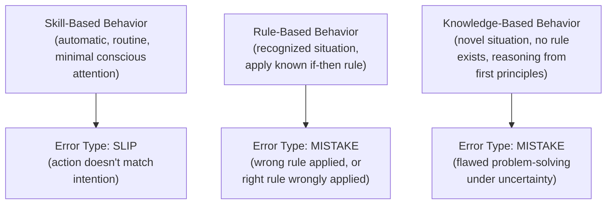
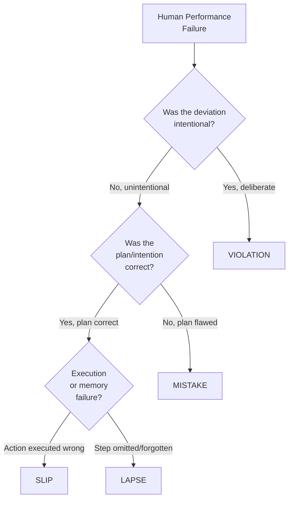
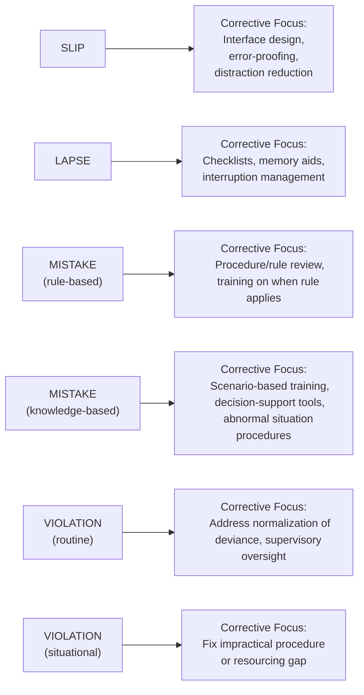
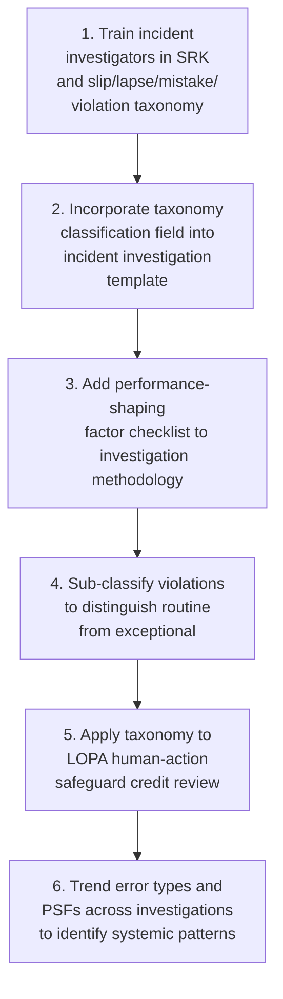

## Human Error Taxonomy in Process Operations

### Purpose and Scope

Human error taxonomy provides a structured vocabulary for classifying how and why human performance failures occur in process operations, moving investigation and prevention efforts beyond the unhelpful and often inaccurate label of "operator error" toward specific, actionable error mechanisms. A precise taxonomy is foundational to incident investigation root-cause analysis, PHA/LOPA human-factor credit decisions, procedure and training design, and human reliability analysis. Without a shared taxonomy, organizations tend to converge prematurely on "retrain the operator" as a corrective action regardless of the actual underlying failure mode, which frequently fails to prevent recurrence.

**Key Points**

- Human error taxonomies distinguish error *type* (what kind of mental failure occurred) from error *cause* (why the conditions existed for that failure to occur) — both are needed for effective corrective action.
- The most widely referenced foundational framework in process safety is Rasmussen's Skill-Rule-Knowledge (SRK) model combined with Reason's slip/lapse/mistake/violation classification, both extensively adapted by CCPS guidance for process industry application.
- Classifying an event correctly within the taxonomy directly shapes what corrective action is appropriate — a slip, a mistake, and a violation each require fundamentally different interventions.

---

### Foundational Model: Skill-Rule-Knowledge (SRK) Framework

Jens Rasmussen's SRK framework categorizes human performance by the cognitive level at which a task is being processed, which in turn shapes the kind of error that can occur at that level.

- **Skill-based level**: highly practiced, automatic actions (e.g., an operator routinely closing a valve as part of a familiar sequence). Errors at this level are typically **slips** (action execution fails despite correct intention) or **lapses** (a step is omitted due to memory failure), not failures of knowledge or judgment.
- **Rule-based level**: the operator recognizes a situation and applies a learned rule or procedure (e.g., "if high level alarm, then open the drain valve"). Errors here are typically **mistakes** — either a good rule is misapplied to the wrong situation, or a bad/outdated rule is correctly applied.
- **Knowledge-based level**: a genuinely novel or unfamiliar situation requiring first-principles reasoning, common during abnormal situations not covered by procedure. Errors here are mistakes arising from incomplete mental models, time pressure, or information overload during a high-stakes, unfamiliar scenario.

[Inference] Many significant process safety incidents occur during transitions into knowledge-based behavior — that is, during abnormal or upset conditions that fall outside routine procedure — because this is the cognitive mode most vulnerable to error under time pressure and incomplete information; this is a widely cited pattern in human factors literature rather than a claim about any specific incident.

---

### Reason's Error Classification: Slips, Lapses, Mistakes, and Violations

James Reason's classification, extensively referenced in CCPS human factors guidance, is generally organized along two dimensions: whether the *intended action* was correct, and whether the *plan* itself was correct.

#### The Four Categories

| Category | Was the Plan Correct? | Was the Execution Correct? | Description | Example |
| --- | --- | --- | --- | --- |
| Slip | Yes | No | Correct intention, but the action was executed incorrectly (attention/execution failure) | Intending to close valve A, but operating valve B due to a momentary attention lapse |
| Lapse | Yes | No (omission) | Correct intention, but a step was forgotten or omitted (memory failure) | Skipping a step in a startup checklist because of interruption |
| Mistake | No | N/A (executed as planned) | The plan itself was flawed — either a good rule misapplied, or the wrong rule/knowledge used | Applying a normal shutdown procedure to an abnormal situation it wasn't designed for |
| Violation | N/A (deliberate deviation) | N/A | A deliberate departure from a known rule or procedure, distinguished from unintentional errors above | Bypassing an interlock to expedite a startup, believing it to be low-risk |

**Key Points**

- Slips and lapses are execution-level failures with a correct underlying plan; mistakes are planning-level failures; violations are deliberate deviations — each requires a fundamentally different corrective action category.
- Violations should be further sub-classified (see below), since "the operator violated procedure" is as unhelpfully vague a label as "operator error" if left unexamined.

---

### Sub-Classifying Violations

Not all violations reflect the same underlying organizational condition, and lumping them together produces poorly targeted corrective actions.

| Violation Sub-Type | Description | Typical Corrective Action Focus |
| --- | --- | --- |
| Routine/habitual violation | A deviation that has become normalized over time because it was never corrected and appeared to carry no consequence (**normalization of deviance**) | Address the organizational/supervisory tolerance that allowed the deviation to persist, not just the individual instance |
| Situational violation | A deviation driven by specific circumstances (e.g., a procedure that cannot actually be followed as written under current conditions) | Fix the underlying procedure, equipment, or resourcing gap that made compliance impractical |
| Exceptional violation | A rare, deliberate deviation in an unusual or emergency situation, often a judgment call under significant pressure | Review whether the judgment was reasonable given information available at the time; may not indicate a systemic gap |
| Malicious/reckless violation | An intentional act with disregard for known risk | Distinct from the other categories; addressed through conduct/disciplinary process rather than systems-based corrective action |

[Inference] Investigation practice generally treats routine/habitual violations as carrying the most significant systemic corrective-action implications, because their existence indicates a supervisory or cultural tolerance for deviation that is likely to also be present in other, not-yet-observed situations — this is a widely held principle in process safety culture literature rather than a claim specific to any single incident.

---

### CCPS Adaptation for Process Industries

CCPS's human factors guidance builds on the SRK and slip/lapse/mistake/violation frameworks specifically for process industry application, commonly organizing contributing factors into categories useful for investigation and design purposes:

#### Performance-Shaping Factors (PSFs)

Performance-shaping factors are conditions that increase or decrease the probability of a given error type occurring, and are central to both incident investigation and Human Reliability Analysis (HRA).

| PSF Category | Examples |
| --- | --- |
| Task-related | Task complexity, time pressure, ambiguous procedure wording |
| Environmental | Noise, poor lighting, extreme temperature, vibration |
| Individual | Fatigue, training/experience level, workload |
| Organizational | Staffing adequacy, shift handover quality, supervisory oversight, safety culture |
| Interface/design | Poor human-machine interface (HMI) design, alarm flood conditions, ambiguous control layout |

**Example**

An operator fails to respond correctly to a developing abnormal situation during a night shift. Taxonomic analysis might classify this as a knowledge-based mistake (the situation was outside routine procedure), with contributing performance-shaping factors including fatigue (circadian low point during night shift), an alarm flood condition overwhelming the operator's ability to diagnose the true root cause (interface/design PSF), and inadequate staffing for the abnormal situation (organizational PSF). Labeling this simply as "operator error" would miss all of these actionable contributing factors and likely lead to an ineffective corrective action (e.g., generic retraining) rather than addressing alarm rationalization, staffing, or fatigue management.

---

### Application to Incident Investigation

#### Why Taxonomy Precision Matters for Corrective Action

A precise taxonomic classification directly determines the corrective action category, which is why investigation teams should be trained in the taxonomy itself, not just in root-cause investigation technique generally.

#### Common Investigation Pitfall: Premature Closure on "Human Error"

- Labeling a finding simply as "human error" or "operator error" without taxonomic classification obscures the actual mechanism and tends to produce a generic, low-effectiveness corrective action (commonly, additional training) regardless of whether training would actually address the root cause.
- A slip caused by poor control panel layout will not be prevented by retraining; it requires interface redesign. A rule-based mistake caused by an outdated procedure will not be prevented by disciplinary action; it requires procedure revision.

---

### Application to PHA/LOPA: Human Factors as Safeguards

When a PHA or LOPA credits human action as part of a safeguard (e.g., "operator responds to high-level alarm within 10 minutes"), the taxonomy informs whether that credit is realistic.

- **Error probability estimation**: Human Reliability Analysis (HRA) techniques (e.g., THERP, HEART, or simplified process-industry adaptations) use performance-shaping factors to estimate the probability that the assumed human action will fail, rather than assuming a fixed reliability figure regardless of context.
- **Realistic task-level assessment**: whether the assumed response is a skill-based, rule-based, or knowledge-based task materially affects how reliable it is reasonable to assume that response will be, particularly under the abnormal/high-stress conditions during which the safeguard is actually likely to be demanded.
- [Inference] A LOPA credit assuming reliable knowledge-based human diagnosis and response under high time pressure and abnormal conditions is generally considered less defensible than a credit assuming a well-practiced skill-based or rule-based response, because knowledge-based performance under stress is inherently more error-prone — though the specific credit and probability of failure assigned should follow the organization's documented HRA methodology rather than a generic assumption.

---

### Common Pitfalls

- **Stopping at "human error" as a root cause**: this label describes an outcome, not a mechanism, and provides no actionable direction for corrective action.
- **Treating all violations identically**: failing to distinguish routine/habitual violations (indicating systemic tolerance) from exceptional violations (a one-time judgment call) leads to mismatched corrective action — either overreacting to a reasonable judgment call or underreacting to a normalized deviation pattern.
- **Ignoring performance-shaping factors**: classifying the error type (slip, mistake, violation) without also identifying the contributing PSFs (fatigue, interface design, staffing, procedure quality) misses the conditions that made the error likely, which are usually more directly correctable than the individual's specific action.
- **Overly optimistic human-action safeguard credit in LOPA**: assuming high reliability for a knowledge-based response under abnormal, high-stress conditions without accounting for realistic performance-shaping factors can overstate the actual risk reduction a "safeguard" provides.
- **Inconsistent taxonomy application across investigators**: without shared training in the taxonomy, different investigators may classify similar events differently, undermining the ability to trend error types and PSFs across multiple incidents (a specific application of loop-closure principles to human factors data).

---

### Implementation Roadmap

**Next Steps**

- Incorporate the SRK and slip/lapse/mistake/violation taxonomy into incident investigation training and templates
- Add a structured performance-shaping factor checklist to the standard investigation methodology
- Review existing LOPA human-action safeguard credits against realistic task-level (skill/rule/knowledge-based) reliability assumptions
- Establish trending of error type and PSF classifications across investigations to identify recurring systemic patterns
- Distinguish routine/habitual violations from exceptional violations in investigation classification to correctly target corrective action

**Related Topics**

- Human Reliability Analysis (HRA) Methods for LOPA Credit
- Alarm Management and Alarm Rationalization
- Normalization of Deviance and Process Safety Culture
- Incident Investigation Root-Cause Taxonomy and Trending
- Procedure Design and Human Factors Engineering
- Fatigue Risk Management in Shift Operations
- Human-Machine Interface (HMI) Design for Abnormal Situation Management