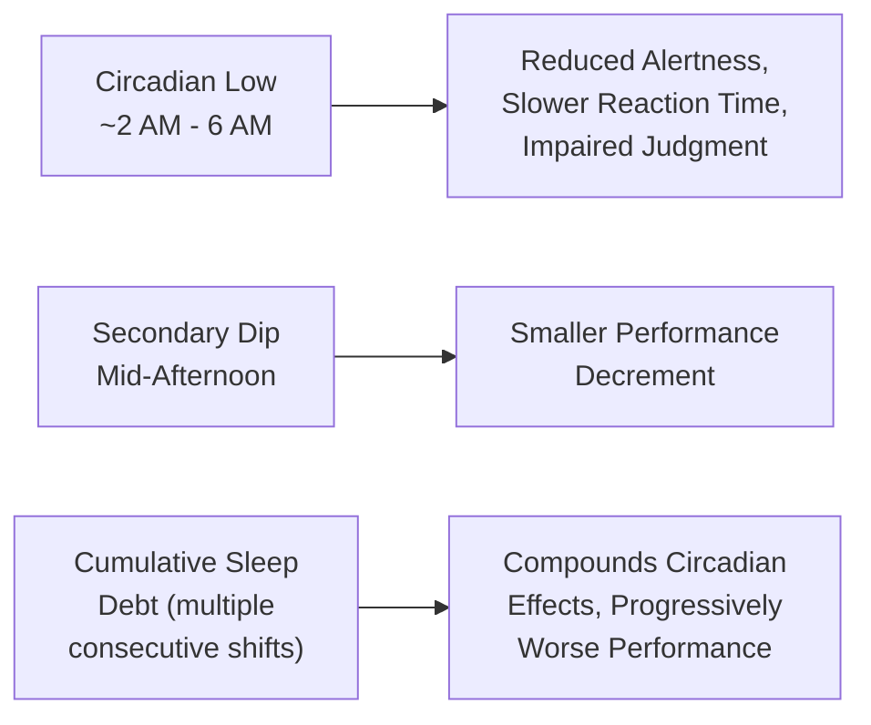
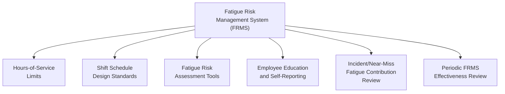
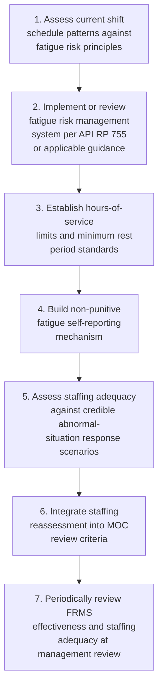

## Fatigue, Shift Work, and Staffing Levels

### Purpose and Scope

Fatigue arising from shift work patterns and inadequate staffing is a well-documented performance-shaping factor that degrades human reliability in exactly the knowledge-based, high-stakes decision-making situations where process safety depends most on sound operator judgment. This topic addresses how fatigue risk arises from shift scheduling and staffing design, how it is assessed and managed, and how staffing adequacy itself functions as a process safety management system input rather than a purely operational/cost consideration.

**Key Points**

- Fatigue is a physiological state with measurable, predictable effects on reaction time, judgment, and vigilance — it is not simply a matter of individual tolerance or work ethic.
- Circadian rhythm disruption from night and rotating shift work produces measurable performance decrements independent of total sleep obtained, meaning schedule design matters even when workers report adequate sleep.
- Staffing level adequacy is a process safety management system input because it directly affects workload, fatigue exposure, and the availability of personnel to respond to abnormal situations — understaffing has been identified as a contributing factor in multiple major process safety incidents.

---

### The Physiological Basis of Fatigue Risk

#### Circadian Rhythm and Performance

Human alertness and cognitive performance follow a roughly 24-hour circadian cycle, with well-documented performance troughs during the early morning hours (commonly cited as roughly 2:00 a.m. to 6:00 a.m.) and a smaller secondary dip in the mid-afternoon, largely independent of how much sleep an individual obtained before their shift.

- **Night shift vulnerability**: night shift work requires operators to be maximally alert during their body's natural circadian low point, which is a primary reason night shifts are consistently associated with higher rates of performance error and safety incidents across multiple industries.
- **Sleep debt accumulation**: consecutive night shifts, or rotating schedules that do not allow adequate recovery sleep between rotations, produce cumulative sleep debt that compounds circadian effects, generally producing progressively degraded performance across a sequence of shifts even when each individual shift's hours comply with a maximum-hours policy.
- [Inference] The specific magnitude of performance decrement varies by individual, task type, and cumulative fatigue history; fatigue risk management is generally approached probabilistically (managing risk exposure) rather than as a fixed, universally quantifiable performance penalty applicable to every individual and task identically.

#### Effects on Task Performance by SRK Level

Referencing the Skill-Rule-Knowledge framework (see human error taxonomy), fatigue affects different cognitive levels differently:

| SRK Level | Fatigue Effect |
| --- | --- |
| Skill-based (routine, automatic tasks) | Relatively more resistant to fatigue effects, though slips and lapses increase |
| Rule-based (recognized situation, apply known procedure) | Increased likelihood of misapplying or failing to recall the correct rule |
| Knowledge-based (novel/abnormal situation reasoning) | Most significantly degraded — fatigue substantially impairs working memory, situational awareness, and complex problem-solving exactly when abnormal situation management most requires them |

[Inference] Because abnormal situation management typically demands knowledge-based reasoning, and because major process safety incidents disproportionately occur during abnormal (not routine) operating conditions, fatigue's disproportionate impact on knowledge-based performance is a significant concern specifically for major accident prevention, not just routine task error rates — though this is an inference connecting well-established separate findings rather than a single directly cited combined statistic.

---

### Shift Schedule Design Considerations

#### Common Schedule Patterns and Fatigue Implications

| Schedule Pattern | Fatigue Consideration |
| --- | --- |
| Fixed shifts (always day or always night) | Allows circadian adaptation over time for permanent night workers, though permanent night work carries its own long-term health and social/family disruption considerations |
| Slow-rotating shifts (e.g., weekly rotation) | Circadian adaptation is disrupted before it fully completes; commonly associated with higher fatigue burden than either fixed or fast-rotating patterns |
| Fast-rotating shifts (e.g., 2-2-2 or similar short rotations) | Some fatigue research favors fast rotation on the basis that it limits cumulative circadian disruption, though the optimal pattern is task- and context-dependent |
| 12-hour shifts | Common in continuous process operations; extends single-shift fatigue exposure and reduces recovery time between shifts, requiring careful design of consecutive-shift limits and rest period minimums |

[Unverified] There is no single universally agreed "best" shift pattern across all fatigue research and process industry practice; the optimal pattern depends on the specific operation, workforce preferences, and the fatigue risk management system's other controls, and organizations should consult current occupational fatigue science and applicable guidance (e.g., API RP 755 for the petroleum industry) rather than assume a single pattern is universally superior.

#### Key Design Parameters

- **Maximum consecutive shifts**: limiting the number of consecutive working days/nights before a mandatory extended rest period, to prevent unbounded cumulative sleep debt accumulation.
- **Minimum rest period between shifts**: sufficient time between shift end and next shift start to obtain adequate recovery sleep, accounting for commute time and normal pre-sleep/post-wake activities, not just the numeric hours between shift boundaries.
- **Shift rotation direction**: forward-rotating schedules (day → evening → night) are generally considered easier for circadian adaptation than backward-rotating schedules (night → evening → day), based on general circadian physiology principles, though individual and organizational context affects practical feasibility.
- **Overtime and call-in limits**: unplanned overtime, particularly extending an already-completed shift or calling in personnel during their intended rest period, is a significant and sometimes under-controlled source of acute fatigue exposure.

---

### API RP 755: Fatigue Risk Management for the Petroleum Industry

API RP 755 provides the primary petroleum/petrochemical-industry-specific guidance on fatigue risk management systems (FRMS), commonly referenced by U.S. refining and petrochemical operators.

#### Core FRMS Elements (General Structure)

- **Hours-of-service style limits**: maximum hours per shift, maximum consecutive shifts, and minimum rest periods, applied specifically to safety-sensitive positions.
- **Fatigue risk assessment tools**: biomathematical fatigue models or similar structured assessment tools used to evaluate whether a proposed schedule pattern falls within acceptable fatigue risk parameters before implementation.
- **Employee education and self-reporting**: training personnel to recognize fatigue symptoms in themselves and colleagues, paired with a non-punitive mechanism to report fatigue-related fitness-for-duty concerns.
- [Unverified] The specific quantitative hours-of-service limits and fatigue model thresholds specified in the current edition of API RP 755 should be verified directly against the current published standard, as this reference does not reproduce those specific figures and the standard may have been revised since this material was developed.

---

### Staffing Levels as a Process Safety Input

#### Why Staffing Adequacy Is a PSM Concern, Not Only an Operations/Cost Decision

Staffing level directly affects fatigue exposure (through overtime and shift coverage gaps), workload during both routine and abnormal operations, and the availability of qualified personnel to execute time-critical safety-related tasks (e.g., manual intervention during an abnormal situation requiring multiple simultaneous actions).

| Staffing Design Question | Process Safety Relevance |
| --- | --- |
| Is minimum crew size sufficient for both routine operations and a credible abnormal-situation response scenario simultaneously? | Undersized crews may be adequate for routine operation but unable to execute all required actions during a simultaneous upset |
| Does staffing account for realistic vacancy/absence rates, or does routine short-staffing depend on overtime to cover gaps? | Chronic reliance on overtime to meet minimum staffing directly increases fatigue exposure |
| Are staffing levels reassessed when process complexity or automation changes (via MOC)? | Staffing adequacy assumptions made at original design may not hold after significant process modification |
| Is staffing adequacy explicitly assessed as part of PHA for credible upset scenarios? | Some PHA methodologies explicitly evaluate whether sufficient qualified personnel are available to execute required manual actions within the time available |

[Inference] Multiple major process safety incident investigations (including well-documented refinery incidents) have identified inadequate staffing — including insufficient staff to cover multiple simultaneous unit activities or extended fatigue from chronic understaffing-driven overtime — as a contributing organizational factor; the specific contribution and findings are incident-specific and should be reviewed in the particular published investigation reports rather than generalized as a universal cause.

#### Staffing and Management of Change

Staffing level should be an explicit consideration in Management of Change reviews, particularly for changes that increase task complexity, automation dependency, or the number of simultaneous responsibilities assigned to existing personnel, since staffing adequacy assumptions embedded in the original process design may no longer hold after a significant modification.

---

### Fatigue Risk Assessment and Monitoring

#### Biomathematical Fatigue Models

Structured fatigue models estimate a fatigue risk score for a given schedule pattern based on factors such as shift start time, shift length, time since last sleep opportunity, and cumulative recent sleep history, providing an objective basis for evaluating proposed schedules before implementation rather than relying solely on qualitative judgment.

#### Fitness-for-Duty and Self-Reporting Systems

- **Non-punitive reporting culture**: a fatigue risk management system's effectiveness depends heavily on whether personnel feel able to report fatigue-related fitness-for-duty concerns without fear of discipline or production pressure, directly connecting to the broader process safety culture and reporting climate discussed elsewhere.
- **Supervisor training**: training supervisors to recognize behavioral indicators of fatigue and to have a defined, supportive response protocol (rather than an ad hoc or punitive one) when fatigue is identified or self-reported.

**Key Points**

- A fatigue risk management system that exists only on paper, without a genuinely non-punitive reporting mechanism, is unlikely to surface fatigue concerns before they contribute to an incident.
- Objective fatigue assessment tools should supplement, not replace, self-reporting and supervisor observation, since biomathematical models estimate population-level risk and do not capture all individual variation.

---

### Common Pitfalls

- **Treating fatigue as an individual responsibility issue only**: framing fatigue management purely around individual workers "getting enough sleep" ignores the organization's role in schedule design, overtime policy, and staffing adequacy, all of which are management-controllable factors.
- **Compliance with hours-of-service limits treated as sufficient**: meeting a maximum-hours policy does not guarantee adequate fatigue management if the underlying schedule pattern, rest period adequacy, or cumulative rotation effects are not also assessed.
- **Chronic short-staffing masked by routine overtime**: relying on overtime as a standing practice to meet minimum staffing, rather than as an occasional exception, creates a persistent and often under-recognized fatigue exposure.
- **No staffing reassessment after process change**: failing to revisit staffing adequacy assumptions when a MOC increases task complexity or removes automation redundancy can leave staffing levels misaligned with actual current workload.
- **Punitive response to fatigue self-reporting**: disciplining or penalizing personnel who report fatigue concerns rapidly extinguishes the self-reporting behavior the fatigue risk management system depends on.
- **Ignoring staffing during PHA**: a PHA that assumes sufficient qualified personnel will be available to execute all required manual safeguard actions, without explicitly verifying that assumption against actual staffing levels and other simultaneous demands on those same personnel, can overstate the reliability of human-action safeguards.

---

### Implementation Roadmap

**Next Steps**

- Review current shift schedule patterns against circadian and cumulative fatigue risk principles
- Establish or benchmark a fatigue risk management system against API RP 755 or applicable industry guidance
- Assess whether current staffing levels are adequate for credible simultaneous routine-plus-abnormal-situation scenarios
- Build a non-punitive fatigue and fitness-for-duty self-reporting mechanism with defined supervisor response protocol
- Add staffing adequacy as an explicit MOC review criterion for changes affecting task complexity or automation

**Related Topics**

- Human Error Taxonomy in Process Operations
- Alarm Management and Alarm Rationalization
- Human Reliability Analysis (HRA) Methods for LOPA Credit
- Process Safety Culture and Reporting Climate
- Management of Change (MOC) as an Audit Trigger
- API RP 755 Fatigue Risk Management System Requirements
- Abnormal Situation Management and Operator Decision Support