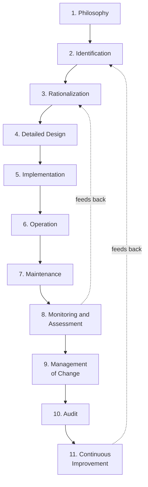
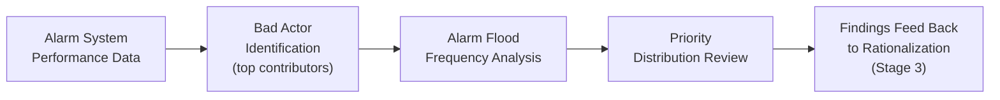
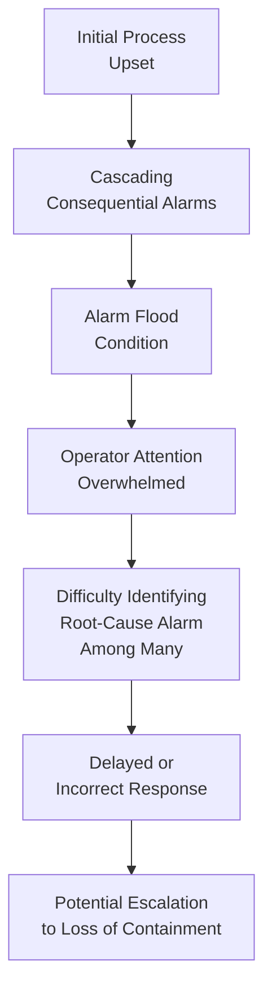
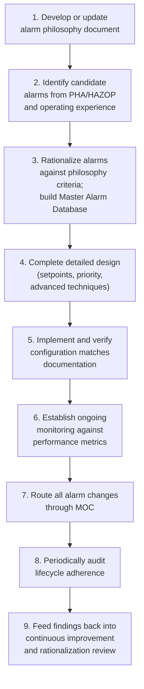

## Alarm Management Lifecycle per ISA 18.2

### Purpose and Scope

ISA 18.2 ("Management of Alarm Systems for the Process Industries") provides the primary consensus standard governing the full lifecycle of alarm system design, implementation, and maintenance in process facilities. Its core purpose is to ensure that alarms reliably direct operator attention to conditions requiring action, in contrast to poorly managed alarm systems that produce alarm floods, chattering alarms, and nuisance alarms — conditions that degrade operator response during exactly the abnormal situations where alarm reliability matters most. The lifecycle model structures alarm management as an ongoing management system, not a one-time engineering design exercise.

**Key Points**

- ISA 18.2 defines alarm management as a continuous lifecycle with eleven distinct stages, not a single design activity completed once at commissioning.
- The standard's foundational principle is that every alarm should have a defined purpose (alerting the operator to a condition requiring a specific, timely response), and every alarm lacking that property is a candidate for elimination or reclassification.
- Poor alarm management is a directly documented contributing factor in multiple major process safety incidents, most notably associated with alarm flood conditions overwhelming operator response capacity during abnormal situations.

---

### The Eleven-Stage ISA 18.2 Lifecycle

#### Stage 1: Philosophy

The alarm philosophy document is the foundational governing document establishing the organization's principles, definitions, and standards for the entire alarm management lifecycle before any individual alarm is designed.

- Defines alarm priority classification scheme (e.g., critical/high/medium/low), performance metrics and targets, and roles/responsibilities across the lifecycle.
- Establishes design standards (e.g., how many alarms constitutes an acceptable operator alarm rate, what conditions justify shelving, suppression, or advanced alarm techniques).
- [Inference] A well-developed alarm philosophy document is widely regarded in ISA 18.2 practice guidance as the single most consequential lifecycle stage, because every subsequent stage's decisions are made against the standards it establishes; a weak or absent philosophy tends to produce inconsistent rationalization decisions downstream.

#### Stage 2: Identification

The process of determining which conditions warrant an alarm in the first place, typically informed by PHA/HAZOP findings, operating experience, and safety-instrumented-system design, ensuring alarms are identified based on a genuine need for operator response rather than simply because a measurement point exists.

#### Stage 3: Rationalization

Rationalization is the systematic review of each candidate/existing alarm against the philosophy's defined criteria to confirm it meets the definition of a valid alarm and to document its design basis.

**Required documentation per alarm (typically captured in a Master Alarm Database):**

| Field | Purpose |
| --- | --- |
| Setpoint | The specific value that triggers the alarm |
| Priority classification | Basis for operator response prioritization during multiple simultaneous alarms |
| Consequence of inaction | What happens if the operator does not respond — directly justifies the alarm's existence and priority |
| Corrective action | The specific action the operator is expected to take |
| Time to respond | Available time before consequence occurs, informing feasibility of the expected response |
| Cause | Root cause(s) that would trigger this alarm |

[Inference] Rationalization is generally considered the most resource-intensive stage of initial lifecycle implementation for an existing facility with a legacy alarm system, since it requires individually reviewing potentially thousands of existing alarm points against the newly defined philosophy criteria — though the specific effort required is highly facility-dependent.

#### Stage 4: Detailed Design

Translates rationalized alarm requirements into specific configuration parameters: setpoints, deadbands, time delays, alarm priority assignment in the control system, and any advanced alarming techniques (e.g., dynamic alarming, state-based alarming) required to suppress alarms not relevant to the current operating state.

#### Stage 5: Implementation

The physical/configuration act of installing the alarm design into the control system, including management approval, testing, and verification that the implemented configuration matches the rationalized and detailed design documentation before commissioning.

#### Stage 6: Operation

Alarms function as designed during day-to-day operation; this stage is where alarm response — and any operator workarounds, shelving, or ad hoc suppression not captured in formal documentation — actually occurs, making it an important source of monitoring data for later lifecycle stages.

#### Stage 7: Maintenance

Ensures that alarm system hardware and configuration continue to function as designed over time, including periodic testing of alarm functionality (particularly for safety-critical alarms) and management of alarm system component failures or degradation.

#### Stage 8: Monitoring and Assessment

Ongoing performance monitoring against the metrics and targets established in the philosophy, using alarm system performance data to identify problem areas requiring rationalization review or design changes.

**Standard ISA 18.2 Performance Metrics (illustrative benchmarks commonly referenced in practice):**

| Metric | Commonly Referenced Target |
| --- | --- |
| Average alarms per operator per day | Manageable level (commonly cited targets are in the range of roughly 150 per day, with "very likely acceptable" performance below this and "maximum manageable" thresholds defined by the philosophy) |
| Average alarms per operator per 10-minute period | Under a small number (commonly cited as fewer than 1–2) during normal operation |
| Percentage of time in "flood" condition | Should be very low (commonly cited targets under 1%) |
| Percentage contribution from top 10 most frequent alarms | High contribution from a small number of "bad actor" alarms is a common finding and priority target for rationalization review |
| Chattering/fleeting alarms | Should be effectively eliminated through design and maintenance |

[Unverified] The specific numeric benchmark figures commonly cited in ISA 18.2 practice guidance (such as specific alarms-per-day targets) should be verified against the current edition of the standard and associated technical reports, as this reference presents commonly cited illustrative figures rather than quoting the standard's exact specified values, and guidance in this area has been refined across various editions and related technical reports.

#### Stage 9: Management of Change

Any modification to an alarm's setpoint, priority, or configuration should be processed through the site's MOC procedure, ensuring alarm changes are reviewed against the philosophy and documented in the Master Alarm Database, rather than being made informally by operations or engineering personnel outside a controlled process.

#### Stage 10: Audit

Periodic audit of the alarm management system against the philosophy and ISA 18.2 requirements, verifying that the documented lifecycle process is actually being followed in practice (e.g., that MOC is genuinely used for alarm changes, that the Master Alarm Database is current and accurate).

#### Stage 11: Continuous Improvement

Systemic use of monitoring/assessment findings and audit results to improve the philosophy, rationalization criteria, and design standards over time — directly analogous to the continuous improvement discipline in the broader PSM management review process.

---

### Alarm Floods and Abnormal Situation Management

#### The Alarm Flood Problem

An alarm flood is commonly defined as a condition in which the rate of incoming alarms exceeds an operator's capacity to review and respond to them (commonly referenced threshold: more than 10 alarms in a 10-minute period, though the specific threshold is philosophy-defined). Alarm floods are of particular process safety concern because they typically occur during genuine process upsets — precisely the abnormal, knowledge-based decision-making situations (see human error taxonomy) where clear operator guidance matters most, and where an overwhelmed operator is least able to identify the specific alarm indicating true root cause amid dozens of consequential alarms.

#### Design Techniques to Reduce Flood Risk

- **Alarm suppression/shelving**: temporarily suppressing alarms known to be irrelevant to the current operating state (e.g., suppressing a low-flow alarm on equipment intentionally shut down), governed by defined rules rather than ad hoc operator action.
- **State-based alarming**: dynamically adjusting which alarms are active based on the current process operating state (e.g., startup vs. normal running vs. shutdown), since many nuisance alarms occur specifically because a static alarm configuration does not account for state-dependent normal conditions.
- **First-out/root-cause alarming**: designs that highlight the first alarm in a cascading sequence, helping the operator identify the originating cause rather than being presented with an undifferentiated list of consequential alarms.
- **Consequential alarm suppression**: automatically suppressing alarms that are a known, expected consequence of an already-active alarm or condition, reducing flood volume without losing safety-relevant information.

---

### Alarm Priority and Response Time

#### Priority Classification Principle

Alarm priority should be assigned based on the consequence of not responding and the time available to respond — not on subjective engineering judgment about general importance — consistent with the documentation fields established during rationalization.

$$\text{Priority} = f(\text{Consequence Severity}, \text{Available Response Time})$$

A high-consequence condition with a very short available response time warrants the highest priority classification; a lower-consequence condition, or one with substantial available response time, warrants a correspondingly lower priority — ensuring the priority distribution genuinely reflects urgency rather than becoming inflated over time (a common problem where an excessive proportion of alarms are classified as "high" priority, undermining the prioritization scheme's usefulness during a flood).

**Example**

During rationalization, a high-high level alarm on a vessel with a 90-second available response time before overflow, and a consequence of a moderate hydrocarbon release, would typically be classified at a higher priority than a low-level alarm on the same vessel with a 30-minute available response time and a consequence limited to a pump trip on low suction. The differentiated priority ensures that during a simultaneous alarm condition, the operator's attention is directed first to the alarm with the least available response time and most severe consequence.

---

### Common Pitfalls

- **No formal alarm philosophy**: implementing or inheriting an alarm system without a governing philosophy document leads to inconsistent, ad hoc rationalization decisions and priority classification over time.
- **Priority inflation**: classifying an excessive share of alarms as high priority undermines the prioritization scheme's value during an alarm flood, when operators most need to distinguish genuinely urgent alarms from the rest.
- **Alarm changes made outside MOC**: allowing setpoint or priority changes without formal MOC review erodes the accuracy of the Master Alarm Database and can silently reintroduce previously rationalized-out nuisance alarms or degrade safety-relevant alarm reliability.
- **"Alarm" used as a substitute for good process design or operator training**: adding an alarm to address a design or training gap, rather than using alarms only for conditions genuinely requiring operator judgment and action, contributes to unnecessary long-term alarm burden.
- **Monitoring data collected but not acted upon**: gathering alarm performance metrics without a defined process for feeding "bad actor" findings back into rationalization review largely negates the value of the monitoring stage.
- **Chattering/fleeting alarms left unaddressed**: alarms that repeatedly activate and clear in rapid succession consume operator attention disproportionate to their information value and are a well-recognized, addressable design/maintenance issue rather than an inevitable feature of the process.

---

### Regulatory and Standards Context

- **ISA 18.2**: the primary consensus standard for alarm management lifecycle in the process industries, widely adopted (directly or as the basis for internal alarm philosophy documents) across the sector; the standard is developed and maintained by the International Society of Automation (ISA) and has associated technical reports (ISA-TR18.2.x series) providing more detailed implementation guidance on specific lifecycle stages.
- **No direct OSHA PSM/EPA RMP alarm-specific regulatory citation**: neither standard contains a distinct "alarm management" regulatory element by that name; alarm system adequacy is generally addressed indirectly through PSI, PHA, and operating procedures elements, with ISA 18.2 serving as the recognized and generally accepted good engineering practice reference. [Unverified] This general characterization should be confirmed against current regulatory text and any jurisdiction-specific requirements, as regulatory framing and enforcement emphasis on alarm management can evolve.
- **CSB investigation findings**: alarm flood conditions and inadequate alarm rationalization have been specifically identified as contributing factors in multiple published CSB investigation reports; [Unverified] these findings are specific to the incidents investigated and should be reviewed in the particular published reports rather than generalized universally.

---

### Implementation Roadmap

**Next Steps**

- Develop or review the site's alarm philosophy document against ISA 18.2 principles
- Conduct or update alarm rationalization for the highest-priority process units, building or refreshing the Master Alarm Database
- Implement alarm performance monitoring against defined metrics (alarm rate, flood frequency, bad-actor contribution)
- Verify that alarm setpoint/priority changes are consistently routed through MOC
- Evaluate advanced alarming techniques (state-based alarming, consequential suppression) for units with known flood risk

**Related Topics**

- Human Error Taxonomy in Process Operations
- Fatigue, Shift Work, and Staffing Levels
- Abnormal Situation Management and Operator Decision Support
- Human-Machine Interface (HMI) Design for Abnormal Situation Management
- Management of Change (MOC) as an Audit Trigger
- Designing a Site-Level Metrics Program
- Safety Instrumented Systems (SIS) and Alarm Interaction Design