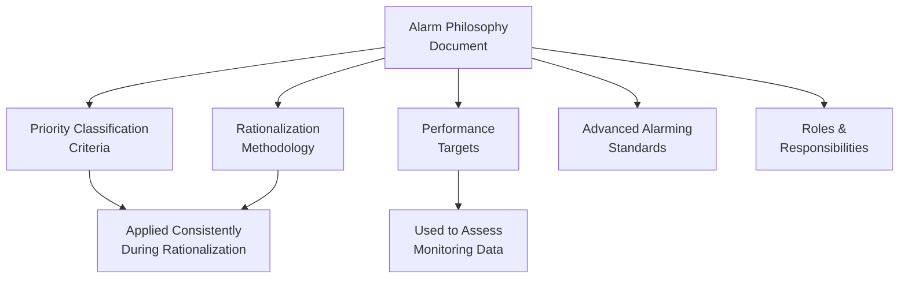
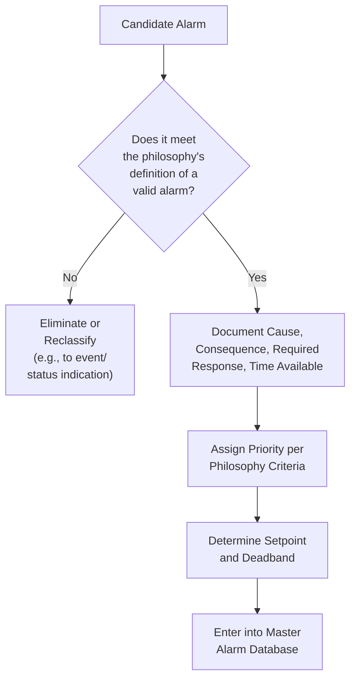
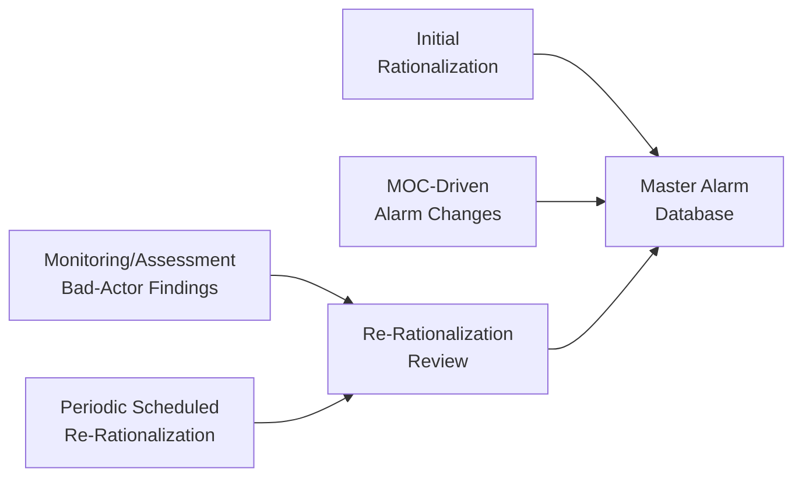
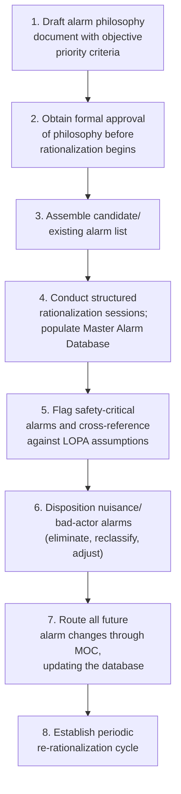

## Alarm Rationalization and Alarm Philosophy Documents

### Purpose and Scope

Alarm rationalization is the systematic, documented process of reviewing every candidate or existing alarm against defined criteria to confirm it serves a legitimate purpose, while the alarm philosophy document is the governing standard that establishes those criteria before rationalization begins. Together they form the foundation of the ISA 18.2 alarm management lifecycle (see alarm management lifecycle overview): the philosophy sets the rules, and rationalization applies those rules alarm-by-alarm to produce a defensible, documented basis for every alarm in the system. This reference addresses both in depth, since together they determine whether an alarm system genuinely supports operator decision-making or degrades into an undifferentiated, poorly justified collection of setpoints.

**Key Points**

- The philosophy document must exist and be approved before rationalization begins in earnest, since rationalization decisions are only as consistent as the criteria they are measured against.
- Rationalization produces the Master Alarm Database — the authoritative record of every alarm's setpoint, priority, cause, consequence, and required operator response — which becomes the reference point for all subsequent lifecycle stages (design, monitoring, MOC, audit).
- A rationalization exercise that removes or reclassifies nuisance alarms without a documented basis in the philosophy is difficult to defend and often gets silently reversed over time as informal changes accumulate outside MOC control.

---

### The Alarm Philosophy Document

#### Core Content Requirements

The alarm philosophy document establishes the organization-wide (or site-wide) standards that govern every subsequent lifecycle stage. A comprehensive philosophy typically addresses:

| Section | Content |
| --- | --- |
| Alarm definition and purpose | What qualifies as a legitimate alarm (a condition requiring specific, timely operator action) vs. what does not |
| Priority classification scheme | Number of priority levels (commonly 3–4: e.g., critical/high/medium/low), and the objective criteria (consequence severity × available response time) used to assign each |
| Performance targets | Numeric targets for alarm rate, flood frequency, and other ISA 18.2 monitoring metrics the system should meet |
| Rationalization methodology | The specific process, documentation fields, and required participants for rationalizing each alarm |
| Advanced alarming design standards | When and how techniques such as state-based alarming, shelving, or consequential suppression may be used |
| Roles and responsibilities | Who owns each lifecycle stage (engineering, operations, PSM function) and who has authority to approve alarm changes |
| Alarm classification for safety-critical alarms | Criteria distinguishing safety-critical alarms (potentially linked to LOPA/SIS) from general operational alarms, and any additional controls (e.g., stricter MOC requirements) applied to the former |

#### Why the Philosophy Must Precede Rationalization

[Inference] Attempting rationalization without an approved philosophy document is a commonly cited practical failure mode in ISA 18.2 implementation guidance, because different rationalization sessions (often conducted by different teams across different process units, potentially over months or years) will apply inconsistent, undocumented judgment criteria in its absence — producing a Master Alarm Database with inconsistent priority distributions and setpoint justifications across the facility, undermining the database's later usefulness for monitoring, audit, and MOC comparison.

#### Priority Classification Criteria: Consequence and Response Time

The philosophy should specify the objective basis for priority assignment, generally structured around two dimensions:

$$\text{Priority} = f(\text{Consequence of Inaction}, \text{Time Available to Respond})$$

A common structure defines priority bands using a matrix combining consequence severity categories (e.g., minor operational upset, equipment damage, safety/environmental consequence, major accident potential) against available response time bands (e.g., under 2 minutes, 2–10 minutes, over 10 minutes), producing a defensible, reproducible priority for any given alarm rather than relying on ad hoc engineering judgment at rationalization time.

**Key Points**

- Defining priority criteria numerically and in advance, rather than leaving priority to case-by-case judgment during rationalization sessions, is what allows the resulting priority distribution to be audited and defended later.
- A philosophy allowing an excessive proportion of alarms to qualify for "high" priority under its own stated criteria should itself be revisited, since priority inflation undermines the entire scheme's usefulness during a simultaneous multi-alarm condition.

---

### The Rationalization Process

#### Step 1: Assemble the Candidate Alarm List

Compile the full list of alarms configured in the control system (or, for new design, the candidate list identified during the Identification stage from PHA/HAZOP findings), including any currently active but undocumented alarms — a common finding in legacy systems is that the configured alarm count substantially exceeds what any formal design basis accounts for.

#### Step 2: Conduct the Rationalization Review Session

A rationalization session is typically a structured, cross-functional review (operations, process/controls engineering, and often a facilitator trained in the site's alarm philosophy) that works through each candidate alarm against the philosophy's criteria and populates the Master Alarm Database fields.

#### Required Documentation Fields (Master Alarm Database)

Consistent with the fields introduced in the lifecycle overview, each rationalized alarm's record should be complete before the alarm is considered validly rationalized:

| Field | Purpose | Example |
| --- | --- | --- |
| Tag/identifier | Unique reference to the specific alarm point | LAH-101 |
| Setpoint and deadband | Trigger value and hysteresis to prevent chattering | 85% level, 2% deadband |
| Priority | Basis for operator prioritization during simultaneous alarms | High |
| Cause(s) | Root cause condition(s) that would trigger this alarm | Feed control valve failure, downstream blockage |
| Consequence of inaction | What happens if the operator does not respond, justifying the alarm's existence | Vessel overflow, potential hydrocarbon release |
| Corrective action | The specific action the operator is expected to take | Close feed valve XV-102, open drain valve XV-103 |
| Time to respond | Available time before consequence occurs | 8 minutes |
| Class (if applicable) | Whether the alarm is safety-critical, linked to a SIS/LOPA safeguard, or general operational | Safety-critical (linked to LOPA scenario 4) |

**Example**

During rationalization of a high-level alarm on a feed surge vessel, the team determines the alarm's cause is a feed control valve failing open, the consequence of inaction is vessel overflow leading to a hydrocarbon release, and the available response time before overflow is 8 minutes. Given the safety consequence and moderate available time, the philosophy's priority matrix assigns this alarm "High" priority. Because the alarm also corresponds to an Independent Protection Layer credited in the unit's LOPA, it is additionally flagged as safety-critical, subjecting any future change to this alarm's setpoint or priority to a more stringent MOC review requirement than a general operational alarm would receive.

#### Step 3: Address Existing Nuisance and Bad-Actor Alarms

Rationalization of an existing (brownfield) alarm system typically surfaces alarms that do not meet the philosophy's criteria for a valid alarm — chattering alarms, alarms with no clear required operator action, or alarms duplicating information already available through a higher-priority alarm.

| Disposition Option | When Applied |
| --- | --- |
| Eliminate | Alarm serves no genuine operator-action purpose; convert to a non-alarmed status indication if the information still has value |
| Reclassify priority | Alarm is valid but was previously misclassified relative to actual consequence/response-time criteria |
| Adjust setpoint/deadband | Alarm is valid but poorly tuned, causing chattering or premature activation |
| Retain as-is | Alarm meets all philosophy criteria as currently configured |
| Apply advanced technique | Alarm is valid but only in certain operating states; apply state-based suppression rather than eliminating outright |

[Inference] In legacy alarm systems undergoing first-time rationalization, it is a commonly reported pattern that a substantial proportion of existing configured alarms do not meet a rigorously applied philosophy's criteria for a valid alarm; the specific proportion is highly system- and facility-dependent and should not be assumed to follow a universal ratio.

---

### Safety-Critical Alarm Considerations

Alarms that correspond to an Independent Protection Layer credited in a LOPA, or that are otherwise linked to a Safety Instrumented Function, warrant particular rigor during rationalization because the assumptions made here directly affect the validity of the safeguard credit taken elsewhere in the process hazard analysis.

- **Cross-reference to LOPA documentation**: the rationalized alarm's documented response time and required action should match the assumptions used in the corresponding LOPA scenario; a mismatch between the two (e.g., LOPA assumes a 10-minute response but the rationalized alarm documentation shows only 5 minutes actually available) should trigger a review of both documents (see closing the loop between audits, incidents, and hazard analyses for the broader cross-system integration principle).
- **Stricter change control**: the philosophy should specify that any change to a safety-critical alarm's setpoint or priority requires a more rigorous MOC review — potentially including PHA/LOPA re-review — than a change to a general operational alarm.
- **Testing and verification**: safety-critical alarms should be included in a periodic functional test regime under the Maintenance lifecycle stage, verifying the alarm actually activates at the documented setpoint.

---

### Maintaining Rationalization Currency

#### Rationalization Is Not a One-Time Event

Because process modifications (via MOC), operating experience, and monitoring data all generate reasons to revisit specific alarms, the philosophy should define a periodic re-rationalization cycle (commonly aligned with, but not necessarily identical to, PHA revalidation cycles) rather than treating the initial rationalization exercise as permanently valid.

- **MOC-driven updates**: every alarm change processed through MOC should update the Master Alarm Database, keeping the documented rationalization basis synchronized with the actual configured system.
- **Monitoring-driven updates**: bad-actor alarms identified through the Monitoring and Assessment lifecycle stage should be routed back into a re-rationalization review, closing the loop between operational performance data and the documented design basis.

---

### Common Pitfalls

- **Rationalization conducted before the philosophy is approved**: produces inconsistent documentation and priority assignment across different sessions or process units, undermining the Master Alarm Database's reliability as a reference.
- **Incomplete documentation fields**: rationalizing an alarm without fully documenting cause, consequence, and required response leaves the basis for its priority and setpoint unverifiable later, particularly during audit or MOC review of a proposed change.
- **Philosophy with vague or subjective priority criteria**: a philosophy that does not define priority using objective consequence/response-time criteria allows inconsistent classification and priority inflation over time.
- **Safety-critical alarms not distinguished from general alarms**: treating a LOPA-credited alarm identically to a routine operational alarm in terms of change control rigor creates a gap between the actual safeguard reliability assumed in the PHA and the change-control discipline applied to the alarm implementing it.
- **No periodic re-rationalization mechanism**: treating the initial rationalization as permanently valid, without a defined cycle or trigger for revisiting specific alarms, allows the documented basis to drift out of alignment with actual process conditions and operating experience over time.
- **Master Alarm Database not kept current with MOC**: allowing alarm changes to occur without updating the corresponding database record breaks the link between the documented design basis and the actual configured system, undermining both audit and future rationalization efforts.

---

### Implementation Roadmap

**Next Steps**

- Draft or review the alarm philosophy document to ensure objective, consequence/response-time-based priority criteria are defined before rationalization proceeds
- Conduct structured rationalization sessions for process units not yet covered, populating the Master Alarm Database with complete documentation fields
- Cross-reference safety-critical alarm documentation against corresponding LOPA scenario assumptions to identify any mismatches
- Establish a periodic re-rationalization cycle and ensure MOC-driven alarm changes consistently update the Master Alarm Database
- Review current priority distribution for signs of priority inflation against the philosophy's own stated criteria

**Related Topics**

- Alarm Management Lifecycle per ISA 18.2
- Human Error Taxonomy in Process Operations
- Closing the Loop Between Audits, Incidents, and Hazard Analyses
- LOPA Safeguard Credit Assumptions and Validation
- Management of Change (MOC) as an Audit Trigger
- Abnormal Situation Management and Operator Decision Support
- Human-Machine Interface (HMI) Design for Abnormal Situation Management