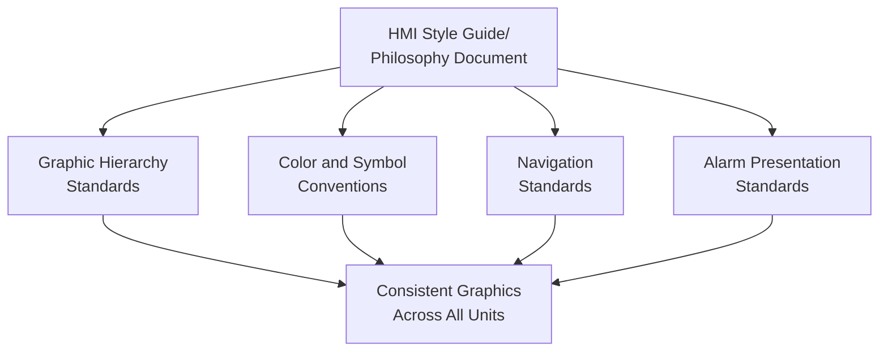
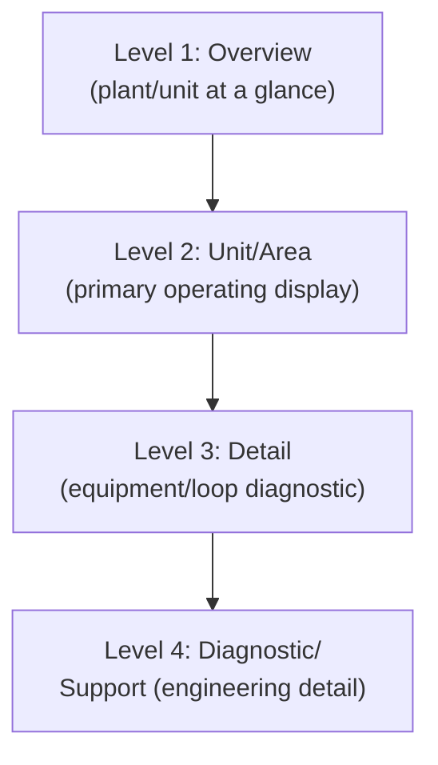
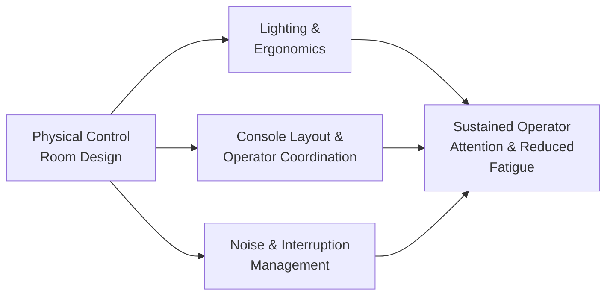
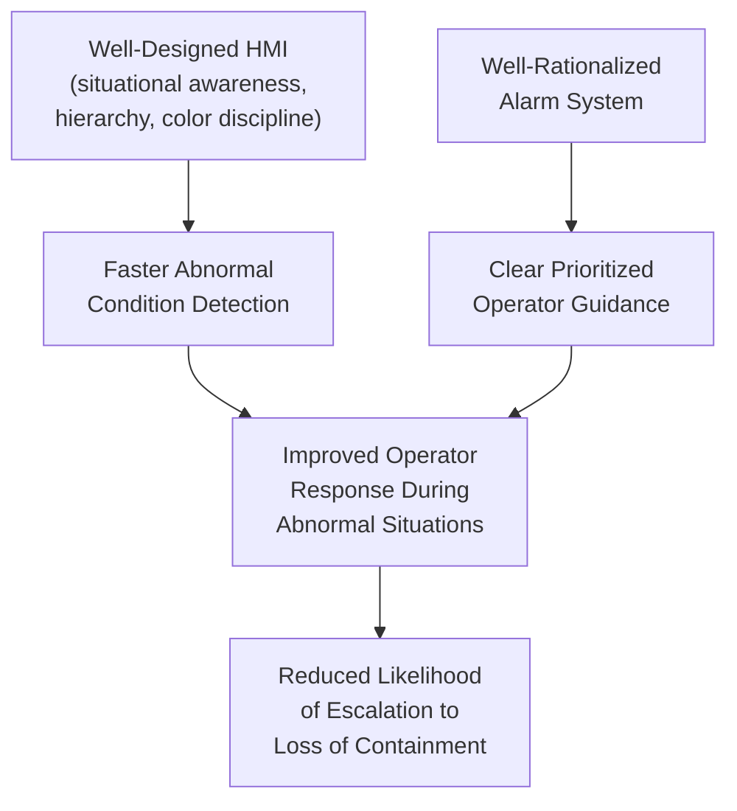
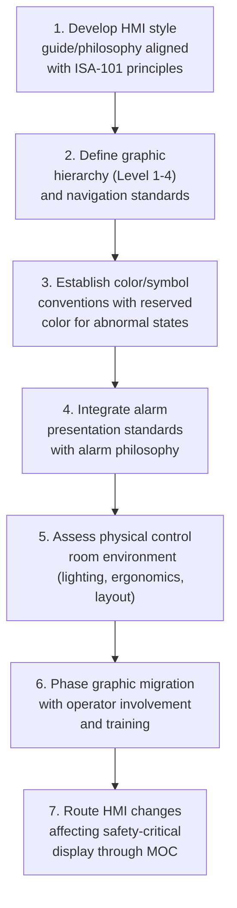

## Control Room and Human-Machine Interface Design

### Purpose and Scope

Control room and human-machine interface (HMI) design determines how effectively an operator can perceive process state, detect abnormal conditions, and take timely corrective action — making it a direct performance-shaping factor in the human error taxonomy sense, and a critical enabler (or degrader) of effective alarm response. Good HMI design supports rapid situational awareness during both routine and abnormal operations; poor design actively contributes to the slips, mistakes, and delayed responses that alarm management and human factors programs are otherwise trying to prevent. This reference addresses both the physical control room environment and the graphical/software HMI presented to operators.

**Key Points**

- HMI design and alarm management are deeply interdependent: a well-rationalized alarm system can still fail operationally if the graphical interface does not clearly present alarm information during a flood condition.
- The primary published standard governing HMI graphic design specifically for the process industries is ISA-101 ("Human Machine Interfaces for Process Automation Systems"), which complements ISA 18.2's alarm-specific guidance.
- Control room physical design (layout, environment, staffing arrangement) and graphical HMI design are both performance-shaping factors and should be addressed together, not treated as separate, unrelated design domains.

---

### ISA-101: HMI Design Philosophy and Principles

#### Core Design Philosophy

ISA-101 establishes that HMI design should be approached as a deliberate, documented discipline — similar in structure to the alarm philosophy document — rather than left to default distributed control system (DCS) vendor templates or individual engineer preference.

#### Key ISA-101 Principles

- **Situational awareness over data display**: graphics should be designed to support the operator's understanding of overall process state and trends, not simply to display every available measurement point on screen.
- **High-performance HMI concept**: a design approach emphasizing muted, low-contrast backgrounds (commonly gray-scale) with color and visual emphasis reserved specifically for abnormal conditions, in deliberate contrast to older, more "colorful" DCS graphic conventions where color was used decoratively rather than diagnostically.
- **Consistency across the facility**: standardized symbols, color meanings, and navigation conventions across all process units and graphics, so an operator's learned interpretation of a given color or symbol on one graphic reliably applies to every other graphic in the system.

[Inference] The shift toward high-performance, low-color-saturation HMI design reflects a broader human factors principle that reserving strong visual emphasis (bright colors, flashing, high contrast) specifically for genuinely abnormal conditions makes those conditions easier to detect quickly; a graphic that is uniformly colorful during normal operation provides no visual contrast to signal that something has changed, which is the central diagnostic function color should serve.

---

### Graphic Hierarchy: The Multi-Level Display Structure

ISA-101 and associated practice guidance commonly describe a hierarchical graphic structure supporting different levels of operator situational awareness need.

| Level | Purpose | Typical Content |
| --- | --- | --- |
| Level 1 (Overview) | High-level plant/unit status at a glance | Aggregate KPIs, high-level process flow, major alarm summary |
| Level 2 (Unit/Area) | Operator's primary working display for a specific process area | Detailed process flow diagram, key control loops, relevant alarms |
| Level 3 (Detail) | Diagnostic detail for troubleshooting a specific piece of equipment or loop | Detailed equipment/loop faceplate, trend data, diagnostic parameters |
| Level 4 (Diagnostic/Support) | Deep diagnostic or engineering-level detail, not typically used during normal operation | Instrument diagnostics, maintenance data, engineering unit configuration |

- **Navigation design**: the hierarchy should allow an operator to move quickly from a Level 1 overview to the specific Level 2/3 detail relevant to a developing abnormal condition, without requiring an excessive number of navigation steps or memorized screen paths during a time-critical situation.
- **Level 2 as the primary operating environment**: since operators spend the majority of routine monitoring time at Level 2, this level's design quality has outsized influence on baseline situational awareness and early abnormal-condition detection.

---

### Color, Symbol, and Alarm Presentation Conventions

#### Color Coding Principles

| Design Principle | Rationale |

 

| Muted background, reserved color for abnormal states | Preserves color's diagnostic value by avoiding constant visual "noise" during normal operation |

| Consistent color-to-meaning mapping across all graphics | Prevents operator misinterpretation when moving between different unit graphics |

| Avoid reliance on color alone for critical distinctions | Supports operators with color vision deficiencies and improves reliability under poor lighting/monitor conditions; shape, position, or text should reinforce color-coded information |

[Unverified] The specific percentage of the general population with color vision deficiency (commonly cited as affecting a meaningful minority of men) is a well-established general statistic, but this reference does not reproduce a specific figure to avoid presenting a number that may not reflect the most current epidemiological source; the underlying design principle (do not rely on color alone) holds regardless of the specific prevalence figure.

#### Alarm Presentation on the Graphic

Effective HMI design directly supports the alarm rationalization and management lifecycle (see alarm rationalization and philosophy documents) by ensuring that:

- Alarm priority is visually distinguishable at a glance (e.g., through consistent color, icon, or position conventions matching the alarm philosophy's priority scheme).
- The graphic clearly indicates which specific alarm(s) are currently active without requiring the operator to navigate away from their primary working display during a developing situation.
- During an alarm flood, the interface supports rapid identification of the highest-priority and/or first-out alarm rather than presenting an undifferentiated chronological list requiring manual scanning.

---

### Physical Control Room Design

#### Environmental and Layout Factors

| Factor | Human Factors Consideration |
| --- | --- |
| Lighting | Adequate, glare-free lighting supporting screen readability without causing fatigue over long shifts |
| Noise | Minimizing distracting ambient noise while preserving audibility of critical audible alarms |
| Console/workstation ergonomics | Screen distance, viewing angle, and seating supporting sustained attention without physical strain contributing to fatigue |
| Console layout relative to responsibility | Physical arrangement of operator consoles supporting necessary communication and coordination between operators responsible for interdependent process areas |
| Environmental separation from other functions | Control room design that limits interruption from non-operational personnel traffic during critical operating periods |

- **Console arrangement and span of control**: physical proximity between operators responsible for interdependent or adjacent process areas supports the informal communication often necessary during a developing abnormal situation, while console arrangement that isolates operators can hinder this coordination.
- **Interruption management**: control rooms should be designed and operated to limit non-essential interruptions (visitors, non-operational personnel, unrelated administrative tasks) during periods requiring sustained operator attention, since interruptions are a well-recognized contributor to lapses (see human error taxonomy).

---

### Integration with Abnormal Situation Management

#### The ASM Consortium Perspective

The Abnormal Situation Management (ASM) Consortium's published research has substantially informed both ISA-101 and broader industry HMI practice, with particular emphasis on how HMI and alarm system design jointly determine operator effectiveness during the abnormal, knowledge-based decision-making situations that carry the highest process safety consequence.

[Inference] The combined effectiveness of HMI and alarm system design during abnormal situations is generally considered more consequential to major accident prevention than during routine operation, because abnormal situations are precisely when operators are most reliant on the interface to rapidly build an accurate mental model of a developing, unfamiliar condition — this connects established human factors and ASM Consortium research findings rather than restating a single specific published statistic.

---

### Legacy System Migration Considerations

Many facilities operate DCS graphics originating from vendor default templates or historical engineering practice predating ISA-101, creating a common practical challenge of migrating to a high-performance HMI design without disrupting operator familiarity built over years of experience with the existing graphics.

- **Phased migration and operator involvement**: a commonly recommended practice is phased graphic conversion (rather than a single facility-wide cutover) combined with substantial operator involvement in the redesign process, since operator buy-in and familiarity are themselves performance-shaping factors that a technically superior but unfamiliar design can undermine if introduced poorly.
- **Training on the new interface**: operators experienced with legacy graphics require dedicated training and, ideally, simulator-based practice on the new HMI design before it is relied upon during an actual abnormal situation, since first exposure to a new interface during a genuine emergency is a foreseeably poor time to be learning its conventions.
- **MOC applicability**: HMI graphic changes affecting how safety-critical information is presented should be considered within the site's Management of Change process, consistent with the same principle applied to alarm changes.

---

### Common Pitfalls

- **Vendor default graphics used without a documented style guide**: produces inconsistent color/symbol meaning across different units and graphics, undermining the operator's ability to reliably interpret unfamiliar displays during a developing situation.
- **Overloaded Level 1/2 graphics**: attempting to display excessive data density on a primary operating graphic, following the outdated assumption that more visible data is always better, actually degrades the operator's ability to quickly identify the specific abnormal parameter among many.
- **Decorative rather than diagnostic color use**: continuing older DCS graphic conventions where color is used for visual variety rather than reserved for abnormal-condition signaling removes the contrast value color should provide.
- **HMI and alarm system designed independently**: treating graphic design and alarm rationalization as unrelated projects can produce a well-rationalized alarm list that is nonetheless poorly presented on the operator's actual working display during a flood.
- **No operator involvement in redesign**: implementing a technically sound new HMI design without operator input and adequate training risks operator distrust or confusion precisely when reliable interface interpretation matters most.
- **Control room physical environment neglected**: focusing exclusively on graphical HMI design while ignoring lighting, noise, ergonomics, and interruption management addresses only part of the overall human-performance picture.

---

### Regulatory and Standards Context

- **ISA-101**: the primary consensus standard specifically addressing HMI design philosophy, graphic hierarchy, and style guide development for process automation systems, complementing ISA 18.2's alarm-specific scope.
- **ASM Consortium research**: an industry research collaborative whose published findings on abnormal situation management have substantially shaped both ISA-101 and broader HMI practice guidance; specific ASM Consortium publications should be consulted directly for detailed design guidance beyond this overview.
- **No direct OSHA PSM/EPA RMP HMI-specific regulatory citation**: as with alarm management, neither standard names HMI design as a distinct regulatory element; HMI adequacy is addressed indirectly through PSI, PHA, and operating procedure elements, with ISA-101 and ASM Consortium guidance serving as recognized and generally accepted good engineering practice references. [Unverified] This general characterization should be confirmed against current regulatory text, as regulatory framing can evolve.

---

### Implementation Roadmap

**Next Steps**

- Develop or review an HMI style guide aligned with ISA-101 principles, including graphic hierarchy and color conventions
- Assess current DCS graphics for overload, decorative color use, and inconsistency across units
- Evaluate physical control room environment (lighting, noise, console layout) against human factors design principles
- Plan a phased graphic migration approach incorporating operator involvement and simulator-based training
- Ensure HMI changes affecting safety-critical information display are routed through MOC

**Related Topics**

- Alarm Management Lifecycle per ISA 18.2
- Alarm Rationalization and Alarm Philosophy Documents
- Human Error Taxonomy in Process Operations
- Fatigue, Shift Work, and Staffing Levels
- Abnormal Situation Management and Operator Decision Support
- Human Reliability Analysis (HRA) Methods for LOPA Credit
- Simulator-Based Operator Training for Abnormal Situations